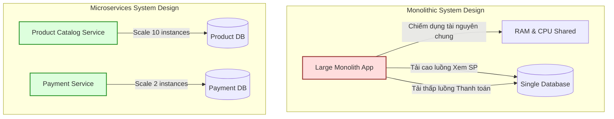

# Microservices giải quyết vấn đề gì?

## ⚡ Tóm tắt ngắn (30s)
*   **Bản chất**: Microservices (Kiến trúc vi dịch vụ) là cách tiếp cận phân rã một hệ thống phần mềm lớn, phức tạp thành một tập hợp các dịch vụ nhỏ hơn, hoạt động độc lập, tập trung vào một domain nghiệp vụ duy nhất (Single Responsibility) và giao tiếp với nhau qua giao thức mạng nhẹ (HTTP, gRPC, Message Queue).
*   **Các thảm họa thực chiến được giải quyết**:
    1.  **Chồng chéo nhân sự (Conway's Law & Communication Bottleneck)**: Khi team Monolith vượt quá 10-15 người, việc phối hợp merge code, xung đột git và họp hành phi kỹ thuật chiếm hết thời gian. Microservices cho phép áp dụng mô hình "Two-Pizza Teams" độc lập tự chủ.
    2.  **Thời gian đưa sản phẩm ra thị trường quá lâu (Deployment Lock-in)**: Thay vì phải đợi 2 tuần để build, test tích hợp toàn diện và deploy một khối Monolith 2GB chỉ để sửa một lỗi typo, bạn có thể deploy service nhỏ chỉ mất vài phút độc lập hoàn toàn.
    3.  **Lỗi sập dây chuyền (Single Point of Failure - SPOF)**: Trong Monolith, một luồng phụ bị lỗi OutOfMemory hoặc rò rỉ luồng (thread leak) (ví dụ: xuất báo cáo Excel nặng) sẽ kéo sập toàn bộ ứng dụng, ảnh hưởng trực tiếp đến luồng cốt lõi (như thanh toán).
    4.  **Tải không đồng đều (Suboptimal Hardware Scaling)**: Luồng xem sản phẩm chiếm 90% tải trong khi luồng đặt hàng chỉ chiếm 5%. Với Monolith, bạn phải scale-up toàn bộ ứng dụng và database cồng kềnh. Microservices cho phép scale riêng lẻ service xem sản phẩm lên 10 instance nhỏ, tiết kiệm hàng ngàn USD tiền hạ tầng Cloud.
*   **Quyết định Senior**: Chỉ chuyển sang Microservices khi dự án đã có sự phân tách rõ rệt về ranh giới nghiệp vụ (Bounded Context), tổ chức nhân sự đã phình to và hạ tầng tự động hóa (CI/CD, Kubernetes, Observability) đã sẵn sàng. Tránh xa Microservices nếu team chỉ có dưới 5-7 kỹ sư hoặc sản phẩm đang ở giai đoạn khởi nghiệp (MVP).

---

## 🔍 Chi tiết bản chất thực chiến

Khi ứng dụng phát triển lớn, các nút thắt kỹ thuật và nút thắt tổ chức bắt đầu đè nặng lên kiến trúc Monolithic truyền thống. Định luật Conway (Conway's Law) chỉ ra rằng: *"Các tổ chức thiết kế hệ thống có xu hướng tạo ra các thiết kế là bản sao của cấu trúc giao tiếp của chính tổ chức đó."*

### 1. Nút thắt tổ chức & Xung đột Git
Trong một Monolith khổng lồ, hàng chục lập trình viên cùng làm việc trên một repository. Tần suất xảy ra xung đột khi merge code (git merge conflict) tăng vọt, quy trình kiểm thử hồi quy (regression testing) mất hàng tiếng đồng hồ, và mỗi đợt release trở thành cơn ác mộng vì phải phối hợp lịch trình của quá nhiều nhóm.

### 2. Nút thắt kỹ thuật & Tải phần cứng
Dưới đây là mô hình so sánh dòng chảy tài nguyên hạ tầng giữa hai cấu trúc:



*   **Monolithic**: Khi luồng "Xem sản phẩm" bị nghẽn CPU/RAM do lượng truy cập tăng vọt, luồng "Thanh toán" cũng bị chết theo vì dùng chung tài nguyên máy chủ vật lý và connection pool đến Database chung.
*   **Microservices**: Cơ chế **Database-per-Service** (Mỗi dịch vụ sở hữu cơ sở dữ liệu riêng) giúp cô lập dữ liệu tuyệt đối ở tầng đĩa. Nếu Database của Product Service bị quá tải, Payment Service vẫn xử lý giao dịch thanh toán bình thường bằng dữ liệu nội bộ được cache hoặc đồng bộ bất đồng bộ.

---

## 💻 Code thực chiến: BAD vs GOOD

### ❌ BAD: Monolith liên kết chặt chẽ (Tightly Coupled Monolith)
Lập trình viên viết toàn bộ nghiệp vụ đặt hàng, thanh toán và kiểm tra kho chung một khối giao dịch database (`@Transactional`). Một lỗi nhỏ ở tầng kho hoặc lỗi mạng khi gọi API thanh toán sẽ rollback toàn bộ và giữ lock database cực lâu, kéo sập lượng tài nguyên xử lý luồng.

```java
@Service
public class OrderServiceBad {

    @Autowired
    private InventoryRepository inventoryRepository;
    @Autowired
    private OrderRepository orderRepository;
    @Autowired
    private PaymentRepository paymentRepository;

    @Transactional // Anti-pattern: Một Transaction ôm đồm quá nhiều Domain khác nhau!
    public OrderResponse placeOrder(OrderRequest request) {
        // 1. Kiểm tra kho và trừ kho (Tác động Inventory DB)
        Inventory inventory = inventoryRepository.findByProductId(request.getProductId());
        if (inventory.getQuantity() < request.getQuantity()) {
            throw new InsufficientStockException("Hết hàng!");
        }
        inventory.setQuantity(inventory.getQuantity() - request.getQuantity());
        inventoryRepository.save(inventory);

        // 2. Tạo đơn hàng (Tác động Order DB)
        Order order = new Order(request.getCustomerId(), request.getTotalAmount());
        order = orderRepository.save(order);

        // 3. Gọi thanh toán trực tiếp (Tác động Payment DB & Mạng ngoại vi)
        // Việc gọi API ngoài hoặc giữ kết nối thanh toán trong Transaction là thảm họa!
        boolean paymentSuccess = callExternalPaymentGateway(request.getPaymentDetails());
        if (!paymentSuccess) {
            throw new PaymentFailedException("Thanh toán thất bại!"); // Rollback toàn bộ đợt giữ khóa DB!
        }

        Payment payment = new Payment(order.getId(), request.getTotalAmount(), "SUCCESS");
        paymentRepository.save(payment);

        return new OrderResponse(order.getId(), "SUCCESS");
    }

    private boolean callExternalPaymentGateway(Object details) {
        // Mô phỏng gọi API thanh toán qua mạng mất 5 giây
        try { Thread.sleep(5000); } catch (InterruptedException e) {}
        return true;
    }
}
```

---

###  GOOD: Phân rã Microservices với Ranh giới Domain cô lập (Resilient Microservices Interface)
Mỗi dịch vụ đóng vai trò là một Bounded Context tự chủ. `Order Service` chỉ quản lý nghiệp vụ đơn hàng của riêng mình và giao tiếp bất đồng bộ qua Message Queue hoặc gọi đồng bộ có cấu hình Resilience (Timeout, Circuit Breaker) thông qua Spring Cloud OpenFeign.

**1. Định nghĩa Order Service độc lập quản lý trạng thái:**

```java
@Service
public class OrderServiceGood {

    @Autowired
    private OrderRepository orderRepository;
    @Autowired
    private PaymentClient paymentClient; // Client gọi gRPC/HTTP được bảo vệ bởi Resilience4j
    @Autowired
    private KafkaTemplate<String, OrderEvent> kafkaTemplate;

    @Transactional
    public OrderResponse placeOrder(OrderRequest request) {
        // Tạo đơn hàng ở trạng thái chờ xử lý (PENDING_PAYMENT)
        Order order = new Order(request.getCustomerId(), request.getTotalAmount(), "PENDING_PAYMENT");
        order = orderRepository.save(order);

        // Phát sự kiện kiểm tra kho bất đồng bộ qua Kafka (Event-driven)
        kafkaTemplate.send("order-created-events", new OrderEvent(order.getId(), request.getProductId(), request.getQuantity()));

        // Gọi đồng bộ thanh toán qua API Gateway nhưng có bảo vệ ngắt mạch (Circuit Breaker)
        try {
            PaymentResponse payment = paymentClient.processPayment(new PaymentRequest(order.getId(), request.getTotalAmount()));
            if ("SUCCESS".equals(payment.getStatus())) {
                order.setStatus("PAID");
                orderRepository.save(order);
            }
        } catch (CallNotPermittedException e) {
            // Khi Circuit Breaker đang OPEN, chủ động rơi vào kịch bản dự phòng (Fallback)
            order.setStatus("PAYMENT_RETRY_QUEUE");
            orderRepository.save(order);
        }

        return new OrderResponse(order.getId(), order.getStatus());
    }
}
```

**2. Khai báo HTTP Client độc lập có cấu hình ngắt mạch dự phòng:**

```java
@FeignClient(name = "payment-service", fallback = PaymentClientFallback.class)
public interface PaymentClient {
    @PostMapping("/api/v1/payments")
    PaymentResponse processPayment(@RequestBody PaymentRequest request);
}

@Component
public class PaymentClientFallback implements PaymentClient {
    @Override
    public PaymentResponse processPayment(PaymentRequest request) {
        // Kịch bản xử lý lỗi khi Payment Service chết hẳn
        return new PaymentResponse(request.getOrderId(), "FAILED_FALLBACK");
    }
}
```

---

## 📊 Bảng so sánh Monolith vs Microservices

| Tiêu chí so sánh | Kiến trúc Monolithic | Kiến trúc Microservices |
| :--- | :--- | :--- |
| **Quy mô triển khai (Deployment)** | Toàn bộ ứng dụng đóng gói chung một tệp (WAR/JAR/Docker image). | Mỗi service là một Docker container độc lập, tự deploy. |
| **Ranh giới dữ liệu (Database)** | Chia sẻ chung một DB. Dễ JOIN bảng, nguy cơ nghẽn DB cao. | **Database-per-service**. Dữ liệu cô lập tuyệt đối, truy vấn qua API/Event. |
| **Cách cô lập lỗi (Fault Isolation)** | Kém. Một module sập có thể kéo sập toàn bộ RAM/CPU của JVM. | Hoàn hảo. Dùng **Circuit Breaker** để chặn đứng lỗi lan rộng. |
| **Rào cản công nghệ (Tech Stack)** | Khóa cứng trong một ngôn ngữ/framework xuyên suốt dự án. | Đa dạng hóa (Polyglot). Java cho Core API, Python cho AI, Go cho Proxy. |
| **Độ phức tạp vận hành (Ops Overhead)**| Rất thấp ở giai đoạn đầu. Chỉ cần 1 server/DB. | **Cực kỳ cao**. Yêu cầu Kubernetes, Log tập trung, Trace ID, CI/CD xịn. |

---

## ⚠️ Common Gotchas & Questions follow-up

### 1. Cạm bẫy "Distributed Monolith" (Hệ Monolith phân tán)
*   **Thảm họa thực tế**: Đây là sai lầm phổ biến nhất của các team bắt đầu làm microservices. Bạn chia mã nguồn ra thành 20 services chạy trên 20 cổng khác nhau, nhưng mỗi khi xử lý một Request, Service A lại gọi đồng bộ HTTP đến Service B, B gọi C, C gọi D tạo thành một chuỗi xích dài vô tận (Cascading Synchronous Calls).
*   **Hậu quả**: Chỉ cần Service D bị trễ 2 giây hoặc sập, toàn bộ chuỗi A -> B -> C -> D sẽ sập theo do cạn kiệt luồng HTTP worker (thread starvation). Hiệu năng hệ thống lúc này còn tệ hơn cả Monolith vì gánh thêm overhead mạng (Network latency).
*   **Giải pháp**: Tối đa hóa giao tiếp **bất đồng bộ (Asynchronous)** bằng Message Broker (Kafka/RabbitMQ) cho các tác vụ ghi/ghi nghiệp vụ và sử dụng dữ liệu nhân bản cục bộ (Local Read-Model / CQRS) cho các luồng đọc.

### 2. Sự cố "Shared Database" (Sử dụng chung cơ sở dữ liệu)
*   **Vấn đề**: Các dịch vụ chạy độc lập nhưng đằng sau lại kết nối vào chung một DB vật lý, trực tiếp đọc-ghi chéo vào các bảng của nhau.
*   **Hậu quả**: Phá vỡ ranh giới bao đóng (Encapsulation). Khi Service A thay đổi schema bảng, Service B lập tức bị nổ lỗi runtime. Ngoài ra, việc cạnh tranh connection pool chung tại DB sẽ biến cơ sở dữ liệu thành nút thắt cổ chai SPOF duy nhất.
*   **Giải pháp**: Tuân thủ triệt để nguyên tắc **Database-per-Service**. Tuyệt đối không cho phép truy cập chéo trực tiếp tầng DB; mọi giao tiếp bắt buộc phải đi qua API hoặc Event bus.

### 3. Câu hỏi đào sâu từ interviewer
*   **Q: Làm thế nào để đo lường chính xác lúc nào Monolith đã hết giá trị và bắt buộc phải chuyển sang Microservices?**
    *   *Trả lời*: Một quyết định chuyển đổi kiến trúc chuyên nghiệp không dựa vào sở thích công nghệ, mà dựa trên các chỉ số đo lường thực tế (Metrics-Driven Decision):
        1.  **Chỉ số đo lường tổ chức (Organizational Metrics)**:
            *   *Merge conflict frequency*: Tần suất xung đột git tăng lên quá mức kiểm soát, mỗi lập trình viên tốn hơn 20% thời gian hàng tuần chỉ để sửa conflict và đồng bộ code.
            *   *Deployment queue congestion*: Hàng đợi release bị nghẽn. Một tính năng của Team A phải đợi kiểm thử tích hợp chung với Team B, C mất hàng tuần.
        2.  **Chỉ số kỹ thuật (Technical Metrics)**:
            *   *Database Connection & CPU Starvation*: Database chung chạm giới hạn tối đa về CPU hoặc Connection Pool do các tác vụ báo cáo phụ tranh chấp tài nguyên với luồng OLTP chính.
            *   *Resource Contention*: CPU/Memory của server chính chạm ngưỡng đỏ liên tục vì một module cụ thể chạy quá tải, trong khi các module khác nhàn rỗi nhưng vẫn phải scale chung.
            *   *Mean Time to Recover (MTTR)*: Thời gian khởi động lại Monolith quá lâu (ví dụ 10-15 phút do phải nạp quá nhiều cấu hình và Hibernate metadata), khiến hệ thống mất khả năng tự hồi phục nhanh khi chịu tải lớn.
