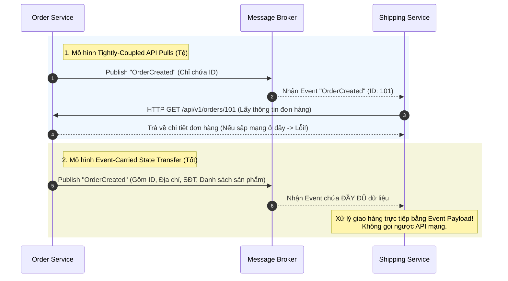

# Event-driven architecture là gì?

## ⚡ Tóm tắt ngắn (30s)
*   **Bản chất**: Event-driven Architecture (EDA - Kiến trúc hướng sự kiện) là một phong cách kiến trúc phần mềm phân tán. Trong đó, các dịch vụ (Services) giao tiếp và cộng tác với nhau bất đồng bộ thông qua việc sản xuất (Publishing), phát hiện (Detecting), tiêu thụ (Consuming) và phản ứng lại các **Sự kiện (Events)** - đại diện cho những thay đổi trạng thái có thật trong nghiệp vụ (ví dụ: `OrderPlaced`, `UserRegistered`).
*   **Các thảm họa thực chiến được giải quyết**:
    1.  **Sập toàn bộ hệ thống khi gọi API chéo chuỗi dài (Cascading Failures & API Over-dependency)**: Trong kiến trúc Request-Response truyền thống, `Service A` nhận sự kiện đơn giản chỉ chứa ID (`order_id = 123`), sau đó bắt buộc phải gọi ngược HTTP API sang `Service B` để lấy thông tin đơn hàng, `B` lại gọi `C` lấy thông tin khách hàng. Nếu `B` hoặc `C` bị chậm/sập, toàn bộ chuỗi sập theo. EDA giải quyết bằng **Event-Carried State Transfer (Truyền tải trạng thái kèm sự kiện)**: Sự kiện phát ra chứa đầy đủ thông tin cần thiết, các dịch vụ nhận tự lưu bản sao cục bộ để truy vấn tức thì mà không cần thực hiện bất kỳ cuộc gọi mạng (API Pulls) nào ngược lại.
    2.  **Khó khăn khi tích hợp tính năng mới (Rigid Extensibility & Code Pollution)**: Khi có yêu cầu: "Sau khi đơn hàng được tạo, hãy gửi dữ liệu sang hệ thống AI phân tích hành vi và cập nhật CRM". Nếu dùng REST, bạn phải sửa trực tiếp code của `Order Service` để gọi thêm 2 API mới. Với EDA, `Order Service` hoàn toàn không đổi một dòng code nào, chỉ phát ra `OrderPlaced` event. Các service mới chỉ việc cắm-và-chạy (Plug-and-play) lắng nghe cùng Topic.
*   **Quyết định Senior**:
    *   **Áp dụng EDA**: Khi hệ thống có quy mô lớn, nhiều team độc lập, cần khả năng mở rộng cực cao, luồng nghiệp vụ phức tạp chấp nhận **Nhất quán sau (Eventual Consistency)**.
    *   **Tránh xa EDA**: Khi hệ thống nhỏ, nghiệp vụ đơn giản, yêu cầu tính nhất quán tức thì (Strong Consistency / ACID giao dịch), hoặc khi đội ngũ chưa sẵn sàng về mặt hạ tầng giám sát phân tán (Distributed Tracing, Jaeger/Zipkin) vì EDA cực kỳ khó debug và theo dõi luồng chạy (traceability).

---

## 🔍 Chi tiết bản chất thực chiến

Trong kiến trúc hướng sự kiện chuyên nghiệp, có **3 mô hình trao đổi trạng thái cốt lõi** cần phân biệt rõ:

### 1. Event Collaboration (Cộng tác hướng sự kiện)
Các dịch vụ phối hợp thực hiện một quy trình nghiệp vụ bằng cách phản ứng tuần tự với các sự kiện của nhau. `Order Service` phát ra `OrderCreated`, `Payment Service` nhận tin và xử lý thanh toán rồi phát ra `PaymentProcessed`, `Shipping Service` lắng nghe để giao hàng. Không có bất kỳ service nào đóng vai trò chỉ huy trung tâm.

### 2. Event-Carried State Transfer (Truyền tải trạng thái kèm Sự kiện)
Thay vì chỉ gửi một thông điệp rỗng tuếch kiểu "đã cập nhật", Producer đính kèm toàn bộ dữ liệu trạng thái thay đổi vào Event Payload. Consumer nhận tin và lưu trữ một bản sao (Local Read Model) của dữ liệu đó vào Database riêng của nó. 
*   **Điểm mạnh tối thượng**: Consumer chạy hoàn toàn độc lập, tự truy vấn dữ liệu cục bộ siêu tốc, khả năng chịu lỗi (Resilience) đạt mức 100% vì không còn bất kỳ liên kết đồng bộ nào qua HTTP/gRPC API.

### 3. Event Sourcing (Lưu vết sự kiện)
Thay vì lưu trữ trạng thái hiện tại của dữ liệu (như ghi đè trường `status = PAID`), hệ thống lưu trữ **toàn bộ lịch sử các sự kiện thay đổi** dưới dạng một chuỗi Append-Only. Trạng thái hiện tại được tạo dựng lại bằng cách "phát lại" (replay) toàn bộ chuỗi sự kiện từ thuở khai sinh đến hiện tại.



---

## 💻 Code thực chiến: BAD vs GOOD

### ❌ BAD: Mô hình API Pulls liên dịch vụ gây nghẽn cổ chai mạng (Tight Coupling API Pulls)
Consumer nhận sự kiện nghèo nàn chỉ có ID, sau đó phải liên tục gọi đồng bộ HTTP API sang `Order Service` để lấy dữ liệu. Nếu có 1000 đơn hàng/giây, `Order Service` sẽ bị sập vì quá tải lượng truy cập GET API từ các service hạ nguồn.

```java
// ĐẦU GỬI (PRODUCER) - Gửi thông điệp quá nghèo nàn thông tin
kafkaTemplate.send("order-topic", new OrderCreatedMinimalEvent(order.getId()));

// ĐẦU NHẬN (CONSUMER - SHIPPING SERVICE)
@Component
@Slf4j
public class ShippingConsumerBad {

    @Autowired
    private OrderRestApiClient orderClient; // Feign Client gọi HTTP
    @Autowired
    private ShippingService shippingService;

    @KafkaListener(topics = "order-topic", groupId = "shipping-group")
    public void handleOrder(OrderCreatedMinimalEvent event) {
        // Hậu quả thảm họa: Cứ mỗi event nhận được, lại phải thực hiện 1 cuộc gọi mạng HTTP API!
        // Gây ra lỗi N+1 network calls trên hệ thống phân tán.
        try {
            OrderDto orderDetail = orderClient.getOrderById(event.getOrderId()); // Nghẽn và sập nếu Order Service offline
            shippingService.arrangeDelivery(orderDetail.getShippingAddress(), orderDetail.getItems());
        } catch (Exception e) {
            log.error("Thất bại khi lấy dữ liệu đơn hàng {}", event.getOrderId(), e);
        }
    }
}
```

---

### ✔️ GOOD: Áp dụng Event-Carried State Transfer (Payload hoàn chỉnh & Độc lập tuyệt đối)
Gửi đầy đủ dữ liệu trạng thái nghiệp vụ trong Event. Consumer nhận xong là tự xử lý trực tiếp, không phụ thuộc mạng hay sự sống chết của bất kỳ dịch vụ nào khác.

```java
// 1. ĐỊNH NGHĨA EVENT PAYLOAD HOÀN CHỈNH (Event-Carried State Transfer)
@Data
@AllArgsConstructor
@NoArgsConstructor
public class OrderCreatedRichEvent {
    private Long orderId;
    private Long customerId;
    private String email;
    private double totalAmount;
    private String shippingAddress;
    private String phoneNumber;
    private List<OrderItemDto> items;
}

// 2. ĐẦU GỬI (PRODUCER - ORDER SERVICE)
@Service
public class OrderService {
    @Autowired
    private KafkaTemplate<String, OrderCreatedRichEvent> kafkaTemplate;

    public void completeOrder(Order order) {
        OrderCreatedRichEvent richEvent = new OrderCreatedRichEvent(
            order.getId(),
            order.getCustomerId(),
            order.getCustomerEmail(),
            order.getTotalAmount(),
            order.getShippingAddress(),
            order.getPhoneNumber(),
            order.getItems()
        );
        // Gửi event đầy đủ thông tin
        kafkaTemplate.send("order-rich-topic", order.getId().toString(), richEvent);
    }
}

// 3. ĐẦU NHẬN (CONSUMER - SHIPPING SERVICE)
@Component
@Slf4j
public class ShippingConsumerGood {

    @Autowired
    private ShippingService shippingService;

    @KafkaListener(topics = "order-rich-topic", groupId = "shipping-group-good")
    public void handleOrder(OrderCreatedRichEvent event, Acknowledgment ack) {
        log.info("Nhận sự kiện giao hàng cho đơn hàng: {}", event.getOrderId());
        try {
            // Tận dụng trực tiếp dữ liệu đính kèm trong Event để xử lý nghiệp vụ
            // Đạt trạng thái Decoupled hoàn toàn (Không gọi bất kỳ API nào ra ngoài)
            shippingService.arrangeDelivery(
                event.getShippingAddress(), 
                event.getPhoneNumber(), 
                event.getItems()
            );
            
            ack.acknowledge(); // Commit offset thành công
        } catch (Exception e) {
            log.error("Lỗi xử lý giao hàng cho đơn hàng: {}", event.getOrderId(), e);
            // Không ack để đưa vào hàng đợi xử lý lại
        }
    }
}
```

---

## 📊 Bảng so sánh Request-Response vs Event-Driven

| Tiêu chí so sánh | Kiến trúc Request-Response (REST/gRPC) | Kiến trúc Hướng Sự Kiện (EDA) |
| :--- | :--- | :--- |
| **Sự liên kết (Coupling)**| **Chặt chẽ (Tight Coupling)**. Khách hàng phải biết đích danh Server để gọi. | **Cực kỳ lỏng lẻo (Loose Coupling)**. Chỉ giao tiếp qua Broker trung gian. |
| **Mô hình luồng đi** | **Pull / Synchronous**. Client chủ động kéo/gửi và đợi kết quả. | **Push / Asynchronous**. Sự kiện được đẩy chủ động đến các Consumer đăng ký. |
| **Khả năng mở rộng (Scale)**| **Khó khăn**. Server chính bị giới hạn bởi số Thread xử lý đồng thời. | **Vô hạn**. Dễ dàng scale-out bằng cách tăng số lượng Consumer độc lập. |
| **Tính nhất quán dữ liệu**| **Nhất quán tức thì (Strong Consistency)**. | **Nhất quán sau (Eventual Consistency)**. Dữ liệu sẽ khớp sau vài giây/phút. |
| **Độ phức tạp hệ thống** | **Thấp**. Phù hợp cho CRUD thông thường, dễ hiểu, dễ debug. | **Cực kỳ cao**. Đòi hỏi vận hành Broker, xử lý duplicate event, log tập trung. |
| **Tác động khi tích hợp** | Sửa code ở service cũ để gọi thêm API mới. | Giữ nguyên code cũ, cắm thêm service mới chạy độc lập. |

---

## ⚠️ Common Gotchas & Questions follow-up

### 1. Thảm họa "Event Storming & Loop" (Cơn bão sự kiện & Vòng lặp vô tận)
*   **Hiện tượng thực tế**: Hệ thống bỗng dưng nghẽn mạng, Broker bị quá tải và ghi nhận lượng tin nhắn tăng vọt hàng triệu bản ghi không rõ nguyên nhân.
*   **Nguyên nhân**: Xảy ra vòng lặp vô tận do cấu hình Consumer sai. Ví dụ: `Service A` lắng nghe sự kiện `EventX`, xử lý dữ liệu rồi vô tình publish ra `EventY`. `Service B` lắng nghe `EventY` xử lý xong lại phát ra `EventX`. Tạo thành vòng lặp sự kiện bất tận kéo sập hệ thống (Infinite Event Loop).
*   **Giải pháp**: Thiết kế hệ thống sự kiện theo một chiều rõ ràng (Directed Acyclic Graph - DAG). Tuyệt đối cấm các luồng sự kiện vòng tròn. Sử dụng công cụ giám sát để vẽ trực quan luồng đi của tin nhắn dựa trên Correlation ID để phát hiện vòng lặp sớm.

### 2. Sự cố "Out-of-order State Corruption" (Trạng thái sai lệch do lệch thứ tự sự kiện)
*   **Vấn đề**: Thứ tự mạng bị đảo lộn. Sự kiện `OrderCancelled` đi trước sự kiện `OrderPaid`. Consumer nhận `OrderCancelled` -> cập nhật hủy đơn. Tiếp theo nhận `OrderPaid` -> cập nhật đã thanh toán. Hậu quả: Đơn hàng đã bị hủy vẫn hiển thị trạng thái đã thanh toán!
*   **Giải pháp**: 
    1.  Sử dụng **Event Versioning / Timestamps**: Đính kèm số phiên bản (`version = 1, 2, 3`) hoặc thời gian xảy ra chính xác (`occurred_at`) vào mỗi Event.
    2.  Trong Database của Consumer, trước khi cập nhật trạng thái, phải kiểm tra điều kiện: chỉ cập nhật nếu phiên bản hoặc thời gian của sự kiện mới lớn hơn phiên bản hiện tại trong DB.
    ```sql
    UPDATE orders SET status = 'CANCELLED', version = 2 WHERE id = 101 AND version < 2;
    ```

### 3. Câu hỏi đào sâu từ interviewer
*   **Q: Làm thế nào để giải quyết bài toán Distributed Transaction (Giao dịch phân tán) trong kiến trúc hướng sự kiện Event-driven?**
    *   *Trả lời*: Trong hệ thống Event-driven phân tán, chúng ta không thể sử dụng 2-Phase Commit (2PC) vì nó gây nghẽn kết nối và khóa DB cực kỳ lâu. Giải pháp tối ưu và thực chiến nhất là áp dụng **Saga Pattern** với cơ chế Nhất quán sau.
    *   Saga Pattern chia một giao dịch lớn thành một chuỗi các giao dịch cục bộ (Local Transactions) chạy trên các service độc lập. Có 2 cách thực hiện:
        1.  **Choreography Saga (Phi tập trung)**: Các service tự lắng nghe event của nhau và tự thực hiện giao dịch của mình, sau đó phát ra event tiếp theo. Nếu một bước bị fail (ví dụ: Thanh toán thất bại), service đó phát ra sự kiện thất bại. Các service trước đó lắng nghe sự kiện thất bại này để thực hiện các **Giao dịch bù trừ (Compensating Transactions)** nhằm rollback dữ liệu cục bộ về trạng thái cũ (ví dụ: Kho trả lại số lượng hàng đã trừ).
        2.  **Orchestration Saga (Tập trung)**: Có một service chỉ huy trung tâm (Orchestrator) điều phối toàn bộ các bước. Nó gửi chỉ thị đến từng service, nhận kết quả và quyết định gửi lệnh tiếp theo hay gửi lệnh thực hiện giao dịch bù trừ để rollback toàn cục nếu có bước lỗi. Phù hợp cho các quy trình nghiệp vụ cực kỳ phức tạp.
