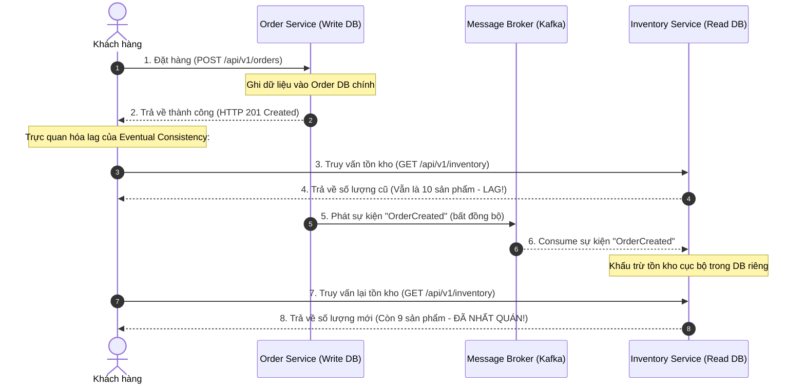

# Eventual consistency là gì?

## ⚡ Tóm tắt ngắn (30s)
*   **Bản chất**: **Nhất quán sau (Eventual Consistency)** là một mô hình nhất quán yếu (Weak Consistency) trong hệ thống phân tán. Nó đảm bảo rằng, nếu không có cập nhật mới nào được thực hiện trên một bản ghi dữ liệu, cuối cùng (eventually) tất cả các bản sao (replicas / local databases của các microservices) sẽ đồng bộ và trả về cùng một giá trị giống nhau.
*   **Các thảm họa thực chiến được giải quyết**:
    1.  **Hệ thống tê liệt / Nghẽn cổ chai diện rộng (Cascading Outages & Low Throughput)**: Trong hệ thống microservices, nếu cố bắt buộc mọi giao dịch phải nhất quán tức thì (Strong Consistency - ví dụ dùng 2-Phase Commit khóa dữ liệu ở 5 services khác nhau), chỉ cần 1 service bị chậm hoặc sập mạng, toàn bộ chuỗi giao dịch sẽ bị rollback hoặc treo. Eventual Consistency giải quyết triệt để bằng cách cho phép ghi dữ liệu cực nhanh vào service chính, các service phụ thuộc sẽ được cập nhật bất đồng bộ (Asynchronously) sau đó vài mili-giây đến vài giây.
    2.  **Hệ thống sập theo định lý CAP (Violation of CAP Theorem)**: Giúp hệ thống đạt độ sẵn sàng cao (**Availability**) và khả năng chịu được chia cắt mạng (**Partition Tolerance**) - tức là lựa chọn mô hình **AP**, chấp nhận dữ liệu có thể bị lệch trong một khoảng thời gian ngắn (lag) để giữ cho hệ thống luôn hoạt động bình thường.
*   **Quyết định Senior**:
    *   **Áp dụng**: Dành cho các luồng nghiệp vụ chấp nhận độ trễ dữ liệu như: Số lượng lượt xem/like video, thông báo (Notification), cập nhật trạng thái đơn hàng (vận chuyển), đồng bộ dữ liệu sản phẩm sang Elasticsearch để tìm kiếm, báo cáo tổng hợp.
    *   **Tránh xa**: Các nghiệp vụ tài chính cốt lõi (giao dịch trừ tiền tài khoản ngân hàng), khấu trừ tồn kho lúc thanh toán (để tránh bán lố - oversell), quản lý quyền truy cập bảo mật (revocation list). Các trường hợp này bắt buộc phải dùng **Strong Consistency**.

---

## 🔍 Chi tiết bản chất thực chiến

Trong hệ thống phân tán, mô hình Nhất quán sau thường hoạt động dựa trên cơ chế **Replication** (nhân bản dữ liệu giữa các node database) hoặc **Asynchronous Messaging** (truyền thông điệp bất đồng bộ qua Kafka/RabbitMQ giữa các microservices).



### Các biến thể của Eventual Consistency (Senior cần nắm để thiết kế UX tốt):
1.  **Read-your-own-writes Consistency (Nhất quán đọc-sau-khi-ghi)**: Người dùng sửa thông tin của mình (ví dụ cập nhật Avatar) thì bắt buộc họ phải thấy Avatar mới ngay lập tức. Nhưng những người dùng khác có thể nhìn thấy Avatar cũ trong vài giây.
2.  **Monotonic Read Consistency (Đọc đơn điệu)**: Đảm bảo người dùng khi đã nhìn thấy giá trị mới (`V2`), họ sẽ không bao giờ nhìn thấy lại giá trị cũ (`V1`) trong các lần truy vấn tiếp theo, ngay cả khi các truy vấn đó trúng vào các node replica khác nhau.
3.  **Monotonic Write Consistency (Ghi đơn điệu)**: Đảm bảo các thao tác ghi của cùng một người dùng được xử lý theo đúng thứ tự mà họ thực hiện.

---

## 💻 Code thực chiến: BAD vs GOOD

### ❌ BAD: Cố gắng đạt Strong Consistency bằng cách gọi API đồng bộ chéo liên tục gây treo hệ thống

Dưới đây là thiết kế sai lầm khi cố gắng giữ cho dữ liệu Inventory và Order luôn khớp nhau 100% bằng cách gọi API đồng bộ. Khi `Inventory Service` bị chậm hoặc mất kết nối, luồng đặt hàng của khách hàng lập tức bị lỗi 500.

```java
@Service
@Slf4j
public class OrderServiceBad {

    @Autowired
    private OrderRepository orderRepository;
    
    @Autowired
    private InventoryClient inventoryClient; // Feign Client gọi HTTP đồng bộ sang Inventory Service

    @Transactional
    public OrderResponse createOrder(OrderRequest request) {
        // 1. Lưu đơn hàng cục bộ
        Order order = orderRepository.save(new Order(request));
        
        // 2. Gọi đồng bộ sang Inventory Service để cập nhật kho
        // Hậu quả thảm họa: Nếu Inventory Service bị lag (timeout 5s), thread này bị khóa cứng.
        // Nếu Inventory sập, cả giao dịch đặt hàng bị sập theo. Tính sẵn sàng (Availability) bị phá hủy.
        try {
            inventoryClient.deductStock(request.getProductId(), request.getQuantity());
        } catch (Exception e) {
            log.error("Cập nhật kho thất bại, phải rollback đơn hàng!", e);
            throw new RuntimeException("Inventory Service Error - Order Rolled Back");
        }
        
        return new OrderResponse(order);
    }
}
```

---

### ✔️ GOOD: Tách biệt bất đồng bộ qua Outbox Pattern & Kafka để đạt Nhất quán sau (AP Model)

Thiết kế này đảm bảo luồng đặt hàng luôn thành công và siêu nhanh. Sự kiện trừ kho được gửi bất đồng bộ qua Kafka. Cả hai hệ thống đạt trạng thái nhất quán sau vài mili-giây.

```java
// 1. ĐẦU GỬI (ORDER SERVICE) - Ghi vào DB và gửi event qua Outbox Pattern (đảm bảo an toàn giao dịch)
@Service
@Slf4j
public class OrderServiceGood {

    @Autowired
    private OrderRepository orderRepository;
    @Autowired
    private OutboxRepository outboxRepository; // Lưu sự kiện vào DB để tránh mất mát nếu Kafka sập lúc đó

    @Transactional
    public OrderResponse createOrder(OrderRequest request) {
        // Lưu đơn hàng cục bộ
        Order order = orderRepository.save(new Order(request));
        
        // Tạo Outbox Event (Đảm bảo ghi Transactional thành công cùng với Order)
        OrderCreatedEvent event = new OrderCreatedEvent(order.getId(), request.getProductId(), request.getQuantity());
        outboxRepository.save(new OutboxEvent("order-events", order.getId().toString(), JsonUtils.toJson(event)));
        
        return new OrderResponse(order);
    }
}

// 2. ĐẦU NHẬN (INVENTORY SERVICE) - Lắng nghe sự kiện để khấu trừ kho bất đồng bộ
@Component
@Slf4j
public class InventoryConsumer {

    @Autowired
    private InventoryService inventoryService;

    @KafkaListener(topics = "order-events", groupId = "inventory-group")
    public void handleOrderCreated(String message, Acknowledgment ack) {
        try {
            OrderCreatedEvent event = JsonUtils.fromJson(message, OrderCreatedEvent.class);
            log.info("Xử lý trừ kho cho sản phẩm: {}, số lượng: {}", event.getProductId(), event.getQuantity());
            
            // Trừ kho cục bộ tại Inventory Service DB (Có cơ chế idempotent check)
            inventoryService.deductStock(event.getProductId(), event.getQuantity(), event.getOrderId());
            
            ack.acknowledge(); // Cập nhật offset thành công
        } catch (DuplicateKeyException e) {
            log.warn("Sự kiện này đã được xử lý trước đó (Idempotent Check). Bỏ qua!");
            ack.acknowledge();
        } catch (Exception e) {
            log.error("Lỗi xử lý trừ kho. Sẽ retry!", e);
            // Không ack để Kafka gửi lại hoặc đưa vào Dead Letter Queue (DLQ) sau N lần thử
        }
    }
}
```

---

## 📊 Bảng so sánh Strong Consistency vs Eventual Consistency

| Tiêu chí | Strong Consistency (Nhất quán tức thì) | Eventual Consistency (Nhất quán sau) |
| :--- | :--- | :--- |
| **Độ trễ (Latency)** | **Cao**. Phải chờ tất cả các bản sao/dịch vụ xác nhận thành công trước khi phản hồi Client. | **Rất thấp**. Phản hồi ngay sau khi ghi vào dịch vụ gốc. |
| **Độ sẵn sàng (Availability)** | **Thấp**. Một node bị lỗi có thể khiến toàn bộ yêu cầu ghi/đọc bị chặn hoặc lỗi. | **Rất cao**. Các dịch vụ hoạt động độc lập, không bị ảnh hưởng chéo trực tiếp. |
| **Thông lượng (Throughput)** | **Bị giới hạn** bởi tốc độ mạng và cơ chế khóa dữ liệu (Locking). | **Cực cao**. Thích hợp cho các hệ thống tải lớn (High Load). |
| **Độ phức tạp lập trình** | **Thấp**. Developer không cần bận tâm về xung đột trạng thái dữ liệu cũ/mới. | **Cao**. Phải xử lý lag dữ liệu ở FE, idempotent consumer ở BE, và xung đột ghi. |
| **Giải pháp công nghệ** | Relational Database (PostgreSQL, MySQL), Ratis, Raft, Paxos. | Apache Kafka, RabbitMQ, DynamoDB, Cassandra, Redis Replicas. |

---

## ⚠️ Common Gotchas & Questions follow-up

### 1. Sự cố UX: "Tôi vừa bấm thanh toán, tại sao màn hình lịch sử vẫn trống trơn?"
*   **Nguyên nhân**: Replication lag hoặc thời gian tiêu thụ message của Consumer bị trễ. Khách hàng thực hiện hành vi ghi (Write) ở Service A, nhưng khi chuyển trang, Frontend lại gọi API đọc (Read) từ Service B. Lúc này Service B chưa nhận được dữ liệu đồng bộ.
*   **Giải pháp thực chiến**:
    1.  **UX Trick (Optimistic Updates)**: Frontend chủ động thêm bản ghi tạm thời vào giao diện ngay khi nhận được response 200 từ API ghi, thay vì kéo lại danh sách từ API đọc ngay lập tức.
    2.  **Read-your-own-writes Routing**: Định tuyến các yêu cầu đọc của chính User vừa thực hiện hành vi ghi sang thẳng Database master/Primary Service trong vòng `N` giây (sử dụng cache/cookie để đánh dấu), thay vì đọc từ Replica/Secondary Service.

### 2. Sự cố xung đột ghi "Lost Update / Concurrent Updates"
*   **Nguyên nhân**: Khi hai cập nhật xảy ra đồng thời ở hai node khác nhau và đồng bộ chéo. Node A cập nhật trường `name = 'Nguyen A'`, Node B cập nhật `name = 'Nguyen B'`. Nếu không có cơ chế quản lý, cập nhật sau cùng ghi đè bất chấp có thể phá hủy dữ liệu hợp lệ.
*   **Giải pháp**:
    1.  **Last-Write-Wins (LWW)**: Sử dụng NTP (Network Time Protocol) đồng bộ để so sánh timestamp. Bản ghi có timestamp mới nhất sẽ thắng. (Nhược điểm: Đồng hồ mạng có thể bị lệch).
    2.  **Version Vector / Vector Clocks**: Lưu chuỗi version của các node cập nhật để phát hiện xung đột và yêu cầu client/nghiệp vụ giải quyết (Conflict Resolution) giống như cách Git xử lý Merge Conflict.

### 3. Câu hỏi đào sâu từ interviewer
*   **Q: Làm sao để đo lường và giám sát độ trễ (Lag) của sự nhất quán dữ liệu trong hệ thống thực tế?**
    *   *Trả lời*: Chúng ta cần đo lường 2 chỉ số cốt lõi:
        1.  **Kafka Consumer Lag**: Sử dụng các công cụ như Prometheus + Burrow để theo dõi khoảng cách giữa Offset cuối cùng được ghi vào Kafka Topic (Log End Offset) và Offset cuối cùng mà Consumer tiêu thụ thành công. Nếu lag tăng cao liên tục, chứng tỏ hệ thống đang mất rất nhiều thời gian để đạt trạng thái nhất quán.
        2.  **End-to-End Latency Metric**: Đính kèm trường `created_at` (thời điểm phát sinh sự kiện gốc) vào Event Payload. Khi Consumer xử lý xong và ghi dữ liệu xuống Read Database, tính toán khoảng thời gian `duration = current_time - created_at` và đẩy chỉ số này lên Prometheus/Grafana dưới dạng Histogram để giám sát phân phối độ trễ (ví dụ: p99 lag < 500ms).
