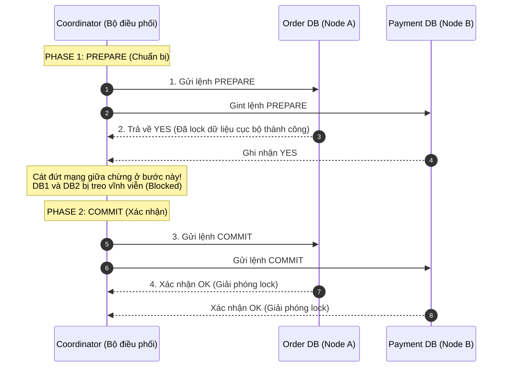

# Distributed transaction khó ở điểm nào?

## ⚡ Tóm tắt ngắn (30s)
*   **Bản chất**: **Giao dịch phân tán (Distributed Transaction)** là một chuỗi các thao tác ghi dữ liệu diễn ra trên nhiều cơ sở dữ liệu vật lý độc lập (hoặc nhiều microservices khác nhau) nhưng yêu cầu tính toàn vẹn tuyệt đối: Tất cả các database phải cùng hoàn thành (Commit) hoặc tất cả phải cùng hủy bỏ (Rollback).
*   **Các thảm họa thực chiến được giải quyết**: Ngăn chặn trạng thái dữ liệu bất nhất nghiêm trọng (Data Inconsistency). Ví dụ điển hình trong E-commerce: Tiền của khách hàng đã bị trừ tại `Payment Service`, nhưng `Order Service` bị sập mạng không tạo được đơn hàng, còn `Inventory Service` thì đã trừ kho. Nếu không có giao dịch phân tán, hệ thống sẽ rơi vào tình trạng "mất tiền của khách nhưng không giao hàng".
*   **Vì sao nó cực kỳ khó?**:
    1.  **Lỗi mạng bán phần (Partial Failures)**: Trong môi trường phân tán, mạng có thể bị đứt giữa chừng, mất gói tin, hoặc một node bị khởi động lại đột ngột. Rất khó để tất cả các node đạt được sự đồng thuận (Consensus) về việc nên đi tiếp hay rút lui.
    2.  **Thảm họa nghẽn cổ chai và sập dây chuyền (Lock Contention & Performance Bottleneck)**: Các giải pháp cổ điển như 2-Phase Commit (2PC) yêu cầu giữ khóa dữ liệu (exclusive locks) trên tất cả các database từ đầu cho đến khi kết thúc giao dịch. Việc này làm tê liệt hoàn toàn throughput, dễ gây cạn kiệt Connection Pool và kéo sập toàn bộ hệ thống nếu có 1 node phản hồi chậm.
    3.  **Single Point of Failure (SPOF)**: Bộ điều phối (Coordinator) có thể bị sập đúng vào thời khắc quyết định giữa Phase 1 và Phase 2, khiến toàn bộ các database tham gia rơi vào trạng thái "treo" (Blocked) không thể giải phóng khóa dữ liệu.
*   **Quyết định Senior**:
    *   **Nguyên tắc cốt lõi**: **Tránh giao dịch phân tán bằng mọi giá!** Thiết kế lại ranh giới dịch vụ (Service Boundaries / Domain-Driven Design) để gộp các bảng dữ liệu cần giao dịch ACID tức thì vào chung một database cục bộ.
    *   **Giải pháp thay thế**: Chuyển sang mô hình **Nhất quán sau (Eventual Consistency)** bằng cách áp dụng **Saga Pattern** hoặc **Transactional Outbox** kết hợp với Message Queue.

---

## 🔍 Chi tiết bản chất thực chiến

Để hiểu tại sao Distributed Transaction là một "cơn ác mộng" vận hành, hãy phân tích cơ chế hoạt động và điểm yếu của giải pháp kinh điển **2-Phase Commit (2PC)**:



### 3 Điểm nghẽn chí tử của 2-Phase Commit (2PC):
1.  **Tính chất đồng bộ và khóa cứng (Synchronous Blocking)**: Các node tham gia phải khóa tài nguyên dữ liệu và chờ đợi lệnh từ Coordinator. Nếu luồng thanh toán kéo dài 3 giây, toàn bộ dữ liệu liên quan sẽ bị khóa trong 3 giây. Không một request nào khác được phép đọc/ghi vào các dòng dữ liệu đó.
2.  **Trạng thái bất định (Uncertainty)**: Nếu Coordinator sập sau khi nhận được phiếu bầu "YES" từ các node nhưng trước khi kịp phát lệnh "COMMIT", các node tham gia hoàn toàn không biết phải làm gì. Chúng bắt buộc phải tiếp tục giữ khóa dữ liệu vô thời hạn để chờ Coordinator sống lại.
3.  **Lỗi mạng trong Phase 2**: Giả sử Coordinator phát lệnh COMMIT cho Node A thành công, nhưng đường truyền sang Node B bị đứt. Node A đã commit, Node B phải tự rollback do quá hạn (timeout). Kết quả: Dữ liệu bị lệch hoàn toàn giữa 2 node.

---

## 💻 Code thực chiến: BAD vs GOOD

### ❌ BAD: Tưởng nhầm Spring `@Transactional` xử lý được giao dịch trên nhiều microservices

Nhiều lập trình viên lầm tưởng việc bọc `@Transactional` bên ngoài một method chứa các cuộc gọi HTTP API sang service khác sẽ giúp rollback được dữ liệu ở service khác khi có exception. Thực tế, Spring chỉ rollback được database cục bộ của service hiện tại!

```java
@Service
@Slf4j
public class OrderServiceBad {

    @Autowired
    private OrderRepository orderRepository;
    @Autowired
    private PaymentClient paymentClient; // Feign Client gọi HTTP sang Payment Service
    @Autowired
    private InventoryClient inventoryClient; // Feign Client gọi HTTP sang Inventory Service

    // Sai lầm nghiêm trọng! @Transactional ở đây CHỈ có tác dụng với Order DB cục bộ.
    @Transactional
    public void createOrderBad(OrderRequest request) {
        // 1. Lưu đơn hàng vào Order DB cục bộ
        Order order = orderRepository.save(new Order(request));

        // 2. Gọi HTTP trừ tiền ở Payment Service
        // Nếu dòng này chạy thành công -> tiền tài khoản khách đã bị trừ thực tế!
        paymentClient.chargeMoney(request.getCustomerId(), request.getAmount());

        // 3. Gọi HTTP trừ kho ở Inventory Service
        // GIẢ SỬ: Dòng này bị lỗi (ví dụ kho hết hàng hoặc sập mạng) -> Ném ra Exception
        if (true) {
            throw new OutOfStockException("Sản phẩm đã hết hàng!");
        }
        
        // HẬU QUẢ: Spring rollback và xóa đơn hàng vừa tạo ở Order DB.
        // NHƯNG tiền của khách ở Payment Service ĐÃ BỊ TRỪ và KHÔNG hề được trả lại!
        // Dữ liệu bị bất nhất nghiêm trọng!
    }
}
```

---

### ✔️ GOOD: Áp dụng Saga Pattern (Choreography) với Giao dịch bù trừ (Compensating Transaction)

Thay vì cố khóa cứng hệ thống, chúng ta cho phép các giao dịch cục bộ chạy độc lập và thành công ngay lập tức. Nếu một bước sau đó bị lỗi, hệ thống sẽ phát tín hiệu bất đồng bộ để kích hoạt các giao dịch ngược lại (bù trừ) nhằm hoàn tác dữ liệu.

```java
// 1. TẠI ORDER SERVICE - Khởi tạo luồng Đặt hàng cục bộ và phát sự kiện
@Service
@Slf4j
public class OrderServiceGood {

    @Autowired
    private OrderRepository orderRepository;
    @Autowired
    private KafkaTemplate<String, String> kafkaTemplate;

    @Transactional
    public void createOrder(OrderRequest request) {
        // Ghi nhận trạng thái đơn hàng là PENDING (Chưa xác nhận)
        Order order = orderRepository.save(new Order(request, "PENDING"));
        
        // Phát sự kiện bắt đầu thanh toán bất đồng bộ
        OrderCreatedEvent event = new OrderCreatedEvent(order.getId(), request.getCustomerId(), request.getAmount());
        kafkaTemplate.send("order-created-topic", order.getId().toString(), JsonUtils.toJson(event));
        log.info("Đã tạo đơn hàng {} ở trạng thái PENDING. Phát sự kiện sang Payment.", order.getId());
    }

    // Luồng xử lý giao dịch bù trừ (Compensating Transaction) khi các service sau bị lỗi
    @Transactional
    @KafkaListener(topics = "order-failed-topic", groupId = "order-group")
    public void handleOrderFailed(String message) {
        OrderFailedEvent event = JsonUtils.fromJson(message, OrderFailedEvent.class);
        log.warn("Nhận sự kiện thất bại của đơn hàng {}. Thực hiện giao dịch bù trừ (Hủy đơn)!", event.getOrderId());
        
        Order order = orderRepository.findById(event.getOrderId())
            .orElseThrow(() -> new EntityNotFoundException());
        
        order.setStatus("CANCELLED"); // Cập nhật trạng thái hủy bỏ đơn hàng
        order.setFailureReason(event.getReason());
        orderRepository.save(order);
    }
}

// 2. TẠI PAYMENT SERVICE - Nhận sự kiện, thực hiện thanh toán. Nếu lỗi thì gửi sự kiện bù trừ
@Component
@Slf4j
public class PaymentConsumer {

    @Autowired
    private PaymentService paymentService;
    @Autowired
    private KafkaTemplate<String, String> kafkaTemplate;

    @KafkaListener(topics = "order-created-topic", groupId = "payment-group")
    public void handleOrderCreated(String message, Acknowledgment ack) {
        OrderCreatedEvent event = JsonUtils.fromJson(message, OrderCreatedEvent.class);
        try {
            // Thực hiện trừ tiền tài khoản
            paymentService.chargeMoney(event.getCustomerId(), event.getAmount());
            
            // Thanh toán thành công -> Phát event tiếp tục luồng sang Inventory Service
            kafkaTemplate.send("payment-success-topic", JsonUtils.toJson(new PaymentSuccessEvent(event.getOrderId())));
        } catch (InsufficientBalanceException e) {
            log.error("Tài khoản không đủ tiền! Phát sự kiện rollback đơn hàng {}", event.getOrderId());
            // Thanh toán thất bại -> Phát event kích hoạt giao dịch bù trừ tại Order Service
            kafkaTemplate.send("order-failed-topic", JsonUtils.toJson(new OrderFailedEvent(event.getOrderId(), "Tài khoản không đủ số dư")));
        } finally {
            ack.acknowledge();
        }
    }
}
```

---

## 📊 Bảng so sánh 2-Phase Commit (2PC) vs Saga Pattern

| Tiêu chí so sánh | 2-Phase Commit (2PC) | Saga Pattern (Eventual Consistency) |
| :--- | :--- | :--- |
| **Tính nhất quán (Consistency)** | **Strong Consistency**. Dữ liệu đồng bộ tức thì trên toàn hệ thống. | **Eventual Consistency**. Chấp nhận dữ liệu tạm lệch (ví dụ trạng thái PENDING). |
| **Tính cô lập (Isolation)** | **Cực cao**. Toàn bộ dữ liệu bị khóa, không dịch vụ nào đọc được trạng thái trung gian. | **Thấp**. Các dịch vụ khác có thể đọc được dữ liệu trung gian (cần xử lý tầng application). |
| **Độ sẵn sàng (Availability)** | **Rất thấp**. Chỉ cần 1 node bị lỗi/chậm sẽ kéo sập cả hệ thống. | **Cực cao**. Một node chết chỉ tạm dừng luồng xử lý, các node khác vẫn nhận request. |
| **Khả năng mở rộng (Scale)** | **Bị giới hạn**. Nghẽn cổ chai do lock DB. | **Vô hạn**. Chạy bất đồng bộ hoàn toàn qua Broker. |
| **Cách hoàn tác dữ liệu** | Database tự động Rollback nhờ cơ chế Transaction Lock. | Phải tự viết code cho các **Giao dịch bù trừ (Compensating Transactions)**. |

---

## ⚠️ Common Gotchas & Questions follow-up

### 1. Thảm họa "Thiếu tính cô lập" (Lack of Isolation) trong Saga
*   **Vấn đề**: Vì Saga không có cơ chế khóa toàn cục (Global Lock), trong khi Saga đang chạy (ở trạng thái PENDING), một luồng giao dịch khác hoàn toàn có thể đọc và sửa đổi chính dữ liệu đó.
    *   *Ví dụ*: Khách hàng đang thực hiện Saga mua hàng. Trong lúc chờ trừ tiền (PENDING), họ gửi tiếp 1 request hủy đơn hàng. Cả 2 luồng chạy song song dẫn đến việc tiền vẫn bị trừ nhưng đơn hàng thì bị hủy!
*   **Giải pháp thực chiến**:
    1.  **Semantic Lock (Khóa ngữ nghĩa)**: Đánh dấu trạng thái bản ghi là `PENDING_APPROVAL` hoặc `LOCK`. Mọi API cập nhật khác của khách hàng khi thấy trạng thái này đều phải bị từ chối (HTTP 409 Conflict) cho đến khi Saga kết thúc.
    2.  **Pessimistic View**: Chỉ hiển thị số dư khả dụng (Available Balance) sau khi đã trừ đi lượng tiền đang chờ xử lý của Saga, thay vì hiển thị số dư thực tế trong DB.

### 2. Sự cố "Giao dịch bù trừ bị thất bại" (Compensating Transaction Fails)
*   **Vấn đề**: Trong Saga, nếu bước thanh toán thành công nhưng bước trừ kho thất bại, ta cần chạy giao dịch bù trừ để trả lại tiền cho khách. Nhưng đúng lúc đó `Payment Service` bị sập nguồn hoặc DB bị lỗi, khiến lệnh hoàn tiền không thể thực hiện.
*   **Giải pháp**:
    1.  **Idempotent Retry (Thử lại vô hạn)**: Message Queue phải tiếp tục gửi lại thông điệp bù trừ (Retry loop) cho đến khi thành công. Do đó, hàm xử lý giao dịch bù trừ bắt buộc phải thiết kế **Idempotent** (chạy 10 lần kết quả vẫn như 1 lần).
    2.  **Dead Letter Queue (DLQ) & Alerting**: Nếu retry quá 5 lần vẫn lỗi, đẩy message lỗi vào DLQ và kích hoạt còi cảnh báo khẩn cấp (PagerDuty/Slack Telegram Alert) để đội ngũ vận hành (Ops) can thiệp thủ công hoặc chạy script sửa dữ liệu.

### 3. Câu hỏi đào sâu từ interviewer
*   **Q: Sự khác biệt lớn nhất giữa Choreography Saga và Orchestration Saga là gì? Khi nào nên chọn loại nào?**
    *   *Trả lời*: 
        *   **Choreography (Phi tập trung)**: Các service tự lắng nghe event và tự phản ứng. Ưu điểm là hiệu năng cực cao, không có SPOF. Nhược điểm là khi quy trình nghiệp vụ có từ 5 bước trở lên, chuỗi sự kiện sẽ cực kỳ rối rắm (Spaghetti Event Flow), rất khó vẽ sơ đồ luồng chạy hoặc kiểm soát lỗi. Chọn khi quy trình đơn giản (2-3 bước).
        *   **Orchestration (Tập trung)**: Có một service trung tâm đóng vai trò là "Nhạc trưởng" (Orchestrator) giữ máy trạng thái (State Machine) của toàn bộ quy trình. Nó ra lệnh cho từng service con và nhận kết quả. Ưu điểm là dễ quản lý, dễ vẽ sơ đồ luồng dữ liệu, dễ viết code xử lý lỗi tập trung. Nhược điểm là tăng độ trễ và tạo ra một Single Point of Failure tiềm ẩn. Chọn khi quy trình nghiệp vụ phức tạp, nhiều bước liên quan đến tài chính.
