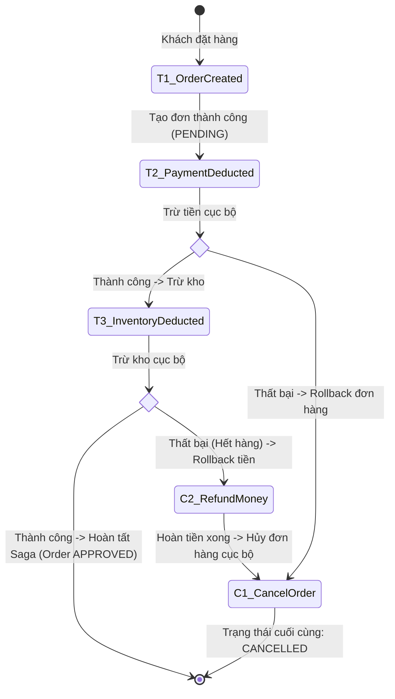

# Saga pattern là gì?

## ⚡ Tóm tắt ngắn (30s)
*   **Bản chất**: **Saga Pattern** là một mẫu thiết kế (Design Pattern) dùng để quản lý giao dịch phân tán (Distributed Transactions) trong kiến trúc Microservices. Thay vì khóa cứng toàn bộ hệ thống bằng một giao dịch lớn duy nhất (như 2-Phase Commit), Saga chia quy trình nghiệp vụ lớn thành một chuỗi các **Giao dịch cục bộ (Local Transactions)** chạy nối tiếp nhau trên từng service.
*   **Cơ chế rollback đặc biệt (Compensating Transaction)**: Khi một bước trong chuỗi giao dịch cục bộ bị thất bại (ví dụ: Kho hết hàng), hệ thống sẽ tự động kích hoạt một loạt các **Giao dịch bù trừ (Compensating Transactions)** chạy theo chiều ngược lại để hoàn tác các tác vụ đã thực hiện thành công trước đó (ví dụ: Hoàn lại tiền cho khách hàng, hủy đơn hàng cục bộ).
*   **Các thảm họa thực chiến được giải quyết**:
    1.  **Sập toàn hệ thống do Lock Contention (Nghẽn tài nguyên)**: Giải quyết triệt để vấn đề giữ khóa dữ liệu quá lâu của 2PC. Trong Saga, mỗi service hoàn thành giao dịch cục bộ của mình là giải phóng khóa và commit thẳng vào DB riêng ngay lập tức.
    2.  **Mất mát dữ liệu / Rác dữ liệu liên dịch vụ**: Khi luồng nghiệp vụ bị đứt gãy ở giữa chừng, Saga đảm bảo dữ liệu không bị "treo lơ lửng" hay lệch lạc mà cuối cùng sẽ trở về trạng thái nhất quán hoặc được hoàn tác hoàn toàn.
*   **Quyết định Senior**:
    *   **Áp dụng**: Cho bất kỳ quy trình nghiệp vụ phân tán nào kéo dài qua nhiều microservices có DB riêng biệt, chấp nhận **Nhất quán sau (Eventual Consistency)** như luồng Đặt hàng (Checkout), đặt vé máy bay/khách sạn (Booking), phê duyệt hồ sơ vay vốn tài chính nhiều bước.
    *   **Điểm yếu cần lưu ý**: Thiếu tính cô lập (Lack of Isolation) của ACID. Dữ liệu trung gian (PENDING) sẽ hiển thị cho các luồng truy vấn khác đọc được. Bắt buộc phải thiết kế thêm **Semantic Lock (Khóa ngữ nghĩa)** để ngăn ngừa tranh chấp dữ liệu (Race Condition).

---

## 🔍 Chi tiết bản chất thực chiến

Saga Pattern hoạt động dựa trên nguyên lý chia một giao dịch phân tán $T$ thành một chuỗi gồm các giao dịch cục bộ $T_1, T_2, ..., T_n$. Với mỗi giao dịch cục bộ $T_i$, ta bắt buộc phải thiết kế một giao dịch bù trừ tương ứng $C_i$ để hoàn tác tác động của nó.



### Luồng chạy khi xảy ra lỗi (Rollback Flow):
Nếu Saga bị lỗi ở bước thứ $k$ (ví dụ $T_3$ trừ kho bị thất bại do hết hàng), Saga sẽ thực thi các giao dịch bù trừ theo thứ tự ngược lại: $C_2 \r\rightarrow C_1$ để khôi phục trạng thái cũ.
*   **Lưu ý cực kỳ quan trọng**: Giao dịch bù trừ $C_i$ **không phải là rollback database vật lý** (vì $T_i$ đã được commit thực sự trước đó rồi). Nó là một giao dịch logic nghiệp vụ để triệt tiêu ảnh hưởng của $T_i$ (ví dụ: $T_2$ là "Trừ 100$ trong ví", thì $C_2$ là "Cộng lại 100$ vào ví").

### 2 Mô hình triển khai Saga (Xem chi tiết câu tiếp theo):
1.  **Choreography Saga (Phi tập trung / Hướng sự kiện)**: Các dịch vụ tự lắng nghe và phát ra sự kiện để kích hoạt bước tiếp theo mà không có người điều phối trung tâm.
2.  **Orchestration Saga (Tập trung / Nhạc trưởng)**: Có một service trung tâm (Saga Orchestrator) quản lý máy trạng thái (State Machine) và trực tiếp ra lệnh cho các service con.

---

## 💻 Code thực chiến: Thiết kế Saga Orchestrator với Spring Boot

Dưới đây là một mô hình đơn giản nhưng chuẩn thực chiến để xây dựng một **Saga Orchestrator** quản lý quy trình thanh toán và đặt hàng bằng Spring Boot sử dụng cơ chế xử lý lỗi chủ động.

```java
// 1. STATE MACHINE CỦA SAGA
public enum SagaStatus {
    STARTED, PAYMENT_PENDING, PAYMENT_SUCCESS, INVENTORY_PENDING, APPROVED, FAILED
}

// 2. SAGA ORCHESTRATOR - NHẠC TRƯỞNG ĐIỀU PHỐI
@Component
@Slf4j
public class OrderSagaOrchestrator {

    @Autowired
    private PaymentClient paymentClient; // Feign Client
    @Autowired
    private InventoryClient inventoryClient; // Feign Client
    @Autowired
    private OrderRepository orderRepository;

    public void executeSaga(Order order) {
        log.info("Bắt đầu Saga Orchestration cho đơn hàng: {}", order.getId());
        
        // Bước 1: Khởi động giao dịch cục bộ tại Payment Service
        try {
            log.info("Saga [1/3]: Gọi Payment Service trừ tiền đơn {}", order.getId());
            boolean paymentOk = paymentClient.charge(order.getCustomerId(), order.getTotalAmount());
            
            if (paymentOk) {
                log.info("Saga [2/3]: Thanh toán thành công. Tiến hành gọi Inventory trừ kho.");
                
                // Bước 2: Gọi giao dịch cục bộ tại Inventory Service
                boolean inventoryOk = inventoryClient.deductStock(order.getProductId(), order.getQuantity());
                
                if (inventoryOk) {
                    // Cả 2 bước thành công -> Hoàn tất Saga
                    log.info("Saga [3/3]: Trừ kho thành công. Duyệt đơn hàng!");
                    updateOrderStatus(order.getId(), SagaStatus.APPROVED, "Thành công");
                } else {
                    // Trừ kho thất bại -> Kích hoạt chuỗi bù trừ khẩn cấp
                    log.warn("Saga [3/3]: Trừ kho thất bại! Bắt đầu chạy giao dịch bù trừ.");
                    rollbackSaga(order, "Hết hàng trong kho", true, false);
                }
            } else {
                // Thanh toán thất bại
                log.warn("Saga [1/3]: Thanh toán thất bại! Hủy đơn hàng.");
                rollbackSaga(order, "Thanh toán bị từ chối", false, false);
            }
        } catch (Exception e) {
            log.error("Saga bị lỗi hệ thống bất ngờ! Tiến hành rollback an toàn.", e);
            rollbackSaga(order, "Lỗi hệ thống: " + e.getMessage(), true, true);
        }
    }

    // Cơ chế thực thi Giao dịch bù trừ (Compensating Transactions)
    private void rollbackSaga(Order order, String reason, boolean refundPayment, boolean rollbackInventory) {
        log.error("--- KÍCH HOẠT GIAO DỊCH BÙ TRỪ CHO ĐƠN HÀNG {} ---", order.getId());
        
        // Bù trừ 1: Trả lại tiền nếu trước đó đã trừ thành công
        if (refundPayment) {
            try {
                log.info("Bù trừ: Gọi hoàn tiền {} cho khách {}", order.getTotalAmount(), order.getCustomerId());
                paymentClient.refund(order.getCustomerId(), order.getTotalAmount());
            } catch (Exception e) {
                // Sự cố chí tử: Giao dịch bù trừ bị lỗi -> Cần báo động đỏ!
                log.error("THẢM HỌA: Hoàn tiền thất bại cho đơn hàng {}! Cần Ops can thiệp!", order.getId(), e);
            }
        }

        // Bù trừ 2: Trả lại kho nếu trước đó đã trừ kho thành công (Trường hợp lỗi ở bước sau nữa nếu có)
        if (rollbackInventory) {
            try {
                log.info("Bù trừ: Trả lại số lượng {} vào kho cho sản phẩm {}", order.getQuantity(), order.getProductId());
                inventoryClient.addStock(order.getProductId(), order.getQuantity());
            } catch (Exception e) {
                log.error("THẢM HỌA: Trả lại kho thất bại cho đơn hàng {}!", order.getId(), e);
            }
        }

        // Bước cuối: Cập nhật trạng thái đơn hàng thành FAILED cục bộ
        updateOrderStatus(order.getId(), SagaStatus.FAILED, reason);
    }

    private void updateOrderStatus(Long orderId, SagaStatus status, String notes) {
        Order order = orderRepository.findById(orderId).orElseThrow();
        order.setStatus(status.name());
        order.setNotes(notes);
        orderRepository.save(order);
    }
}
```

---

## 📊 Bảng so sánh 3 mô hình xử lý giao dịch cục bộ trong Saga

| Đặc điểm | Tác vụ thông thường (Pivotal Transaction) | Tác vụ bù trừ (Compensating Transaction) | Tác vụ đảo ngược (Idempotent Retry) |
| :--- | :--- | :--- | :--- |
| **Mục đích** | Thực hiện hành động nghiệp vụ chính (Ghi mới/Cập nhật). | Khôi phục trạng thái nghiệp vụ cũ khi có lỗi xảy ra hạ nguồn. | Chạy lại tác vụ khi có lỗi mạng để đảm bảo tính phân phát. |
| **Tính chất đặc trưng** | Có thể thất bại (ví dụ: hết tiền, hết hàng). | **Bắt buộc phải Idempotent** và cực kỳ khó thất bại về mặt logic. | Phải thiết kế Idempotent để tránh ghi trùng dữ liệu. |
| **Ví dụ thực tế** | Trừ 100.000đ tài khoản ví điện tử. | Cộng lại 100.000đ tài khoản ví điện tử. | Gửi lại gói tin kiểm tra thanh toán. |

---

## ⚠️ Common Gotchas & Questions follow-up

### 1. Thảm họa "Giao dịch bù trừ bị thất bại chéo" (Cascading Compensation Failure)
*   **Vấn đề**: Trong quá trình thực hiện giao dịch bù trừ để hoàn trả tiền, service hoàn tiền sập mạng vĩnh viễn hoặc tài khoản nhận tiền bị khóa. Hệ thống rơi vào trạng thái bất nhất không thể tự cứu vãn.
*   **Giải pháp**:
    1.  **Thiết kế Idempotency tuyệt đối**: Giao dịch bù trừ bắt buộc phải có khả năng thử lại (Retry) liên tục mà không sinh ra tác dụng phụ.
    2.  **Sử dụng Transactional Outbox Pattern**: Không gọi trực tiếp API hoàn tiền mà ghi lệnh hoàn tiền vào bảng `Outbox` cục bộ. Một worker chạy ngầm sẽ liên tục quét bảng này để đẩy qua hàng đợi tin nhắn (Message Queue) cho đến khi thanh toán xử lý hoàn tất 100%.

### 2. Sự cố "Đọc dữ liệu rác" (Dirty Read ở tầng phân tán) do thiếu tính cô lập
*   **Vấn đề**: Khách hàng A đang mua hàng, Saga cập nhật số dư khả dụng của A từ 500$ xuống 100$. Trong lúc Saga chưa hoàn tất, một luồng nghiệp vụ khác kiểm tra số dư của A thấy có 100$. Sau đó Saga thất bại và hoàn trả tiền về 500$. Khách hàng đã bị nhìn thấy số dư sai lệch tạm thời.
*   **Giải pháp**:
    *   Sử dụng **Semantic Lock (Khóa ngữ nghĩa)**: Khi trừ tiền tạm thời, không trừ trực tiếp vào tài khoản chính mà chuyển 400$ vào một ví phụ gọi là `Locked Balance` hoặc `Pending Balance`. Số dư hiển thị cho khách hàng vẫn là số dư khả dụng thực tế. Chỉ khi Saga kết thúc thành công, số tiền ở ví phụ mới chính thức biến mất.

### 3. Câu hỏi đào sâu từ interviewer
*   **Q: Làm thế nào để giải quyết vấn đề Trùng lặp Message (Duplicate Messages) khi Saga Orchestrator thử lại các cuộc gọi dịch vụ nhiều lần?**
    *   *Trả lời*: Để chống trùng lặp dữ liệu khi chạy lại Saga, mọi API tham gia vào Saga bắt buộc phải là **Idempotent API**. 
    *   Mỗi khi Saga bắt đầu, Orchestrator sẽ tạo ra một `Saga ID` (UUID) duy nhất toàn cục. Tất cả các yêu cầu gửi đến các service con (Payment, Inventory) đều phải đính kèm `Saga ID` này.
    *   Ở các service con, trước khi xử lý, chúng phải kiểm tra xem `Saga ID` này đã được xử lý thành công chưa (lưu vết trong một bảng `Processed_Sagas` cùng với Database Transaction cục bộ). Nếu thấy ID đã tồn tại, lập tức trả về kết quả thành công của lần trước đó mà không thực hiện ghi đè dữ liệu lần 2.
