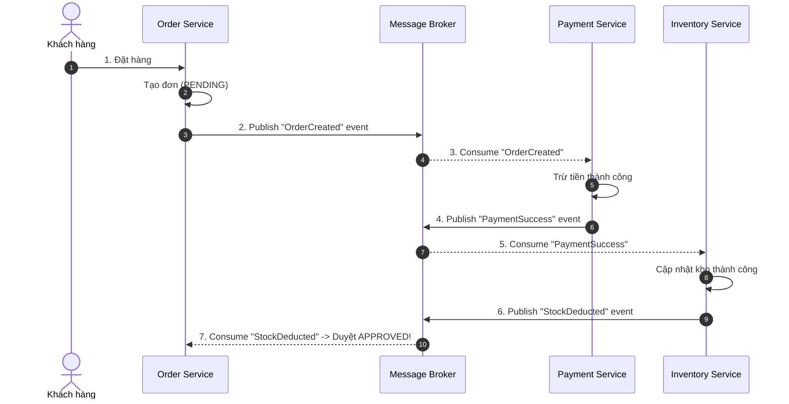
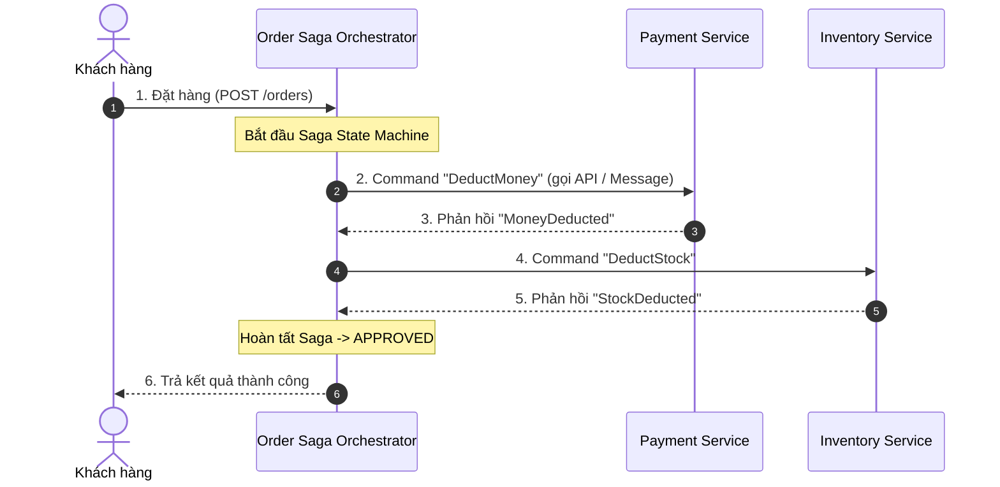

# Choreography và orchestration trong Saga khác nhau thế nào?

## ⚡ Tóm tắt ngắn (30s)
*   **Bản chất**: Đây là hai trường phái thiết kế khác biệt hoàn toàn để điều phối luồng giao dịch phân tán trong **Saga Pattern**:
    *   **Choreography (Phi tập trung - Hướng sự kiện)**: Không có người chỉ huy trung tâm. Các service tự tương tác với nhau bằng cách lắng nghe (Subscribe) và phát ra (Publish) các **Sự kiện (Events)** qua Message Broker (như Kafka/RabbitMQ). Mỗi service tự quyết định hành động tiếp theo dựa trên sự kiện nhận được.
    *   **Orchestration (Tập trung - Nhạc trưởng)**: Sử dụng một bộ điều phối trung tâm gọi là **Saga Orchestrator** để nắm giữ máy trạng thái (State Machine) của toàn bộ quy trình. Orchestrator trực tiếp gửi chỉ thị (**Commands**) đến các service con và nhận lại phản hồi để quyết định bước đi tiếp theo hoặc kích hoạt luồng rollback.
*   **Quyết định Senior**:
    *   **Chọn Choreography**: Khi quy trình nghiệp vụ **đơn giản, ít bước** (thường từ 2 đến 4 bước), luồng đi tuyến tính. Ưu điểm là hiệu năng cực cao, không lo Single Point of Failure (SPOF) và dễ mở rộng.
    *   **Chọn Orchestration**: Khi quy trình nghiệp vụ **phức tạp** (từ 5 bước trở lên, ví dụ: luồng Booking du lịch gồm Đặt vé máy bay -> Đặt phòng -> Thuê xe -> Thanh toán -> Tích điểm), luồng rẽ nhánh điều kiện loằng ngoằng, cần khả năng theo dõi tập trung (Traceability), hoặc có tích hợp với các service bên thứ ba (Third-party) không thể phát sự kiện.

---

## 🔍 Chi tiết bản chất thực chiến

### 1. Mô hình Choreography Saga (Vũ điệu tự do)
Các service hoạt động giống như các vũ công trên sân khấu, tự nhảy theo nhạc và phản ứng lại chuyển động của nhau mà không cần nhạc trưởng chỉ tay năm ngón.


*   **Nhược điểm chí tử (Spaghetti Dependency)**: Khi quy trình phình to ra 10 bước, các service sẽ phụ thuộc chéo vòng tròn vào sự kiện của nhau. Rất khó để một lập trình viên mới vào dự án có thể hiểu được luồng đi toàn cục của một đơn hàng nếu không có tài liệu vẽ tay bên ngoài.

---

### 2. Mô hình Orchestration Saga (Nhạc trưởng chỉ huy)
Orchestrator đóng vai trò là nhạc trưởng đứng giữa, trực tiếp điều hành từng nhạc công chơi nhạc cụ theo đúng bản giao hưởng.


*   **Điểm mạnh tối thượng**: Toàn bộ logic nghiệp vụ điều phối được tập trung tại một nơi (Orchestrator code). Dễ dàng sửa đổi quy trình (ví dụ thêm bước gửi SMS khuyến mãi) chỉ bằng cách sửa code tại Orchestrator mà không cần động vào code của Payment hay Inventory.

---

## 💻 Code thực chiến: BAD vs GOOD (So sánh cấu trúc điều hướng)

### ❌ BAD: Dùng Choreography Saga cho quy trình quá phức tạp gây rối loạn luồng sự kiện (Event Spaghetti)

Dưới đây là một ví dụ tai hại khi lạm dụng Choreography. `PaymentConsumer` phải tự biết sau mình là bước nào để gửi event tiếp theo, làm mất đi tính độc lập (Decoupling) của service.

```java
// TẠI PAYMENT SERVICE - Phải biết cả sự tồn tại của Inventory Service để điều phối luồng
@Component
@Slf4j
public class PaymentConsumerChoreographyBad {

    @Autowired
    private PaymentService paymentService;
    @Autowired
    private KafkaTemplate<String, Object> kafkaTemplate;

    @KafkaListener(topics = "order-created-event", groupId = "payment-group")
    public void onOrderCreated(String message) {
        OrderCreatedEvent event = JsonUtils.fromJson(message, OrderCreatedEvent.class);
        try {
            paymentService.charge(event.getCustomerId(), event.getAmount());
            
            // HẬU QUẢ: Payment Service bị gắn chặt vào luồng của Inventory Service.
            // Nếu sau này thay đổi quy trình (Thanh toán xong phải gửi Email xác nhận rồi mới trừ kho),
            // ta bắt buộc phải sửa code và deploy lại Payment Service! Vi phạm Open-Closed Principle.
            kafkaTemplate.send("payment-success-event", new PaymentSuccessEvent(event.getOrderId()));
        } catch (Exception e) {
            kafkaTemplate.send("payment-failed-event", new PaymentFailedEvent(event.getOrderId()));
        }
    }
}
```

---

### ✔️ GOOD: Áp dụng Orchestration Saga tập trung logic luồng đi tại Orchestrator

Payment Service hoàn toàn "ngây thơ", không cần biết ai gọi nó hay sau nó là bước nào. Nó chỉ nhận Command, thực thi nhiệm vụ cục bộ và trả về kết quả cho Orchestrator.

```java
// 1. TẠI PAYMENT SERVICE (Hoàn toàn decoupled)
@RestController
@RequestMapping("/api/v1/payments")
public class PaymentController {
    
    @Autowired
    private PaymentService paymentService;

    // API chỉ nhận Command xử lý cục bộ, không quan tâm luồng đi tiếp theo
    @PostMapping("/process-payment")
    public ResponseEntity<PaymentResponse> processPayment(@RequestBody ProcessPaymentCommand cmd) {
        boolean success = paymentService.charge(cmd.getCustomerId(), cmd.getAmount());
        return ResponseEntity.ok(new PaymentResponse(success));
    }
}

// 2. TẠI ORDER SERVICE - NƠI CHỨA ORCHESTRATOR ĐIỀU PHỐI LUỒNG
@Service
@Slf4j
public class OrderSagaOrchestratorGood {

    @Autowired
    private PaymentClient paymentClient;
    @Autowired
    private InventoryClient inventoryClient;
    @Autowired
    private NotificationClient notificationClient; // Dễ dàng cắm thêm bước mới!

    public void runSaga(Order order) {
        // Bước 1: Trừ tiền
        boolean paymentSuccess = paymentClient.processPayment(new ProcessPaymentCommand(order.getCustomerId(), order.getAmount())).isSuccess();
        if (!paymentSuccess) {
            cancelOrder(order.getId(), "Thanh toán thất bại");
            return;
        }

        // Bước 2: Trừ kho
        boolean stockSuccess = inventoryClient.deductStock(new DeductStockCommand(order.getProductId(), order.getQuantity())).isSuccess();
        if (!stockSuccess) {
            // Chạy giao dịch bù trừ: Hoàn lại tiền
            paymentClient.refund(new RefundCommand(order.getCustomerId(), order.getAmount()));
            cancelOrder(order.getId(), "Hết hàng trong kho");
            return;
        }

        // Bước 3: Cực kỳ dễ dàng tích hợp thêm bước mới mà không ảnh hưởng các service khác!
        notificationClient.sendSMS(order.getPhoneNumber(), "Đơn hàng của bạn đã được duyệt thành công!");
        
        approveOrder(order.getId());
    }

    private void cancelOrder(Long orderId, String reason) { /* ... */ }
    private void approveOrder(Long orderId) { /* ... */ }
}
```

---

## 📊 Bảng so sánh toàn diện Choreography vs Orchestration

| Tiêu chí so sánh | Choreography (Phi tập trung) | Orchestration (Tập trung) |
| :--- | :--- | :--- |
| **Độ phức tạp thiết lập** | **Thấp lúc đầu**. Không cần viết code cho Orchestrator. | **Cao**. Phải xây dựng State Machine, xử lý lỗi tại Orchestrator. |
| **Độ phức tạp khi scale hệ thống**| **Cực cao**. Khó trace luồng sự kiện khi số lượng service tăng lên. | **Thấp**. Quy trình nghiệp vụ hiển thị tường minh tại code Orchestrator. |
| **Sự phụ thuộc (Coupling)** | **Thấp**. Các service chỉ liên kết lỏng lẻo qua Broker. | **Trung bình**. Các service phụ thuộc vào các Command định nghĩa bởi Orchestrator. |
| **Nguy cơ SPOF (Điểm lỗi duy nhất)**| **Không có**. Nếu Broker chạy HA, hệ thống chịu lỗi cực tốt. | **Có**. Nếu Orchestrator sập, toàn bộ quy trình giao dịch mới bị đóng băng. |
| **Dễ Debug và Giám sát (Tracing)**| **Rất khó**. Đòi hỏi phải cấu hình Distributed Tracing (Jaeger/Zipkin) đồng bộ. | **Dễ dàng**. Chỉ cần kiểm tra trạng thái lưu trong DB của Orchestrator. |

---

## ⚠️ Common Gotchas & Questions follow-up

### 1. Thảm họa "Vòng lặp sự kiện bất tận" (Cyclic Dependency / Event Loop) ở Choreography
*   **Vấn đề**: Khi thiết kế Choreography, do không có bộ não trung tâm kiểm soát, lập trình viên có thể vô tình cấu hình: `Service A` lắng nghe `Event X` -> phát ra `Event Y`. `Service B` lắng nghe `Event Y` -> phát ra `Event Z`. `Service C` lắng nghe `Event Z` -> lại phát ra ngược lại `Event X`. Điều này tạo thành một vòng lặp vô tận tiêu tốn sạch tài nguyên CPU và làm tràn ngập Broker trong vài giây.
*   **Giải pháp**: 
    1.  Luôn vẽ biểu đồ luồng sự kiện (Dependency Graph) và kiểm tra tính bất tuần hoàn (Directed Acyclic Graph - DAG) trước khi viết code.
    2.  Khi hệ thống có dấu hiệu bắt đầu lặp vòng tròn, chuyển hướng thiết kế sang dùng **Orchestration** ngay lập tức để nhạc trưởng trực tiếp cắt đứt vòng lặp.

### 2. Sự cố "Nhạc trưởng sập nguồn giữa chừng" (Orchestrator Crash)
*   **Vấn đề**: Đối với mô hình Orchestration, nếu máy chủ chạy Orchestrator bị crash đột ngột trong khi Saga mới thực hiện được nửa chặng đường. Khi server khởi động lại, làm thế nào để tiếp tục Saga mà không làm mất trạng thái dữ liệu?
*   **Giải pháp**:
    *   **Bắt buộc phải bền vững hóa trạng thái (State Persistence)**: Trước khi gửi bất kỳ Command nào sang service con, Orchestrator phải ghi trạng thái hiện tại (ví dụ: `STATUS = PAYMENT_COMPLETED_WAITING_STOCK`) vào Database cục bộ của nó.
    *   Khi sống lại, Orchestrator chỉ việc quét các bản ghi Saga chưa hoàn tất trong DB và tiếp tục thực thi bước tiếp theo (hoặc chạy luồng bù trừ nếu quá thời gian chờ - Timeout).

### 3. Câu hỏi đào sâu từ interviewer
*   **Q: Công nghệ/Thư viện nào phổ biến nhất hiện nay để hiện thực hóa Orchestration Saga trong thế giới Java/Spring Boot?**
    *   *Trả lời*: Có 2 giải pháp hàng đầu đang được dùng ở các doanh nghiệp lớn:
        1.  **Temporal.io (hoặc Cadence)**: Đây là framework cực kỳ mạnh mẽ cho Distributed Workflow. Nó giải quyết triệt để vấn đề lưu trữ trạng thái, retry tự động, timeout và giao dịch bù trừ. Code viết bằng Temporal trông như code đồng bộ thông thường nhưng chạy phân tán cực kỳ tin cậy.
        2.  **Camunda (hoặc Zeebe / Activiti)**: Công cụ BPMN (Business Process Model and Notation) cho phép định nghĩa luồng Saga bằng giao diện đồ họa kéo thả trực quan, sau đó engine của Camunda sẽ tự động thực thi các Service Task (Spring beans) tương ứng. Rất thích hợp cho các quy trình nghiệp vụ cần alignment chặt chẽ với Business Analyst (BA).
