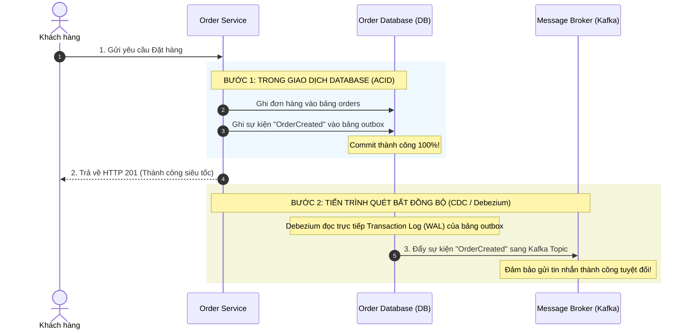

# Outbox pattern là gì?

## ⚡ Tóm tắt ngắn (30s)
*   **Bản chất**: **Transactional Outbox Pattern** là một mẫu thiết kế đảm bảo **Độ tin cậy gửi thông điệp tuyệt đối (Dual-Write Problem)** trong môi trường phân tán. Thay vì gửi trực tiếp tin nhắn đến Message Broker (như Kafka) ngay trong luồng xử lý database, dịch vụ sẽ ghi tin nhắn đó vào một bảng tạm gọi là **Outbox Table** nằm trong cùng Database, được thực thi trong cùng một **Database Transaction** cục bộ. 
*   **Cơ chế phát hành (Message Relay)**: Một tiến trình quét ngầm độc lập (Message Relayer hoặc CDC tool như Debezium) sẽ chịu trách nhiệm đọc các bản ghi từ bảng Outbox này và xuất bản (Publish) chúng lên Message Broker một cách đáng tin cậy (đảm bảo phân phát ít nhất một lần - At-Least-Once Delivery).
*   **Các thảm họa thực chiến được giải quyết**:
    1.  **Sự kiện mồ côi (Ghost / Orphan Events)**: Gửi tin nhắn sang Kafka thành công, nhưng ngay sau đó Database cục bộ của service chính bị lỗi rollback (do trùng khóa, mất kết nối DB). Kết quả: Service hạ nguồn nhận được tin nhắn và xử lý giao dịch trong khi thực chất đơn hàng gốc không hề tồn tại trên hệ thống!
    2.  **Mất mát sự kiện (Lost Events)**: Database cục bộ lưu dữ liệu đơn hàng thành công, nhưng luồng mạng sang Kafka bị đứt đột ngột, khiến tin nhắn không bao giờ được gửi đi. Hệ thống hạ nguồn (Thanh toán, Kho) bị "mù thông tin" vĩnh viễn.
*   **Quyết định Senior**:
    *   **Áp dụng**: Cho tất cả các luồng đồng bộ dữ liệu liên dịch vụ quan trọng đòi hỏi sự nhất quán tuyệt đối giữa trạng thái DB cục bộ và Message Broker.
    *   **Công nghệ khuyên dùng**: Sử dụng **Debezium (CDC)** đọc Transaction Log (WAL của Postgres / Binlog của MySQL) để đẩy dữ liệu từ bảng Outbox sang Kafka. Giải pháp này có hiệu năng siêu cao, không gây chậm (Overhead) DB chính như việc dùng Scheduler quét bảng (`SELECT ... FOR UPDATE`).

---

## 🔍 Chi tiết bản chất thực chiến: Bài toán Dual-Write

Trong kiến trúc Microservices, thảm họa xảy ra khi ta phải thực hiện đồng thời 2 hành vi ghi dữ liệu (Dual-Write): vừa ghi vào Database cục bộ, vừa đẩy sự kiện sang Message Broker. Hai thao tác này không thể gộp chung vào một Transaction phân tán (2PC) vì hiệu năng quá tệ.



### Các cách hiện thực hóa Message Relayer phổ biến:

#### Cách 1: Polling Publisher (Quét bảng ngầm - Scheduler)
Sử dụng một thread ngầm chạy trong service (ví dụ `@Scheduled` của Spring Boot) liên tục quét bảng `outbox` với điều kiện `processed = false`, gửi tin nhắn sang Kafka, rồi cập nhật lại `processed = true`.
*   **Nhược điểm**: Gây tải lớn (Overhead) lên Database do liên tục thực hiện các câu lệnh `SELECT` và `UPDATE`. Gây chậm nếu có nhiều luồng tranh chấp. Có độ trễ nhất định.

#### Cách 2: Transaction Log Mining / CDC (Change Data Capture)
Sử dụng công cụ chuyên dụng như **Debezium** hoặc **Flink CDC** lắng nghe trực tiếp tệp nhật ký ghi trước của database (Write-Ahead Log - WAL của PostgreSQL, hoặc Binlog của MySQL).
*   **Điểm mạnh**: Siêu nhanh (Độ trễ gần như bằng 0). Không can thiệp hay gây tải cho CPU/RAM của Database chính vì nó chỉ đọc file log tuần tự trên đĩa cứng.

---

## 💻 Code thực chiến: BAD vs GOOD

### ❌ BAD: Gửi trực tiếp tin nhắn sang Kafka ngay trong `@Transactional`

Đây là lỗi phổ biến nhất của các lập trình viên tầm trung. Luồng xử lý dưới đây cực kỳ dễ bị mất mát dữ liệu hoặc tạo ra tin nhắn mồ côi khi mạng chập chờn.

```java
@Service
@Slf4j
public class OrderServiceBad {

    @Autowired
    private OrderRepository orderRepository;
    @Autowired
    private KafkaTemplate<String, String> kafkaTemplate;

    @Transactional
    public void createOrderBad(OrderRequest request) {
        // 1. Ghi vào database cục bộ
        Order order = orderRepository.save(new Order(request));

        // 2. Gửi thẳng sang Kafka
        // NGUY HIỂM 1: Nếu Kafka Broker bị sập/lag, dòng này ném exception -> Transaction bị rollback.
        // Đơn hàng bị hủy mặc dù lỗi chỉ là do mạng của Kafka!
        
        // NGUY HIỂM 2: Nếu gửi Kafka thành công, nhưng đúng lúc này DB bị lỗi khóa ngoại (Foreign Key Constraint) ở cuối method.
        // DB rollback đơn hàng. Nhưng tin nhắn ĐÃ gửi sang Kafka rồi và không thể rút lại!
        // Hệ thống hạ nguồn sẽ nhận được tin nhắn và xử lý giao dịch ảo!
        kafkaTemplate.send("order-events", order.getId().toString(), JsonUtils.toJson(order));
    }
}
```

---

### ✔️ GOOD: Áp dụng Outbox Pattern sử dụng Polling Scheduler trong Spring Boot

Ghi đồng thời thông tin đơn hàng và thông điệp sự kiện vào cùng một giao dịch DB. Tách biệt hoàn toàn hành vi gửi tin nhắn sang một tiến trình khác.

```java
// 1. THỰC THỂ BẢNG OUTBOX
@Entity
@Table(name = "outbox")
@Data
@NoArgsConstructor
@AllArgsConstructor
public class OutboxEvent {
    @Id
    @GeneratedValue(strategy = GenerationType.IDENTITY)
    private Long id;
    private String aggregateType;
    private String aggregateId;
    private String type;
    private String payload;
    private boolean processed = false;
    private LocalDateTime createdAt = LocalDateTime.now();
}

// 2. ĐẦU GHI (ORDER SERVICE)
@Service
public class OrderServiceGood {

    @Autowired
    private OrderRepository orderRepository;
    @Autowired
    private OutboxRepository outboxRepository;

    @Transactional
    public void createOrder(OrderRequest request) {
        // Lưu đơn hàng cục bộ
        Order order = orderRepository.save(new Order(request));

        // Lưu thông điệp sự kiện vào bảng Outbox cùng Transaction cục bộ
        OutboxEvent outbox = new OutboxEvent();
        outbox.setAggregateType("Order");
        outbox.setAggregateId(order.getId().toString());
        outbox.setType("OrderCreated");
        outbox.setPayload(JsonUtils.toJson(new OrderCreatedEvent(order)));
        
        outboxRepository.save(outbox);
        // Kết thúc Transaction -> Cả Order và Outbox đều được ghi thành công an toàn!
    }
}

// 3. ĐẦU QUÉT VÀ GỬI (MESSAGE RELAYER - RUNS IN BACKGROUND)
@Component
@Slf4j
public class OutboxSchedulerRelayer {

    @Autowired
    private OutboxRepository outboxRepository;
    @Autowired
    private KafkaTemplate<String, String> kafkaTemplate;

    // Quét bảng outbox mỗi 100ms
    @Scheduled(fixedDelay = 100)
    @Transactional
    public void relayMessages() {
        List<OutboxEvent> pendingEvents = outboxRepository.findByProcessedFalseOrderByCreatedAtAsc();
        
        for (OutboxEvent event : pendingEvents) {
            try {
                // Đẩy tin nhắn sang Kafka Broker
                kafkaTemplate.send(
                    "order-events", 
                    event.getAggregateId(), 
                    event.getPayload()
                ).get(); // Gọi sync .get() để đảm bảo Kafka đã xác nhận nhận được tin
                
                // Đánh dấu đã gửi thành công
                event.setProcessed(true);
                outboxRepository.save(event);
                log.info("Đã relay thành công Outbox Event ID: {}", event.getId());
            } catch (Exception e) {
                log.error("Relay thất bại Outbox Event ID: {}. Sẽ thử lại lần sau!", event.getId(), e);
                break; // Dừng lại để đảm bảo thứ tự gửi tin nhắn (Ordering) của các event tiếp theo
            }
        }
    }
}
```

---

## 📊 Bảng so sánh Polling Publisher vs CDC (Debezium) cho Outbox Pattern

| Tiêu chí | Polling Scheduler (Quét bảng ngầm) | Change Data Capture (Debezium / WAL Reader) |
| :--- | :--- | :--- |
| **Ảnh hưởng hiệu năng DB** | **Cao**. Các câu lệnh quét bảng và cập nhật liên tục làm chậm các câu lệnh ghi nghiệp vụ chính. | **Gần như bằng 0**. Chỉ đọc trực tiếp file nhật ký giao dịch tuần tự trên ổ đĩa. |
| **Độ trễ truyền tin (Latency)**| **Có trễ**. Phụ thuộc vào tần suất chu kỳ quét của Scheduler (ví dụ 100ms, 1s). | **Gần như tức thời (< 10ms)** ngay khi DB hoàn tất commit. |
| **Độ phức tạp triển khai** | **Cực kỳ đơn giản**. Chỉ cần viết code Java thuần bằng Spring Boot Scheduler. | **Cao**. Đòi hỏi cài đặt Kafka Connect, cấu hình Debezium, quản lý hạ tầng vận hành. |
| **Đảm bảo thứ tự gửi tin** | Rất khó xử lý khi scale-out ra nhiều node chạy Scheduler song song. | **Hoàn hảo**. Đọc tuần tự đúng theo thứ tự ghi chép thực tế của Transaction Log. |

---

## ⚠️ Common Gotchas & Questions follow-up

### 1. Thảm họa "Phát thông điệp trùng lặp" (Duplicate Messages)
*   **Vấn đề**: Outbox Pattern cam kết phân phát tin nhắn **ít nhất một lần (At-Least-Once)**. Điều này có nghĩa là sẽ có trường hợp Broker nhận được tin nhắn thành công, nhưng Message Relayer bị crash đột ngột trước khi kịp cập nhật trạng thái `processed = true` trong DB. Khi sống lại, Relayer sẽ quét lại bản ghi đó và gửi tin nhắn lần thứ hai.
*   **Giải pháp**: 
    *   Phía nhận tin nhắn (Consumer) bắt buộc phải được thiết kế dạng **Idempotent Consumer**. Phải lưu vết các message ID đã xử lý vào một bảng lưu giữ trạng thái cục bộ để phát hiện và bỏ qua tin nhắn trùng lặp.

### 2. Dọn dẹp dữ liệu bảng Outbox (Outbox Table Bloat)
*   **Vấn đề**: Theo thời gian, bảng `outbox` sẽ phình to ra hàng triệu bản ghi đã xử lý (`processed = true`), làm chậm các câu lệnh tìm kiếm và tốn tài nguyên đĩa cứng.
*   **Giải pháp**:
    1.  **Retention Job**: Thiết lập một Cron Job ngầm chuyên dọn dẹp (xóa) các bản ghi có trạng thái `processed = true` đã tồn tại quá 24 giờ.
    2.  **Ghi đè thay vì Append**: Nếu sử dụng CDC Debezium, ta có thể ghi đè (Delete) ngay bản ghi trong bảng `outbox` sau khi commit, vì Debezium ghi nhận được sự kiện `INSERT` rồi tự động bỏ qua sự kiện `DELETE` nếu cấu hình phù hợp.

### 3. Câu hỏi đào sâu từ interviewer
*   **Q: Làm thế nào để đảm bảo thứ tự các tin nhắn (Event Ordering) được gửi đi từ bảng Outbox chính xác theo thời gian khi chúng ta scale ứng dụng lên chạy 5 instance khác nhau?**
    *   *Trả lời*: 
        *   Nếu sử dụng **Polling Scheduler**: Rất nguy hiểm vì 5 instance chạy song song sẽ tranh chấp đọc bảng Outbox, dẫn đến việc instance 2 xử lý xong gửi trước instance 1. Giải pháp là phải dùng **Distributed Lock** (như ShedLock bằng Redis) để đảm bảo tại một thời điểm chỉ có DUY NHẤT một instance được phép quét bảng Outbox.
        *   Nếu sử dụng **CDC (Debezium)**: Tránh được hoàn toàn lỗi này. Vì Debezium đọc trực tiếp Transaction Log của cơ sở dữ liệu gốc (Single Stream of Log), nên dù ứng dụng có chạy bao nhiêu instance thì Debezium vẫn gửi tin nhắn lên Kafka theo đúng thứ tự commit duy nhất của Database.
