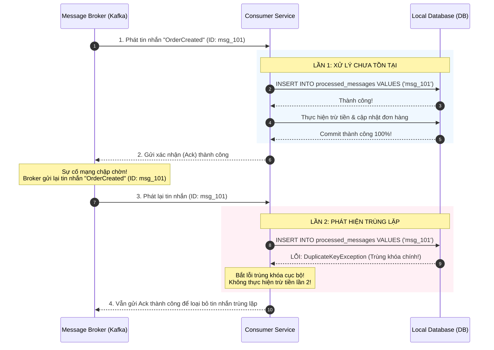

# Idempotent consumer là gì?

## ⚡ Tóm tắt ngắn (30s)
*   **Bản chất**: **Idempotent Consumer** (Bộ tiêu thụ an toàn / Bộ tiêu thụ bất biến) là một mẫu thiết kế (Design Pattern) trong hệ thống bất đồng bộ. Nó đảm bảo rằng, ngay cả khi một Consumer nhận được cùng một tin nhắn (Message) nhiều lần, hành động xử lý tin nhắn đó chỉ được thực hiện **thực tế đúng một lần duy nhất**, các lần nhận sau sẽ tự động nhận diện và bỏ qua mà không làm biến đổi dữ liệu hay sinh ra bất kỳ tác dụng phụ (Side Effects) nào.
*   **Vì sao bắt buộc phải dùng?**: Trong hệ thống phân tán, các Message Broker (như Kafka, RabbitMQ) thường cam kết mức độ phân phát tin nhắn là **At-Least-Once (Phân phát ít nhất một lần)** do lỗi mạng mạng chập chờn. Nghĩa là việc gửi trùng lặp tin nhắn (Duplicate Messages) là **chắc chắn sẽ xảy ra** trong thực tế.
*   **Các thảm họa thực chiến được giải quyết**:
    1.  **Trừ tiền tài khoản khách hàng nhiều lần (Double Charging)**: Khách hàng mua hàng trị giá 100$, do Broker gửi trùng tin nhắn thanh toán, Consumer xử lý 2 lần khiến khách hàng bị trừ mất 200$.
    2.  **Khấu trừ kho lố / Giao hàng trùng lặp**: Tạo ra 2 đơn vận chuyển giống hệt nhau gửi cho khách, hoặc làm sai lệch số liệu tồn kho nghiêm trọng dẫn đến việc không thể giao hàng cho khách hàng khác.
*   **Quyết định Senior**:
    *   **Nguyên tắc vàng**: Không bao giờ được tin tưởng cơ chế "Exactly-once" của Message Broker. **Tất cả các Consumer xử lý dữ liệu nhạy cảm (Tài chính, Kho, Trạng thái đơn hàng) đều phải được thiết kế dạng Idempotent.**
    *   **Phương pháp thực chiến tối ưu**: Sử dụng **Unique Message ID** kết hợp với bảng lưu vết xử lý tin nhắn trong cơ sở dữ liệu (Database Constraint).

---

## 🔍 Chi tiết bản chất thực chiến

Có **3 kỹ thuật cốt lõi** để thiết kế một Idempotent Consumer ở cấp độ Senior:

### 1. Kỹ thuật "Idempotency Key / Message Log DB" (Khuyên dùng)
Consumer lưu giữ danh sách tất cả các Message ID đã xử lý thành công vào một bảng trong Database cục bộ (ví dụ bảng `processed_messages`). 
*   Trước khi thực hiện bất kỳ xử lý nghiệp vụ nào, Consumer thực hiện chèn (Insert) Message ID đó vào bảng. 
*   Nhờ ràng buộc khóa chính độc nhất (**Unique Constraint**), nếu một message trùng lặp gửi đến, DB sẽ ném ra lỗi trùng khóa. Consumer lập tức bắt lỗi này, bỏ qua không xử lý và gửi xác nhận (Acknowledge) thành công cho Broker.



### 2. Kỹ thuật "State Machine Validation" (Kiểm tra máy trạng thái)
Kiểm tra trực tiếp trạng thái nghiệp vụ hiện tại của bản ghi dữ liệu trước khi thay đổi.
*   *Ví dụ*: Chỉ xử lý thanh toán và đổi trạng thái thành `PAID` nếu trạng thái hiện tại của đơn hàng là `PENDING`. Nếu message trùng lặp đến khi trạng thái đơn hàng đã là `PAID` hoặc `SHIPPED`, Consumer lập tức bỏ qua vì trạng thái chuyển đổi không hợp lệ.

### 3. Kỹ thuật "Mathematical Idempotency" (Phép toán bất biến)
Thiết kế câu lệnh cập nhật dữ liệu theo dạng gán giá trị trực tiếp (**Absolute Assignment**) thay vì cộng trừ tương đối.
*   **BAD (Không Idempotent)**: `UPDATE users SET points = points + 10 WHERE id = 1` (Chạy 2 lần khách sẽ được cộng 20 điểm).
*   **GOOD (Idempotent)**: `UPDATE orders SET status = 'DELIVERED' WHERE id = 1` (Trạng thái thiết lập thành DELIVERED dù chạy 1 lần hay 100 lần vẫn là DELIVERED).

---

## 💻 Code thực chiến: BAD vs GOOD

### ❌ BAD: Consumer xử lý cẩu thả không có Idempotent Check gây thảm họa trừ tiền trùng

Consumer dưới đây chỉ đơn thuần nhận tin nhắn và gọi lệnh trừ tiền, dẫn đến việc mất tiền oan của khách khi Broker gửi lại sự kiện do chập mạng.

```java
@Component
@Slf4j
public class PaymentConsumerBad {

    @Autowired
    private WalletService walletService;

    @KafkaListener(topics = "payment-requests", groupId = "payment-group-bad")
    public void onPaymentRequest(String message, Acknowledgment ack) {
        PaymentRequestEvent event = JsonUtils.fromJson(message, PaymentRequestEvent.class);
        
        log.info("Xử lý trừ tiền cho ví: {}", event.getWalletId());
        // HẬU QUẢ CHÍ TỬ: Cứ nhận được tin nhắn là trừ tiền!
        // Nếu Kafka gửi lại tin nhắn này 3 lần do lỗi Ack, ví của khách sẽ bị trừ tiền 3 lần!
        walletService.deductBalance(event.getWalletId(), event.getAmount());
        
        ack.acknowledge();
    }
}
```

---

### ✔️ GOOD: Thiết kế Idempotent Consumer kết hợp Unique Message ID trong Database Transaction

Sử dụng bảng `processed_messages` để lưu vết xử lý và gộp chung vào một Database Transaction cục bộ duy nhất. Đảm bảo tính nhất quán tuyệt đối.

```java
// 1. THỰC THỂ LƯU VẾT MESSAGE ID
@Entity
@Table(name = "processed_messages")
@Data
@NoArgsConstructor
@AllArgsConstructor
public class ProcessedMessage {
    @Id
    private String messageId; // Sử dụng Message ID từ Kafka làm khóa chính độc nhất (Unique Key)
    private LocalDateTime processedAt = LocalDateTime.now();
}

// 2. IDEMPOTENT CONSUMER IMPLEMENTATION
@Component
@Slf4j
public class PaymentConsumerGood {

    @Autowired
    private WalletService walletService;
    @Autowired
    private ProcessedMessageRepository messageRepository;

    @KafkaListener(topics = "payment-requests", groupId = "payment-group-good")
    public void onPaymentRequest(ConsumerRecord<String, String> record, Acknowledgment ack) {
        String messageId = record.key(); // Sử dụng Key của Kafka Message làm Unique ID
        PaymentRequestEvent event = JsonUtils.fromJson(record.value(), PaymentRequestEvent.class);
        
        try {
            // Thực thi xử lý trong Transaction cục bộ
            executeIdempotentTransaction(messageId, event);
            ack.acknowledge(); // Xác nhận xử lý thành công
        } catch (DuplicateKeyException e) {
            log.warn("Sự cố trùng lặp tin nhắn! Message ID {} đã được xử lý trước đó. Bỏ qua!", messageId);
            ack.acknowledge(); // Vẫn phải Ack để xóa tin nhắn trùng lặp khỏi Kafka Queue
        } catch (Exception e) {
            log.error("Lỗi hệ thống khi xử lý Message ID {}. Sẽ retry!", messageId, e);
            // Không ack để Kafka gửi lại hoặc đưa vào DLQ xử lý
        }
    }

    // Gộp chung việc lưu vết Message ID và xử lý nghiệp vụ vào một Transaction duy nhất (ACID)
    @Transactional
    public void executeIdempotentTransaction(String messageId, PaymentRequestEvent event) {
        // Bước 1: Ghi đè chèn Message ID vào bảng processed_messages
        // Nếu messageId đã tồn tại, Spring sẽ ném ra DuplicateKeyException lập tức
        messageRepository.save(new ProcessedMessage(messageId, LocalDateTime.now()));
        
        // Bước 2: Thực hiện tác vụ nghiệp vụ nhạy cảm
        walletService.deductBalance(event.getWalletId(), event.getAmount());
        log.info("Xử lý trừ tiền thành công ví {} cho Message ID: {}", event.getWalletId(), messageId);
    }
}
```

---

## 📊 Bảng so sánh các kỹ thuật đạt tính Idempotency

| Tiêu chí | Kỹ thuật Message Log (Unique Key DB) | Kỹ thuật State Machine Validation | Kỹ thuật Distributed Lock (Redis) |
| :--- | :--- | :--- | :--- |
| **Độ an toàn** | **Tối đa**. Ngăn chặn tuyệt đối ghi trùng nhờ ràng buộc cứng ở tầng database. | **Trung bình**. Vẫn có rủi ro Race Condition nếu 2 thread chạy đồng thời kiểm tra cùng lúc. | **Cao**. Phù hợp cho việc khóa tạm thời ở tầng RAM memory trước khi ghi DB. |
| **Độ trễ hệ thống**| Rất thấp. Chỉ tốn thêm 1 câu lệnh ghi `INSERT` cực kỳ đơn giản. | Không tăng độ trễ. | Tăng độ trễ nhẹ do phải gọi mạng sang Redis Cluster. |
| **Use Case điển hình**| Giao dịch chuyển tiền, hoàn tiền, thanh toán ví điện tử. | Đổi trạng thái đơn hàng: PENDING -> SHIPPED -> DELIVERED. | Khóa luồng click đúp nút "Thanh toán" liên tiếp của User ở FE. |

---

## ⚠️ Common Gotchas & Questions follow-up

### 1. Thảm họa "Race Condition xử lý song song tin nhắn trùng"
*   **Hiện tượng thực tế**: Broker bị lag, gửi lại tin nhắn `msg_101` ngay lập tức. Hệ thống scale-out có 2 instance chạy song song nhận được tin nhắn `msg_101` này gần như cùng một micro-giây.
    *   Cả 2 instance cùng chạy kiểm tra: `SELECT FROM processed_messages WHERE id = 'msg_101'`.
    *   Cả 2 cùng thấy chưa tồn tại (vì chưa kịp insert ghi nhận).
    *   Cả 2 cùng tiến hành trừ tiền của khách!
*   **Giải pháp**:
    *   **Không dùng câu lệnh SELECT trước**: Tuyệt đối không kiểm tra bằng lệnh `SELECT` rồi mới `INSERT`. Hãy chèn thẳng `INSERT` vào bảng có khóa chính độc nhất (Unique Constraint) để tận dụng cơ chế khóa vật lý (Pessimistic Write Lock) ở tầng nhân DB. Database sẽ đảm bảo chỉ có duy nhất 1 luồng chèn thành công, luồng còn lại sẽ bị từ chối lập tức.

### 2. Sự cố "Quên tạo Kafka Message Key" từ đầu Producer
*   **Vấn đề**: Để đạt được Unique Message ID, Producer bắt buộc phải đính kèm một ID duy nhất vào message. Nếu lập trình viên ở Producer quên tạo hoặc tạo ID trùng lặp cho các sự kiện khác nhau, Consumer sẽ bỏ qua nhầm các sự kiện hợp lệ (Lost Events).
*   **Giải pháp**:
    *   Đưa ra tiêu chuẩn chung (API Contract): Message Payload bắt buộc phải chứa trường `event_id` dạng UUID hoặc `order_id` + `action` để làm khóa nghiệp vụ tự sinh ở Producer. Tuyệt đối cấm gửi tin nhắn không có định danh duy nhất.

### 3. Câu hỏi đào sâu từ interviewer
*   **Q: Làm thế nào để giải quyết bài toán dọn dẹp bảng lưu vết tin nhắn `processed_messages` khi hệ thống chạy vài năm và bảng này có hàng tỷ dòng gây phập phồng hiệu năng?**
    *   *Trả lời*: Chúng ta áp dụng cơ chế **TTL (Time-To-Live)** hoặc phân vùng dữ liệu (**Database Partitioning**):
        1.  Với các Database hỗ trợ TTL như Redis hoặc MongoDB: Thiết lập TTL cho các Message ID là 7 ngày (vì tin nhắn retry của Kafka thông thường chỉ diễn ra trong vòng vài phút đến vài giờ). Sau 7 ngày, Message ID tự động bị xóa để giải phóng bộ nhớ.
        2.  Với SQL Database (Postgres/MySQL): Phân vùng bảng theo ngày/tuần. Có một job chạy ngầm hàng đêm xóa các phân vùng cũ (ví dụ phân vùng đã quá 30 ngày) cực nhanh bằng câu lệnh `DROP PARTITION` mà không làm khóa bảng hay ảnh hưởng đến hiệu năng ghi.
