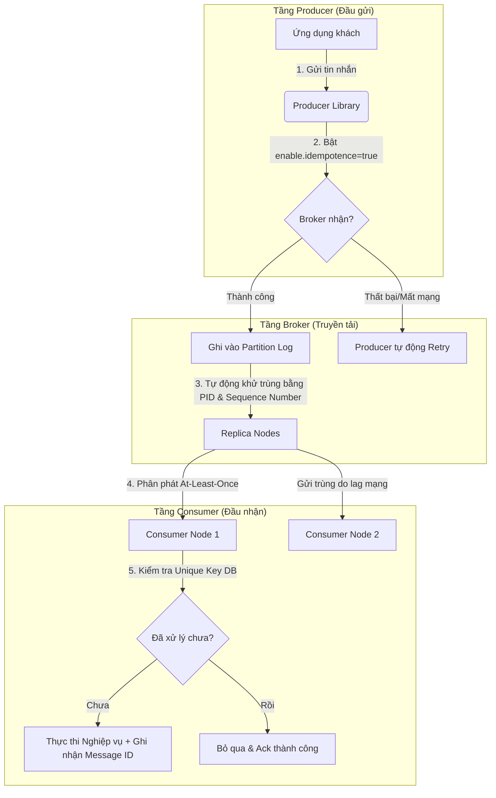

# Duplicate message xử lý thế nào?

## ⚡ Tóm tắt ngắn (30s)
*   **Bản chất**: Trùng lặp tin nhắn (Duplicate Messages) là một đặc tính không thể tránh khỏi trong hệ thống phân tán giao tiếp qua Message Broker. Xử lý trùng lặp đòi hỏi một **chiến lược phòng thủ toàn diện ở 3 tầng (End-to-End Deduplication Strategy)**: Producer (Đầu gửi), Broker (Hạ tầng truyền tin) và Consumer (Đầu nhận).
*   **Các thảm họa thực chiến được giải quyết**:
    1.  **Dữ liệu rác làm tràn ngập hệ thống (System Resource Exhaustion)**: Khi Broker hoặc Producer bị lỗi cấu hình retry vô hạn không giới hạn, hàng triệu tin nhắn trùng lặp sẽ dội bom vào Consumer, làm nghẽn CPU và Database.
    2.  **Sai lệch số dư tài khoản / Giao dịch lỗi**: Tránh việc thực hiện các tác vụ nghiệp vụ nhiều lần (trừ tiền, xuất kho, gửi email spam cho khách).
*   **Chiến lược Senior toàn diện**:
    *   **Tầng Producer**: Bật cấu hình **Idempotent Producer** (`enable.idempotence=true` trong Kafka) để Broker tự động nhận diện và loại bỏ tin nhắn gửi trùng từ Producer trước khi ghi vào đĩa.
    *   **Tầng Broker**: Cấu hình cơ chế Replication an toàn (`acks=all`, `min.insync.replicas`) để giảm thiểu việc Producer phải gửi lại tin nhắn do Broker mất liên lạc tạm thời.
    *   **Tầng Consumer**: Áp dụng **Idempotent Consumer** sử dụng **Unique Deduplication Key** (Khóa chống trùng lặp) trong một Database Transaction cục bộ, hoặc áp dụng **Inbox Pattern** đối với các hệ thống nghiệp vụ cực kỳ phức tạp.

---

## 🔍 Chi tiết bản chất thực chiến

Để xử lý trùng lặp triệt để, Senior Engineer cần hiểu rõ **tại sao tin nhắn bị trùng lặp** và cách phòng thủ ở từng chặng của vòng đời tin nhắn:



### 1. Giải pháp tại tầng Producer (Đầu gửi)
Trong Kafka, nếu Producer gửi tin nhắn đến Broker thành công, nhưng đường truyền mạng báo phản hồi (ACK) bị mất giữa chừng. Producer tưởng sập mạng nên tự động gửi lại (Retry) tin nhắn đó.
*   **Cấu hình thực chiến**: Bật `enable.idempotence=true` ở phía Producer (Mặc định được bật từ Kafka 3.0+).
*   **Cơ chế hoạt động**: Mỗi Producer khi khởi chạy sẽ được Broker cấp cho một **Producer ID (PID)** duy nhất toàn cục. Mỗi tin nhắn gửi đi kèm theo một số thứ tự tăng dần (**Sequence Number**). Khi nhận tin, Broker sẽ kiểm tra: nếu PID và Sequence Number đã được ghi nhận trong Log của Partition, Broker sẽ tự động từ chối tin nhắn gửi trùng đó mà không ghi đè dữ liệu lần 2, đồng thời vẫn gửi phản hồi ACK thành công cho Producer yên tâm.

### 2. Giải pháp tại tầng Broker (Truyền tải)
*   Cấu hình `acks=all` (hoặc `acks=-1`): Đảm bảo tin nhắn được ghi nhận thành công ở cả Node Leader và tất cả các Node Follower đủ điều kiện trước khi báo về cho Producer. Điều này làm giảm thiểu tối đa tình trạng Leader bị sập nguồn khi chưa kịp đồng bộ dữ liệu sang các Follower, giúp tránh việc Producer phải retry gửi lại tin cũ.

### 3. Giải pháp tại tầng Consumer (Đầu nhận - Chốt chặn cuối cùng)
Dù Producer và Broker có an toàn đến đâu, lỗi mạng giữa Consumer và Broker vẫn sẽ làm phát sinh trùng lặp khi Consumer đã xử lý xong dữ liệu nhưng bị sập mạng trước khi gửi Ack về Broker.
*   **Inbox Pattern**: Đây là mô hình nâng cao của Idempotent Consumer. Khi Consumer nhận tin nhắn, nó không xử lý nghiệp vụ ngay. Nó chỉ lưu tin nhắn đó vào bảng `inbox_messages` (Hộp thư đến) với trạng thái `RECEIVED` trong DB của nó. Một tiến trình ngầm (Worker) sau đó sẽ quét bảng Inbox này, xử lý tuần tự từng tin và cập nhật trạng thái thành `PROCESSED`. Kỹ thuật này giúp giải quyết triệt để bài toán overload và thứ tự tin nhắn.

---

## 💻 Code thực chiến: BAD vs GOOD

### ❌ BAD: Tự viết code chống trùng lặp bằng cách lưu Message ID vào Memory (RAM)

Nhiều lập trình viên sử dụng `ConcurrentHashMap` hoặc `HashSet` trong bộ nhớ ứng dụng để kiểm tra trùng lặp tin nhắn nhằm tối ưu hiệu năng. Đây là một lỗi thiết kế cực kỳ ngây thơ.

```java
@Component
@Slf4j
public class DuplicateCheckBad {

    // Sai lầm chí tử 1: Khi ứng dụng bị restart, toàn bộ Map bị xóa sạch!
    // Sai lầm chí tử 2: Khi scale ứng dụng ra 5 instance, Map của instance 1 không thể biết instance 2 đã xử lý tin nhắn nào!
    private final Set<String> processedMessageIds = ConcurrentHashMap.newKeySet();

    @KafkaListener(topics = "order-events", groupId = "group-bad")
    public void onMessage(ConsumerRecord<String, String> record, Acknowledgment ack) {
        String messageId = record.key();
        
        if (processedMessageIds.contains(messageId)) {
            log.warn("Tin nhắn trùng lặp phát hiện bằng RAM cache! Bỏ qua: {}", messageId);
            ack.acknowledge();
            return;
        }

        // Thực hiện xử lý nghiệp vụ
        doBusinessLogic(record.value());
        
        processedMessageIds.add(messageId);
        ack.acknowledge();
    }

    private void doBusinessLogic(String value) {}
}
```

---

### ✔️ GOOD: Áp dụng Inbox Pattern chuẩn hóa luồng xử lý và chống trùng lặp tuyệt đối

Sử dụng cơ chế ghi nhận tin nhắn vào bảng `inbox` cục bộ cùng một transaction để đạt độ tin cậy tối thượng, không phụ thuộc vào trạng thái Memory của ứng dụng.

```java
// 1. THỰC THỂ HỘP THƯ ĐẾN (INBOX TABLE)
@Entity
@Table(name = "inbox_messages", uniqueConstraints = {
    @UniqueConstraint(columnNames = {"message_id"}) // Ràng buộc cứng để chống trùng lặp
})
@Data
@NoArgsConstructor
public class InboxMessage {
    @Id
    @GeneratedValue(strategy = GenerationType.IDENTITY)
    private Long id;
    
    @Column(name = "message_id", nullable = false)
    private String messageId;
    
    @Column(nullable = false)
    private String payload;
    
    @Enumerated(EnumType.STRING)
    private InboxStatus status = InboxStatus.RECEIVED;
    
    private LocalDateTime createdAt = LocalDateTime.now();
    private LocalDateTime processedAt;
}

public enum InboxStatus { RECEIVED, PROCESSED, FAILED }

// 2. TẦNG CONSUMER - CHỈ GHI NHẬN VÀO INBOX
@Component
@Slf4j
public class OrderInboxConsumer {

    @Autowired
    private InboxRepository inboxRepository;

    @KafkaListener(topics = "order-events", groupId = "group-good")
    public void onMessage(ConsumerRecord<String, String> record, Acknowledgment ack) {
        String messageId = record.key();
        
        try {
            saveToInbox(messageId, record.value());
            ack.acknowledge(); // Commit offset ngay lập tức vì tin nhắn đã nằm an toàn trong Inbox DB của ta!
        } catch (DataIntegrityViolationException e) {
            log.warn("Tin nhắn trùng lặp phát hiện ở bảng Inbox! Skip: {}", messageId);
            ack.acknowledge(); // Vẫn Ack để skip tin nhắn trùng
        } catch (Exception e) {
            log.error("Lỗi ghi nhận vào Inbox cho Message ID: {}", messageId, e);
            // Sẽ retry nhận lại tin nhắn sau
        }
    }

    @Transactional
    public void saveToInbox(String messageId, String payload) {
        InboxMessage inbox = new InboxMessage();
        inbox.setMessageId(messageId);
        inbox.setPayload(payload);
        inboxRepository.save(inbox); // Ném ra DataIntegrityViolationException nếu trùng khóa Message ID
    }
}
```

---

## 📊 Bảng so sánh 3 chặng phòng thủ chống trùng lặp tin nhắn

| Tiêu chí so sánh | Tầng Producer (`enable.idempotence`) | Tầng Broker (`acks=all`) | Tầng Consumer (Inbox Pattern / DB Constraint) |
| :--- | :--- | :--- | :--- |
| **Phạm vi bảo vệ** | Giữa Producer và Broker. | Giữa các node bản sao (Replicas) của Broker. | Giữa Broker và ứng dụng Consumer cuối cùng. |
| **Rủi ro lớn nhất** | Bị mất mạng ở chặng cuối sau khi Broker trả Ack về cho Producer. | Không chống được trùng lặp nếu Consumer sập nguồn khi đang xử lý tin. | Đòi hỏi phải tốn thêm chi phí lưu trữ bảng Inbox/Log. |
| **Hiệu năng hệ thống** | Tác động cực kỳ nhẹ lên băng thông. | Giảm nhẹ throughput ghi của Broker do phải đợi ghi xuống đĩa ở các replica. | Tăng tải nhẹ lên Database của Consumer. |
| **Bảo vệ dữ liệu nhạy cảm**| Chưa đủ (Vẫn có rủi ro trùng lặp do Consumer sập mạng). | Chưa đủ. | **Đầy đủ và tuyệt đối (Bắt buộc phải có)**. |

---

## ⚠️ Common Gotchas & Questions follow-up

### 1. Thảm họa "Vắt kiệt đĩa cứng do bảng Inbox phình to" (Inbox Bloat)
*   **Vấn đề**: Sử dụng Inbox Pattern mang lại độ an toàn tuyệt đối, nhưng nếu một hệ thống nhận 10 triệu tin nhắn/ngày, chỉ sau 1 tháng bảng `inbox_messages` sẽ có 300 triệu bản ghi, làm sụp đổ hoàn toàn hiệu năng truy vấn của Database.
*   **Giải pháp thực chiến**:
    1.  **Partitioning theo ngày**: Phân vùng bảng `inbox_messages` theo ngày.
    2.  **Archiving / Deletion Job**: Thiết lập một tiến trình ngầm (Cron Job) chuyên dọn dẹp các bản ghi đã xử lý (`status = 'PROCESSED'`) đã tồn tại quá 3 ngày. 3 ngày là khoảng thời gian quá thừa để đảm bảo không có tin nhắn trùng lặp nào bị phát lại muộn đến thế.
    ```sql
    DELETE FROM inbox_messages WHERE status = 'PROCESSED' AND processed_at < NOW() - INTERVAL '3 days';
    ```

### 2. Sự cố "Distributed Lock và Redis TTL" chống trùng lặp bị hết hạn sớm
*   **Vấn đề**: Để tối ưu hiệu năng ghi DB, nhiều Senior sử dụng Redis làm chốt chặn chống trùng lặp: `SET message_id 'processing' EX 3600 NX` (Khóa trong 1 giờ). Tuy nhiên, nếu Consumer xử lý nghiệp vụ quá lâu (ví dụ xử lý ảnh/video mất hơn 1 giờ), khóa Redis hết hạn trước khi Consumer xử lý xong. Một tin nhắn trùng lặp gửi đến lúc đó sẽ vượt qua chốt chặn Redis và được xử lý song song lần 2!
*   **Giải pháp**:
    *   Sử dụng cơ chế **Redisson RLock (Redisson Lock Watchdog)**: Tự động gia hạn thời gian khóa (Lock renewal) liên tục khi luồng xử lý của Consumer vẫn đang hoạt động bình thường, và chỉ giải phóng khóa khi transaction thực sự commit thành công.

### 3. Câu hỏi đào sâu từ interviewer
*   **Q: Làm thế nào để giải quyết bài toán chống trùng lặp đối với các tin nhắn không có Unique ID tự nhiên từ nguồn bên ngoài gửi về?**
    *   *Trả lời*: Trong trường hợp không có ID định danh tự nhiên, chúng ta bắt buộc phải tự tạo ra một **Khóa chống trùng lặp tổng hợp (Synthetic Idempotency Key)** từ nội dung (Payload) của tin nhắn.
    *   Chúng ta có thể áp dụng thuật toán băm (ví dụ: **MD5** hoặc **SHA-256**) trên các trường dữ liệu cốt lõi cấu thành tính độc nhất của tin nhắn (ví dụ: băm chuỗi kết hợp `customerId_productId_amount_timestamp`). Kết quả của hàm băm này sẽ được sử dụng làm khóa chính độc nhất để chèn vào bảng Inbox kiểm tra trùng lặp.
