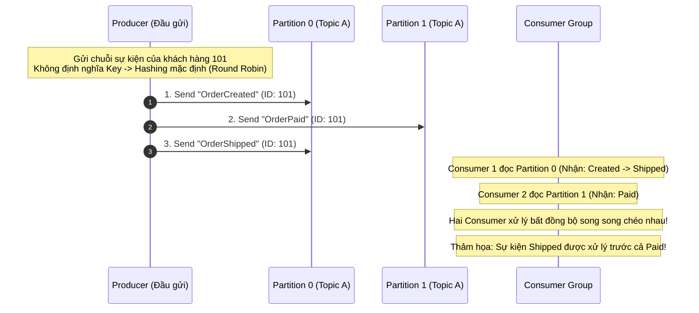

# Ordering trong message queue có đảm bảo không?

## ⚡ Tóm tắt ngắn (30s)
*   **Bản chất**: Thứ tự tin nhắn (Message Ordering) **không được bảo toàn tuyệt đối trên toàn hệ thống (Global Ordering)** theo mặc định trong các Message Queue hiện đại. Các hệ thống phân tán hiệu năng cao như Apache Kafka chỉ cam kết đảm bảo thứ tự ở mức **Phân vùng cục bộ (Partition-level Ordering / Queue-level Ordering)**.
*   **Các thảm họa thực chiến được giải quyết**: Ngăn chặn thảm họa sai lệch trạng thái nghiệp vụ nghiêm trọng (**State Corruption**). 
    *   *Ví dụ thực tế*: Khách hàng thực hiện các hành động tuần tự: Tạo tài khoản (`V1`) $\rightarrow$ Cập nhật thông tin (`V2`) $\rightarrow$ Xóa tài khoản (`V3`). Nếu thứ tự tin nhắn bị đảo lộn do trễ mạng hoặc xử lý đa luồng, Consumer xử lý sự kiện `V3` trước, rồi mới xử lý `V2`. Kết quả: Tài khoản đã bị xóa vẫn xuất hiện trở lại và lưu thông tin cũ trên hệ thống!
*   **Quyết định Senior để bảo toàn thứ tự**:
    1.  **Tại Producer**: Luôn gửi tin nhắn kèm theo **Message Key** là định danh duy nhất của thực thể nghiệp vụ (ví dụ: `key = order_id` hoặc `key = customer_id`). Kafka sẽ băm (Hash) key này để luôn định tuyến tất cả các tin nhắn của cùng thực thể đó vào duy nhất một Partition.
    2.  **Tại Producer (Cấu hình)**: Bật cấu hình `enable.idempotence=true` để Broker tự động sắp xếp lại thứ tự ghi đúng nếu có gói tin bị gửi lại do lỗi mạng (Retry).
    3.  **Tại Consumer**: **Tuyệt đối không sử dụng xử lý đa luồng (Multi-threading / Async Thread Pool) một cách cẩu thả bên trong Consumer** cho cùng một luồng tin nhắn yêu cầu thứ tự.

---

## 🔍 Chi tiết bản chất thực chiến

Để hiểu sâu tại sao tính đảm bảo thứ tự là một bài toán hóc búa, hãy xem xét luồng đi của dữ liệu qua Kafka Topic có nhiều Partitions:



### Tại sao thứ tự bị phá vỡ? (3 nguyên nhân cốt lõi)

#### 1. Cấu hình In-Flight Requests sai ở Producer
Khi Producer gửi 3 gói tin liên tiếp: $Msg_1, Msg_2, Msg_3$ sang cùng một Partition.
*   Gói $Msg_1$ bị lỗi mạng tạm thời, Producer gửi tiếp $Msg_2$ thành công.
*   Producer tự động gửi lại (Retry) gói $Msg_1$.
*   Kết quả trong Partition log: Gói $Msg_2$ được ghi trước gói $Msg_1$ $\rightarrow$ Thứ tự bị đảo lộn!
*   **Giải pháp**: Bật `enable.idempotence=true` hoặc cấu hình `max.in.flight.requests.per.connection = 1` (để chỉ cho phép gửi duy nhất 1 request mạng tại một thời điểm, chờ phản hồi thành công mới gửi tiếp gói thứ 2).

#### 2. Xử lý Multi-threading cẩu thả ở Consumer
Consumer nhận tin nhắn tuần tự từ Partition cực kỳ chính xác. Nhưng lập trình viên muốn tăng tốc độ xử lý nên đã đẩy các tin nhắn nhận được vào một `ThreadPoolExecutor` để xử lý bất đồng bộ (Asynchronously). Do thời gian chạy của các Thread khác nhau, tin nhắn đến sau hoàn toàn có thể được xử lý xong trước tin nhắn đến trước!

#### 3. Scale-out số lượng Partitions (Partition Scaling Bloat)
Khi khối lượng dữ liệu tăng cao, ta tăng số lượng Partition của Topic từ 3 lên 6. Do thuật toán băm khóa dựa trên số lượng Partition (`murmur2(key) % partition_count`), tin nhắn tiếp theo của cùng một `customer_id` đang được ghi vào `Partition 0` bỗng dưng bị bay sang `Partition 3`, làm mất hoàn toàn thứ tự với các tin nhắn trước đó.

---

## 💻 Code thực chiến: BAD vs GOOD

### ❌ BAD: Dùng Thread Pool bất đồng bộ bên trong Consumer phá vỡ thứ tự sự kiện

Nhiều lập trình viên lạm dụng `CompletableFuture` hoặc `ExecutorService` để tăng tốc độ tiêu thụ tin nhắn mà không nhận ra nó đã phá hủy hoàn toàn thứ tự xử lý dữ liệu.

```java
@Component
@Slf4j
public class OrderConsumerOrderingBad {

    // Thread Pool xử lý song song để tăng hiệu năng
    private final ExecutorService executorService = Executors.newFixedThreadPool(10);

    @KafkaListener(topics = "order-events-bad", groupId = "group-bad")
    public void onMessage(ConsumerRecord<String, String> record, Acknowledgment ack) {
        // Consumer nhận tin từ Kafka tuần tự rất đẹp: Created -> Paid -> Shipped
        
        // Nhưng dòng này đẩy xử lý vào Thread Pool bất đồng bộ!
        executorService.submit(() -> {
            try {
                // Do tranh chấp tài nguyên Thread, task "Shipped" chạy siêu nhanh và hoàn thành trước
                // task "Paid" chạy chậm hơn 1s do DB bị nghẽn
                doBusinessLogic(record.value());
            } catch (Exception e) {
                log.error("Xử lý lỗi", e);
            }
        });
        
        ack.acknowledge(); // Ack ngay lập tức mặc dù thread ngầm chưa chạy xong -> Rất nguy hiểm!
    }

    private void doBusinessLogic(String value) {}
}
```

---

### ✔️ GOOD: Đảm bảo thứ tự tuyệt đối từ khâu gửi (Key-based) đến khâu nhận (Single-threaded)

Producer gửi kèm Key duy nhất nghiệp vụ, cấu hình Idempotence an toàn. Consumer xử lý tuần tự đồng bộ theo luồng phân vùng của Kafka.

```java
// 1. TẠI PRODUCER - GỬI KÈM MESSAGE KEY VÀ CẤU HÌNH AN TOÀN
@Service
public class OrderProducerGood {

    @Autowired
    private KafkaTemplate<String, String> kafkaTemplate;

    public void sendOrderEvent(OrderEvent event) {
        // Bắt buộc sử dụng orderId làm Message Key!
        // Đảm bảo tất cả các event của đơn hàng này chui chung vào 1 partition
        String messageKey = event.getOrderId().toString();
        
        kafkaTemplate.send("order-events-good", messageKey, JsonUtils.toJson(event));
    }
}

// Cấu hình Producer an toàn (application.yml)
/*
spring:
  kafka:
    producer:
      properties:
        enable.idempotence: true # Bật chống trùng lặp và tự động sắp xếp thứ tự retry
        max.in.flight.requests.per.connection: 5 # Có thể gửi tối đa 5 request song song nhưng vẫn bảo toàn thứ tự nhờ idempotent
        acks: all
*/

// 2. TẠI CONSUMER - XỬ LÝ TUẦN TỰ THEO PHÂN VÙNG
@Component
@Slf4j
public class OrderConsumerOrderingGood {

    @KafkaListener(topics = "order-events-good", groupId = "group-good")
    public void onMessage(ConsumerRecord<String, String> record, Acknowledgment ack) {
        String messageKey = record.key();
        log.info("Nhận tin nhắn tuần tự của đơn hàng {} từ partition: {}", messageKey, record.partition());
        
        try {
            // Thực thi xử lý TUẦN TỰ và ĐỒNG BỘ trực tiếp trên Thread tiêu thụ của Kafka Listener
            // Không đẩy sang bất kỳ Thread Pool nào khác!
            processOrderEvent(record.value());
            
            ack.acknowledge(); // Chỉ Ack khi và chỉ khi tác vụ đã ghi xuống Database thành công
        } catch (Exception e) {
            log.error("Xử lý thất bại sự kiện của đơn hàng: {}. Dừng hàng đợi để retry!", messageKey, e);
            // Ném lỗi để Kafka dừng và retry lại bản ghi này, đảm bảo tính đúng đắn của thứ tự
            throw new RuntimeException("Stop listener to preserve ordering", e);
        }
    }

    private void processOrderEvent(String payload) {
        // Thực thi cập nhật DB (Idempotent)
    }
}
```

---

## 📊 Bảng so sánh Global Ordering vs Partition-level Ordering

| Đặc điểm | Global Ordering (Thứ tự toàn cục) | Partition-level Ordering (Thứ tự phân vùng) |
| :--- | :--- | :--- |
| **Bản chất đảm bảo** | Tất cả các tin nhắn trong toàn bộ Topic đều được xử lý đúng theo thứ tự thời gian gửi đi. | Thứ tự chỉ được đảm bảo giữa các tin nhắn có chung **Message Key** (được xếp chung partition). |
| **Cách hiện thực** | Topic chỉ được phép có duy nhất **1 Partition** và Consumer chỉ có duy nhất **1 Instance**. | Topic có thể có **N Partitions**, cho phép nhiều Consumer Instance xử lý song song. |
| **Thông lượng (Throughput)**| **Cực kỳ thấp**. Không thể scale-out hiệu năng, bị giới hạn bởi tốc độ của 1 thread duy nhất. | **Cực kỳ cao và vô hạn**. Dễ dàng scale-out bằng cách thêm Partitions và Consumer Nodes. |
| **Độ phức tạp hệ thống** | Thấp. Dễ viết code, không sợ race condition chéo. | Trung bình. Đòi hỏi thiết kế Message Key và idempotent an toàn ở Consumer. |

---

## ⚠️ Common Gotchas & Questions follow-up

### 1. Sự cố "Nghẽn đầu chuỗi" (Head-of-Line Blocking) khi xử lý tuần tự
*   **Vấn đề**: Vì ta bắt buộc phải xử lý đồng bộ và tuần tự tin nhắn trên Consumer để bảo toàn thứ tự. Nếu gói tin $Msg_1$ bị lỗi logic nghiệp vụ nghiêm trọng (ví dụ: lỗi dữ liệu do bug code - Poison Pill) và không thể xử lý nổi, Consumer sẽ bị kẹt mãi ở $Msg_1$, làm tắc nghẽn toàn bộ các tin nhắn $Msg_2, Msg_3$ phía sau của phân vùng đó.
*   **Giải pháp thực chiến**:
    1.  **Dead Letter Queue (DLQ) có kiểm soát**: Đối với các lỗi hệ thống (Network timeout), tiếp tục retry tạm thời. Nhưng nếu là lỗi logic nghiệp vụ không thể tự sửa (bug code), lập tức ghi bản ghi lỗi đó vào DLQ và ghi nhận lỗi vào log, sau đó **Acknowledge thành công để bỏ qua**, giải phóng hàng đợi tiếp tục xử lý các sự kiện tiếp theo.
    2.  **Key-based Thread Pool (Shedding)**: Sử dụng các thư viện hỗ trợ chia nhỏ xử lý theo Key (ví dụ: dùng cấu hình `Spring Kafka ConcurrentMessageListenerContainer` chia thread theo partition, hoặc tự viết In-memory Queue dựa trên Hash của Key để xử lý đa luồng an toàn theo Key).

### 2. Sự cố "Scale Partitions phá vỡ thứ tự tạm thời"
*   **Vấn đề**: Khi tăng số lượng partition của Topic đang chạy từ 3 lên 6 để tăng throughput. Cập nhật này sẽ phá vỡ thứ tự tin nhắn của các đơn hàng cũ ngay lập tức vì key cũ sẽ bị hash sang partition mới, trong khi partition cũ vẫn còn các tin nhắn cũ chưa tiêu thụ xong!
*   **Giải pháp**:
    *   **Blue-Green Topic Migration**: Tuyệt đối không thay đổi trực tiếp số lượng partition của Topic đang chạy live. Hãy tạo một Topic mới hoàn toàn với số lượng partition mong muốn (ví dụ: `order-events-v2`). Cập nhật Producer đẩy sang topic mới, và cấu hình Consumer đọc song song cả 2 topic để tiêu thụ sạch dữ liệu ở topic cũ rồi mới tắt hẳn topic cũ đi.

### 3. Câu hỏi đào sâu từ interviewer
*   **Q: Trong Kafka, nếu có một partition bị sập, làm thế nào để đảm bảo thứ tự dữ liệu không bị lệch khi Leader mới được bầu lên?**
    *   *Trả lời*: Để đảm bảo dữ liệu ghi đúng thứ tự và không bị mất mát khi có biến cố sập node, ta phải cấu hình **ISR (In-Sync Replicas)** chặt chẽ:
        1.  `acks = all`: Đảm bảo dữ liệu được ghi nhận ở tất cả các replica đồng bộ trước khi phản hồi thành công.
        2.  `min.insync.replicas = 2`: Cấu hình tối thiểu phải có ít nhất 2 replica đang hoạt động bình thường và đồng bộ dữ liệu. Nếu số lượng replica hoạt động thấp hơn 2, Broker sẽ từ chối nhận tin nhắn mới từ Producer thay vì chấp nhận ghi dữ liệu không an toàn. Điều này giữ cho dữ liệu trong partition luôn đúng đắn và không bao giờ bị mất hoặc đảo lộn thứ tự khi có bầu cử Leader mới.
