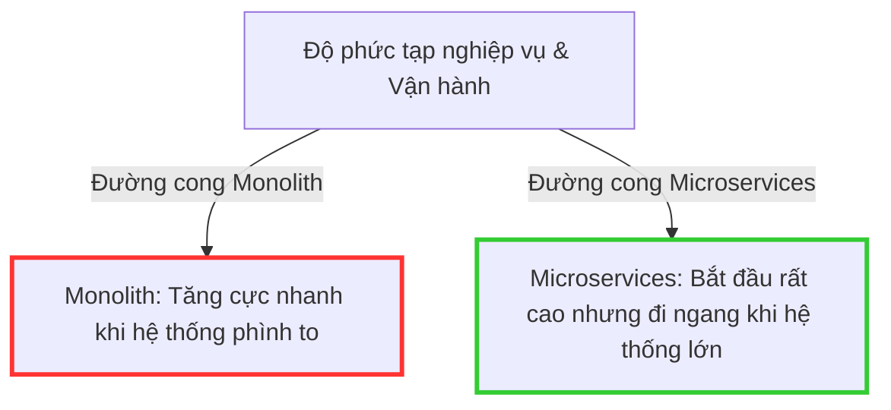

# Khi nào không nên sử dụng Microservices?

## ⚡ Tóm tắt ngắn (30s)
*   **Bản chất**: Microservices là một kiến trúc đánh đổi (Trade-off-driven architecture). Nó giải quyết các nút thắt về quy mô (Scale of organization & software) nhưng cái giá phải trả là sự phức tạp cực độ về mặt vận hành, mạng lưới và quản lý dữ liệu.
*   **Các trường hợp chống chỉ định thực chiến**:
    1.  **Quy mô đội ngũ dưới 5-7 người (Small Team)**: Lập trình viên sẽ bị kiệt sức (DevOps Burnout) vì phải quản lý hạ tầng (Docker, Kubernetes, Jenkins/GitHub Actions, Prometheus, Kafka) nhiều hơn thời gian viết mã nghiệp vụ.
    2.  **Dự án đang ở giai đoạn khởi nghiệp/MVP (Minimum Viable Product)**: Nghiệp vụ thay đổi liên tục để kiểm chứng thị trường. Việc chia nhỏ quá sớm sẽ tạo ra "rào cản tái cấu trúc" do phải thay đổi giao diện API và deploy nhiều service chéo nhau mỗi khi đổi ý tưởng.
    3.  **Yêu cầu độ trễ cực thấp (Ultra-low Latency)**: Việc gọi API liên dịch vụ qua mạng (HTTP/gRPC) gánh thêm chi phí tuần tự hóa (Serialization overhead) và độ trễ mạng (Network hops) cao gấp hàng ngàn lần so với cuộc gọi vùng nhớ (In-memory calls) trong Monolith.
    4.  **Hạ tầng tự động hóa bằng Không (No DevOps Maturity)**: Deploy vẫn bằng tay, không có log tập trung, không có CI/CD, không có Distributed Tracing. Việc quản lý hơn 5 service chạy tay trên production là một thảm họa tự sát.
*   **Quyết định Senior**: Tuyệt đối bắt đầu bằng **Modular Monolith (Monolith mô-đun hóa sạch sẽ)** để định hình rõ ranh giới nghiệp vụ. Chỉ tách sang Microservices khi "nỗi đau" giới hạn của Monolith vượt quá "nỗi đau" chi phí vận hành và quản trị của Microservices.

---

## 🔍 Chi tiết bản chất thực chiến

Martin Fowler đã đưa ra khái niệm **"Microservice Premium"** (Phí tổn Microservices). Hệ thống chỉ thực sự nhận lại lợi ích vượt trội từ Microservices khi độ phức tạp của bài toán nghiệp vụ vượt qua một điểm giới hạn cụ thể:



### Các chi phí khổng lồ của Microservices (The Hidden Costs)
1.  **Độ trễ và Sự kém tin cậy của mạng (The Network Fallacy)**: Mạng không đáng tin cậy. Các cuộc gọi qua mạng có thể mất kết nối, timeout hoặc bị suy hao hiệu năng.
2.  **Sự phức tạp của Dữ liệu Phân tán (Distributed Data)**: Mất khả năng truy vấn `JOIN` sql trên nhiều bảng. Việc giữ tính toàn vẹn dữ liệu buộc phải sử dụng các cơ chế phức tạp như Saga Pattern hoặc Outbox Pattern, thay vì chỉ cần một câu lệnh `COMMIT` database đơn giản.
3.  **Độ phức tạp kiểm thử (Testing Difficulty)**: Kiểm thử tích hợp (Integration Testing) trong Microservices yêu cầu dựng môi trường Docker (Testcontainers) phức tạp để giả lập các service phụ thuộc, gây tốn thời gian và tài nguyên CPU kiểm thử.

---

## 💻 Code thực chiến: BAD vs GOOD

### ❌ BAD: Cố tình chia nhỏ Microservices khi team nhỏ và nghiệp vụ đơn giản
Dưới đây là một thiết kế tồi, nơi một nhóm phát triển chỉ có 3 người cố chia nhỏ các dịch vụ `Customer`, `Product` và `Order` thành các microservices độc lập chạy qua mạng. Mỗi khi tạo hóa đơn đơn hàng, ứng dụng thực hiện các cuộc gọi REST API lặp lại trong vòng lặp (HTTP N+1 API Calls), gánh chịu độ trễ mạng khổng lồ và nguy cơ sập luồng nếu một service downstream bị chậm.

```java
@Service
public class InvoiceGeneratorBad {

    @Autowired
    private RestTemplate restTemplate; // Gọi HTTP API xuyên suốt mạng

    public InvoiceResponse generateInvoice(Long orderId) {
        // 1. Gọi API lấy thông tin Order qua HTTP
        OrderDTO order = restTemplate.getForObject("http://order-service/api/v1/orders/" + orderId, OrderDTO.class);
        
        // 2. Gọi API lấy thông tin Customer qua HTTP
        CustomerDTO customer = restTemplate.getForObject("http://customer-service/api/v1/customers/" + order.getCustomerId(), CustomerDTO.class);

        List<ItemDetail> details = new ArrayList<>();
        // 3. Vòng lặp thảm họa: Gọi HTTP liên tục để lấy thông tin chi tiết từng sản phẩm! (HTTP N+1 Problem)
        for (OrderItemDTO item : order.getItems()) {
            ProductDTO product = restTemplate.getForObject("http://product-service/api/v1/products/" + item.getProductId(), ProductDTO.class);
            details.add(new ItemDetail(product.getName(), product.getPrice(), item.getQuantity()));
        }

        return new InvoiceResponse(customer.getName(), details, calculateTotal(details));
    }
}
```

---

###  GOOD: Thiết kế Modular Monolith sạch sẽ (High-Quality Modular Monolith)
Ứng dụng chạy chung một tiến trình xử lý và chung một Database vật lý để tận dụng tốc độ tối đa của bộ nhớ (In-memory calls) và tính toàn vẹn giao dịch (ACID). Tuy nhiên, các mô-đun được bao đóng cực kỳ nghiêm ngặt thông qua cấu trúc package và giao tiếp bằng Spring Application Events để đảm bảo tính độc lập, giúp việc phân tách thành Microservices sau này cực kỳ dễ dàng khi dự án phình to.

**1. Cấu trúc thư mục mô-đun hóa nghiêm ngặt:**
```
com.company.app
├── customer (Bao đóng thông tin khách hàng)
│   ├── internal (Chỉ truy cập nội bộ package)
│   └── CustomerService.java (Interface công khai)
├── product (Bao đóng sản phẩm)
├── order (Bao đóng đơn hàng)
│   └── OrderService.java
└── invoice (Mô-đun hóa hóa đơn, gọi trực tiếp bộ nhớ)
```

**2. Triển khai code gọi bộ nhớ hiệu năng cao và an toàn:**

```java
package com.company.app.invoice.internal;

import com.company.app.customer.CustomerService;
import com.company.app.customer.CustomerDTO;
import com.company.app.product.ProductService;
import com.company.app.product.ProductDTO;
import com.company.app.order.OrderService;
import com.company.app.order.OrderDTO;

@Service
public class InvoiceGeneratorGood {

    // Đúng đắn 1: Khai báo dependency rõ ràng đến các Service Interface thay vì gọi qua mạng
    private final OrderService orderService;
    private final CustomerService customerService;
    private final ProductService productService;

    public InvoiceGeneratorGood(OrderService orderService, CustomerService customerService, ProductService productService) {
        this.orderService = orderService;
        this.customerService = customerService;
        this.productService = productService;
    }

    public InvoiceResponse generateInvoice(Long orderId) {
        // Đúng đắn 2: Các cuộc gọi thực thi trực tiếp trên RAM (In-memory JVM calls) cực kỳ nhanh (dưới 1ms)
        OrderDTO order = orderService.getOrderById(orderId);
        CustomerDTO customer = customerService.getCustomerById(order.getCustomerId());

        // Lấy danh sách ID sản phẩm để truy vấn hàng loạt (Batch query) thay vì lặp qua từng phần tử
        List<Long> productIds = order.getItems().stream().map(OrderItemDTO::getProductId).toList();
        Map<Long, ProductDTO> productMap = productService.getProductsByIds(productIds); // 1 câu SELECT duy nhất!

        List<ItemDetail> details = order.getItems().stream().map(item -> {
            ProductDTO product = productMap.get(item.getProductId());
            return new ItemDetail(product.getName(), product.getPrice(), item.getQuantity());
        }).toList();

        return new InvoiceResponse(customer.getName(), details, calculateTotal(details));
    }
}
```

---

## 📊 Bảng đối chiếu quyết định: Monolith vs Modular Monolith vs Microservices

| Tiêu chí xem xét | Monolith Truyền thống | Modular Monolith | Microservices |
| :--- | :--- | :--- | :--- |
| **Quy mô Team phù hợp** | < 10 người. | 10 - 30 người. | > 30 người (nhiều team độc lập). |
| **Độ trễ hệ thống (Latency)** | Cực thấp (gọi trực tiếp RAM). | Cực thấp (gọi trực tiếp RAM). | **Cao** (gánh thêm Network và Serialization overhead). |
| **Độ nhất quán dữ liệu** | Nhất quán tuyệt đối (ACID DB). | Nhất quán tuyệt đối (ACID DB). | **Nhất quán sau** (Eventual Consistency / Saga). |
| **Khả năng tự động hóa hạ tầng**| Không cần nhiều. | Trung bình (CI/CD cơ bản). | **Bắt buộc tuyệt đối** (K8s, Service Mesh, Tracing). |
| **Khả năng tách dịch vụ** | Rất khó (code như đống mì Spagetti).| **Cực kỳ dễ dàng** (do ranh giới mô-đun đã rõ ràng).| Đã tách sẵn. |

---

## ⚠️ Common Gotchas & Questions follow-up

### 1. Cạm bẫy "Nano-services" (Dịch vụ siêu vi)
*   **Thảm họa thực tế**: Chia nhỏ các service quá mức cần thiết. Ví dụ: Tạo ra một service riêng chỉ để thực hiện các thao tác CRUD lên bảng `users`, một service khác cho bảng `roles`.
*   **Hậu quả**: Hệ thống gánh chịu sự bùng nổ của số lượng service. Gây khó khăn cho việc quản lý mã nguồn, CI/CD bị quá tải và hiệu năng ứng dụng bị kéo sập thảm hại do các cuộc gọi mạng chéo nhau liên tục chỉ để hoàn thành một nghiệp vụ CRUD đơn giản.
*   **Giải pháp**: Nhóm các dịch vụ dựa trên ranh giới **Domain nghiệp vụ** (Bounded Context) chứ không chia theo bảng Database hay chức năng lập trình cơ bản.

### 2. Sự ngộ nhận về khả năng mở rộng (The Scalability Illusion)
*   **Ngộ nhận**: Rằng cứ dùng Microservices thì hệ thống sẽ tự động chịu tải vô hạn và xử lý được hàng triệu request/giây.
*   **Thực tế**: Nút thắt cổ chai (Bottleneck) của hầu hết các hệ thống phân tán nằm ở tầng **Database vật lý**. Nếu bạn chia nhỏ ứng dụng thành 50 microservices nhưng chúng vẫn kết nối chung vào một database MySQL duy nhất, hệ thống của bạn sẽ sập nhanh hơn do số lượng kết nối đồng thời từ các service làm cạn kiệt tài nguyên kết nối của database.

### 3. Câu hỏi đào sâu từ interviewer
*   **Q: Làm thế nào để thiết lập một Modular Monolith chuẩn chỉnh ngay từ đầu để sau này có thể tách thành Microservices mà không cần phải viết lại code từ đầu?**
    *   *Trả lời*: Để xây dựng một Modular Monolith có thể dễ dàng tiến hóa lên Microservices trong tương lai, chúng ta phải tuân thủ nghiêm ngặt các nguyên tắc thiết kế bao đóng sau:
        1.  **Cô lập tuyệt đối tầng cơ sở dữ liệu logical**: Trong cùng một Database, các bảng của mô-đun A (ví dụ: `order`) không được phép sử dụng khóa ngoại vật lý (Foreign Key constraints) trực tiếp đến bảng của mô-đun B (ví dụ: `customer`). Không cho phép viết các câu truy vấn SQL `JOIN` xuyên suốt giữa các bảng của các mô-đun khác nhau. Mọi liên kết dữ liệu chỉ được lưu dưới dạng tham chiếu logical (ví dụ: trường `customer_id` kiểu số nguyên).
        2.  **Chỉ gọi qua Interface API công khai (Public Interfaces Only)**: Các mô-đun chỉ được giao tiếp với nhau qua các lớp được đánh dấu là API công khai. Các lớp thực thi nghiệp vụ bên trong (Internal classes) phải được ẩn đi bằng cách sử dụng modifier `package-private` của Java.
        3.  **Tách biệt các DTO (Data Transfer Objects)**: Không chia sẻ trực tiếp các đối tượng Entity của Hibernate giữa các mô-đun. Mỗi mô-đun phải tự định nghĩa DTO riêng để trao đổi dữ liệu qua ranh giới mô-đun, tránh hiện tượng thay đổi thực thể ở mô-đun này làm lỗi runtime mô-đun kia.
        4.  **Sử dụng Cơ chế Sự kiện (Application Events)**: Với các luồng xử lý không đồng bộ hoặc mang tính chất phản ứng (ví dụ: Đơn hàng hoàn tất -> Gửi Email chúc mừng), hãy sử dụng cơ chế sự kiện nội bộ của Spring (`ApplicationEventPublisher` và `@EventListener`) thay vì gọi trực tiếp phương thức. Điều này giúp loại bỏ hoàn toàn liên kết cứng về mã nguồn giữa hai mô-đun, khi tách lên Microservices chỉ cần thay thế Spring Event bằng Apache Kafka Event mà không cần sửa đổi logic nghiệp vụ.
