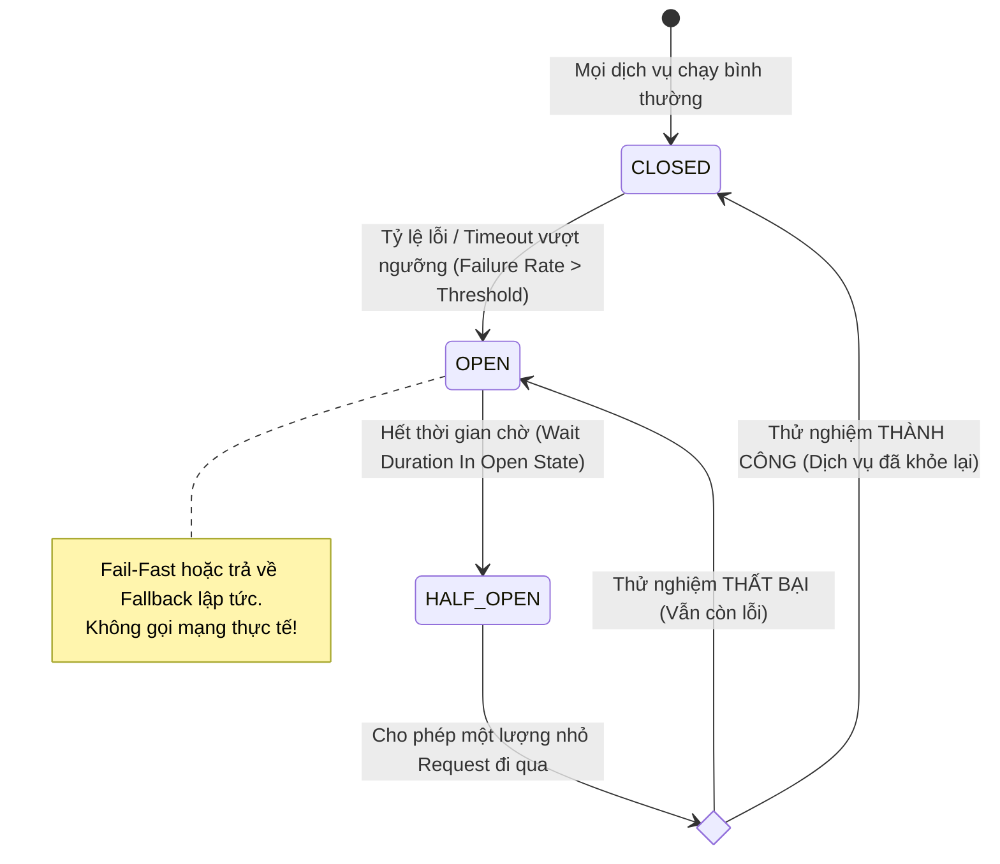

# Circuit breaker pattern là gì?

## ⚡ Tóm tắt ngắn (30s)
*   **Bản chất**: **Circuit Breaker Pattern** (Mẫu thiết kế ngắt mạch) là một mẫu thiết kế ổn định hệ thống (Stability Pattern) giúp tự động hóa việc cô lập lỗi và ngăn ngừa hiện tượng **sập dây chuyền (Cascading Failures)** trong kiến trúc Microservices. Nó hoạt động giống hệt như một chiếc **cầu dao điện (aptomat)** tự động trong gia đình.
*   **3 Trạng thái cốt lõi**:
    1.  **CLOSED (Đóng mạch)**: Trạng thái bình thường. Mọi yêu cầu được cho phép gọi trực tiếp sang service hạ nguồn.
    2.  **OPEN (Hở mạch / Ngắt mạch)**: Khi tỷ lệ lỗi hoặc số lượng cuộc gọi bị chậm (Timeout) vượt ngưỡng cấu hình (ví dụ: >50% cuộc gọi bị lỗi trong 10s qua), cầu dao tự động ngắt. Mọi yêu cầu tiếp theo sẽ bị từ chối lập tức (**Fail-Fast**) hoặc trả về kết quả dự phòng (**Fallback**) mà không thực hiện bất kỳ cuộc gọi mạng thực tế nào.
    3.  **HALF-OPEN (Mở mạch một nửa)**: Sau một khoảng thời gian chờ cấu hình (ví dụ 30s), mạch cho phép thử nghiệm một lượng nhỏ yêu cầu (ví dụ 10 requests) đi qua. Nếu các cuộc gọi thử nghiệm này thành công $\r\rightarrow$ mạch quay về trạng thái **CLOSED** (Hồi phục hoàn toàn). Nếu có lỗi xảy ra $\r\rightarrow$ lập tức chuyển ngược lại **OPEN** (Tiếp tục ngắt).
*   **Các thảm họa thực chiến được giải quyết**:
    1.  **Cạn kiệt tài nguyên hệ thống (Thread Pool Exhaustion)**: Khi service downstream bị lag, service upstream gọi đồng bộ sẽ bị treo thread. Dưới áp lực traffic lớn, toàn bộ thread của service chính sẽ bị khóa cứng để chờ đợi, dẫn đến sập toàn bộ hệ thống. Circuit Breaker giải quyết bằng cách chặn đứng các yêu cầu vô ích khi biết chắc service hạ nguồn đang chết.
    2.  **Bão yêu cầu đè bẹp service đang hồi phục (Throttling recovering services)**: Giúp service hạ nguồn có thời gian hồi sinh sau sự cố mà không bị dập tắt ngay lập tức bởi hàng triệu request đang dồn ứ ở đầu gửi.
*   **Quyết định Senior**:
    *   **Công cụ áp dụng**: Sử dụng thư viện chuyên dụng **Resilience4j** (thay thế cho Hystrix đã bị deprecated).
    *   **Fallback Strategy**: Bắt buộc phải thiết kế hàm Fallback trả về dữ liệu an toàn (ví dụ: dữ liệu cache cũ, danh sách rỗng, hoặc thông báo thân thiện) để đảm bảo trải nghiệm khách hàng không bao giờ bị gián đoạn hoàn toàn.

---

## 🔍 Chi tiết bản chất thực chiến: Máy trạng thái của Circuit Breaker

Máy trạng thái (State Machine) của Circuit Breaker được lưu trữ trong bộ nhớ đệm (In-memory) hoặc Redis của dịch vụ gọi (Client-side) để đưa ra quyết định nhanh nhất:



### Các thông số cấu hình cốt lõi của Resilience4j (Senior cần nắm để Tuning):
1.  **failureRateThreshold (Ngưỡng tỷ lệ lỗi)**: Ví dụ `50.0` (tức là 50%). Nếu 50% số cuộc gọi trong cửa sổ trượt bị lỗi, mạch chuyển sang OPEN.
2.  **slowCallRateThreshold (Ngưỡng tỷ lệ cuộc gọi chậm)**: Ví dụ `75.0` (75%). Nếu 75% cuộc gọi mất nhiều thời gian hơn cấu hình `slowCallDurationThreshold`, mạch sẽ ngắt.
3.  **slidingWindowSize (Kích thước cửa sổ trượt)**: Số lượng cuộc gọi được ghi nhận để tính toán tỷ lệ lỗi (ví dụ: tính toán trên 100 cuộc gọi gần nhất).
4.  **waitDurationInOpenState (Thời gian chờ ở trạng thái OPEN)**: Thời gian mạch ở trạng thái OPEN trước khi chuyển sang HALF-OPEN để thử nghiệm (ví dụ 60 giây).

---

## 💻 Code thực chiến: BAD vs GOOD

### ❌ BAD: Gọi HTTP API trực tiếp không có cơ chế ngắt mạch tự động

Khi `Payment Service` bị lag kéo dài 10 giây, toàn bộ các thread xử lý luồng đặt hàng của `Order Service` bị treo cứng, dẫn đến nghẽn cổ chai và sập hoàn toàn `Order Service` sau vài phút.

```java
@Service
@Slf4j
public class OrderServiceBad {

    @Autowired
    private RestTemplate restTemplate;

    public OrderResponse processOrder(OrderRequest request) {
        log.info("Bắt đầu xử lý đơn hàng...");
        
        // HẬU QUẢ: Gọi trực tiếp không có bảo vệ.
        // Nếu Payment Service bị phản hồi chậm (Timeout 10s), Thread của Order Service sẽ bị khóa cứng.
        // Dưới tải cao (1000 requests/s), hệ thống sẽ lập tức cạn kiệt Thread và sập dây chuyền!
        PaymentDto paymentResult = restTemplate.postForObject(
            "http://payment-service/api/v1/payments", 
            new PaymentRequest(request), 
            PaymentDto.class
        );
        
        return new OrderResponse(paymentResult);
    }
}
```

---

### ✔️ GOOD: Áp dụng Circuit Breaker với Resilience4j và thiết kế Fallback an toàn

Sử dụng `@CircuitBreaker` của Resilience4j để bảo vệ cuộc gọi mạng. Hàm fallback được kích hoạt tự động để trả về dữ liệu an toàn khi mạch bị ngắt hoặc dịch vụ lỗi.

```java
@Service
@Slf4j
public class OrderServiceGood {

    @Autowired
    private RestTemplate restTemplate;

    // 1. ÁP DỤNG CIRCUIT BREAKER VỚI CONFIG "paymentService"
    // Định nghĩa hàm fallback để xử lý khi xảy ra lỗi hoặc khi mạch đang OPEN
    @CircuitBreaker(name = "paymentService", fallbackMethod = "processOrderFallback")
    public OrderResponse processOrder(OrderRequest request) {
        log.info("Gọi sang Payment Service...");
        
        PaymentDto paymentResult = restTemplate.postForObject(
            "http://payment-service/api/v1/payments", 
            new PaymentRequest(request), 
            PaymentDto.class
        );
        
        return new OrderResponse(paymentResult, "SUCCESS");
    }

    // 2. HÀM FALLBACK (Bắt buộc phải có cùng chữ ký phương thức và thêm tham số Throwable)
    public OrderResponse processOrderFallback(OrderRequest request, Throwable t) {
        log.error("--- CIRCUIT BREAKER KÍCH HOẠT FALLBACK! Nguyên nhân: {} ---", t.getMessage());
        
        // Trả về phương án dự phòng an toàn: 
        // Cho phép đặt hàng trước ở trạng thái "PAYMENT_PENDING", xử lý trừ tiền thủ công/sau qua MQ
        PaymentDto fallbackPayment = new PaymentDto(null, "PENDING", "Thanh toán tạm giữ do nghẽn hệ thống");
        return new OrderResponse(fallbackPayment, "PAYMENT_QUEUED");
    }
}
```

**Cấu hình Resilience4j an toàn trong tệp `application.yml`:**
```yaml
resilience4j:
  circuitbreaker:
    instances:
      paymentService:
        slidingWindowType: COUNT_BASED
        slidingWindowSize: 10 # Ghi nhận trên 10 cuộc gọi gần nhất
        minimumNumberOfCalls: 5 # Số cuộc gọi tối thiểu để bắt đầu tính toán tỷ lệ lỗi
        failureRateThreshold: 50 # Ngưỡng ngắt mạch: 50% cuộc gọi bị lỗi
        slowCallRateThreshold: 75 # Ngưỡng ngắt mạch: 75% cuộc gọi bị chậm
        slowCallDurationThreshold: 2000ms # Định nghĩa cuộc gọi chậm: > 2 giây
        waitDurationInOpenState: 15000ms # Mạch OPEN trong 15s rồi tự động chuyển sang HALF-OPEN
        permittedNumberOfCallsInHalfOpenState: 3 # Cho phép 3 cuộc gọi thử nghiệm ở trạng thái HALF-OPEN
```

---

## 📊 Bảng so sánh 3 trạng thái của Circuit Breaker

| Tiêu chí | CLOSED (Đóng mạch) | OPEN (Ngắt mạch) | HALF-OPEN (Mở một nửa) |
| :--- | :--- | :--- | :--- |
| **Đường đi của Request**| Cho phép đi qua trực tiếp tới service hạ nguồn. | Chặn đứng ngay lập tức (**Fail-Fast**), chuyển sang chạy hàm **Fallback**. | Cho phép một số lượng giới hạn request đi qua để thử nghiệm. |
| **Tác động mạng** | Thực thi cuộc gọi mạng (Network IO) bình thường. | **Không có tác động mạng**. Trả kết quả cục bộ cực kỳ nhanh (< 1ms). | Thực thi cuộc gọi mạng có kiểm soát. |
| **Nguyên nhân chuyển đổi**| Mạch tự động chuyển sang CLOSED khi thử nghiệm ở trạng thái HALF-OPEN thành công. | Tỷ lệ lỗi hoặc cuộc gọi chậm vượt quá ngưỡng cấu hình. | Hết thời gian chờ (`waitDurationInOpenState`) ở trạng thái OPEN. |

---

## ⚠️ Common Gotchas & Questions follow-up

### 1. Sự cố "Tỷ lệ lỗi ảo" (Cold Start Failure) do lượng request quá ít
*   **Vấn đề**: Khi service vừa khởi động, cuộc gọi đầu tiên bị lỗi (ví dụ do sập mạng tạm thời). Tỷ lệ lỗi lúc này lập tức là 100%. Nếu không cấu hình cẩn thận, Circuit Breaker sẽ ngắt mạch (OPEN) ngay lập tức chỉ vì 1 cuộc gọi lỗi duy nhất này.
*   **Giải pháp**:
    *   Cấu hình tham số **`minimumNumberOfCalls`** (Số cuộc gọi tối thiểu để bắt đầu tính toán). Ví dụ đặt bằng `10`. Chỉ khi hệ thống ghi nhận đủ 10 cuộc gọi gần nhất thì mới bắt đầu tính toán tỷ lệ lỗi để quyết định có ngắt mạch hay không.

### 2. Thảm họa "Không cấu hình Timeout" kết hợp với Circuit Breaker
*   **Vấn đề**: Nhiều lập trình viên cấu hình Circuit Breaker nhưng quên không thiết lập **Connection/Read Timeout** cho RestTemplate hoặc FeignClient (mặc định là vô hạn ở một số thư viện). Khi service hạ nguồn bị treo (không trả phản hồi nhưng không ngắt kết nối), Consumer sẽ bị treo thread vĩnh viễn và Circuit Breaker hoàn toàn vô tác dụng vì không có cuộc gọi nào ném ra lỗi để nó tính toán tỷ lệ!
*   **Giải pháp**:
    *   Luôn thiết lập cấu hình Timeout cứng cho mọi HTTP/gRPC Client (ví dụ: `ConnectTimeout = 1s`, `ReadTimeout = 2s`) song song với việc áp dụng Circuit Breaker.

### 3. Câu hỏi đào sâu từ interviewer
*   **Q: Làm thế nào để đồng bộ trạng thái của Circuit Breaker giữa các Instance khác nhau của cùng một Microservice? Có nên dùng Redis để lưu trạng thái Circuit Breaker dùng chung không?**
    *   *Trả lời*: 
        *   **Không nên lưu trạng thái Circuit Breaker tập trung trong Redis**. Đây là một lỗi thiết kế phản mẫu (Anti-pattern). 
        *   Bản chất Circuit Breaker là để bảo vệ tài nguyên cục bộ (Thread Pool, CPU) của từng instance. Nếu dùng chung qua Redis, mỗi cuộc gọi mạng của instance đều phải đi qua Redis để kiểm tra trạng thái mạch, tạo ra một nghẽn cổ chai mạng mới (Single Point of Bottleneck) và tăng độ trễ cho mọi request.
        *   Hãy để Circuit Breaker chạy **độc lập hoàn toàn trên bộ nhớ cục bộ (In-memory)** của từng instance. Nếu instance A ghi nhận tỷ lệ lỗi cao, nó tự ngắt mạch để tự bảo vệ nó, trong khi instance B vẫn có thể tiếp tục thử gọi nếu đường truyền của nó ổn định hơn. Điều này giúp tối ưu hiệu năng và giữ cho hệ thống có tính chịu lỗi phân tán cao nhất.
