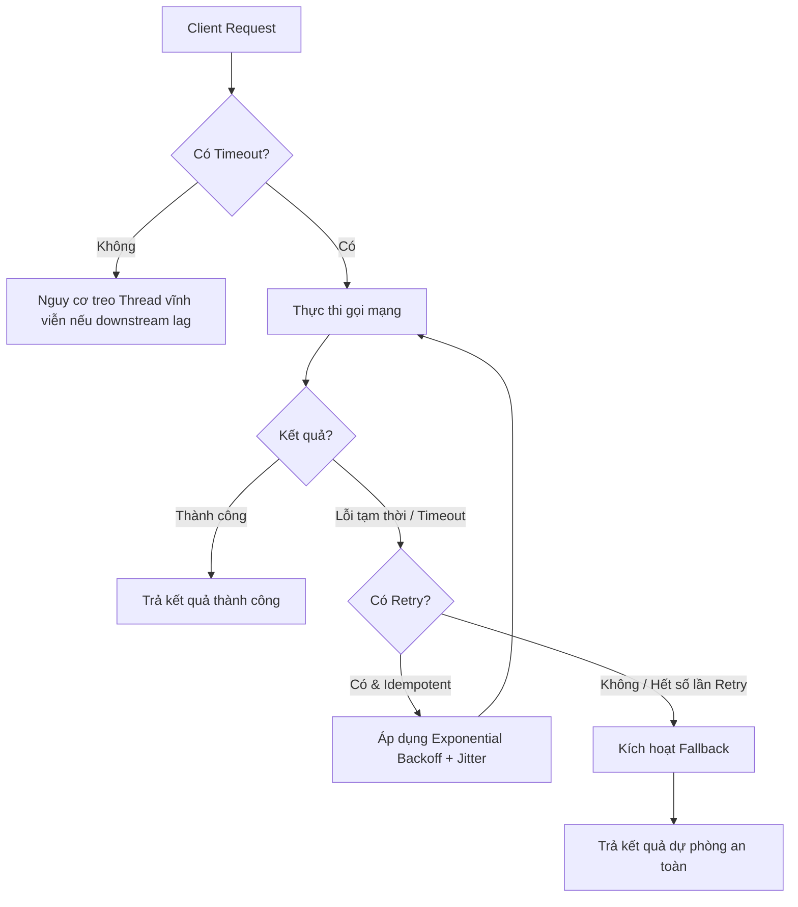

# Retry, timeout, fallback nên thiết kế thế nào?

## ⚡ Tóm tắt ngắn (30s)
*   **Bản chất**: Đây là **bộ ba phòng thủ (Self-preservation)** không thể tách rời khi gọi mạng (Network RPC/HTTP) trong Microservices. Thiết kế thiếu hoặc sai một trong ba yếu tố này sẽ dẫn đến hiện tượng treo luồng (Thread Exhaustion), sập dây chuyền (Cascading Failure), hoặc làm tê liệt dịch vụ phía sau khi đang gặp sự cố.
*   **Timeout**: Giới hạn thời gian tối đa để thực hiện một cuộc gọi mạng. Gồm hai loại cốt lõi: **Connect Timeout** (chờ kết nối) và **Read/Socket Timeout** (chờ nhận phản hồi).
*   **Retry**: Cơ chế tự động thử lại khi gặp **lỗi tạm thời (Transient Failures)** như mất mạng chớp nhoáng, DNS resolution tạm thời lỗi, hoặc downstream quá tải chớp nhoáng (lỗi 429 hoặc 503). Bắt buộc phải áp dụng **Exponential Backoff** (thời gian giãn cách tăng dần) và **Jitter** (nhiễu ngẫu nhiên) để tránh hiện tượng tự tấn công DDOS hệ thống của chính mình (**Retry Storm**).
*   **Fallback**: Phương án cứu cánh cuối cùng khi mọi cuộc gọi và thử lại đều thất bại. Trả về dữ liệu an toàn (static data, cached data, empty list) để duy trì tính khả dụng (High Availability) cho người dùng cuối.
*   **Nguyên tắc Senior**: Chỉ Retry với các phương thức có tính **Idempotent** (an toàn khi thực hiện nhiều lần, như GET, PUT, DELETE). TUYỆT ĐỐI không tự động retry mù quáng với POST tạo đơn hàng hoặc giao dịch thanh toán trừ khi có Idempotency Key bảo vệ.

---

## 🔍 Chi tiết bản chất thực chiến: Ba Trụ Cột Phòng Thủ

Khi một Microservice gọi dịch vụ khác qua mạng, luôn tồn tại xác suất lỗi. Mô hình dưới đây biểu diễn cách 3 yếu tố này phối hợp bảo vệ hệ thống:



### 1. Phân biệt các loại Timeout (Tuning tối ưu)
*   **Connect Timeout**: Thời gian thiết lập kết nối TCP (3-way handshake) giữa Client và Server. Nên đặt ngắn (ví dụ: `500ms - 1s`). Nếu vượt quá thời gian này, thường là do Server bị sập hoàn toàn hoặc lỗi định tuyến mạng.
*   **Read (Socket) Timeout**: Thời gian chờ nhận gói dữ liệu tiếp theo sau khi kết nối đã thiết lập thành công. Nên đặt dựa trên SLO (Service Level Objective) của downstream (ví dụ: `2s - 5s`). Nếu đặt quá dài, thread xử lý sẽ bị treo vô ích. Nếu đặt quá ngắn, Client sẽ ngắt kết nối trước khi Server kịp xử lý xong các tác vụ nặng.

### 2. Thiết kế Retry thông minh (Tránh tự hủy)
Nếu downstream bị quá tải nhẹ, việc tất cả client đồng loạt retry ngay lập tức sẽ tạo ra **bão yêu cầu (Retry Storm)** đập nát hoàn toàn downstream. Công thức giãn cách retry chuẩn chỉnh:

$$\text{Backoff Interval} = \text{Initial Interval} \times \text{Multiplier}^{\text{attempt}} \pm \text{Jitter}$$

*   **Exponential Backoff**: Tăng dần thời gian chờ sau mỗi lần thất bại (ví dụ: thử lần 1 sau 100ms, lần 2 sau 200ms, lần 3 sau 400ms).
*   **Jitter (Nhiễu ngẫu nhiên)**: Cộng hoặc trừ một lượng mili-giây ngẫu nhiên vào thời gian chờ (ví dụ: thay vì đúng 400ms, hệ thống sẽ chờ ngẫu nhiên từ 350ms - 450ms). Điều này giúp phân tán luồng request của các client khác nhau, tránh hiện tượng cộng hưởng tải (thắt nút cổ chai).

---

## 💻 Code thực chiến: BAD vs GOOD

### ❌ BAD: Tự viết vòng lặp Retry thô sơ, không timeout cứng, không phân biệt loại lỗi

```java
@Service
@Slf4j
public class OrderServiceBad {

    @Autowired
    private RestTemplate restTemplate; // Không cấu hình Timeout (mặc định vô hạn)

    public PaymentDto processPayment(PaymentRequest request) {
        int maxAttempts = 3;
        for (int i = 1; i <= maxAttempts; i++) {
            try {
                // NGUY HIỂM 1: Không có timeout, nếu payment-service bị treo, Thread này sẽ treo vĩnh viễn!
                // NGUY HIỂM 2: Nếu đây là phương thức thanh toán (POST) và payment-service đã nhận được tiền 
                // nhưng bị đứt mạng lúc trả kết quả, việc thử lại sẽ dẫn đến TRỪ TIỀN 2 LẦN của khách hàng!
                return restTemplate.postForObject(
                    "http://payment-service/api/v1/payments", request, PaymentDto.class
                );
            } catch (Exception e) {
                log.warn("Thử lại lần {} thất bại do lỗi: {}", i, e.getMessage());
                if (i == maxAttempts) throw e;
                try {
                    // NGUY HIỂM 3: Chờ cứng 1000ms. Tạo ra hiện tượng thắt nút cổ chai khi chịu tải cao.
                    Thread.sleep(1000); 
                } catch (InterruptedException ie) {
                    Thread.currentThread().interrupt();
                }
            }
        }
        return null;
    }
}
```

---

### ✔️ GOOD: Sử dụng RestTemplate có Timeout kết hợp Resilience4j Retry & Jitter

```java
@Service
@Slf4j
public class OrderServiceGood {

    @Autowired
    private RestTemplate secureRestTemplate; // RestTemplate đã được cấu hình Connect/Read Timeout

    // 1. ÁP DỤNG RETRY VỚI CONFIG "paymentRetry" VÀ PHƯƠNG ÁN FALLBACK AN TOÀN
    @Retry(name = "paymentRetry", fallbackMethod = "paymentFallback")
    public PaymentDto callPaymentService(PaymentRequest request) {
        log.info("Gọi sang Payment Service...");
        
        // Chỉ áp dụng retry tự động khi API này có cơ chế Idempotency Key bảo vệ ở Header!
        HttpHeaders headers = new HttpHeaders();
        headers.set("Idempotency-Key", request.getTransactionId());
        HttpEntity<PaymentRequest> entity = new HttpEntity<>(request, headers);

        return secureRestTemplate.postForObject(
            "http://payment-service/api/v1/payments", entity, PaymentDto.class
        );
    }

    // 2. HÀM FALLBACK CỨU CÁNH
    public PaymentDto paymentFallback(PaymentRequest request, Throwable t) {
        log.error("--- MỌI NỖ LỰC GỌI VÀ RETRY ĐÃ THẤT BẠI. Nguyên nhân: {} ---", t.getMessage());
        
        // Trả về phương án dự phòng an toàn: 
        // Trả về trạng thái PENDING để lưu trữ offline và đối soát thanh toán bất đồng bộ sau qua Kafka.
        return new PaymentDto(
            request.getTransactionId(), 
            "PENDING", 
            "Giao dịch đang được xử lý bất đồng bộ do gián đoạn mạng."
        );
    }
}
```

**Cấu hình YAML an toàn cho Timeout và Resilience4j:**

```yaml
# 1. Cấu hình Timeout cho HTTP Client (ví dụ RestTemplate / WebClient)
http:
  client:
    connect-timeout-ms: 1000  # Connect timeout 1 giây
    read-timeout-ms: 3000     # Read timeout 3 giây

# 2. Cấu hình Resilience4j Retry
resilience4j:
  retry:
    instances:
      paymentRetry:
        maxAttempts: 3 # Tối đa thử 3 lần (bao gồm lần gọi đầu tiên)
        waitDuration: 500ms # Thời gian chờ ban đầu
        enableExponentialBackoff: true # Kích hoạt Exponential Backoff
        exponentialBackoffMultiplier: 2 # Thử lần 1: 500ms, lần 2: 1000ms
        retryExceptions: # Chỉ retry khi gặp lỗi tạm thời (Transient Exceptions)
          - org.springframework.web.client.ResourceAccessException # Lỗi kết nối mạng, timeout
          - java.io.IOException
        ignoreExceptions: # Bỏ qua không retry khi lỗi logic (mất công vô ích)
          - org.springframework.web.client.HttpClientErrorException.BadRequest # Lỗi 400
          - org.springframework.web.client.HttpClientErrorException.Unauthorized # Lỗi 401
```

---

## 📊 Bảng so sánh chiến thuật phòng thủ mạng

| Chiến thuật | Mục tiêu chính | Phù hợp nhất khi nào? | Rủi ro nếu lạm dụng |
| :--- | :--- | :--- | :--- |
| **Timeout** | Giải phóng tài nguyên cục bộ (Thread), chống treo hệ thống. | **Bắt buộc** áp dụng cho 100% cuộc gọi mạng. | Đặt quá ngắn gây tỷ lệ lỗi ảo tăng vọt (False Alarm). |
| **Retry** | Tự động hồi phục sau lỗi mạng tạm thời (Transient). | Áp dụng cho các truy vấn đọc dữ liệu (**GET**) hoặc các ghi đè an toàn có **Idempotency Key**. | Tạo ra **Retry Storm** đè bẹp hệ thống phía sau nếu không có Backoff & Jitter. |
| **Fallback** | Đảm bảo tính sẵn sàng cao (High Availability), giữ chân trải nghiệm UI của khách hàng. | Các nghiệp vụ không yêu cầu tính nhất quán tức thì (Eventual Consistency), có thể sử dụng dữ liệu cũ/cached. | Dẫn đến việc che giấu lỗi hệ thống nếu không kết hợp cảnh báo (Alert) đúng cách. |

---

## ⚠️ Common Gotchas & Questions follow-up

### 1. Sự cố "Treo luồng ngầm" do không cấu hình Timeout cho các thư viện kết nối khác
*   **Vấn đề**: Lập trình viên thiết lập Timeout cho RestTemplate nhưng lại quên mất cấu hình timeout cho JDBC/R2DBC Connection Pool, Redis Client, hoặc MongoDB Client. Khi cơ sở dữ liệu bị sụt giảm hiệu năng hoặc treo khóa (Locking), toàn bộ luồng ứng dụng vẫn sẽ bị treo đứng vĩnh viễn bất chấp bạn có cài Circuit Breaker hay Retry ở API ngoại vi.
*   **Giải pháp**: Thiết lập quy trình kiểm tra (Checklist) bắt buộc kiểm tra Connect Timeout và Read/Query Timeout cho tất cả các IO Client trong ứng dụng (SQL, Cache, NoSQL, Message Queue).

### 2. Có nên Retry khi nhận mã lỗi 500 (Internal Server Error) không?
*   **Câu trả lời**: **Phải cực kỳ cẩn trọng**. 
    *   Mã lỗi `500` có hai bản chất: Một là do lỗi hệ thống sập nguồn tạm thời (có thể retry), hai là do lỗi logic code (Bug - NullPointerException, DB constraint violation) thì có retry 1000 lần vẫn thất bại 100% và chỉ gây quá tải cho hệ thống.
    *   **Best Practice**: Chỉ nên cấu hình retry tự động cho lỗi truyền tải mạng (ví dụ `ResourceAccessException`, `ConnectException`) hoặc các mã HTTP cụ thể đại diện cho lỗi tạm thời như `429 Too Many Requests` (bị Rate Limit), `503 Service Unavailable` hoặc `504 Gateway Timeout`. Không nên retry đại trà mọi mã `500`.

### 3. Câu hỏi từ Interviewer: "Làm thế nào để thiết kế một hệ thống không bị lỗi trùng tiền khi Client thực hiện Retry luồng thanh toán?"
*   **Cách trả lời ghi điểm**:
    1.  **Idempotency Key**: Bắt buộc Client phải sinh một token duy nhất (thường là UUID) gắn với hành động thanh toán đó (gọi là `Idempotency-Key` hoặc `TransactionId`) gửi kèm lên Header.
    2.  **Distributed Lock**: Server nhận yêu cầu sẽ thực hiện lấy khóa phân tán (Distributed Lock - ví dụ bằng Redis `SETNX`) theo `Idempotency-Key` để tránh xử lý concurrent trùng lặp.
    3.  **State Machine checking**: Kiểm tra trạng thái đơn hàng trong Database. Nếu đã có trạng thái `PAID` hoặc `PROCESSING`, lập tức trả về kết quả trước đó mà không thực hiện trừ tiền tiếp.
    4.  **Transaction Boundary**: Đảm bảo nghiệp vụ kiểm tra trạng thái và cập nhật số dư/tạo hóa đơn diễn ra trong cùng một transaction cô lập bảo vệ.
