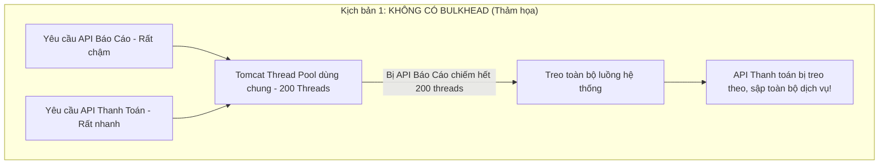
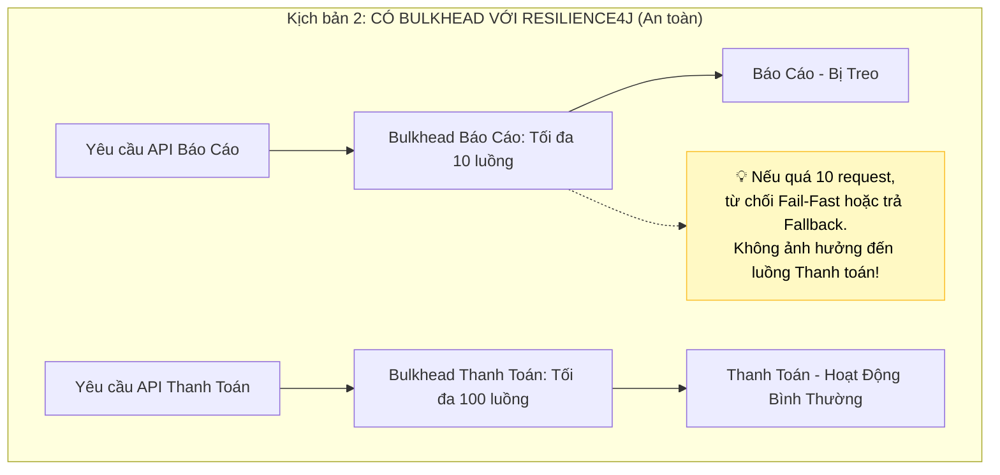

# Bulkhead pattern là gì?

## ⚡ Tóm tắt ngắn (30s)
*   **Bản chất**: **Bulkhead Pattern** (Mẫu vách ngăn chống chìm) là một mẫu thiết kế ổn định hệ thống (Stability Pattern) lấy cảm hứng từ kỹ thuật đóng tàu thủy. Người ta chia thân tàu thành nhiều khoang kín nước độc lập (**bulkheads**). Nếu một khoang bị thủng và ngập nước, nước sẽ bị cô lập ở khoang đó và tàu vẫn nổi. Trong kiến trúc Microservices, Bulkhead cô lập tài nguyên hệ thống (như Thread Pool, Connection Pool, CPU, Memory) để ngăn chặn lỗi ở một API đơn lẻ tiêu thụ hết tài nguyên của toàn bộ máy chủ, kéo sập tất cả các dịch vụ khác cùng chạy trên đó.
*   **Mục tiêu cốt lõi**: Ngăn chặn hiện tượng **cạn kiệt luồng (Thread Pool Exhaustion)** của Web Server (như Tomcat). Ví dụ: Nếu API xuất báo cáo nặng bị treo, không để nó chiếm hết 200 threads của Tomcat, khiến API thanh toán cực kỳ nhẹ không còn thread nào để xử lý.
*   **Hai giải pháp cô lập phổ biến**:
    1.  **Thread Pool Isolation (Cô lập bằng Thread Pool)**: Phân bổ mỗi API/dịch vụ gọi ngoài một Thread Pool chuyên biệt riêng. Nếu dịch vụ hạ nguồn bị treo, chỉ Thread Pool tương ứng bị cạn kiệt, các Thread Pool của các dịch vụ khác vẫn hoàn toàn khỏe mạnh. (Có chi phí Context Switch).
    2.  **Semaphore Isolation (Cô lập bằng Semaphore/Limit)**: Không tạo thêm Thread Pool mới, sử dụng chung Thread của Tomcat nhưng dùng một biến đếm (Semaphore) để giới hạn số lượng cuộc gọi đồng thời tối đa (ví dụ: tối đa 10 luồng xử lý API báo cáo cùng lúc). Khi vượt quá giới hạn, từ chối ngay lập tức (**Fail-Fast**). (Cực kỳ nhẹ, hiệu năng cao).
*   **Lời khuyên Senior**: Hãy dùng Semaphore cho các cuộc gọi mạng có độ trễ cực thấp (< 20ms) hoặc API nội bộ tin cậy. Dùng Thread Pool cho các cuộc gọi mạng ngoại vi không tin cậy hoặc tác vụ nặng cần tính năng bất đồng bộ và timeout chủ động.

---

## 🔍 Chi tiết bản chất thực chiến: Tại sao không có Bulkhead hệ thống sẽ chết?

Mặc định, các ứng dụng Java Spring Boot (sử dụng Tomcat) xử lý các request đồng thời bằng một **Thread Pool dùng chung duy nhất** (thường mặc định là 200 threads). 





---

## 💻 Code thực chiến: BAD vs GOOD

### ❌ BAD: Hai dịch vụ gọi ngoài dùng chung Thread Pool mặc định của Tomcat
Nếu API lấy thông báo khuyến mãi bị lag, nó sẽ ăn mòn hết thread của hệ thống, khiến luồng checkout thanh toán bị nghẽn hoàn toàn.

```java
@RestController
@RequestMapping("/api/v1")
@Slf4j
public class CheckoutControllerBad {

    @Autowired
    private PaymentService paymentService; // Gọi API thanh toán (rất quan trọng)
    
    @Autowired
    private PromoService promoService; // Gọi API lấy tin khuyến mãi (phụ)

    @PostMapping("/checkout")
    public ResponseEntity<?> checkout() {
        // Thực thi trong thread mặc định của Tomcat
        return ResponseEntity.ok(paymentService.charge());
    }

    @GetMapping("/promotions")
    public ResponseEntity<?> getPromotions() {
        // NGUY HIỂM: Nếu promo-service bị lag phản hồi mất 10 giây.
        // Hàng ngàn request gọi lấy khuyến mãi sẽ chiếm dụng sạch 200 threads mặc định của Tomcat.
        // Luồng /checkout ở trên sẽ KHÔNG THỂ tìm được thread trống để thực thi!
        return ResponseEntity.ok(promoService.fetchPromotions());
    }
}
```

---

### ✔️ GOOD: Áp dụng Bulkhead của Resilience4j để cô lập tài nguyên cho từng luồng vụ

Chúng ta áp dụng hai cấu hình Bulkhead độc lập cho API Thanh Toán (ưu tiên tài nguyên lớn) và API Khuyến mãi (giới hạn chặt chẽ).

```java
@Service
@Slf4j
public class CheckoutServiceGood {

    @Autowired
    private RestTemplate restTemplate;

    // 1. CÔ LẬP BẰNG SEMAPHORE BULKHEAD (Mặc định của Resilience4j)
    // Giới hạn nghiêm ngặt số luồng đồng thời gọi sang Promo Service
    @Bulkhead(name = "promoBulkhead", fallbackMethod = "promoFallback", type = Bulkhead.Type.SEMAPHORE)
    public List<String> getPromotions() {
        log.info("Gọi lấy khuyến mãi...");
        return restTemplate.getForObject("http://promo-service/api/promos", List.class);
    }

    // 2. CÔ LẬP BẰNG THREAD POOL BULKHEAD (Chạy trên một Thread Pool độc lập hoàn toàn)
    // Áp dụng cho tác vụ cực kỳ quan trọng: Thanh toán
    @Bulkhead(name = "paymentBulkhead", fallbackMethod = "paymentFallback", type = Bulkhead.Type.THREADPOOL)
    public CompletableFuture<String> processPayment() {
        return CompletableFuture.supplyAsync(() -> {
            log.info("Bắt đầu thanh toán bất đồng bộ trên luồng riêng...");
            return restTemplate.postForObject("http://payment-service/api/payments", null, String.class);
        });
    }

    // Hàm Fallback cho Báo Cáo / Khuyến mãi
    public List<String> promoFallback(Throwable t) {
        log.error("--- PROMO BULKHEAD KÍCH HOẠT FALLBACK! Quá tải hoặc Lỗi ---");
        return List.of("Chương trình khuyến mãi mặc định"); // Trả về khuyến mãi cache/tĩnh
    }

    // Hàm Fallback cho Thanh Toán
    public CompletableFuture<String> paymentFallback(Throwable t) {
        log.error("--- PAYMENT BULKHEAD KÍCH HOẠT FALLBACK! Nghẽn hoặc Lỗi ---");
        return CompletableFuture.completedFuture("Thanh toán bị nghẽn, vui lòng thử lại sau.");
    }
}
```

**Cấu hình chi tiết `application.yml` cho Resilience4j Bulkhead:**

```yaml
resilience4j:
  # Cấu hình Semaphore Bulkhead (Cô lập dựa trên số lượng request đồng thời)
  bulkhead:
    instances:
      promoBulkhead:
        maxConcurrentCalls: 10 # Tối đa chỉ 10 thread Tomcat được phép gọi Promo Service cùng lúc
        maxWaitDuration: 10ms # Nếu vượt ngưỡng, chờ tối đa 10ms trước khi ném Exception Fail-Fast

  # Cấu hình Thread Pool Bulkhead (Cô lập dựa trên Thread Pool độc lập hoàn toàn)
  threadpoolbulkhead:
    instances:
      paymentBulkhead:
        maxThreadPoolSize: 20 # Thread Pool thanh toán có tối đa 20 Threads
        coreThreadPoolSize: 10 # Số lượng thread duy trì thường trực là 10
        queueCapacity: 50 # Đợi tối đa 50 requests trong hàng chờ trước khi từ chối
        keepAliveDuration: 1000ms
```

---

## 📊 Bảng so sánh Thread Pool vs Semaphore Isolation

| Tiêu chí | Thread Pool Isolation (Cô lập bằng Thread Pool) | Semaphore Isolation (Cô lập bằng Semaphore) |
| :--- | :--- | :--- |
| **Cơ chế hoạt động** | Tạo ra một Thread Pool riêng độc lập với Thread của Web Server. | Sử dụng trực tiếp Thread của Web Server nhưng bị khống chế bởi biến đếm. |
| **Hiệu năng & Overhead**| **Trung bình**. Tốn bộ nhớ để duy trì Pool và hao tổn CPU cho việc đổi ngữ cảnh (**Context Switching**). | **Cực cao**. Gần như bằng 0 vì không tạo Thread mới, không có Context Switch. |
| **Tính năng bổ sung** | Hỗ trợ Timeout chủ động, thực thi bất đồng bộ (Asynchronous/Future). | Không hỗ trợ xử lý bất đồng bộ. |
| **Use Case khuyên dùng**| Gọi dịch vụ ngoại vi không đáng tin cậy (Third-party APIs), có độ trễ lớn và không đoán trước được. | Các dịch vụ nội bộ có độ trễ cực thấp (In-memory, Cache, DB local), chịu tải cực cao. |

---

## ⚠️ Common Gotchas & Questions follow-up

### 1. Thảm họa "OOM (Out Of Memory)" do cấu hình hàng đợi quá lớn trong Thread Pool Bulkhead
*   **Vấn đề**: Nhiều kỹ sư cấu hình `queueCapacity` của Thread Pool Bulkhead lên tới `10,000` hoặc không giới hạn. Khi downstream bị đứt kết nối hoàn toàn, hàng ngàn request gửi đến sẽ bị dồn ứ lại trong bộ nhớ RAM của JVM để xếp hàng. Điều này làm cạn kiệt tài nguyên Heap Memory và gây ra lỗi `java.lang.OutOfMemoryError` chết toàn bộ ứng dụng.
*   **Giải pháp**: Luôn cấu hình hàng chờ (`queueCapacity`) ở mức vừa phải (thường từ `50 - 200` tùy thuộc traffic). Nếu hàng chờ đầy, hãy ném lỗi Fail-Fast lập tức để giải phóng hệ thống.

### 2. Sự xuất hiện của Java 21 Virtual Threads ảnh hưởng thế nào đến Bulkhead Pattern?
*   **Câu trả lời đột phá từ Senior**:
    *   Trong Java truyền thống (Platform Threads), một Thread Java ánh xạ 1:1 với một Thread của hệ điều hành (OS Thread), tài nguyên rất đắt đỏ. Vì vậy, ta phải hạn chế tối đa Thread Pool để tránh sập RAM.
    *   Với **Java 21 Virtual Threads (Project Loom)**, chúng ta có thể tạo ra hàng triệu threads nhẹ (Lightweight Threads) chạy trên JVM mà không sợ tốn RAM. Do đó, kỹ thuật **Thread Pool Isolation truyền thống trở nên vô nghĩa** (vì không cần gom nhóm thread đắt đỏ nữa).
    *   Tuy nhiên, **Bulkhead vẫn cực kỳ cần thiết**, nhưng ta sẽ dịch chuyển sang dùng **Semaphore/Lock** hoặc các cơ chế khống chế tốc độ xử lý đồng thời (Rate Limiter/Concurrency Limiter) để bảo vệ downstream không bị hàng triệu Virtual Threads đồng loạt đập nát!
