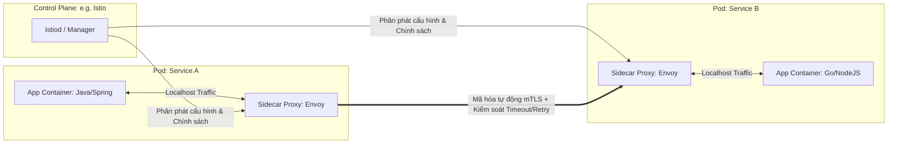

# Service mesh là gì?

## ⚡ Tóm tắt ngắn (30s)
*   **Bản chất**: **Service Mesh** (Lưới dịch vụ) là một tầng hạ tầng chuyên biệt (Dedicated Infrastructure Layer) được tích hợp trực tiếp vào nền tảng triển khai (thường là Kubernetes) để quản lý giao tiếp an toàn, tin cậy và minh bạch giữa các Microservices (**East-West Traffic**). Nhiệm vụ lớn nhất của Service Mesh là tách hoàn toàn các tính năng phi chức năng (Non-functional Requirements) như: *Retry, Timeout, Circuit Breaker, Service Discovery, Load Balancing, Security (mTLS), Tracing* ra khỏi mã nguồn của nhà phát triển và đưa xuống tầng hạ tầng quản lý.
*   **Mô hình hoạt động (Sidecar Pattern)**: Mỗi container ứng dụng (App Container) sẽ có một container Proxy siêu nhẹ chạy song song bên cạnh (gọi là **Sidecar Proxy**, phổ biến nhất là **Envoy**). Mọi lưu lượng mạng đi vào và đi ra khỏi dịch vụ đều bị chặn đứng và định tuyến đi qua Sidecar Proxy này.
*   **Kiến trúc chia làm 2 vùng**:
    1.  **Data Plane (Mặt phẳng dữ liệu)**: Tập hợp tất cả các Sidecar Proxies làm nhiệm vụ trực tiếp chuyển tiếp data, thực hiện mã hóa mTLS, áp dụng luật ngắt mạch, gom log.
    2.  **Control Plane (Mặt phẳng điều khiển)**: Trung tâm đầu não điều khiển (ví dụ: **Istio Istiod**). Nó quản lý các cấu hình, chính sách bảo mật, định nghĩa routing và phân phát các cấu hình đó xuống các Sidecar Proxies dưới Data Plane.
*   **Quyết định Senior**: Áp dụng Service Mesh (như Istio, Linkerd) khi hệ thống Microservices quy mô lớn (>20 services), được phát triển bằng **nhiều ngôn ngữ khác nhau** (Java, Go, Python, Node.js). Nếu chỉ chạy 3-4 dịch vụ thuần Java Spring Boot, việc dùng Service Mesh sẽ tạo ra gánh nặng cực kỳ lớn về chi phí vận hành (Operational Complexity) và lãng phí tài nguyên phần cứng vô ích.

---

## 🔍 Chi tiết bản chất thực chiến: Sự Tiến Hóa từ SDK sang Sidecar Mesh

Trước khi có Service Mesh, các tính năng thông minh mạng phải được nhúng trực tiếp vào code dưới dạng thư viện (SDK/Library) như Spring Cloud Netflix (Eureka, Ribbon, Hystrix) hay Resilience4j. 

### 1. Nỗi đau của giải pháp dùng SDK (SDK-based Approach)
*   **Dependency Hell (Thảm họa thư viện)**: Rất khó nâng cấp phiên bản thư viện vì liên quan đến xung đột mã nguồn. Nâng cấp phiên bản Spring Boot kéo theo hàng loạt lỗi tương thích của Spring Cloud.
*   **Không hỗ trợ Đa Ngôn Ngữ**: Nếu hệ thống có dịch vụ viết bằng Go hay Node.js, lập trình viên Go lại phải tìm thư viện tương đương Resilience4j của Go để cấu hình lại từ đầu. Sự không nhất quán này tạo ra lỗ hổng quản trị cực lớn.
*   **Phình code ứng dụng**: Mã nguồn bị ô nhiễm bởi các cấu hình hạ nguồn, làm mất đi tính tập trung vào logic nghiệp vụ cốt lõi.

### 2. Mô hình kiến trúc Service Mesh (Sidecar Pattern)



---

## 💻 Cấu hình thực chiến: BAD vs GOOD

### ❌ BAD (SDK Approach): Tự cấu hình bảo mật kết nối mTLS và kiểm soát mạng bằng Code Java
Code ứng dụng bị phình to do phải tự quản lý chứng chỉ SSL/TLS phục vụ mTLS và cấu hình thủ công các thông số retry/circuit breaker của mạng.

```java
// Lập trình viên phải tự viết Code/Cấu hình cực kỳ phức tạp để quản lý Certificate (chứng chỉ số)
// Nhằm đảm bảo 2 service giao tiếp mã hóa (mTLS). Code bị ô nhiễm bảo mật hạ tầng!
@Configuration
public class SecurityConfig {
    @Bean
    public RestTemplate restTemplateWithMtls() throws Exception {
        SSLContext sslContext = new SSLContextBuilder()
            .loadKeyMaterial(ResourceUtils.getFile("classpath:keystore.jks"), "password".toCharArray(), "password".toCharArray())
            .loadTrustMaterial(ResourceUtils.getFile("classpath:truststore.jks"), "password".toCharArray())
            .build();
            
        CloseableHttpClient client = HttpClients.custom().setSSLContext(sslContext).build();
        return new RestTemplate(new HttpComponentsClientHttpRequestFactory(client));
    }
}
```

---

### ✔️ GOOD: Code Java sạch thuần khiết, đẩy toàn bộ cấu hình mạng xuống Istio Service Mesh

Code Java hoàn toàn không chứa bất kỳ logic mạng hay chứng chỉ bảo mật nào. Dưới đây là cấu hình tài nguyên của Istio (**VirtualService** và **DestinationRule**) để thiết lập **Timeout**, **Retry với Jitter** và **mTLS tự động** ở mức hạ tầng:

```yaml
# 1. Cấu hình Định tuyến, Timeout và Retry thông minh bằng VirtualService của Istio
apiVersion: networking.istio.io/v1alpha3
kind: VirtualService
metadata:
  name: payment-service-route
  namespace: production
spec:
  hosts:
    - payment-service
  http:
    - route:
        - destination:
            host: payment-service
      timeout: 3s # Giới hạn Timeout cứng 3 giây cho mọi request
      retries:
        attempts: 3 # Tự động thử lại 3 lần ở mức hạ tầng (Sidecar thực hiện)
        perTryTimeout: 1s # Mỗi lần thử chờ tối đa 1 giây
        retryOn: "5xx,connect-failure,refused-stream" # Chỉ retry lỗi mạng/5xx

---

# 2. Cấu hình mTLS an toàn và Circuit Breaker bằng DestinationRule của Istio
apiVersion: networking.istio.io/v1alpha3
kind: DestinationRule
metadata:
  name: payment-service-policy
  namespace: production
spec:
  host: payment-service
  trafficPolicy:
    # BẮT BUỘC: Bật mã hóa mTLS tự động giữa các Sidecars không cần code Java can thiệp
    tls:
      mode: ISTIO_MUTUAL
    # Cấu hình Circuit Breaker (Outlier Detection)
    connectionPool:
      tcp:
        maxConnections: 100 # Giới hạn tối đa 100 kết nối TCP đồng thời
    outlierDetection:
      consecutive5xxErrors: 3 # Nếu service lỗi 3 lần liên tiếp
      interval: 10s # Kiểm tra định kỳ mỗi 10 giây
      baseEjectionTime: 30s # Đuổi instance lỗi ra khỏi pool load-balancer trong 30s
      maxEjectionPercent: 50 # Tối đa đuổi 50% số lượng instances để tránh sập cụm
```

---

## 📊 Bảng so sánh SDK Library vs Service Mesh

| Tiêu chí | SDK Library (Spring Cloud / Resilience4j) | Service Mesh (Istio / Linkerd) |
| :--- | :--- | :--- |
| **Vị trí xử lý** | Chạy bên trong JVM (Cùng tiến trình ứng dụng). | Chạy ngoài JVM (Trong Sidecar Container độc lập). |
| **Hỗ trợ đa ngôn ngữ**| **Rất kém**. Phải tìm và cài đặt thư viện riêng cho từng ngôn ngữ (Java, Go, Python). | **Tuyệt vời**. Trong suốt (Transparent) với mọi ngôn ngữ lập trình. |
| **Bảo mật (mTLS)** | Phải cấu hình thủ công trong code Java, quản lý cert phức tạp. | Tự động hóa hoàn toàn 100% nhờ Sidecar mã hóa đầu cuối. |
| **Độ phức tạp vận hành**| **Thấp**. Chỉ cần import dependency Maven/Gradle là chạy được. | **Cực cao**. Yêu cầu kỹ năng DevOps vững vàng để vận hành Control Plane. |
| **Độ trễ (Latency)** | **Rất thấp**. Gọi trực tiếp từ tiến trình này sang tiến trình kia qua mạng. | **Tăng nhẹ**. Do phải đi qua thêm 2 luồng Proxy mạng phụ (**Extra Network Hops**). |

---

## ⚠️ Common Gotchas & Questions follow-up

### 1. Thảm họa "Phình RAM cục bộ" (Sidecar Memory Overhead) trên Kubernetes
*   **Vấn đề**: Khi triển khai hàng trăm Pods trên K8s, mỗi Pod đều ngốn thêm một lượng tài nguyên RAM và CPU nhất định cho Sidecar (ví dụ mỗi Envoy Container ngốn từ `50MB - 150MB` RAM). Nếu hệ thống có 200 microservices, mỗi service chạy 3 replicas $\r\rightarrow$ chúng ta tiêu tốn thêm khoảng `30GB - 90GB` RAM vô ích chỉ để nuôi Sidecar Proxies!
*   **Giải pháp**:
    *   Sử dụng các Mesh nhẹ hơn như **Linkerd** thay vì Istio nếu hệ thống không cần quá nhiều tính năng định tuyến phức tạp.
    *   Áp dụng kiến trúc **Ambient Mesh** (Sidecarless) mới của Istio: Không dùng Sidecar cho từng Pod, chuyển sang dùng chung một Proxy (Daemonset Ztunnel) cho toàn bộ Node để tiết kiệm tài nguyên RAM đáng kể.

### 2. Có nên kết hợp cả Resilience4j (Code) và Istio (Hạ tầng) cùng lúc không?
*   **Câu trả lời từ thực chiến**:
    *   **Không nên cấu hình chồng chéo các tính năng giống nhau**. Nếu cả Resilience4j và Istio cùng bật cấu hình *Retry* hoặc *Timeout*, hành vi hệ thống sẽ trở nên cực kỳ bất định và khó debug. Ví dụ: Resilience4j retry 3 lần, mỗi lần gọi lại bị Istio tiếp tục retry 3 lần nữa $\r\rightarrow$ tổng cộng tạo ra `3 x 3 = 9` lần gọi thực tế đè bẹp downstream!
    *   **Best Practice**: Hãy phân định rạch ròi trách nhiệm:
        *   **Hạ tầng (Istio)** quản lý: Bảo mật mạng (`mTLS`), Giám sát lưu lượng (`Tracing/Metrics`), Định tuyến xanh-đỏ (`Canary Routing`), và các lỗi mạng cơ bản (`Connect Timeout`).
        *   **Ứng dụng (Resilience4j)** quản lý: **Logic nghiệp vụ đặc thù** như Hàm Fallback (vì hạ tầng K8s không thể biết business logic để trả về dữ liệu cache gì của Java), Circuit Breaker cấp ứng dụng, và các nghiệp vụ xử lý dữ liệu nhạy cảm.
