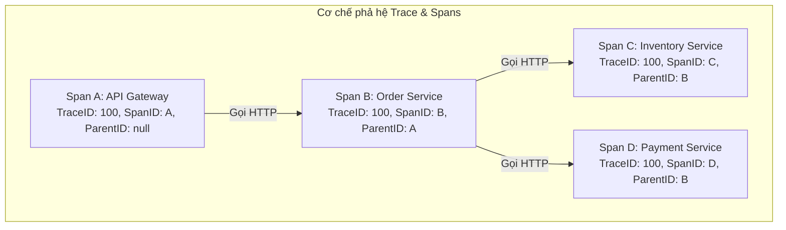

# Distributed tracing là gì?

## ⚡ Tóm tắt ngắn (30s)
*   **Bản chất**: **Distributed Tracing** (Truy vết phân tán) là kỹ thuật giám sát hiệu năng hệ thống (APM) giúp theo dõi, ghi nhận hành trình và đo lường độ trễ (latency) của một yêu cầu (User Request) từ lúc đi vào hệ thống cho tới khi hoàn tất, đi qua hàng loạt microservices, database và message brokers độc lập.
*   **Ba khái niệm xương sống**:
    1.  **Trace ID**: Mã định danh duy nhất (thường là UUID hoặc chuỗi Hex 128-bit) sinh ra ở điểm chạm đầu tiên (ví dụ API Gateway). Tất cả các dịch vụ tham gia xử lý request này bắt buộc phải dùng chung một Trace ID duy nhất.
    2.  **Span ID**: Định danh duy nhất cho một đơn vị công việc nhỏ nhất bên trong một dịch vụ cụ thể (ví dụ: truy vấn DB, gọi API bên thứ ba).
    3.  **Parent Span ID**: Span ID của dịch vụ cha gọi dịch vụ hiện tại. Giúp tái tạo lại toàn bộ cây phả hệ cuộc gọi (**Call Tree Hierarchy**) từ đầu đến cuối.
*   **Context Propagation (Lan truyền ngữ cảnh)**: Cơ chế đóng gói ngữ cảnh truy vết (Trace ID, Span ID) vào giao thức truyền tải mạng (ví dụ HTTP Headers, Kafka Headers) để truyền đi xuyên biên giới tiến trình. Định dạng chuẩn quốc tế hiện nay là **W3C Trace Context** (sử dụng header `traceparent`).
*   **Hệ sinh thái chuẩn hóa**: Sử dụng **OpenTelemetry (OTel)** làm chuẩn chung để thu thập và xuất (export) dữ liệu trace, kết hợp với các công cụ trực quan hóa như **Jaeger**, **Zipkin**, hoặc Datadog.

---

## 🔍 Chi tiết bản chất thực chiến: Cơ chế hoạt động của Trace và Span

Nếu không có Distributed Tracing, khi người dùng bấm đặt hàng thất bại, việc dò tìm nguyên nhân trong hàng tá file log của 20 microservices khác nhau là điều bất khả thi (**Kim đáy bể**).

Dưới đây là cách Trace ID kết nối dữ liệu và cách Parent Span ID tái cấu trúc đồ thị luồng đi:

```mermaid
gantt
    title Biểu đồ Span biểu diễn thời gian xử lý yêu cầu (Trace)
    dateFormat  X
    axisFormat %s
    
    section API Gateway
    Trace 1 - Span A (Gateway): active, 0, 10
    
    section Order Service
    Trace 1 - Span B (Order Creation): active, 1, 9
    
    section Inventory Service
    Trace 1 - Span C (Check Stock): active, 2, 5
    
    section Payment Service
    Trace 1 - Span D (Charge Card): active, 6, 8
```





### Tiêu chuẩn W3C Trace Context HTTP Header
Khi truyền tải qua mạng, header `traceparent` sẽ có định dạng chuẩn hóa:
```text
traceparent: 00-4bf92f3577b34da6a3ce929d0e0e4736-00f067aa0ba902b7-01
             │  └─────────────┬──────────────┘ └──────┬──────┘ └┬┘
             │            Trace ID                 Span ID      Flags
          Version (00)                                       (01 = Sampled)
```

---

## 💻 Code thực chiến: BAD vs GOOD

### ❌ BAD: Gọi HTTP thủ công khiến Trace ID bị đứt gãy giữa đường
Nếu chỉ ghi log thông thường và gọi API không đồng bộ hóa ngữ cảnh, Trace ID sẽ biến mất ngay khi rời khỏi service đầu tiên.

```java
@Service
@Slf4j
public class OrderServiceBad {

    @Autowired
    private RestTemplate restTemplate;

    public void processOrder(OrderRequest request) {
        // Log cục bộ chỉ hiển thị Trace ID nếu ứng dụng đó tự sinh (không đồng bộ với Gateway)
        log.info("Bắt đầu xử lý đơn đặt hàng..."); 
        
        // HẬU QUẢ: Cuộc gọi trực tiếp qua RestTemplate này không hề đính kèm Trace ID vào Header.
        // Payment Service nhận cuộc gọi sẽ coi đây là một request mới hoàn toàn và sinh Trace ID mới.
        // Luồng Trace bị đứt gãy 100%!
        PaymentDto payment = restTemplate.postForObject(
            "http://payment-service/api/payments", 
            new PaymentRequest(request), 
            PaymentDto.class
        );
        
        log.info("Đặt hàng hoàn tất thành công.");
    }
}
```

---

### ✔️ GOOD: Sử dụng Micrometer Tracing (Spring Boot 3) và Tự động Truyền Ngữ Cảnh

Spring Boot 3 tích hợp sẵn thư viện **Micrometer Tracing** (thay thế Spring Cloud Sleuth). Khi gọi qua `WebClient` hoặc `RestTemplate` đã được cấu hình, nó tự động trích xuất TraceContext từ `ThreadLocal` đưa vào HTTP Header để gửi sang service tiếp theo.

```java
@Service
@Slf4j
public class OrderServiceGood {

    // BẮT BUỘC: Sử dụng RestTemplate Builder để Spring tự động tiêm các Interceptor quản lý Trace
    private final RestTemplate restTemplate;
    
    @Autowired
    private Tracer tracer; // Công cụ thao tác Trace thủ công của Micrometer

    public OrderServiceGood(RestTemplateBuilder restTemplateBuilder) {
        this.restTemplate = restTemplateBuilder.build();
    }

    public void processOrder(OrderRequest request) {
        // 1. Log tự động hiển thị cấu trúc [app-name, traceId, spanId] nhờ cấu hình Logback
        log.info("Bắt đầu xử lý đơn đặt hàng...");
        
        // 2. Tạo một Span con thủ công nếu muốn theo dõi một khối code nặng riêng biệt
        Span newSpan = this.tracer.nextSpan().name("heavy-database-calculation");
        try (Tracer.SpanInScope ws = this.tracer.withSpan(newSpan.start())) {
            log.info("Đang thực hiện tính toán cơ sở dữ liệu nặng...");
            performHeavyTask();
        } finally {
            newSpan.end(); // Kết thúc đo lường Span con
        }

        // 3. Gọi ngoài: RestTemplate tự động tiêm "traceparent" header vào yêu cầu đi
        PaymentDto payment = restTemplate.postForObject(
            "http://payment-service/api/payments", 
            new PaymentRequest(request), 
            PaymentDto.class
        );
        
        log.info("Đặt hàng hoàn tất thành công.");
    }

    private void performHeavyTask() {
        try { Thread.sleep(200); } catch (InterruptedException e) { Thread.currentThread().interrupt(); }
    }
}
```

**Cấu hình hiển thị Logback có chứa Trace ID & Span ID trong `application.yml`:**

```yaml
spring:
  application:
    name: order-service
# Cấu hình Micrometer Tracing xuất dữ liệu sang Zipkin hoặc Jaeger
management:
  tracing:
    sampling:
      probability: 1.0 # 1.0 = Ghi nhận 100% request. Production nên đặt 0.1 (10%) để tránh lãng phí RAM/Disk
  zipkin:
    tracing:
      endpoint: http://localhost:9411/api/v2/spans

# Định dạng in LOG chuẩn của Spring Boot 3
logging:
  pattern:
    level: "%5p [${spring.application.name:},%X{traceId:-},%X{spanId:-}]"
```

---

## 📊 Bảng so sánh Ba trụ cột Observability

| Tiêu chí | Logging (Nhật ký sự kiện) | Metrics (Số liệu giám sát) | Tracing (Truy vết phân tán) |
| :--- | :--- | :--- | :--- |
| **Mục đích chính** | Ghi lại chi tiết lỗi logic hoặc thông tin cụ thể của luồng chạy. | Đo lường sức khỏe hệ thống (CPU, RAM, Error Rate, Latency). | Vẽ bản đồ đường đi của Request xuyên qua các hệ thống phân tán. |
| **Dạng dữ liệu** | Văn bản có cấu trúc (JSON) hoặc phi cấu trúc (String). | Dữ liệu dạng số, chuỗi thời gian (Time-series data). | Đồ thị có hướng (Directed Acyclic Graph - DAG) của các Spans. |
| **Công cụ tiêu biểu**| ELK Stack (Elasticsearch, Logstash, Kibana), Grafana Loki. | Prometheus, VictoriaMetrics, InfluxDB, Grafana. | Jaeger, Zipkin, OpenTelemetry, Datadog. |

---

## ⚠️ Common Gotchas & Questions follow-up

### 1. Thảm họa "Mất Trace ID" khi chạy Code Bất Đồng Bộ (Multi-threading / Thread Pool)
*   **Vấn đề**: Trace ID mặc định được lưu trữ trong `ThreadLocal`. Khi bạn chạy một tác vụ bất đồng bộ bằng `@Async`, `CompletableFuture.runAsync()`, hoặc chạy trong Thread Pool tùy biến, tác vụ đó sẽ được thực thi trên một **Thread hoàn toàn mới**. Do đó, `ThreadLocal` bị rỗng và toàn bộ thông tin Trace ID bị biến mất trong các dòng log tiếp theo.
*   **Giải pháp**: Bắt buộc phải bọc (decorate) Executor Service bằng **`ContextExecutor`** hoặc sử dụng cấu hình chuyển giao context của Spring để tự động copy `ThreadLocal` sang Thread mới.
    ```java
    @Configuration
    public class AsyncConfig {
        @Bean(name = "taskExecutor")
        public Executor getAsyncExecutor() {
            ThreadPoolTaskExecutor executor = new ThreadPoolTaskExecutor();
            executor.setCorePoolSize(10);
            // Kích hoạt cơ chế chuyển giao Context (bao gồm Tracing Context) sang Thread mới của Spring Boot 3
            executor.setTaskDecorator(new ContextPropagatingTaskDecorator()); 
            executor.initialize();
            return executor;
        }
    }
    ```

### 2. Sự cố "Cạn kiệt đĩa cứng và sập mạng" do Log Tracing quá đà (Sampling Rate)
*   **Vấn đề**: Trong hệ thống chịu tải cao (ví dụ: 10,000 requests/s), nếu cấu hình ghi nhận 100% trace (`sampling.probability: 1.0`), lượng dữ liệu trace gửi qua mạng về Jaeger/Zipkin sẽ cực kỳ lớn. Điều này gây bão băng thông nội bộ và nhanh chóng lấp đầy ổ cứng của cụm cơ sở dữ liệu lưu trữ trace (Elasticsearch/Cassandra) chỉ sau vài giờ.
*   **Giải pháp**: 
    *   Sử dụng cơ chế **Adaptive Sampling** hoặc cấu hình **Probabilistic Sampling** thấp (ví dụ: `0.1` tức là chỉ trace ngẫu nhiên 10% các request thành công).
    *   Đối với các request bị lỗi (mã lỗi >= 500 hoặc latency quá cao), cấu hình **Tail-based Sampling** để bắt buộc lưu trữ 100% các vết lỗi này nhằm mục đích debug.
