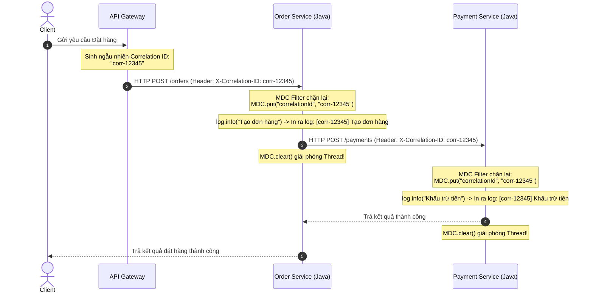

# Correlation ID trong microservices

## ⚡ Tóm tắt ngắn (30s)
*   **Bản chất**: **Correlation ID** (Mã tương quan / Mã liên đới) là một chuỗi định danh duy nhất (thường là UUID) được gán cho một yêu cầu của người dùng ngay tại điểm bắt đầu (Client hoặc API Gateway). Chuỗi này được truyền tải xuyên suốt qua tất cả các Microservices tham gia xử lý yêu cầu đó và được ghi kèm vào **tất cả các dòng log**. Sợi dây liên kết vô hình này giúp kỹ sư hệ thống có thể gom toàn bộ log của tất cả các dịch vụ độc lập lại để dựng lại trọn vẹn lịch sử xử lý của một request duy nhất.
*   **Cơ chế hoạt động cục bộ (MDC)**: Bên trong một tiến trình Java, Correlation ID được lưu trữ bằng **MDC (Mapped Diagnostic Context)** của các thư viện log (như Logback, Log4j2). MDC tận dụng `ThreadLocal` để tự động đính kèm Correlation ID vào tất cả các câu lệnh log (`log.info()`, `log.error()`) mà không bắt buộc lập trình viên phải truyền biến ID này làm tham số phương thức.
*   **Cơ chế truyền đi (Context Propagation)**: Khi thực hiện gọi API mạng (HTTP/gRPC) hoặc gửi tin nhắn (Kafka/RabbitMQ), Correlation ID được trích xuất từ MDC cục bộ và đính kèm vào header truyền tải (ví dụ HTTP header `X-Correlation-Id` hoặc `X-Request-Id`).
*   **Sự khác biệt với Trace ID**: 
    *   **Trace ID**: Thường thuộc tầng hạ tầng mạng, quản lý tự động bởi các công cụ giám sát (APM - OpenTelemetry, Jaeger) để đo lường độ trễ mạng (Timeline / Spans).
    *   **Correlation ID**: Thường thuộc tầng ứng dụng (Application Level), dùng để **truy vết log nghiệp vụ** (Business Troubleshooting / Auditing). Trong nhiều hệ thống hiện đại, người ta đồng nhất 2 khái niệm này bằng cách lấy Trace ID làm Correlation ID để giảm độ phức tạp.

---

## 🔍 Chi tiết bản chất thực chiến: Mapped Diagnostic Context (MDC) hoạt động ra sao?

MDC hoạt động dựa trên cơ chế `ThreadLocal`, tức là nó liên kết một vùng chứa dữ liệu (Map) với duy nhất **Thread hiện tại** đang xử lý request. 



---

## 💻 Code thực chiến: BAD vs GOOD

### ❌ BAD: Truyền Correlation ID thủ công qua tham số phương thức (Parameter Pollution)
Đây là một thảm họa thiết kế. Code nghiệp vụ bị ô nhiễm nghiêm trọng vì phương thức nào cũng phải nhận thêm một biến `correlationId` chỉ để phục vụ việc ghi log.

```java
@Service
@Slf4j
public class OrderServiceBad {

    // THẢM HỌA: Mọi hàm nghiệp vụ đều phải nhận thêm tham số String correlationId!
    public void createOrder(OrderRequest request, String correlationId) {
        log.info("[{}] Bắt đầu tạo đơn hàng cho khách: {}", correlationId, request.getCustomerId());
        
        saveToDb(request, correlationId);
        
        log.info("[{}] Đơn hàng đã được lưu thành công", correlationId);
    }

    private void saveToDb(OrderRequest request, String correlationId) {
        // Tiếp tục phải truyền biến này đi khắp nơi...
        log.info("[{}] Lưu Database...", correlationId);
    }
}
```

---

### ✔️ GOOD: Tự động hóa quản lý Correlation ID bằng Filter, MDC và HTTP Interceptor

Giải pháp này hoàn toàn tách biệt logic truy vết ra khỏi business code. Sử dụng MDC Filter để tự động quản lý Correlation ID cho luồng vào và RestTemplate Interceptor cho luồng ra.

#### Bước 1: Tạo Servlet Filter để đánh chặn Request đi vào, nạp vào MDC
```java
@Component
@Order(Ordered.HIGHEST_PRECEDENCE) // Đảm bảo chạy đầu tiên khi request đi vào ứng dụng
@Slf4j
public class CorrelationIdFilter implements Filter {

    private static final String CORRELATION_HEADER_NAME = "X-Correlation-Id";
    private static final String MDC_KEY = "correlationId";

    @Override
    public void doFilter(ServletRequest request, ServletResponse response, FilterChain chain)
            throws IOException, ServletException {
        HttpServletRequest httpRequest = (HttpServletRequest) request;
        HttpServletResponse httpResponse = (HttpServletResponse) response;

        // Trích xuất ID từ Header của API Gateway hoặc Service khác gửi tới
        String correlationId = httpRequest.getHeader(CORRELATION_HEADER_NAME);
        
        // Nếu không có (ví dụ cuộc gọi trực tiếp đầu tiên), tự sinh mới UUID
        if (correlationId == null || correlationId.trim().isEmpty()) {
            correlationId = UUID.randomUUID().toString();
            log.debug("Sinh mới Correlation ID: {}", correlationId);
        }

        // 1. NẠP VÀO MDC để tất cả các dòng log của Thread này tự động có ID
        MDC.put(MDC_KEY, correlationId);

        // Đính kèm ngược lại phản hồi cho client tiện đối soát khi gặp lỗi
        httpResponse.setHeader(CORRELATION_HEADER_NAME, correlationId);

        try {
            chain.doFilter(request, response);
        } finally {
            // 2. BẮT BUỘC: Xóa sạch dữ liệu MDC khi kết thúc xử lý!
            // Giúp tránh rò rỉ bộ nhớ (Memory Leak) và nhiễm chéo dữ liệu khi tái sử dụng Thread.
            MDC.clear();
        }
    }
}
```

#### Bước 2: Thiết lập Interceptor để tự động truyền ID đi khi gọi API ngoài
```java
public class RestTemplateCorrelationInterceptor implements ClientHttpRequestInterceptor {

    private static final String CORRELATION_HEADER_NAME = "X-Correlation-Id";
    private static final String MDC_KEY = "correlationId";

    @Override
    public ClientHttpResponse intercept(HttpRequest request, byte[] body, ClientHttpRequestExecution execution)
            throws IOException {
        
        // Lấy Correlation ID hiện tại của Thread từ MDC
        String correlationId = MDC.get(MDC_KEY);
        
        if (correlationId != null) {
            // Tiêm tự động vào HTTP Header của cuộc gọi ra
            request.getHeaders().add(CORRELATION_HEADER_NAME, correlationId);
        }
        
        return execution.execute(request, body);
    }
}
```

#### Bước 3: Định cấu hình Logback (`logback-spring.xml`) tự động in ID
Ta sử dụng biến `%X{correlationId}` để in trực tiếp giá trị lưu trong MDC ra log:
```xml
<appender name="CONSOLE" class="ch.qos.logback.core.ConsoleAppender">
    <encoder>
        <pattern>%d{yyyy-MM-dd HH:mm:ss.SSS} [%thread] %5level [%X{correlationId:-NoCorrID}] %logger{36} - %msg%n</pattern>
    </encoder>
</appender>
```
*Kết quả in log:*
```text
2026-05-23 09:30:15.123 [http-nio-8080-exec-1]  INFO [c3b88b48-18e3-4d40-9a25-e51f8a846c43] c.e.OrderService - Tạo đơn hàng
```

---

## 📊 Bảng so sánh các loại ID truy vết phổ biến

| Loại ID | Điểm sinh ra | Tầm ảnh hưởng | Mục tiêu chính | Đối tượng sử dụng |
| :--- | :--- | :--- | :--- | :--- |
| **Correlation ID** | API Gateway / Client | Xuyên suốt toàn bộ hệ thống phân tán. | Xâu chuỗi **log nghiệp vụ** của các dịch vụ khác nhau. | Lập trình viên, Kỹ sư hỗ trợ đối soát dữ liệu (L1/L2 Support). |
| **Trace ID** | Tầng APM / Sidecar Mesh | Xuyên suốt toàn bộ hệ thống phân tán. | Đo lường **hiệu năng**, độ trễ các chặng kết nối mạng (Spans). | Kỹ sư SRE, DevOps, APM Tools (Jaeger, Zipkin). |
| **Request ID** | Web Server cục bộ | Chỉ có giá trị nội bộ trong **duy nhất 1 service**. | Truy vết lỗi xử lý cục bộ của một tiến trình HTTP. | Quản trị viên hệ thống cục bộ. |

---

## ⚠️ Common Gotchas & Questions follow-up

### 1. Thảm họa "Nhiễm chéo log" (Log Contamination) do quên dọn dẹp MDC
*   **Vấn đề**: Các Web Server như Tomcat sử dụng cơ chế **Thread Pool** để tái sử dụng các Thread cũ cho các request mới nhằm tối ưu hiệu năng. Nếu ở cuối filter xử lý của Request A, bạn quên gọi `MDC.clear()` (hoặc `MDC.remove()`). Khi Thread đó được tái sử dụng để xử lý Request B mới hoàn toàn (không gửi Correlation ID), MDC của Thread đó vẫn lưu giá trị của Request A. Kết quả là log của Request B sẽ in kèm Correlation ID của Request A, tạo ra sự hỗn loạn và sai lệch thông tin nghiêm trọng khi debug!
*   **Giải pháp**: Luôn đặt khối lệnh `MDC.clear()` bên trong mệnh đề `finally` của Filter/Interceptor để đảm bảo nó luôn được thực thi dù request có xảy ra lỗi nghiêm trọng.

### 2. Làm thế nào để truyền Correlation ID qua Message Broker như Apache Kafka?
*   **Câu trả lời từ thực chiến**:
    *   Chúng ta không nhét Correlation ID vào nội dung payload (JSON body) của message vì như vậy sẽ làm bẩn cấu trúc dữ liệu nghiệp vụ.
    *   Hãy tận dụng tính năng **Kafka Headers** (hoặc RabbitMQ Message Properties).
    *   **Phía gửi (Producer Interceptor)**: Đọc Correlation ID từ MDC nạp vào Kafka Header.
        ```java
        ProducerRecord<String, OrderEvent> record = new ProducerRecord<>(topic, event);
        record.headers().add("X-Correlation-Id", MDC.get("correlationId").getBytes(StandardCharsets.UTF_8));
        kafkaTemplate.send(record);
        ```
    *   **Phía nhận (Consumer Interceptor)**: Đọc Header từ tin nhắn nhận được, giải mã và nạp ngược lại vào MDC của Thread xử lý tin nhắn của Consumer.
