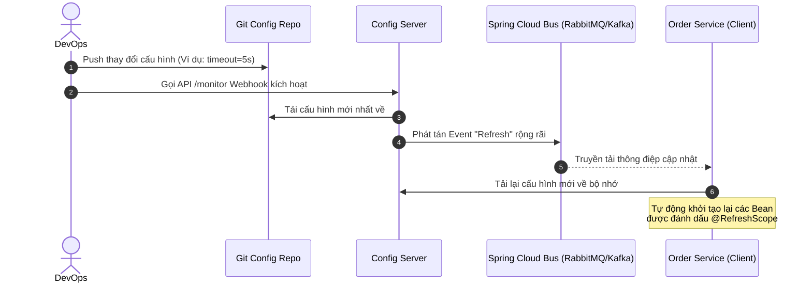

# Config management cho microservices

## ⚡ Tóm tắt ngắn (30s)
*   **Bản chất**: **Config Management** (Quản lý cấu hình) trong kiến trúc Microservices tuân thủ nghiêm ngặt nguyên lý thứ III của phương pháp luận **Twelve-Factor App**: *Store config in the environment (Lưu trữ cấu hình trong môi trường)*. Cấu hình (như địa chỉ Database, đường dẫn API ngoại vi, tham số Thread Pool) phải được tách biệt hoàn toàn khỏi mã nguồn ứng dụng và quản lý tập trung dựa trên môi trường triển khai (Dev, Staging, Prod).
*   **Centralized Config (Cấu hình tập trung)**: Thay vì lưu file cấu hình cục bộ trong từng service, tất cả cấu hình được đưa về một kho lưu trữ chung. Các dịch vụ khi khởi động sẽ gọi lên máy chủ cấu hình chung này để tải thông số về bộ nhớ. Các công cụ phổ biến gồm: **Spring Cloud Config**, **HashiCorp Consul**, hoặc trực tiếp sử dụng **Kubernetes ConfigMap**.
*   **Dynamic Refresh (Cập nhật nóng)**: Khả năng thay đổi tham số cấu hình tại thời điểm chạy (Runtime) và tự động áp dụng vào ứng dụng mà không cần phải khởi động lại (Restart) ứng dụng, giúp giảm thiểu tối đa thời gian gián đoạn hệ thống.
*   **Quyết định Senior**: Nếu hệ thống chạy trên **Kubernetes**, hãy ưu tiên sử dụng **Kubernetes ConfigMap** kết hợp biến môi trường (Environment Variables). Đây là giải pháp chuẩn Cloud-Native, gọn nhẹ nhất và không phát sinh chi phí vận hành một hệ thống Config Server cồng kềnh riêng biệt. Chỉ dùng Spring Cloud Config khi cần các tính năng quản lý phiên bản (Git-backed config) cực kỳ nâng cao hoặc chạy ngoài môi trường K8s.

---

## 🔍 Chi tiết bản chất thực chiến: Centralized Config Server hoạt động ra sao?

Khi quản lý cấu hình tập trung sử dụng Spring Cloud Config (lưu trữ trên Git), luồng tải cấu hình và cập nhật động (Hot Reload) diễn ra như sau:



---

## 💻 Cấu hình thực chiến: BAD vs GOOD

### ❌ BAD: Đóng gói cứng cấu hình của mọi môi trường bên trong File JAR ứng dụng
Mỗi khi cần thay đổi địa chỉ IP cơ sở dữ liệu môi trường Production, DevOps bắt buộc phải chỉnh sửa file, thực hiện commit code, build lại file JAR và deploy lại toàn bộ ứng dụng từ đầu. Cực kỳ rủi ro và mất thời gian!

```yaml
# application-prod.yml (Nằm cứng ngắc trong thư mục src/main/resources)
# HẬU QUẢ: 
# 1. Để lộ mật khẩu database nhạy cảm ngay trên Git Repository của mã nguồn.
# 2. Thay đổi thông số nhỏ phải rebuild lại code.
# 3. Phá vỡ nguyên tắc Twelve-Factor App (Build một lần, Deploy mọi nơi).
spring:
  datasource:
    url: jdbc:postgresql://192.168.1.50:5432/order_prod_db
    username: super_admin_prod
    password: SuperSecretPassword123!
```

---

### ✔️ GOOD: Sử dụng Kubernetes ConfigMap để tiêm cấu hình ngoài chuẩn Cloud-Native

Ứng dụng Spring Boot chỉ khai báo các biến môi trường làm tham số giữ chỗ (Placeholders). Giá trị thực tế sẽ được tiêm (Inject) động từ hạ tầng Kubernetes ConfigMap lúc container khởi động.

#### 1. File cấu hình Spring Boot (`application.yml`) sạch sẽ:
```yaml
spring:
  datasource:
    # Sử dụng biến môi trường do hạ tầng tiêm vào, nếu thiếu sẽ dùng giá trị mặc định sau dấu hai chấm
    url: ${DB_URL:jdbc:postgresql://localhost:5432/order_dev_db}
    username: ${DB_USERNAME:postgres}
    password: ${DB_PASSWORD:postgres}

# Cấu hình tự động cập nhật động cho Spring Boot Actuator
management:
  endpoints:
    web:
      exposure:
        include: refresh,health,info
```

#### 2. Khai báo file cấu hình Kubernetes ConfigMap (`configmap.yaml`):
```yaml
apiVersion: v1
kind: ConfigMap
metadata:
  name: order-service-config
  namespace: production
data:
  # Lưu giữ cấu hình phi nhạy cảm
  DB_URL: "jdbc:postgresql://postgres-prod-cluster:5432/order_prod_db"
  EXTERNAL_TIMEOUT_MS: "3000"
```

#### 3. Cấu hình Deployment của Kubernetes để tiêm biến từ ConfigMap vào Container:
```yaml
apiVersion: apps/v1
kind: Deployment
metadata:
  name: order-service
spec:
  replicas: 3
  template:
    spec:
      containers:
        - name: order-service-app
          image: order-service:v1.2.0
          env:
            # Tiêm biến DB_URL từ ConfigMap
            - name: DB_URL
              valueFrom:
                configMapKeyRef:
                  name: order-service-config
                  key: DB_URL
            # Tiêm biến mật khẩu nhạy cảm từ Kubernetes Secret (Bảo mật tuyệt đối)
            - name: DB_PASSWORD
              valueFrom:
                secretKeyRef:
                  name: db-production-credentials
                  key: password
```

#### 4. Code Java hỗ trợ Cập nhật nóng cấu hình không cần restart ứng dụng:
Sử dụng annotation `@RefreshScope` của Spring Cloud. Khi cấu hình thay đổi và ta trigger API `/actuator/refresh`, Spring sẽ tự động tạo lại các Instance của Bean này với giá trị mới.

```java
@Component
@RefreshScope // BẮT BUỘC: Đánh dấu để Spring tái khởi tạo Bean khi cấu hình thay đổi
@Getter
public class OrderProcessingConfig {

    // Giá trị này sẽ tự động thay đổi động lúc runtime khi cấu hình ở ConfigMap cập nhật
    @Value("${external.timeout.ms:2000}")
    private int externalTimeoutMs;
}
```

---

## 📊 Bảng so sánh các giải pháp quản lý cấu hình

| Tiêu chí | Spring Cloud Config | Consul / ZooKeeper | Kubernetes ConfigMap |
| :--- | :--- | :--- | :--- |
| **Bản chất hệ thống** | Git-backed Config Server độc lập viết bằng Java. | Distributed Key-Value Store. | Hạ tầng tích hợp sẵn (Native Kubernetes resource). |
| **Chi phí vận hành** | **Trung bình**. Phải duy trì, phân quyền và giám sát dịch vụ Config Server. | **Cao**. Phải quản lý cụm Consul Cluster đồng thuận bảo mật. | **Cực thấp**. Tận dụng hạ tầng có sẵn của Kubernetes. |
| **Hot Reload** | Yêu cầu Spring Cloud Bus + RabbitMQ/Kafka để phát tán sự kiện. | Hỗ trợ lắng nghe (Watch) sự kiện thay đổi Key-Value nguyên bản. | K8s tự động cập nhật file mount trong container (App cần cơ chế watch file). |
| **Mức độ phụ thuộc** | Phụ thuộc chặt chẽ vào hệ sinh thái Java / Spring. | Đa ngôn ngữ tốt nhờ API RESTful. | Tuyệt vời. Hoàn toàn độc lập với ngôn ngữ lập trình của container. |

---

## ⚠️ Common Gotchas & Questions follow-up

### 1. Thảm họa "Chết chùm lúc khởi động" (Single Point of Failure - SPOF)
*   **Vấn đề**: Khi sử dụng Config Server tập trung, nếu Server cấu hình bị sập nguồn hoặc đứt kết nối mạng. Tất cả các microservices khác khi khởi động (hoặc tự động scale up) sẽ không thể lấy được cấu hình để kết nối Database $\rightarrow$ dẫn đến toàn bộ cụm microservices bị treo hoặc sụp đổ dây chuyền khi khởi động lại.
*   **Giải pháp**:
    *   Cấu hình **`fail-fast: false`** và thiết lập cơ chế nạp cấu hình mặc định cục bộ dự phòng (Fallback Local Config) để ứng dụng vẫn khởi động được ở mức cơ bản.
    *   Duy trì cơ chế **Local Cache** cấu hình trên đĩa cứng của từng container: Khi tải cấu hình thành công, ghi đè một bản sao xuống ổ đĩa cục bộ. Nếu Config Server sập, nạp lại bản sao này.

### 2. Sự cố rò rỉ thông tin nhạy cảm (Secret Leakage) do nhầm lẫn vai trò của ConfigMap
*   **Vấn đề**: Kỹ sư DevOps lưu trữ các thông tin cực kỳ nhạy cảm như Mật khẩu Database, Private Key, API Key của các dịch vụ thanh toán trực tiếp vào **Kubernetes ConfigMap**. ConfigMap bản chất lưu dữ liệu dưới dạng văn bản thuần (Plain Text) không hề được mã hóa. Bất kỳ ai có quyền truy cập cơ bản vào cụm K8s đều có thể đọc được thông tin này dễ dàng.
*   **Giải pháp**: Tuyệt đối không lưu secret vào ConfigMap. Bắt buộc phải sử dụng **Kubernetes Secret** (dữ liệu mã hóa Base64 cấp thấp) kết hợp với các công cụ quản lý bảo mật chuyên sâu như **HashiCorp Vault** hoặc **AWS Secrets Manager** (Sẽ trình bày chi tiết ở câu hỏi tiếp theo).
