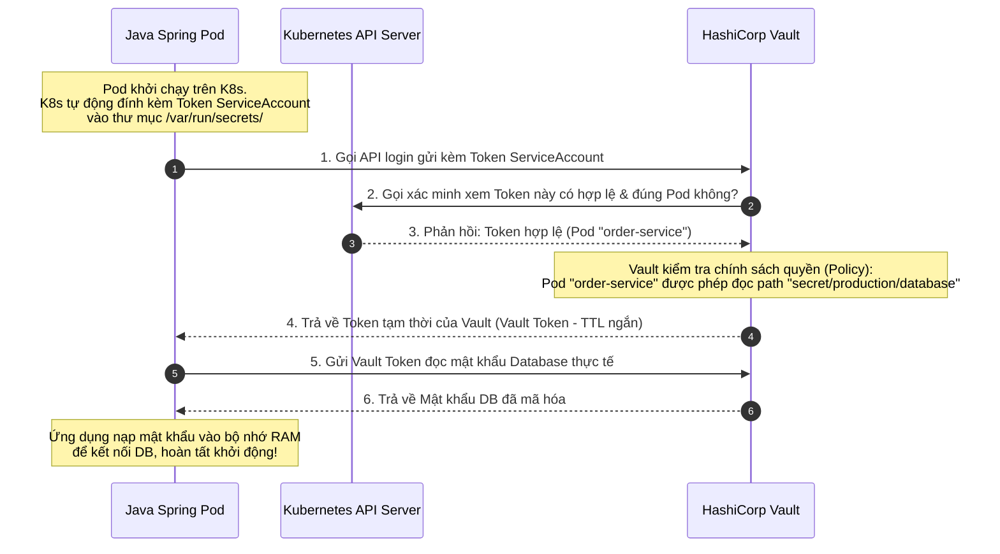

# Secret management nên làm thế nào?

## ⚡ Tóm tắt ngắn (30s)
*   **Bản chất**: **Secret Management** (Quản lý thông tin bảo mật) là quy trình bảo vệ tuyệt đối các dữ liệu nhạy cảm (Mật khẩu Database, API Keys của đối tác như Stripe/Twilio, SSL Certificates, Private Keys) khỏi việc bị rò rỉ ra môi trường bên ngoài. Nguyên tắc tối cao là: **TUYỆT ĐỐI KHÔNG HARDCODE** hoặc lưu trữ bất kỳ thông tin nhạy cảm nào dưới dạng Plain Text trên Git Repository (dù là Git Private).
*   **4 Trụ Cột Bảo Mật Của Senior**:
    1.  **Mã hóa mọi nơi (Encryption at Rest and in Transit)**: Secret phải được mã hóa cả khi lưu trữ trong ổ đĩa cứng và khi truyền tải qua mạng.
    2.  **Xác thực không mật khẩu (Secretless Authentication)**: Ứng dụng chứng thực với kho chứa Secret bằng chính định danh hạ tầng của nó (ví dụ: Kubernetes Service Account Token) thay vì dùng một mật khẩu tĩnh khác.
    3.  **Xoay vòng tự động (Automated Rotation)**: Tự động thay đổi mật khẩu định kỳ (ví dụ: 30 ngày một lần) để giảm thiểu tối đa thiệt hại nếu chẳng may bị lộ lọt.
    4.  **Nhật ký kiểm toán (Audit Logging)**: Ghi log chi tiết 100% các hành động truy cập: "Ai (Service nào) đã đọc Secret gì? Vào lúc nào?".
*   **Công cụ tiêu chuẩn**: **HashiCorp Vault** (tiêu chuẩn On-Premise/Multi-Cloud), **AWS Secrets Manager**, hoặc **Azure Key Vault**.
*   **Khuyến nghị thực chiến**: Tuyệt đối không coi **Kubernetes Secret** mặc định là giải pháp lưu trữ cuối cùng, vì nó chỉ được mã hóa dạng **Base64** cực kỳ sơ đẳng (ai cũng có thể decode được dễ dàng). Bắt buộc phải bật cấu hình mã hóa etcd (K8s Encryption at Rest) hoặc sử dụng các công cụ đồng bộ bảo mật như **External Secrets Operator (ESO)** để tiêm an toàn từ HashiCorp Vault vào Pod.

---

## 🔍 Chi tiết bản chất thực chiến: Bài toán "Con gà và Quả trứng" (Chicken-and-Egg Problem)

Để lấy được thông số bảo mật từ HashiCorp Vault, ứng dụng Java cần một mã thông báo (Token) để xác thực. Vậy **cái Token ban đầu đó phải lưu ở đâu để an toàn?** Nếu lưu Token đó trong code thì chúng ta lại quay lại vạch xuất phát (vẫn là lộ thông tin đăng nhập).

Để giải quyết thảm họa logic này, HashiCorp Vault sử dụng cơ chế **Kubernetes Auth Method** để xác thực tự động không cần dùng mật khẩu tĩnh:



---

## 💻 Cấu hình thực chiến: BAD vs GOOD

### ❌ BAD: Lưu mật khẩu dưới dạng Base64 trực tiếp trong file YAML của Kubernetes
Nhiều lập trình viên nghĩ rằng việc đưa dữ liệu vào Kubernetes Secret là đã an toàn. Nhưng Base64 **không phải là mã hóa (Encryption)**, nó chỉ là một định dạng biểu diễn dữ liệu (Encoding). Bất kỳ ai có quyền chạy lệnh `kubectl get secret` đều có thể giải mã được mật khẩu trong vòng 1 giây.

```yaml
apiVersion: v1
kind: Secret
metadata:
  name: order-db-secret-bad
type: Opaque
data:
  # NGUY HIỂM: Chuỗi này chỉ là Base64 của "SuperSecret123!"
  # Chỉ cần chạy: echo "U3VwZXJTZWNyZXQxMjMh" | base64 --decode
  # Sẽ lộ ngay mật khẩu gốc!
  password: U3VwZXJTZWNyZXQxMjMh
```

---

### ✔️ GOOD: Tích hợp HashiCorp Vault với Spring Boot qua K8s Service Account

Chúng ta sẽ sử dụng cấu hình tích hợp **Spring Cloud Vault** để tự động hóa toàn bộ quy trình xác thực bằng Service Account của Kubernetes ở trên và tải mật khẩu Database trực tiếp vào bộ nhớ RAM của Spring Boot lúc khởi động.

#### Bước 1: Khai báo Service Account trong Kubernetes (`deployment.yaml`)
```yaml
apiVersion: v1
kind: ServiceAccount
metadata:
  name: order-service-sa
  namespace: production
---
apiVersion: apps/v1
kind: Deployment
metadata:
  name: order-service
spec:
  template:
    spec:
      # Bắt buộc gán ServiceAccount có định danh rõ ràng cho Pod
      serviceAccountName: order-service-sa
      containers:
        - name: order-app
          image: order-service:v1.0.0
```

#### Bước 2: Cấu hình kết nối Vault trong Spring Boot (`bootstrap.yml`)
Spring Boot 3 sử dụng file `bootstrap.yml` để thực thi việc nạp cấu hình bảo mật từ bên ngoài trước khi ứng dụng khởi tạo Context chính.

```yaml
spring:
  application:
    name: order-service
  cloud:
    vault:
      uri: https://vault-internal.production.svc.cluster.local:8200
      ssl:
        trust-store: classpath:vault-truststore.p12
        trust-store-password: changeit
      # Kích hoạt xác thực thông minh qua hạ tầng Kubernetes
      authentication: KUBERNETES
      kubernetes:
        # Đường dẫn mặc định chứa Token ServiceAccount do K8s tự động tiêm vào Pod
        token-path: /var/run/secrets/kubernetes.io/serviceaccount/token
        # Role đã được cấu hình sẵn trong Vault gắn với quyền đọc secret của Order Service
        role: order-service-role
        backend: kubernetes
      # Định nghĩa các đường dẫn chứa secret cần đọc
      kv:
        enabled: true
        backend: secret
        profile-separator: '/'
        default-context: production/order-service
```

#### Bước 3: Đọc và sử dụng dữ liệu nhạy cảm trong Code Java
Sau khi cấu hình `bootstrap.yml` hoàn tất, các key từ Vault sẽ được Spring nạp thẳng vào `Environment` của ứng dụng. Chúng ta đọc ra sử dụng hoàn toàn giống như cấu hình thông thường nhưng tuyệt đối an toàn.

```java
@Configuration
@Slf4j
public class DatabaseConfig {

    // Spring tự động tiêm giá trị mật khẩu lấy từ đường dẫn "secret/production/order-service" của Vault
    @Value("${database.password}")
    private String dbPassword;

    @Value("${database.username}")
    private String dbUsername;

    @Value("${database.url}")
    private String dbUrl;

    @Bean
    public DataSource dataSource() {
        log.info("Khởi tạo kết nối cơ sở dữ liệu an toàn...");
        
        HikariConfig config = new HikariConfig();
        config.setJdbcUrl(dbUrl);
        config.setUsername(dbUsername);
        config.setPassword(dbPassword); // Nạp an toàn từ bộ nhớ RAM
        
        return new HikariDataSource(config);
    }
}
```

---

## 📊 Bảng so sánh các công cụ quản lý Secret

| Tiêu chí | Kubernetes Secret mặc định | HashiCorp Vault | AWS Secrets Manager |
| :--- | :--- | :--- | :--- |
| **Độ an toàn mã hóa** | **Cực thấp** (Chỉ encode Base64, etcd mặc định không mã hóa). | **Cực cao** (Mã hóa chuẩn AES-256 cường độ cao chuyên dụng). | **Cực cao** (Mã hóa tích hợp chặt chẽ với AWS KMS). |
| **Xoay vòng khóa (Rotation)**| **Không hỗ trợ**. Phải tự viết script thay thế thủ công. | **Tuyệt vời**. Hỗ trợ cơ chế sinh Dynamic Credentials tự động xoay vòng. | **Tuyệt vời**. Hỗ trợ viết Lambda function tự động xoay vòng. |
| **Nhật ký kiểm toán (Audit)**| **Rất hạn chế**. Khó kiểm tra chi tiết ai đã đọc key nào. | **Hoàn hảo**. Log chi tiết 100% mọi request đọc/ghi và không thể giả mạo. | **Tuyệt vời**. Tích hợp chặt chẽ với AWS CloudTrail. |
| **Phạm vi áp dụng** | Chỉ chạy được trong cụm Kubernetes đó. | Multi-cloud, Hybrid-cloud, chạy được mọi môi trường. | Chỉ chạy hiệu quả bên trong đám mây AWS. |

---

## ⚠️ Common Gotchas & Questions follow-up

### 1. Sự cố "Ứng dụng bị sập khi Mật khẩu xoay vòng" (Stale Connection Pool)
*   **Vấn đề**: Nhiều hệ thống thiết lập tự động xoay vòng mật khẩu Database (Database Credential Rotation) trên Vault cứ sau 7 ngày. Khi Vault cập nhật mật khẩu mới, Database lập tức khóa tài khoản cũ. Lúc này, ứng dụng Java đang chạy vẫn lưu mật khẩu cũ trong Connection Pool (HikariCP) $\r\rightarrow$ kết quả là toàn bộ các truy vấn tiếp theo bị từ chối kết nối (`Access Denied`) dẫn đến sập toàn bộ dịch vụ.
*   **Giải pháp**:
    *   Sử dụng cơ chế **Dynamic Credentials** của Vault: Vault sinh ra tài khoản database phụ tạm thời với thời gian sống (TTL) ngắn. Khi tạo mới tài khoản mới, Vault giữ lại tài khoản cũ song song trong vòng vài giờ (Grace Period) để ứng dụng có thời gian cập nhật.
    *   Trong Spring Boot, tích hợp thư viện lắng nghe thay đổi của Spring Cloud Vault và thực hiện gọi hàm **`hikariPool.softEvictConnections()`** để ép buộc Connection Pool giải phóng kết nối cũ và mở kết nối mới bằng mật khẩu mới vừa tải về.

### 2. Có nên đưa file chứa chứng chỉ SSL/TLS lên Git không?
*   **Câu trả lời**: **TUYỆT ĐỐI KHÔNG**. 
    *   Chứng chỉ chứa Private Key (ví dụ `.key` hoặc `.p12`) nếu bị lộ lên Git sẽ cho phép hacker thực hiện tấn công Man-in-the-Middle (MitM) để nghe lén và giải mã toàn bộ dữ liệu giao dịch mạng của bạn.
    *   **Best Practice**: Hãy lưu chứng chỉ bảo mật đó vào mục **Transit Secrets Engine** hoặc lưu dưới dạng File Secret trong HashiCorp Vault. Khi ứng dụng khởi chạy trên Kubernetes, sử dụng **Vault Agent Injector** để ghi chứng chỉ đó ra một file tạm nằm trong bộ nhớ RAM (`tmpfs` - RAM disk) của container. File này sẽ biến mất hoàn toàn khi Pod bị xóa, không để lại bất kỳ dấu vết nào trên đĩa cứng vật lý.
