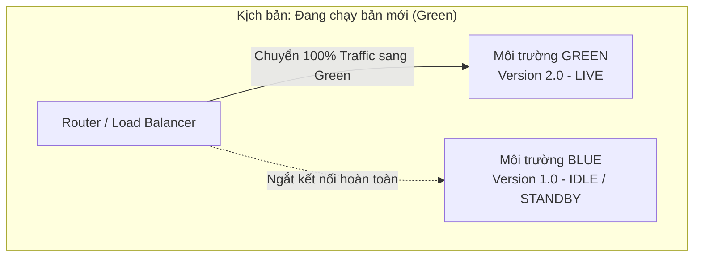
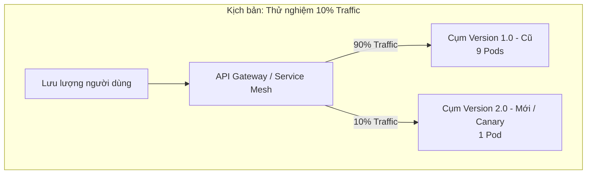

# Blue-green deployment và canary deployment khác nhau thế nào?

## ⚡ Tóm tắt ngắn (30s)
*   **Bản chất**: Đây là hai chiến lược triển khai phần mềm không gián đoạn dịch vụ (**Zero-Downtime Deployment**) phổ biến nhất trong DevOps và Microservices, giúp phát hành phiên bản mới lên Production một cách an toàn và giảm thiểu tối đa rủi ro cho người dùng cuối.
*   **Blue-Green Deployment (Tất cả hoặc không có gì)**:
    *   *Cơ chế*: Duy trì hai môi trường Production hoàn toàn giống hệt nhau chạy song song. Môi trường **Blue** (hiện tại - đang chạy) và **Green** (mới - đang cài đặt bản update). Khi Green đã được kiểm thử OK, chúng ta chuyển hướng **100% lưu lượng mạng (Traffic)** lập tức từ Blue sang Green thông qua bộ định tuyến (Router / Load Balancer).
    *   *Ưu/Nhược*: Rollback (quay lui) cực kỳ nhanh trong 1 giây bằng cách trỏ router quay lại Blue. Tuy nhiên, chi phí hạ tầng bị **gấp đôi (x2 Resource)** vì phải nuôi 2 cụm máy chủ song song.
*   **Canary Deployment (Thử nghiệm chim hoàng yến)**:
    *   *Ý tưởng*: Lấy cảm hứng từ việc thợ mỏ mang chim hoàng yến xuống hầm lò để dò khí độc (nếu chim chết $\r\rightarrow$ có khí độc, thợ mỏ rút lui ngay).
    *   *Cơ chế*: Triển khai phiên bản mới lên một nhóm nhỏ máy chủ (ví dụ: chỉ 1 trong số 20 Pods, nhận **5% - 10% traffic**). 90% người dùng vẫn chạy bản cũ. Chúng ta liên tục giám sát lỗi (Error Rate, Latency) của nhóm 10% này. Nếu ổn định, tăng dần tỷ lệ traffic (25% $\r\rightarrow$ 50% $\r\rightarrow$ 100%). Nếu xảy ra lỗi, lập tức ngắt luồng 10% này $\r\rightarrow$ chỉ tối đa 10% khách hàng bị ảnh hưởng.
    *   *Ưu/Nhược*: Tiết kiệm chi phí hạ tầng tối đa, cô lập lỗi cực kỳ tốt. Nhưng cấu hình định tuyến (Routing) phức tạp hơn rất nhiều.

---

## 🔍 Chi tiết bản chất thực chiến: So sánh mô hình hoạt động

### 1. Mô hình Blue-Green Deployment



### 2. Mô hình Canary Deployment



---

## 💻 Cấu hình thực chiến: Định tuyến Canary bằng Istio Service Mesh

Để chia chính xác tỷ lệ traffic (ví dụ: 90% cho bản cũ `v1` và 10% cho bản mới `v2`) mà không cần tạo thêm máy chủ vật lý, chúng ta cấu hình tài nguyên định tuyến thông minh của **Istio Service Mesh** (`VirtualService` và `DestinationRule`):

#### 1. Khai báo phiên bản của các Pods trong Kubernetes `DestinationRule`:
```yaml
apiVersion: networking.istio.io/v1alpha3
kind: DestinationRule
metadata:
  name: order-service-subsets
  namespace: production
spec:
  host: order-service
  subsets:
    # Định nghĩa Subset v1 ánh xạ với các Pod có nhãn version: v1
    - name: version-v1
      labels:
        version: v1
    # Định nghĩa Subset v2 ánh xạ với các Pod có nhãn version: v2
    - name: version-v2
      labels:
        version: v2
```

#### 2. Cấu hình phân chia chính xác tỷ lệ Traffic bằng `VirtualService`:
```yaml
apiVersion: networking.istio.io/v1alpha3
kind: VirtualService
metadata:
  name: order-service-canary
  namespace: production
spec:
  hosts:
    - order-service
  http:
    - route:
        # Gửi đúng 90% lưu lượng mạng sang phiên bản v1 (Cũ)
        - destination:
            host: order-service
            subset: version-v1
          weight: 90
        # Gửi đúng 10% lưu lượng mạng sang phiên bản v2 (Mới - Canary)
        - destination:
            host: order-service
            subset: version-v2
          weight: 10
```

---

## 📊 Bảng so sánh toàn diện các chiến lược triển khai

| Tiêu chí | Blue-Green Deployment | Canary Deployment | Rolling Update (K8s mặc định) |
| :--- | :--- | :--- | :--- |
| **Chi phí hạ tầng** | **Cực cao** (Gấp đôi tài nguyên 200%). | **Rất thấp** (Gần như 100% tài nguyên gốc). | **Thấp** (Chỉ tốn thêm 1-2 Pods tạm thời). |
| **Tốc độ Rollback** | **Tức thì (< 1s)**. Chỉ cần switch IP ở Load Balancer. | **Nhanh**. Ngắt định tuyến 10% traffic. | **Chậm**. Phải khởi chạy lại từng Pod cũ thế chỗ Pod mới. |
| **Rủi ro người dùng**| **Trung bình**. Nếu lỗi phát sinh sau khi chuyển 100% traffic, toàn bộ khách hàng bị ảnh hưởng. | **Cực thấp**. Chỉ tối đa 5-10% nhóm thử nghiệm chịu ảnh hưởng lỗi. | **Cao**. Lỗi lan dần ra toàn bộ Pods khi quá trình cuộn hoàn tất. |
| **Độ phức tạp Routing**| **Thấp**. Switch nhị phân (0% hoặc 100%). | **Cực kỳ phức tạp**. Đòi hỏi Service Mesh hoặc Smart Gateway. | **Thấp**. Sử dụng thuật toán quay vòng của K8s. |
| **Độ phức tạp DB** | **Cực cao**. Phải xử lý tương thích ngược hoàn hảo. | **Cực cao**. Phải xử lý tương thích ngược hoàn hảo. | **Cực cao**. Phải xử lý tương thích ngược hoàn hảo. |

---

## ⚠️ Common Gotchas & Questions follow-up

### 1. Thảm họa lớn nhất: Tương thích cơ sở dữ liệu (Database Schema Migration)
*   **Vấn đề**: Đây là "tử huyệt" của cả Blue-Green và Canary. Giả sử phiên bản mới (Green/Canary) yêu cầu cấu trúc bảng Database thay đổi (ví dụ: Xóa cột `name` thay bằng 2 cột `first_name` và `last_name`). Khi bạn deploy bản mới kết nối vào database chung, bản mới ghi dữ liệu vào 2 cột mới. Nhưng bản cũ (Blue - vẫn đang chạy song song nhận 90% traffic) khi đọc database sẽ bị ném lỗi ngay lập tức vì không tìm thấy cột `name` nữa $\r\rightarrow$ Sập toàn bộ hệ thống!
*   **Giải pháp (Senior Design)**: Bắt buộc áp dụng chiến lược **Expand and Contract Pattern (Parallel Change)** qua 3 bước:
    1.  **Bước 1 (Expand)**: Thêm 2 cột mới (`first_name`, `last_name`) vào DB nhưng **giữ nguyên cột cũ** (`name`). Viết code v2 ghi vào cả 3 cột. Cả v1 và v2 đều chạy an toàn.
    2.  **Bước 2 (Migrate)**: Chạy một background job (hoặc Kafka consumer) để chuyển đổi dữ liệu lịch sử từ cột `name` sang 2 cột mới. Chuyển hoàn toàn traffic sang v2.
    3.  **Bước 3 (Contract)**: Sau khi v2 đã ổn định 100%, xóa bỏ cột cũ `name` khỏi database an toàn.

### 2. Sự cố "Sticky Session" và người dùng bị nhảy liên tục giữa 2 phiên bản
*   **Vấn đề**: Trong Canary Deployment, nếu Router phân chia 10% ngẫu nhiên theo từng request HTTP. Một người dùng khi bấm F5 trình duyệt: Request 1 rơi vào 90% (bản cũ `v1` hiển thị nút màu Xanh), F5 lần nữa rơi vào 10% (bản mới `v2` hiển thị nút màu Đỏ). Sự thay đổi giao diện và cơ chế xử lý liên tục trong cùng một phiên làm việc gây ra lỗi nghiệp vụ nghiêm trọng và trải nghiệm cực kỳ tệ hại.
*   **Giải pháp**: Cấu hình thuật toán định tuyến Canary dựa trên **định danh người dùng (User Session ID hoặc User ID)**. Bằng cách băm (Hash) ID người dùng (ví dụ: `hash(userId) % 100 < 10` thì đi v2), đảm bảo một khách hàng cụ thể khi đã rơi vào nhóm Canary thì sẽ luôn trải nghiệm bản Canary nhất quán trong suốt thời gian hệ thống triển khai.

### 3. Câu hỏi đào sâu: "Nếu deploy ứng dụng Mobile (iOS/Android) thì làm Canary thế nào?"
*   **Trả lời tinh tế**:
    *   Chúng ta không thể kiểm soát việc tải app về của người dùng từ App Store / Google Play Store theo phần trăm cụ thể được một cách chủ động như web.
    *   **Giải pháp thực chiến**: Bắt buộc phải áp dụng **Feature Flags (Feature Toggles)**. Chúng ta đẩy ứng dụng có sẵn cả hai tính năng (cũ và mới) lên Store. Sau đó sử dụng hệ thống cấu hình từ xa (ví dụ: Firebase Remote Config hoặc LaunchDarkly) để bật mở tính năng mới cho 10% người dùng đăng nhập đầu tiên dựa trên thuật toán Hash User ID ở phía Server.
