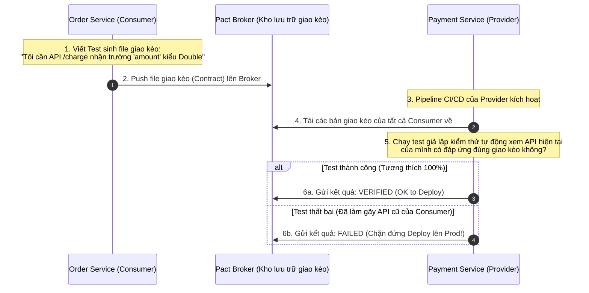

# Backward compatibility giữa các service

## ⚡ Tóm tắt ngắn (30s)
*   **Bản chất**: **Backward Compatibility** (Tương thích ngược) trong Microservices là khả năng của một dịch vụ phía dưới (Downstream Service) khi nâng cấp lên phiên bản mới vẫn có thể phục vụ chính xác các yêu cầu được gửi từ các dịch vụ phía trên (Upstream Services) đang chạy phiên bản cũ. Điều này giúp loại bỏ hoàn toàn việc phải triển khai đồng loạt toàn bộ hệ thống sập nguồn (**Big Bang Deployments**) và giữ vững tính độc lập giải phóng (Loose Coupling) của kiến trúc Microservices.
*   **Định luật Postel (Robustness Principle)**: *"Be conservative in what you do, be liberal in what you accept from others"* (Khắt khe khi gửi đi, cởi mở khi nhận về). 
    *   *Phía gửi*: Chỉ gửi đúng định dạng chuẩn.
    *   *Phía nhận*: Chấp nhận cả những dữ liệu thừa, bỏ qua các trường không hiểu, và luôn chuẩn bị sẵn giá trị mặc định (Default Values) cho các trường bị thiếu.
*   **Quy tắc vàng để tránh phá vỡ API (No Breaking Changes)**:
    1.  **Tuyệt đối KHÔNG** xóa bỏ hoặc đổi tên các trường (Fields) cũ trong JSON Request/Response.
    2.  **Tuyệt đối KHÔNG** thay đổi kiểu dữ liệu của trường cũ (ví dụ: đổi `int` sang `String`).
    3.  **Tuyệt đối KHÔNG** thêm trường bắt buộc mới (`required: true`) trong API Request. Trường mới thêm vào bắt buộc phải là tùy chọn (`optional`) và có giá trị mặc định.
*   **Quyết định Senior**: Sử dụng công cụ **Consumer-Driven Contract Testing (như Pact)** trong pipeline CI/CD để tự động hóa việc phát hiện sớm 100% các lỗi phá vỡ tương thích ngược trước khi tiến hành deploy code mới lên Production.

---

## 🔍 Chi tiết bản chất thực chiến: Quy trình kiểm tra bằng Contract Testing

Để đảm bảo service A nâng cấp không làm gãy service B, chúng ta sử dụng phương pháp **Consumer-Driven Contract Testing (Pact)**. Bên tiêu thụ (Consumer) viết sẵn bản giao kèo (Contract) gửi sang cho bên cung cấp (Provider) ký xác nhận:



---

## 💻 Code thực chiến: BAD vs GOOD

### ❌ BAD: Sửa đổi trực tiếp kiểu dữ liệu và xóa trường gây sập toàn bộ Client gọi tới
Khi thay đổi kiểu dữ liệu trường `status` từ String sang Enum, thư viện ObjectMapper (Jackson) của client sẽ ném ngay lỗi `JsonMappingException` và treo cứng giao dịch.

```java
// PHIÊN BẢN CŨ v1
public class PaymentResponseV1 {
    private String transactionId;
    private String status; // Trả về "SUCCESS", "FAILED"
}

// PHIÊN BẢN MỚI v2 (NGUY HIỂM: Gây sập hệ thống!)
public class PaymentResponseV2 {
    private String transactionId;
    
    // HẬU QUẢ 1: Đổi sang Enum mới. Client sử dụng thư viện v1 không giải mã được chữ và sẽ ném Exception!
    private PaymentStatus status; 
    
    // HẬU QUẢ 2: Tự ý xóa bỏ trường cũ này khiến Client đọc bị lỗi NullPointerException!
    // private String paymentTime; 
}
```

---

### ✔️ GOOD: Áp dụng Postel's Law, bảo tồn trường cũ và cấu hình Jackson bỏ qua thuộc tính lạ

Chúng ta thực hiện nâng cấp an toàn bằng cách giữ lại trường cũ (đánh dấu `@Deprecated`), bổ sung trường mới song song, và luôn cấu hình Jackson bỏ qua các trường không xác định ở phía nhận.

#### 1. Phía nhận (Client/Consumer): Cấu hình Jackson thông minh
Mặc định, Jackson sẽ ném lỗi nếu JSON nhận về có chứa trường lạ mà class Java của client không khai báo. Chúng ta bắt buộc phải tắt tính năng nguy hiểm này:

```java
@Configuration
public class JacksonConfig {

    @Bean
    public ObjectMapper objectMapper() {
        ObjectMapper mapper = new ObjectMapper();
        // BẮT BUỘC: Bỏ qua các trường lạ nhận về từ JSON mà Java Class không khai báo.
        // Giúp Client cực kỳ bền bỉ khi Server thêm trường mới lúc nâng cấp!
        mapper.configure(DeserializationFeature.FAIL_ON_UNKNOWN_PROPERTIES, false);
        return mapper;
    }
}
```

#### 2. Phía gửi (Server/Provider): Nâng cấp tương thích ngược
Chúng ta bổ sung trường mới `paymentStatus` dạng Enum, nhưng vẫn giữ lại trường cũ `status` dạng String để phục vụ các client cũ chưa kịp nâng cấp code.

```java
public class PaymentResponseGood {
    private String transactionId;

    // Giữ nguyên trường cũ, đánh dấu Deprecated để khuyến cáo client nâng cấp dần dần
    @Deprecated
    private String status; 

    // Bổ sung trường mới song song phục vụ phiên bản mới
    private PaymentStatus paymentStatus; 

    // Hàm Getter thông minh: Đảm bảo cả 2 trường đều có giá trị tương đồng
    public String getStatus() {
        return this.status != null ? this.status : (this.paymentStatus != null ? this.paymentStatus.name() : null);
    }
    
    public PaymentStatus getPaymentStatus() {
        return this.paymentStatus;
    }
}
```

---

## 📊 Bảng so sánh các kỹ thuật Versioning API

Khi bắt buộc phải thực hiện thay đổi phá vỡ tương thích (Breaking Change), chúng ta bắt buộc phải nâng phiên bản API. Dưới đây là 3 kỹ thuật phổ biến:

| Kỹ thuật Versioning | Định dạng ví dụ | Ưu điểm | Nhược điểm |
| :--- | :--- | :--- | :--- |
| **URI Versioning** | `/api/v1/payments`<br/>`/api/v2/payments` | **Rất trực quan**, dễ cấu hình định tuyến trên API Gateway, dễ kiểm tra log. | Làm bẩn cấu trúc URI, client phải thay đổi URL gọi mạng. |
| **Custom Header Versioning** | `X-API-Version: 2` | Giữ nguyên URL đẹp đẽ, sạch sẽ. | Khó debug trên trình duyệt trực tiếp, khó cấu hình định tuyến ở tầng CDN/WAF. |
| **Accept Header (Media Type)** | `Accept: application/vnd.myapi.v2+json` | Chuẩn RESTful thuần khiết nhất (HATEOAS). | Cực kỳ phức tạp khi cấu hình, khó test bằng các công cụ thông thường. |

---

## ⚠️ Common Gotchas & Questions follow-up

### 1. Thảm họa Jackson Parsing lỗi khi dùng Schema Registry (Avro/Protobuf) trong Event-Driven
*   **Vấn đề**: Trong kiến trúc hướng sự kiện (Event-Driven) dùng Kafka, khi gửi tin nhắn dùng định dạng Avro/Protobuf. Nếu service gửi (Producer) bổ sung một trường mới vào Schema mà không đăng ký cấu hình tương thích ngược (Backward Compatibility) trên **Schema Registry**, service nhận (Consumer) sử dụng Schema cũ sẽ bị lỗi parse tin nhắn chớp nhoáng và làm nghẽn hoàn toàn luồng xử lý của Consumer (Poison Message).
*   **Giải pháp**: Thiết lập cấu hình khả năng tương thích ngược của **Schema Registry** ở chế độ **`BACKWARD`** hoặc **`FULL`**. Schema Registry sẽ từ chối ngay lập tức nếu Producer đẩy lên một phiên bản Schema mới phá vỡ khả năng tương thích ngược của Consumer.

### 2. Sự cố đổi kiểu dữ liệu của khóa chính (Primary Key Migration)
*   **Vấn đề**: Hệ thống chuyển đổi mã định danh của bảng từ kiểu số tự tăng `Long` sang chuỗi bảo mật `UUID`. Đây là một thay đổi phá vỡ cực kỳ nặng nề, vì kiểu dữ liệu thay đổi hoàn toàn khiến mọi truy vấn so khớp cũ đều bị báo lỗi biên dịch/runtime ở tất cả các service liên quan.
*   **Giải pháp**: 
    1.  Bổ sung cột mới `uuid` song song với cột cũ `id` (Long) trong cơ sở dữ liệu.
    2.  Nâng cấp API: API mới nhận cả `id` và `uuid`.
    3.  Duy trì hoạt động song song cả 2 API trong vòng vài tháng, phát cảnh báo cảnh báo log deprecate cho các nhóm client để họ dịch chuyển dần sang gọi bằng `uuid`.
    4.  Khi 100% client đã chuyển sang dùng `uuid`, tiến hành xóa bỏ hoàn toàn cột `id` cũ.
