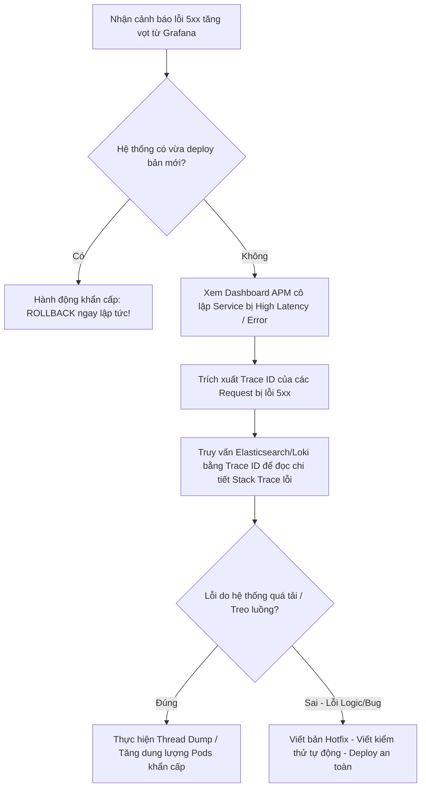

# Làm sao debug production issue trong hệ microservices?

## ⚡ Tóm tắt ngắn (30s)
*   **Bản chất**: Debug lỗi trên Production (Production Troubleshooting) trong kiến trúc Microservices là quy trình phát hiện, cô lập và tìm ra **nguyên nhân gốc rễ (Root Cause Analysis - RCA)** của sự cố trong thời gian ngắn nhất mà không được phép làm gián đoạn dịch vụ. Khác với Monolith, lỗi trong Microservices thường là lỗi phân tán, chập chờn và có tính lây lan (Cascading).
*   **Nguyên tắc vàng của Senior - "Hồi sinh trước, Tìm lỗi sau"**: Khi Production gặp sự cố nghiêm trọng, ưu tiên hàng đầu là **khắc phục nhanh (Mitigation)** để giảm thiểu thiệt hại (ví dụ: Rollback phiên bản vừa deploy, Scale up tăng dung lượng Pods, Kích hoạt Circuit Breaker, chuyển hướng traffic), TUYỆT ĐỐI không cắm đầu vào dò tìm bug trong khi khách hàng đang không thể sử dụng dịch vụ.
*   **Quy trình 4 bước chuẩn SRE**:
    1.  **Detect (Phát hiện)**: Qua hệ thống cảnh báo tự động (Alerting) trên Grafana/Prometheus dựa trên bộ chỉ số vàng **RED** (Rate, Errors, Duration).
    2.  **Isolate (Cô lập)**: Xác định dịch vụ nào là nguồn gốc gây lỗi (Downstream nghẽn hay Upstream quá tải).
    3.  **Trace (Truy vết)**: Sử dụng **Trace ID** tìm trên hệ thống Log tập trung (ELK Stack/Loki) kết hợp sơ đồ đồ thị cuộc gọi (Jaeger/Zipkin).
    4.  **Diagnose (Chẩn đoán)**: Mổ xẻ chi tiết lỗi JVM bằng **Thread Dump**, **Heap Dump**, hoặc nâng tạm thời Log level lên **DEBUG** lúc runtime bằng **Spring Boot Actuator**.

---

## 🔍 Chi tiết bản chất thực chiến: Quy trình 4 bước Xử lý sự cố chuyên nghiệp

Khi xảy ra sự cố (ví dụ: Tỷ lệ lỗi 5xx tăng vọt trên API Gateway), một kỹ sư Senior sẽ bình tĩnh thực hiện theo quy trình phân lập có cấu trúc sau:



### Các công cụ mổ xẻ lỗi sâu cấp JVM (Deep Diagnostics):
*   **Thread Dump**: Cho biết chính xác tất cả các thread của JVM đang làm gì tại một thời điểm (đang chờ khóa DB, đang xử lý CPU, hay bị Deadlock). Cực kỳ hữu dụng khi hệ thống bị **treo đơ cứng**.
*   **Heap Dump**: Chụp lại toàn bộ bộ nhớ RAM của JVM để phân tích xem đối tượng nào đang chiếm dụng tài nguyên lớn nhất. Công cụ số 1 để giải quyết vấn đề **rò rỉ bộ nhớ (Memory Leak / OutOfMemoryError)**.
*   **Dynamic Log Level**: Tạm thời thay đổi log level của một package Java nhạy cảm từ `INFO` lên `DEBUG` mà không cần restart app, giúp lấy thêm thông tin vết lỗi rồi hạ xuống `INFO` để tránh ghi ngập đĩa cứng.

---

## 💻 Kỹ thuật thực chiến: Thay đổi Log Level nóng bằng Spring Boot Actuator

Khi cần debug một lỗi logic khó trích xuất vết trên Production, thay vì phải sửa code và deploy lại, chúng ta sử dụng công cụ **Spring Boot Actuator** để đổi Log level sang `DEBUG` tức thời lúc runtime qua API RESTful.

### Bước 1: Kích hoạt endpoint Loggers trong cấu hình `application.yml`
```yaml
management:
  endpoints:
    web:
      exposure:
        # BẮT BUỘC: Cho phép truy cập endpoint quản lý logger
        include: loggers,health,info
```

### Bước 2: Xem trạng thái Log level hiện tại của một Package Java
Gửi một request HTTP GET lên endpoint Actuator:
```bash
curl -X GET http://order-service-prod:8080/actuator/loggers/com.example.orderservice.repository
```
*Kết quả phản hồi của ứng dụng:*
```json
{
  "configuredLevel": "INFO",
  "effectiveLevel": "INFO"
}
```

### Bước 3: Thay đổi nóng Log level sang DEBUG cục bộ trong 10 phút để lấy vết lỗi
Gửi một request HTTP POST để thay đổi cấu hình trực tiếp trong bộ nhớ RAM của JVM mà không cần khởi động lại:
```bash
curl -X POST http://order-service-prod:8080/actuator/loggers/com.example.orderservice.repository \
     -H "Content-Type: application/json" \
     -d '{"configuredLevel": "DEBUG"}'
```
*Hệ thống lập tức in toàn bộ SQL queries chi tiết và dữ liệu tham số ra Log file. Sau khi lấy được dữ liệu lỗi, lập tức gửi lại request POST với giá trị `INFO` để bảo vệ tài nguyên ghi đĩa cứng của máy chủ.*

---

## 📊 Bảng so sánh các phương pháp chẩn đoán sự cố JVM

| Phương pháp | Sử dụng tốt nhất khi nào? | Lệnh thực thi thực chiến | Rủi ro tác động hệ thống |
| :--- | :--- | :--- | :--- |
| **Thread Dump** | Hệ thống bị treo, CPU tăng vọt 100%, nghi ngờ bị khóa chết luồng (Deadlock). | `jcmd <pid> Thread.print`<br/>hoặc `jstack <pid>` | **Cực thấp**. Gần như không ảnh hưởng hiệu năng ứng dụng (< 50ms). |
| **Heap Dump** | Ứng dụng bị lỗi `OutOfMemoryError`, RAM phình to liên tục không giảm sau GC. | `jcmd <pid> GC.heap_dump /tmp/heap.hprof` | **Cực cao**. JVM sẽ bị đóng băng hoàn toàn (**Stop-The-World**) trong vài giây đến vài phút để ghi file dump. Có thể gây sập Pod do timeout! |
| **Live Profiling** | Điều tra nguyên nhân ngốn CPU hoặc tối ưu hiệu năng tổng thể lúc ứng dụng chạy bình thường. | Dùng công cụ **Async-Profiler**:<br/>`./asprof -d 30 -f /tmp/flame.html <pid>` | **Thấp**. Async-profiler sử dụng APM của nhân Linux (perf) nên overhead cực nhẹ (< 2% CPU). |

---

## ⚠️ Common Gotchas & Questions follow-up

### 1. Thảm họa "Hiệu ứng quan sát" (Observer Effect) làm sập Pod khi thực hiện Heap Dump
*   **Vấn đề**: Khi một Pod Java đang bị cạn kiệt RAM và sắp chết, kỹ sư cuống cuồng chạy lệnh `jmap -dump` hoặc `jcmd GC.heap_dump` để lấy dữ liệu. Quá trình tạo file dump yêu cầu JVM cấp phát thêm một lượng RAM tạm thời tương đối lớn và thực thi Stop-The-World. Hệ điều hành Linux ngay lập tức phát hiện Pod vượt quá giới hạn tài nguyên cấu hình (`limits.memory` trong Kubernetes) $\rightarrow$ OS kích hoạt bộ giết tiến trình **OOM Killer** đập chết tươi container Java ngay lập tức trước khi file dump kịp ghi xong!
*   **Giải pháp (Senior Design)**:
    *   Cấu hình tham số JVM tự động tạo Heap Dump khi xảy ra lỗi sập nguồn thực tế: **`-XX:+HeapDumpOnOutOfMemoryError -XX:HeapDumpPath=/tmp/dumps/`**.
    *   Tận dụng cơ chế **Kubernetes Ephemeral Containers** hoặc chạy một Pod phụ kết nối chung volume lưu trữ để copy file dump ra phân tích ngoài môi trường.

### 2. Sự cố rò rỉ dữ liệu khách hàng nhạy cảm (PII Leakage) do Log DEBUG quá đà
*   **Vấn đề**: Kỹ sư bật cấu hình Log Level `DEBUG` để tìm lỗi. Tuy nhiên, logger in ra toàn bộ nội dung JSON Request bao gồm Số thẻ tín dụng, Số điện thoại, Mật khẩu của khách hàng dưới dạng Plain Text. Log này được đẩy lên Elasticsearch và lưu trữ lâu dài $\rightarrow$ vi phạm nghiêm trọng luật bảo mật **PCI-DSS** và **GDPR**, có nguy cơ bị phạt hàng triệu USD.
*   **Giải pháp**:
    *   Luôn cấu hình cơ chế lọc log tự động (**Log Masking**): Viết thư viện Logback Layout Custom để quét regex và chuyển các trường nhạy cảm như `password`, `cardNumber` thành chuỗi `********` trước khi ghi ra file.
    *   Hạn chế tối đa việc in toàn bộ Request/Response Body ở mức `INFO` log.

### 3. Câu hỏi từ Interviewer: "Hệ thống bị lag p99 tăng cao đột biến nhưng Error Rate vẫn bằng 0%, không có Exception nào ném ra trong Log. Bạn sẽ bắt đầu điều tra từ đâu?"
*   **Cách trả lời ghi điểm**:
    1.  **Garbage Collection Pause**: Kiểm tra Dashboard JVM Metrics xem có xảy ra hiện tượng **Long GC Pause** (Stop-The-World kéo dài) không. Khi GC dọn dẹp bộ nhớ Metaspace hoặc Tenured Gen, toàn bộ ứng dụng bị đóng băng khiến request bị trễ nhưng không ném lỗi.
    2.  **Connection Pool Exhaustion**: Kiểm tra số lượng kết nối đang chờ của **HikariCP Connection Pool**. Nếu tất cả kết nối DB đều đang bận, các thread tiếp theo phải xếp hàng chờ lấy kết nối cho tới khi sát nút timeout $\rightarrow$ độ trễ tăng vọt nhưng kết quả cuối vẫn thành công (Error = 0).
    3.  **Thread Blocking on I/O**: Kiểm tra xem các thread có đang bị nghẽn ở các tác vụ đồng bộ gọi ngoài (như chờ DNS resolution chậm, ghi file log lên đĩa cứng IOPS thấp).
