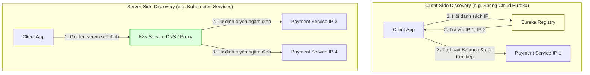

# Service Discovery là gì?

## ⚡ Tóm tắt ngắn (30s)
*   **Bản chất**: Service Discovery (Cơ chế phát hiện dịch vụ) là bản đồ động tự động ghi nhận, cập nhật và tra cứu địa chỉ IP, cổng (port) của tất cả các thực thể (instances) dịch vụ trong hệ thống Microservices. Trong môi trường Cloud hoặc Kubernetes, các container liên tục được tạo mới, sập đi, hoặc scale-up/scale-down khiến địa chỉ IP thay đổi liên tục; Service Discovery ra đời để giải quyết bài toán định tuyến động này.
*   **Mô hình hoạt động thực chiến**:
    1.  **Service Registry (Bản đăng ký trung tâm)**: Nơi lưu trữ tập trung dữ liệu địa chỉ (IP, Port) của các dịch vụ. Ví dụ: Netflix Eureka, HashiCorp Consul, ZooKeeper, etcd.
    2.  **Client-Side Discovery**: Client tự hỏi Registry: *"IP của payment-service hiện tại là gì?"*, Registry trả về danh sách IP. Client tự chạy thuật toán Load Balancing (như Round-Robin) dưới RAM để tự chọn 1 IP và gọi trực tiếp. (Ví dụ: Eureka Client + Spring Cloud LoadBalancer).
    3.  **Server-Side Discovery**: Client chỉ gọi đến một địa chỉ cố định (Proxy/Load Balancer). Load Balancer này tự truy vấn Registry, chọn IP khả dụng và điều hướng cuộc gọi thay cho Client. (Ví dụ: Kubernetes Service + Kube-proxy, AWS ALB).
*   **Quyết định Senior**: Nếu hệ thống chạy trên **Kubernetes**, hãy tận dụng cơ chế **Server-Side Discovery có sẵn của K8s (CoreDNS + Kube-proxy)**. Việc này giúp code Java "sạch" hơn, không bị phình to (bloated) bởi các thư viện Spring Cloud Eureka cồng kềnh, và hỗ trợ đa ngôn ngữ hoàn hảo.

---

## 🔍 Chi tiết bản chất thực chiến

Trong kiến trúc Microservices, việc gán cứng (hardcode) IP của các service vào file cấu hình là một lỗi nghiêm trọng. Khi chịu tải lớn, hệ thống tự động scale thêm instance mới, hoặc khi một máy chủ vật lý gặp sự cố, container sẽ được tái khởi động trên một máy khác với IP hoàn toàn mới. 

### Sơ đồ so sánh hai cơ chế Discovery phổ biến



### Cơ chế kiểm tra sức khỏe (Health Check & Heartbeat)
Để tránh gửi traffic vào một service đã sập, Service Registry liên tục yêu cầu các service gửi tín hiệu duy trì sự sống (Heartbeat - ví dụ mỗi 30 giây). Nếu quá thời gian quy định (Lease expiration) không nhận được heartbeat, Registry tự động gạch tên instance đó ra khỏi danh sách định tuyến khả dụng.

---

## 💻 Code thực chiến: BAD vs GOOD

### ❌ BAD: Gán cứng danh sách IP tĩnh vào cấu hình hệ thống (Static Hardcoding)
Lập trình viên gán cứng các địa chỉ IP của dịch vụ thanh toán vào cấu hình. Thiết kế này lập tức làm sập hệ thống khi có container bị restart trên production, đồng thời ngăn cản hoàn toàn khả năng tự động co giãn (Auto-scaling).

```yaml
# application.yml
payment-service:
  # Anti-pattern: Gán cứng IP! Chỉ cần container bị K8s di tản sang Node khác, IP này sẽ chết!
  urls:
    - http://192.168.1.50:8081
    - http://192.168.1.51:8081
```
*Code gọi thiếu linh hoạt:*
```java
@Service
public class OrderServiceBad {
    @Value("${payment-service.urls}")
    private List<String> paymentUrls;
    private int index = 0;

    public PaymentResponse callPayment(PaymentRequest request) {
        // Tự viết thuật toán load balance ngây thơ, dễ sập nếu 1 IP chết
        String targetUrl = paymentUrls.get(index++ % paymentUrls.size());
        RestTemplate restTemplate = new RestTemplate();
        return restTemplate.postForObject(targetUrl + "/api/v1/payments", request, PaymentResponse.class);
    }
}
```

---

###  GOOD 1: Sử dụng Client-Side Discovery năng động (Spring Cloud LoadBalancer)
Sử dụng annotation `@LoadBalanced` kết hợp với Eureka Client. IP không bao giờ được cấu hình cứng; ứng dụng tự động phân giải tên dịch vụ logical (`payment-service`) thành IP thực tế từ Registry của Eureka.

```yaml
# application.yml
spring:
  application:
    name: order-service
eureka:
  client:
    service-url:
      defaultZone: http://eureka-server:8761/eureka/ # Trỏ tới Registry trung tâm
```

```java
@Configuration
public class RestClientConfig {
    @Bean
    @LoadBalanced // Kích hoạt Spring Cloud LoadBalancer tự động tra cứu Registry ngầm định
    public WebClient.Builder webClientBuilder() {
        return WebClient.builder();
    }
}

@Service
public class OrderServiceGoodClientSide {
    private final WebClient.Builder webClientBuilder;

    public OrderServiceGoodClientSide(WebClient.Builder webClientBuilder) {
        this.webClientBuilder = webClientBuilder;
    }

    public Mono<PaymentResponse> callPayment(PaymentRequest request) {
        return webClientBuilder.build()
            .post()
            // Gọi bằng tên dịch vụ logical thay vì IP tĩnh!
            .uri("http://payment-service/api/v1/payments") 
            .bodyValue(request)
            .retrieve()
            .bodyToMono(PaymentResponse.class);
    }
}
```

---

###  GOOD 2: Sử dụng Kubernetes Server-Side Discovery (Kiến trúc hiện đại)
Trong môi trường Kubernetes, Service Discovery đã được trừu tượng hóa hoàn toàn xuống tầng hạ tầng cơ sở. Lập trình viên không cần cài đặt Eureka hay Ribbon trong code. Chỉ cần gọi DNS cố định do Kubernetes quản lý, Kube-proxy sẽ tự xử lý định tuyến.

```java
@Service
public class OrderServiceGoodK8s {
    private final WebClient webClient;

    public OrderServiceGoodK8s(WebClient.Builder webClientBuilder) {
        // Trỏ trực tiếp tới DNS name của K8s Service: http://<service-name>.<namespace>.svc.cluster.local
        this.webClient = webClientBuilder
            .baseUrl("http://payment-service-k8s-svc") 
            .build();
    }

    public Mono<PaymentResponse> callPayment(PaymentRequest request) {
        return webClient.post()
            .uri("/api/v1/payments")
            .bodyValue(request)
            .retrieve()
            .bodyToMono(PaymentResponse.class);
    }
}
```

---

## 📊 Bảng so sánh các giải pháp Service Discovery

| Tiêu chí so sánh | Cấu hình IP tĩnh (Static) | Client-Side (Eureka / Consul) | Server-Side (K8s Service / DNS) |
| :--- | :--- | :--- | :--- |
| **Độ linh hoạt** | **Rất kém**. Phải sửa cấu hình & deploy lại. | **Tuyệt vời**. Tự động phát hiện tức thì. | **Tuyệt vời**. Tích hợp sẵn dưới tầng hạ tầng. |
| **Độ phức tạp ứng dụng** | Rất thấp. | **Cao**. Phải thêm thư viện Spring Cloud, cấu hình Bean. | **Rất thấp**. Code chỉ cần gửi HTTP thông thường. |
| **Hỗ trợ đa ngôn ngữ** | Có. | Kém (chủ yếu tối ưu tốt cho Java/Spring stack). | **Hoàn hảo**. Bất kỳ ngôn ngữ nào gọi được HTTP/DNS đều chạy được. |
| **Độ trễ khi IP sập** | Ngay lập tức chết. | **Có độ trễ (10-30s)** do dữ liệu cache trên Client chưa cập nhật kịp. | **Có độ trễ nhỏ (1-5s)** để K8s Endpoint cập nhật liveness probe. |
| **Nút thắt cổ chai mạng**| Không. | Không (Client gọi trực tiếp IP đích). | **Có thể** (nếu Proxy Gateway vật lý bị quá tải cấu hình). |

---

## ⚠️ Common Gotchas & Questions follow-up

### 1. Cạm bẫy dữ liệu Registry bị lỗi thời (Stale Registry Data)
*   **Vấn đề thực tế**: Một instance của `payment-service` đột ngột bị sập (Out of Memory). Registry phát hiện ra sau 30 giây (do chu kỳ Heartbeat). Trong 30 giây "mất cảnh giác" này, Eureka Client vẫn giữ danh sách IP cũ trong bộ nhớ cache. Kết quả: Client vẫn tiếp tục gửi request vào IP đã chết đó, gây ra hàng loạt lỗi `504 Gateway Timeout` cho khách hàng.
*   **Giải pháp**:
    1.  Tuning giảm thời gian Heartbeat và Expiration thời gian đăng ký của Registry (tuy nhiên việc này làm tăng CPU tải của Registry).
    2.  **Quan trọng nhất**: Bắt buộc kết hợp **Retry** và **Circuit Breaker** (như Resilience4j) ở phía Client. Khi Client gọi trúng IP chết và ném ra `ConnectException`, Circuit Breaker sẽ đánh dấu IP đó là lỗi và chủ động thử lại (Retry) trên IP khả dụng khác ngay lập tức.

### 2. Sự nghẽn mạng từ Heartbeat của Microservices khổng lồ
*   **Vấn đề**: Khi hệ thống tăng quy mô lên hàng ngàn instances. Lượng tin nhắn Heartbeat gửi liên tục từ hàng ngàn container về một cụm Eureka Server duy nhất có thể gây ra hiện tượng nghẽn card mạng (Network storm) và làm sập chính Eureka Server.
*   **Giải pháp**: Sử dụng cơ chế Gossip Protocol (như Consul) để tự động lan truyền trạng thái sức khỏe giữa các node không tập trung, hoặc sử dụng cơ chế hạ tầng tối ưu của Kubernetes Service.

### 3. Câu hỏi đào sâu từ interviewer
*   **Q: Trong Kubernetes, tại sao chúng ta hiếm khi cần đến một Eureka Server riêng lẻ? K8s đã giải quyết Service Discovery như thế nào?**
    *   *Trả lời*: Kubernetes đã biến Service Discovery thành một dịch vụ hạ tầng mặc định (Out-of-the-box Infrastructure Service) vô hình nhờ sự kết hợp của hai thành phần: **CoreDNS** và **Kube-proxy**.
        1.  **Ghi nhận thông tin (Registration)**: Khi ta deploy một Pod và khai báo một thực thể `Service` trong K8s. Bộ điều khiển của K8s (Control Plane) tự động tạo ra một tài nguyên `Endpoints`, liên tục theo dõi IP của các Pod thỏa mãn bộ lọc `selector` và cập nhật danh sách IP này vào etcd (database nội bộ của K8s).
        2.  **Phát hiện thông tin (Discovery)**: K8s chạy dịch vụ **CoreDNS** bên trong cluster. Khi Service mang tên `payment-service` được tạo, CoreDNS tự động ánh xạ tên miền `payment-service` thành một IP ảo cố định gọi là **ClusterIP**.
        3.  **Định tuyến & Load Balancing**: Khi ứng dụng Java của chúng ta gửi request tới `http://payment-service`, DNS phân giải ra ClusterIP. Luồng tin mạng gửi tới ClusterIP sẽ được đánh chặn bởi **Kube-proxy** chạy trên chính Node đó (thông qua IPVS hoặc iptables). Kube-proxy sẽ tự động chọn ngẫu nhiên một IP thật sự của Pod đích đang sống từ danh sách `Endpoints` và chuyển hướng (NAT) gói tin mạng đến đó.
        4.  *Kết luận*: Ứng dụng Java hoàn toàn không cần biết IP của Pod khác, không cần thư viện client-registry. K8s đã làm thay đổi hoàn toàn cuộc chơi Service Discovery một cách trong suốt (Transparent Service Discovery).
