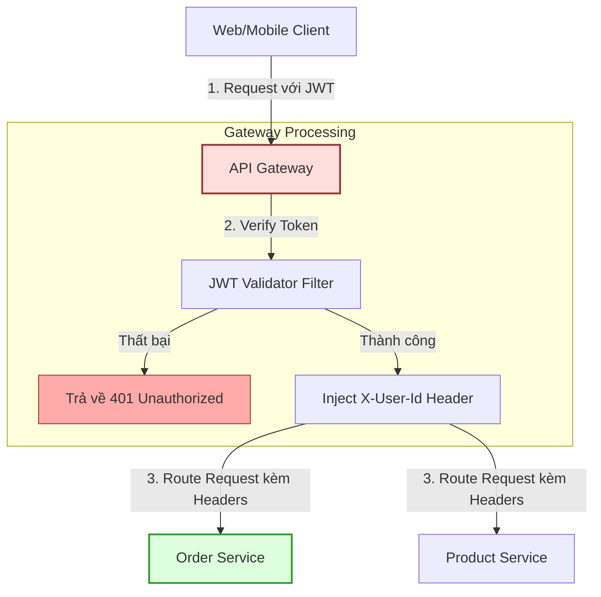

# API Gateway có vai trò gì?

## ⚡ Tóm tắt ngắn (30s)
*   **Bản chất**: API Gateway đóng vai trò là một cổng đảo ngược (Reverse Proxy) - điểm đầu vào duy nhất (Single Entry Point) cho mọi Client bên ngoài muốn kết nối vào hệ thống Microservices nội bộ. Thay vì Client phải tự gọi trực tiếp đến hàng chục IP của các service khác nhau, Client chỉ cần gọi qua một địa chỉ Gateway duy nhất.
*   **Các vai trò thực chiến tối quan trọng**:
    1.  **Định tuyến động (Routing)**: Ánh xạ URL yêu cầu từ bên ngoài tới đúng địa chỉ IP của service nội bộ (ví dụ: `/api/v1/orders` -> `order-service`).
    2.  **Xác thực tập trung (Centralized Auth)**: Kiểm tra và xác thực chữ ký JWT Token ngay tại cửa ngõ. Những request giả mạo hoặc hết hạn sẽ bị chặn đứng lập tức tại Gateway, bảo vệ tuyệt đối và giảm tải xử lý mã hóa cho các service nội bộ bên trong.
    3.  **Kiểm soát tần suất gọi (Rate Limiting)**: Giới hạn số lượng request từ mỗi IP hoặc User ID để ngăn chặn tấn công spam hoặc DDoS kéo sập hệ thống.
    4.  **Bảo mật & Trừu tượng hóa**: Che giấu hoàn toàn địa chỉ IP thật của các service nội bộ bên trong lớp mạng riêng (Private Subnet), chỉ phơi bày duy nhất IP của Gateway ra Internet.
    5.  **SSL Termination & CORS**: Xử lý giải mã giao thức HTTPS sang HTTP để giảm tải tính toán mã hóa cho các service nội bộ. Cấu hình CORS tập trung tại một nơi duy nhất.
*   **Quyết định Senior**: Hãy giữ cho API Gateway chạy thật nhanh và "ngốc nghếch" (Keep Gateway Dumb, Services Smart). Tuyệt đối không viết logic nghiệp vụ (Business logic) hay thực hiện truy vấn cơ sở dữ liệu nặng nề tại Gateway. Sử dụng **Kong (Nginx-based)** hoặc **APISIX** cho hệ thống chịu tải cao; chỉ dùng **Spring Cloud Gateway** khi team quen thuộc Java và cần tùy biến sâu bộ lọc (Filter) bằng code.

---

## 🔍 Chi tiết bản chất thực chiến

### Luồng xử lý Xác thực & Định tuyến tập trung tại Gateway

Khi có yêu cầu từ Client gửi đến, API Gateway đóng vai trò làm lá chắn đầu tiên để xác thực danh tính trước khi phân bổ request tới các service bên trong:



Bằng cách thiết kế luồng như trên, các service nội bộ (như `Order Service` hay `Product Service`) sẽ hoàn toàn sạch bóng các thư viện bảo mật nặng nề (như Spring Security). Chúng chỉ cần tin tưởng tuyệt đối vào Gateway và đọc thông tin người dùng trực tiếp từ HTTP Headers do Gateway gửi xuống.

---

## 💻 Code thực chiến: BAD vs GOOD

### ❌ BAD: Trùng lặp logic xác thực JWT ở tất cả các Microservices
Mỗi dịch vụ nội bộ đều phải tự cài đặt cấu hình Spring Security, nạp khóa chữ ký công khai (Public Key) và tự giải mã kiểm tra token. Thiết kế này vừa lãng phí tài nguyên CPU của hệ thống (do phải giải mã JWT nhiều lần), vừa biến việc bảo trì trở thành cơn ác mộng khi cần thay đổi khóa ký (Token Rotation).

```java
// ĐÂY LÀ CODE BỊ TRÙNG LẶP TRONG CẢ ORDER-SERVICE VÀ INVENTORY-SERVICE
@Component
public class JwtTokenVerifierBad {
    private final String SECRET_KEY = "super-secret-signature-key-that-must-be-copied-everywhere";

    public Claims verifyAndExtractClaims(String token) {
        try {
            // Anti-pattern: Mỗi microservice tự thực hiện giải mã mật mã học nặng nề
            return Jwts.parserBuilder()
                .setSigningKey(Keys.hmacShaKeyFor(SECRET_KEY.getBytes()))
                .build()
                .parseClaimsJws(token)
                .getBody();
        } catch (JwtException e) {
            throw new UnauthorizedException("Token không hợp lệ!");
        }
    }
}
```

---

###  GOOD: Xác thực tập trung tại API Gateway và truyền Context dạng Clear-Text
API Gateway chịu trách nhiệm giải mã token duy nhất một lần. Sau đó, nó tự động tiêm (inject) các thông tin cơ bản của User (như User ID, Roles) vào HTTP Headers dưới dạng text thông thường trước khi chuyển tiếp (forward) request xuống các service nội bộ.

**1. Bộ lọc toàn cục (Global Filter) xử lý Token tại Spring Cloud Gateway:**

```java
@Component
public class CentralizedAuthFilter implements GlobalFilter, Ordered {

    @Autowired
    private JwtUtility jwtUtility; // Chỉ Gateway cần giữ khóa giải mã Token!

    @Override
    public Mono<Void> filter(ServerWebExchange exchange, GatewayFilterChain chain) {
        ServerHttpRequest request = exchange.getRequest();
        
        // 1. Kiểm tra sự tồn tại của Authorization Header
        if (!request.getHeaders().containsKey(HttpHeaders.AUTHORIZATION)) {
            return unauthorized(exchange);
        }

        String authHeader = request.getHeaders().getFirst(HttpHeaders.AUTHORIZATION);
        if (authHeader == null || !authHeader.startsWith("Bearer ")) {
            return unauthorized(exchange);
        }

        String token = authHeader.substring(7);
        
        try {
            // 2. Xác thực Token duy nhất tại Gateway
            Claims claims = jwtUtility.verifyAndExtractAllClaims(token);
            String userId = claims.getSubject();
            String roles = claims.get("roles", String.class);

            // 3. Đúng đắn: Inject thông tin người dùng vào HTTP Headers gửi xuống downstream
            ServerHttpRequest mutatedRequest = request.mutate()
                .header("X-User-Id", userId)
                .header("X-User-Roles", roles)
                .build();

            return chain.filter(exchange.mutate().request(mutatedRequest).build());
        } catch (JwtException e) {
            return unauthorized(exchange);
        }
    }

    private Mono<Void> unauthorized(ServerWebExchange exchange) {
        ServerHttpResponse response = exchange.getResponse();
        response.setStatusCode(HttpStatus.UNAUTHORIZED);
        return response.setComplete();
    }

    @Override
    public int getOrder() {
        return -100; // Ưu tiên chạy bộ lọc xác thực này đầu tiên
    }
}
```

**2. Downstream Service (như Order Service) chỉ cần đọc Header vô cùng đơn giản và nhanh gọn:**

```java
@RestController
@RequestMapping("/api/v1/orders")
public class OrderController {

    @PostMapping
    public ResponseEntity<OrderResponse> createOrder(
            @RequestBody OrderRequest request,
            // Đúng đắn: Đọc trực tiếp Header đã được Gateway kiểm duyệt an toàn!
            @RequestHeader("X-User-Id") String userId, 
            @RequestHeader("X-User-Roles") String userRoles) {

        log.info("Tạo đơn hàng cho người dùng có ID: {} với quyền: {}", userId, userRoles);
        OrderResponse response = orderService.process(request, userId);
        return ResponseEntity.ok(response);
    }
}
```

---

## 📊 Bảng so sánh các giải pháp API Gateway phổ biến

| Tiêu chí so sánh | Spring Cloud Gateway | Kong Gateway | AWS API Gateway | Nginx (Lớp Proxy cơ bản) |
| :--- | :--- | :--- | :--- | :--- |
| **Công nghệ nền tảng** | Java / Project Reactor (WebFlux) | OpenResty / Nginx / Lua | AWS Managed Service | C / Assembly |
| **Hiệu năng xử lý** | Khá cao (Non-blocking I/O). | **Cực kỳ cao** (độ trễ siêu thấp). | Rất cao (Tự động scale bởi AWS). | **Vô địch** về hiệu năng và độ trễ. |
| **Khả năng mở rộng bằng code**| **Dễ nhất** (Viết bằng Java filter thông thường).| Trung bình (Viết bằng Lua plugin hoặc Go). | Rất khó (Phải tích hợp Lambda). | Khó (Cần viết module C/Lua). |
| **Độ phức tạp vận hành** | Rất thấp (Chạy như 1 Java App thường).| Trung bình. | **Thấp nhất** (Serverless). | Thấp. |
| **Use-case tối ưu** | Đội ngũ thuần Java, cần tùy biến logic nghiệp vụ bằng code. | Hệ thống lớn, đa ngôn ngữ, chịu tải hàng chục ngàn req/s. | Hệ sinh thái thuần Cloud AWS, lười quản lý hạ tầng. | Cần proxy tĩnh cơ bản gọn nhẹ. |

---

## ⚠️ Common Gotchas & Questions follow-up

### 1. Cạm bẫy biến Gateway thành "Smart Pipe" (Cầu nối thông minh)
*   **Thảm họa thực tế**: Lập trình viên cố gắng viết logic nghiệp vụ phức tạp ngay tại API Gateway. Ví dụ: Để tạo hóa đơn, Gateway tự động gửi request đến Service A, lấy kết quả gọi tiếp Service B, rồi tự gộp dữ liệu (Orchestration/Aggregation) trả về cho Client. Thậm chí có trường hợp Gateway tự kết nối trực tiếp đến Database để truy vấn.
*   **Hậu quả**: API Gateway trở thành một chiếc Monolith trá hình. Nó bị phình to về mặt mã nguồn, ngốn cực nhiều CPU/RAM để xử lý logic dẫn đến suy giảm nghiêm trọng băng thông xử lý định tuyến, gián tiếp kéo sập toàn bộ hệ thống phía sau.
*   **Giải pháp**: Giữ cho Gateway "Dumb" tối đa. Nó chỉ nên làm nhiệm vụ: Routing, SSL, Rate Limiting, và Auth. Mọi tác vụ tổng hợp dữ liệu (Aggregation) phải được giao cho một service chuyên dụng gọi là **BFF (Backend For Frontend)** xử lý.

### 2. Lỗi bảo mật "Bypass Gateway" (Lọt lưới kiểm soát)
*   **Vấn đề**: Gateway chặn xác thực ở cổng ngoài rất tốt, nhưng các service bên trong (như `Order Service`) lại vô tình để lộ IP công khai ra Internet. Kẻ tấn công có thể trực tiếp gửi request thẳng tới `Order Service` mà không qua Gateway, bỏ qua hoàn toàn lớp chặn xác thực.
*   **Giải pháp**: Cấu hình mạng nghiêm ngặt. Toàn bộ các service bên trong bắt buộc phải nằm trong mạng nội bộ kín (**Private Subnet**). Chỉ cho phép duy nhất API Gateway nhận kết nối từ Internet (Public Subnet) và chỉ chấp nhận luồng giao tiếp nội bộ thông qua việc cấu hình Firewall/Security Groups.

### 3. Câu hỏi đào sâu từ interviewer
*   **Q: Làm thế nào để truyền thông tin người dùng (User Context) từ API Gateway xuống các microservice nội bộ một cách an toàn nhất, phòng ngừa trường hợp kẻ tấn công giả mạo Header X-User-Id từ bên ngoài?**
    *   *Trả lời*: Việc truyền User Context qua các HTTP Header tùy biến như `X-User-Id` tiềm ẩn nguy cơ bảo mật cực lớn nếu không được thiết kế đúng cách. Kẻ tấn công có thể tự đính kèm header `X-User-Id: 1` (Admin) ngay từ trình duyệt để vượt qua cơ chế phân quyền. Để triệt tiêu hoàn toàn lỗ hổng này, chúng ta áp dụng các biện pháp sau:
        1.  **Cơ chế Sanitization (Tẩy rửa Header tại Gateway)**:
            *   API Gateway khi nhận bất kỳ request nào từ Internet vào, việc đầu tiên cần làm là **xóa sạch** toàn bộ các header nhạy cảm dạng `X-User-*` hoặc `X-Forwarded-*` do Client đính kèm lên.
            *   Chỉ sử dụng các header `X-User-*` do chính Gateway tự giải mã JWT và ghi đè (override) lên request trước khi forward đi.
        2.  **Sử dụng Chữ ký nội bộ (Internal JWT / Mutual TLS)**:
            *   Thay vì truyền dạng clear-text (X-User-Id=1), API Gateway sẽ ký một Token JWT nội bộ siêu nhẹ (chỉ chứa ID, Roles, thời gian sống cực ngắn - ví dụ 1 phút) bằng khóa bí mật riêng của vùng mạng nội bộ.
            *   Các service downstream khi nhận request sẽ sử dụng bộ lọc nhẹ để verify chữ ký của Token nội bộ này. Điều này đảm bảo nguồn gốc dữ liệu 100% đến từ Gateway của hệ thống chứ không phải do bên ngoài giả mạo.
        3.  **Cô lập mạng tuyệt đối (Private Network isolation)**:
            *   Đảm bảo các service nội bộ chỉ lắng nghe request từ dải IP nội bộ của API Gateway (sử dụng VPC Security Group trong AWS hoặc NetworkPolicy trong Kubernetes).
