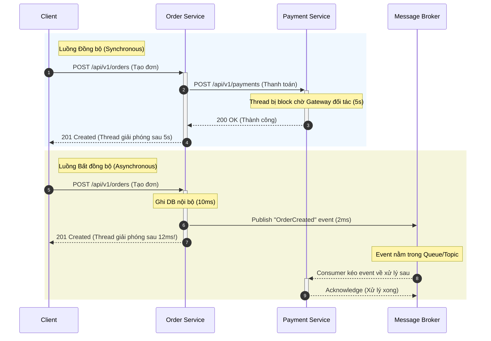

# Synchronous communication và asynchronous communication khác nhau thế nào?

## ⚡ Tóm tắt ngắn (30s)
*   **Bản chất**:
    *   **Synchronous (Đồng bộ - Blocking)**: Client gửi yêu cầu và *bắt buộc phải dừng lại* (block) để chờ đợi phản hồi từ Server rồi mới chạy tiếp. Cả hai hệ thống phải hoạt động đồng thời (Temporal Coupling). Ví dụ: HTTP REST, gRPC.
    *   **Asynchronous (Bất đồng bộ - Non-blocking)**: Client gửi thông điệp (Message/Event) vào một kênh trung gian rồi *tiếp tục thực hiện việc khác ngay lập tức* mà không đợi phản hồi. Server sẽ tiêu thụ và xử lý thông điệp đó bất cứ khi nào nó sẵn sàng. Ví dụ: Kafka, RabbitMQ, AWS SQS.
*   **Các thảm họa thực chiến được giải quyết**:
    1.  **Sập dây chuyền & Nghẽn luồng (Cascading Failure & Thread Starvation)**: Trong chuỗi gọi đồng bộ `Service A -> B -> C -> D`, nếu `Service D` bị trễ 3 giây hoặc sập, toàn bộ các thread xử lý ở `A`, `B`, `C` sẽ bị block để chờ. Connection pool bị cạn kiệt, hệ thống sập hoàn toàn. Bất đồng bộ loại bỏ sự phụ thuộc thời gian này.
    2.  **Quá tải do traffic tăng đột biến (Traffic Spikes & Lack of Backpressure)**: Trong các sự kiện Flash Sale, hàng triệu request ập vào hệ thống tạo đơn hàng. Nếu gọi đồng bộ, database và các service hạ nguồn (như Thanh toán, Giao hàng) sẽ sập ngay lập tức do quá tải. Bất đồng bộ dùng Message Broker làm "bể đệm" (Buffer), giúp điều hòa lưu lượng (Load Leveling) và cho phép hạ nguồn tự tiêu thụ theo tốc độ của nó (Backpressure).
*   **Quyết định Senior**:
    *   **Dùng Synchronous**: Khi nghiệp vụ bắt buộc phải có kết quả ngay lập tức để quyết định luồng tiếp theo (Xác thực đăng nhập, Kiểm tra số dư tài khoản ngân hàng trước khi chuyển tiền, Truy vấn thông tin sản phẩm).
    *   **Dùng Asynchronous**: Cho các tác vụ tốn tài nguyên (I/O, tính toán nặng như Gửi Mail, Xuất file Excel báo cáo, Nén ảnh) hoặc các luồng liên dịch vụ chấp nhận **Nhất quán sau (Eventual Consistency)** (Tạo đơn hàng thành công -> Gửi thông báo SMS -> Cộng điểm tích lũy -> Đồng bộ dữ liệu sang CRM).

---

## 🔍 Chi tiết bản chất thực chiến

Sự khác biệt lớn nhất giữa Đồng bộ và Bất đồng bộ không chỉ nằm ở giao thức mạng, mà là **Temporal Coupling (Sự ràng buộc về mặt thời gian)**. 

### Sơ đồ luồng hoạt động: Synchronous vs Asynchronous



Khi sử dụng gọi đồng bộ, bạn đang đánh đổi **Độ trễ toàn cục (Global Latency)** của hệ thống. Nếu một mắt xích trong chuỗi đồng bộ bị trễ, độ trễ của toàn bộ request sẽ bằng tổng độ trễ của các mắt xích cộng lại. Ngược lại, luồng bất đồng bộ giúp cô lập độ trễ, giải phóng luồng xử lý cực nhanh, từ đó tăng băng thông (Throughput) tổng thể lên gấp hàng chục lần.

---

## 💻 Code thực chiến: BAD vs GOOD

### ❌ BAD: Gọi đồng bộ chuỗi dài (Tightly Coupled & Blocking)
Trong ví dụ này, `OrderService` xử lý tạo đơn hàng, sau đó gọi đồng bộ sang `PaymentService` và `NotificationService` trong cùng một luồng giao dịch. Nếu dịch vụ thông báo hoặc thanh toán phản hồi chậm, luồng này sẽ khóa database kết nối và giữ thread xử lý cực kỳ lâu.

```java
@Service
public class OrderServiceBad {

    @Autowired
    private OrderRepository orderRepository;
    @Autowired
    private PaymentClient paymentClient; // REST/Feign Client gọi đồng bộ
    @Autowired
    private NotificationClient notificationClient; // REST/Feign Client gọi đồng bộ

    @Transactional
    public OrderResponse createOrder(OrderRequest request) {
        // 1. Lưu thông tin đơn hàng vào DB nội bộ
        Order order = new Order(request.getCustomerId(), request.getItems(), "PENDING");
        order = orderRepository.save(order);

        // 2. Gọi đồng bộ thanh toán qua HTTP
        // Hậu quả: Nếu mạng chậm hoặc Payment Service bị nghẽn, thread này sẽ bị block!
        PaymentResponse payment = paymentClient.processPayment(new PaymentRequest(order.getId(), request.getAmount()));
        if (!"SUCCESS".equals(payment.getStatus())) {
            throw new PaymentFailedException("Thanh toán không thành công");
        }
        order.setStatus("PAID");
        orderRepository.save(order);

        // 3. Gọi đồng bộ gửi email/SMS thông báo
        // Hậu quả: Việc gửi email qua đối tác thứ 3 (như SendGrid) cực kỳ bất ổn và chậm chạp
        notificationClient.sendOrderConfirmation(new NotificationRequest(order.getId(), request.getEmail()));

        return new OrderResponse(order.getId(), "SUCCESS");
    }
}
```

---

### ✔️ GOOD: Tách biệt bất đồng bộ với Message Broker & Outbox Pattern
Ở đây, `OrderService` ghi nhận trạng thái đơn hàng vào Database và xuất bản một sự kiện `OrderCreatedEvent` thông qua Kafka hoặc RabbitMQ. Việc gửi email và thanh toán sẽ được thực hiện bất đồng bộ bởi các dịch vụ tương ứng ở phía sau.

```java
@Service
@Slf4j
public class OrderServiceGood {

    @Autowired
    private OrderRepository orderRepository;
    @Autowired
    private KafkaTemplate<String, OrderCreatedEvent> kafkaTemplate;

    @Transactional
    public OrderResponse createOrder(OrderRequest request) {
        // 1. Lưu đơn hàng ở trạng thái ban đầu nhanh chóng (10ms)
        Order order = new Order(request.getCustomerId(), request.getItems(), "CREATED");
        order = orderRepository.save(order);

        // 2. Tạo sự kiện nghiệp vụ
        OrderCreatedEvent event = new OrderCreatedEvent(
            order.getId(), 
            request.getCustomerId(), 
            request.getAmount(), 
            request.getEmail()
        );

        // 3. Publish event bất đồng bộ tới Kafka topic "order-events"
        // Key là orderId để đảm bảo tất cả event của đơn hàng này luôn đi vào cùng 1 partition (bảo toàn thứ tự)
        try {
            kafkaTemplate.send("order-events", order.getId().toString(), event);
        } catch (Exception e) {
            log.error("Không thể publish event lên Kafka cho đơn hàng: {}", order.getId(), e);
            // Thực tế nên kết hợp với Outbox Pattern để tránh mất mát event khi Kafka down
            throw new SystemException("Lỗi xử lý đơn hàng, vui lòng thử lại sau.");
        }

        // Trả kết quả ngay lập tức cho client mà không bắt client chờ xử lý thanh toán/gửi mail
        return new OrderResponse(order.getId(), "PENDING_PAYMENT");
    }
}
```

**Consumer xử lý thông báo bất đồng bộ:**
```java
@Component
@Slf4j
public class NotificationConsumer {

    @Autowired
    private EmailService emailService;

    @KafkaListener(topics = "order-events", groupId = "notification-group")
    public void handleOrderCreated(OrderCreatedEvent event, Acknowledgment ack) {
        log.info("Nhận sự kiện gửi thông báo cho đơn hàng: {}", event.getOrderId());
        try {
            // Tác vụ gửi email chậm chạp (có thể mất 2-3s) hoàn toàn không ảnh hưởng tới luồng tạo đơn của khách hàng
            emailService.sendEmail(event.getEmail(), "Xác nhận đơn hàng " + event.getOrderId());
            
            // Xác nhận đã xử lý thành công để commit offset
            ack.acknowledge();
        } catch (Exception e) {
            log.error("Gửi email thất bại cho đơn hàng: {}", event.getOrderId(), e);
            // Không ack để Kafka retry hoặc đẩy vào Dead Letter Queue (DLQ) sau N lần fail
        }
    }
}
```

---

## 📊 Bảng so sánh Synchronous vs Asynchronous

| Tiêu chí so sánh | Luồng Đồng bộ (Synchronous) | Luồng Bất đồng bộ (Asynchronous) |
| :--- | :--- | :--- |
| **Sự phụ thuộc thời gian**| **Rất cao (Temporal Coupling)**. Hai hệ thống phải hoạt động và kết nối thông suốt cùng lúc. | **Thấp (Temporal Decoupling)**. Dịch vụ gửi và nhận có thể chạy độc lập lệch giờ nhau. |
| **Băng thông (Throughput)**| **Thấp đến Trung bình**. Bị giới hạn bởi số lượng Thread vật lý của Web Server (Tomcat/Netty). | **Cực kỳ cao**. Thread giải phóng ngay lập tức, một server có thể tiếp nhận hàng vạn request/s. |
| **Độ trễ (Latency)** | **Nhỏ (ở điều kiện lý tưởng)** nhưng tăng theo cấp số cộng khi chuỗi gọi dịch vụ dài ra. | **Cao hơn cho kết quả cuối cùng**, nhưng độ trễ phản hồi ban đầu của API cực thấp. |
| **Quản lý lỗi (Error Handling)**| **Đơn giản**. Trả lỗi trực tiếp về client qua mã HTTP status (4xx, 5xx) lập tức. | **Phức tạp**. Phải thiết kế cơ chế Retry, Idempotency, Dead Letter Queue và Saga Pattern. |
| **Tính nhất quán dữ liệu**| **Nhất quán tức thì (Strong Consistency)** nhờ sự hỗ trợ của Transaction đồng bộ. | **Nhất quán sau (Eventual Consistency)**. Dữ liệu sẽ đồng bộ hoàn tất sau vài giây/vài phút. |
| **Chi phí vận hành** | **Thấp**. Không cần thêm thành phần trung gian phức tạp. | **Cao**. Phải cài đặt, giám sát và vận hành cụm Message Broker (Kafka/RabbitMQ). |

---

## ⚠️ Common Gotchas & Questions follow-up

### 1. Cạm bẫy "Async-to-Sync" (Bất đồng bộ nửa mùa)
*   **Thảm họa thực tế**: Nhiều lập trình viên chuyển đổi API sang bất đồng bộ bằng cách đẩy task vào Message Queue, nhưng ở đầu Client/Frontend lại thực hiện cơ chế **Short Polling** (cứ 1 giây gọi API một lần để hỏi xem task xong chưa) hoặc block Thread ở Gateway để đợi kết quả trả về từ Queue qua một cơ chế đồng bộ tạm bợ.
*   **Hậu quả**: Không những không giải phóng được luồng xử lý, hệ thống còn phải gánh thêm chi phí quản lý queue và lượng HTTP request tăng gấp 10 lần do client polling liên tục.
*   **Giải pháp**: Sử dụng giao thức hướng sự kiện thực sự cho Frontend như **WebSockets** hoặc **Server-Sent Events (SSE)**. Khi Backend xử lý xong task bất đồng bộ, event sẽ được đẩy chủ động từ server xuống client mà frontend không cần chủ động gửi request hỏi liên tục.

### 2. Sự cố nổ dữ liệu do "Duplicate Messages" (Trùng lặp tin nhắn)
*   **Vấn đề**: Trong hệ thống bất đồng bộ, quy chuẩn truyền tải thông dụng là **At-Least-Once** (Đảm bảo tin nhắn được gửi đi ít nhất một lần). Điều này có nghĩa là do lỗi mạng chập chờn, Message Broker có thể gửi một Event đến Consumer nhiều lần.
*   **Hậu quả**: Khách hàng bị trừ tiền hai lần, hoặc đơn hàng bị nhân đôi trên hệ thống.
*   **Giải pháp**: Bắt buộc mọi Consumer bất đồng bộ phải đảm bảo tính **Idempotent (Không thay đổi kết quả khi thực hiện nhiều lần)**. Sử dụng một cột `idempotency_key` duy nhất (như Transaction ID, Order ID) kết hợp ràng buộc `UNIQUE` trong Database để chặn các giao dịch trùng lặp.

### 3. Câu hỏi đào sâu từ interviewer
*   **Q: Nếu hệ thống bất đồng bộ bị mất điện đột ngột ở Broker (như Kafka sập), làm sao đảm bảo tin nhắn không bị thất thoát?**
    *   *Trả lời*: Để đảm bảo độ tin cậy tuyệt đối về tin nhắn (Zero Data Loss), chúng ta cần thiết lập cấu hình đồng bộ ở cả 3 tầng:
        1.  **Producer**: Sử dụng **Transactional Outbox Pattern**. Thay vì gửi trực tiếp lên Broker, ta ghi Event vào bảng `outbox` nằm chung một Database Transaction với bảng nghiệp vụ (`order`). Một worker phụ sẽ quét bảng này để gửi lên Kafka. Cấu hình producer `acks=all` (hoặc `acks=-1`), đảm bảo tất cả các replica của partition đã nhận được tin nhắn trước khi trả xác nhận thành công cho Producer.
        2.  **Broker**: Cấu hình lưu trữ đĩa bền vững (`durable` queues trong RabbitMQ, hoặc tăng số lượng replica partition `min.insync.replicas=2` kết hợp `replication.factor=3` trong Kafka).
        3.  **Consumer**: Tắt chế độ Auto-Commit Offset. Chỉ commit offset thủ công (`manual ack`) sau khi xử lý thành công nghiệp vụ và ghi nhận vào Database của Consumer.
