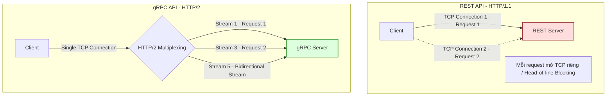

# REST và gRPC khác nhau thế nào?

## ⚡ Tóm tắt ngắn (30s)
*   **Bản chất**:
    *   **REST (Representational State Transfer)**: Phong cách kiến trúc thiết kế API dựa trên tài nguyên (Resources), truyền tải dữ liệu dạng văn bản (chủ yếu là JSON/XML) qua HTTP/1.1. Hoạt động trên mô hình Request-Response chặn (blocking) truyền thống.
    *   **gRPC (Google Remote Procedure Call)**: Framework gọi hàm từ xa hiệu năng cao của Google. Nó định nghĩa contract nghiêm ngặt bằng **Protocol Buffers** (dữ liệu nhị phân siêu nén) và truyền tải qua **HTTP/2**, hỗ trợ truyền phát dữ liệu hai chiều (Streaming).
*   **Các thảm họa thực chiến được giải quyết**:
    1.  **Trễ mạng & Nghẽn băng thông inter-service (Network Latency & Serialization Overhead)**: Khi hàng trăm microservices gọi chéo nhau bằng REST JSON, lượng băng thông tiêu thụ rất lớn vì JSON chứa quá nhiều ký tự thừa (ngoặc nhọn, dấu hai chấm, tên key lặp lại). CPU cũng tốn nhiều tài nguyên để parse chuỗi văn bản. gRPC biên dịch dữ liệu thành nhị phân siêu nhỏ và truyền tải qua HTTP/2 Multiplexing, giúp giảm 50% CPU parse và tăng tốc độ Inter-service gấp 5-10 lần.
    2.  **Lỗi nổ API do lệch Contract (Broken Contract & Typo Runtime Error)**: Với REST, nếu Service A sửa kiểu dữ liệu của một trường (`int` thành `string`) mà không báo trước, Service B sẽ bị lỗi crash parse JSON lúc runtime. gRPC bắt buộc định nghĩa file `.proto` làm "Single Source of Truth", tự động sinh mã nguồn (Strongly-typed) tĩnh ở cả hai đầu, phát hiện lỗi ngay từ lúc compile.
*   **Quyết định Senior**:
    *   **Dùng REST**: Cho các API hướng ra ngoài (Public facing APIs, Frontend-to-Backend) phục vụ Web, Mobile, Third-party vì tính tương thích cao, dễ debug và ai cũng biết dùng.
    *   **Dùng gRPC**: Cho giao tiếp nội bộ giữa các service (Inter-service communication) trong hệ thống Microservices đòi hỏi độ trễ cực thấp, băng thông tối ưu và sự an toàn về kiểu dữ liệu.

---

## 🔍 Chi tiết bản chất thực chiến

Sự vượt trội của gRPC so với REST được xây dựng trên hai trụ cột công nghệ: **Protocol Buffers (Protobuf)** và **HTTP/2**.

### 1. JSON (REST) vs Protocol Buffers (gRPC) ở tầng vật lý
*   **JSON**: Là định dạng văn bản (Text-based). Để biểu diễn một object `{ "age": 30 }`, máy tính cần gửi đi 12 bytes ký tự mã ASCII qua đường truyền.
*   **Protocol Buffers**: Là định dạng nhị phân (Binary-based). Nó bỏ qua tên field (`age`) mà thay bằng các thẻ số (Field Tag/Number) đã định nghĩa trước ở file `.proto`. Object trên được mã hóa thành mã hex `08 1E` chỉ tốn **2 bytes**! Tiết kiệm băng thông tới hơn 80%.

### 2. HTTP/1.1 (REST) vs HTTP/2 (gRPC) ở tầng truyền tải
*   **HTTP/1.1**: Mỗi request cần mở một kết nối TCP riêng biệt (hoặc dùng lại qua Keep-Alive nhưng vẫn bị chặn tuần tự - Head-of-line blocking). Header của HTTP/1.1 là văn bản thuần tuý và lặp lại trong mỗi request.
*   **HTTP/2**: Hỗ trợ **Multiplexing** - cho phép gửi đồng thời hàng trăm request/response song song trên duy nhất một kết nối TCP. HTTP/2 còn nén Header (HPACK) và sử dụng truyền tải nhị phân (Binary Framing Layer) thay cho văn bản thô.



---

## 💻 Code thực chiến: BAD vs GOOD

### ❌ BAD: Gọi Inter-service bằng REST & WebClient (Verbose & No Contract Safety)
Dịch vụ gọi API thanh toán của đối tác nội bộ qua REST. Code verbose, phải tự handle deserialize JSON, không có gì đảm bảo cấu trúc JSON của bên kia không bị thay đổi.

```java
@Service
public class OrderServiceBad {

    @Autowired
    private WebClient.Builder webClientBuilder;

    public PaymentResponse callPaymentService(PaymentRequest request) {
        // Gọi đồng bộ REST API qua WebClient
        // Hậu quả: Không có contract tĩnh. Nếu bên Payment Service đổi tên trường "amount" thành "totalAmount", 
        // code này vẫn build thành công nhưng sẽ bị lỗi Null/Parse Exception khi chạy (Runtime)!
        return webClientBuilder.build()
            .post()
            .uri("http://payment-service/api/v1/payments")
            .bodyValue(request) // Serialize JSON tốn CPU
            .retrieve()
            .bodyToMono(PaymentResponse.class) // Deserialize JSON tốn CPU
            .block(); // Blocking thread
    }
}
```

---

### ✔️ GOOD: Khai báo Contract gRPC (.proto) và gọi strongly-typed gRPC Client

**1. Định nghĩa file Contract: `payment.proto`**
```protobuf
syntax = "proto3";

option java_multiple_files = true;
option java_package = "com.example.grpc.payment";

// Định nghĩa dịch vụ thanh toán
service PaymentService {
  rpc ProcessPayment (PaymentRequest) returns (PaymentResponse);
}

// Định nghĩa cấu trúc request
message PaymentRequest {
  int64 order_id = 1;     // Tag 1 đại diện cho order_id
  double amount = 2;      // Tag 2 đại diện cho amount
  string currency = 3;    // Tag 3 đại diện cho currency
}

// Định nghĩa cấu trúc response
message PaymentResponse {
  string transaction_id = 1;
  string status = 2;      // SUCCESS, FAILED
}
```

---

**2. Cài đặt gRPC Server (Đầu nhận - Spring Boot gRPC Server)**
```java
@GrpcService // Annotation tự động phơi bày Service gRPC qua cổng gRPC (thường là 9090)
@Slf4j
public class PaymentGrpcService extends PaymentServiceGrpc.PaymentServiceImplBase {

    @Override
    public void processPayment(PaymentRequest request, StreamObserver<PaymentResponse> responseObserver) {
        log.info("Xử lý thanh toán cho đơn hàng: {}", request.getOrderId());
        
        // Thực thi nghiệp vụ (Strongly-typed, hoàn toàn không có chuỗi JSON)
        PaymentResponse response = PaymentResponse.newBuilder()
            .setTransactionId(UUID.randomUUID().toString())
            .setStatus("SUCCESS")
            .build();
            
        // Trả kết quả về cho Client qua StreamObserver
        responseObserver.onNext(response);
        // Đánh dấu hoàn thành luồng request
        responseObserver.onCompleted();
    }
}
```

---

**3. Sử dụng gRPC Client (Đầu gọi - Spring Boot gRPC Client)**
```java
@Service
@Slf4j
public class OrderServiceGood {

    // Khởi tạo Stub (Client Stub) sinh tự động từ file .proto
    @GrpcClient("payment-service")
    private PaymentServiceGrpc.PaymentServiceBlockingStub paymentStub;

    public void processOrderPayment(Long orderId, double amount) {
        // Xây dựng request strongly-typed bằng Builder Pattern sinh tự động
        PaymentRequest request = PaymentRequest.newBuilder()
            .setOrderId(orderId)
            .setAmount(amount)
            .setCurrency("VND")
            .build();

        try {
            // Gọi hàm từ xa gRPC siêu tốc qua HTTP/2
            // Compiler sẽ báo lỗi ngay lập tức nếu bạn truyền sai kiểu dữ liệu của bất cứ trường nào
            PaymentResponse response = paymentStub.processPayment(request);
            
            log.info("Thanh toán thành công. Giao dịch ID: {}, Trạng thái: {}", 
                response.getTransactionId(), response.getStatus());
                
        } catch (StatusRuntimeException e) {
            log.error("Lỗi gọi dịch vụ gRPC Payment: {}", e.getStatus().getCode(), e);
            throw new SystemException("Dịch vụ thanh toán tạm thời không khả dụng");
        }
    }
}
```

---

## 📊 Bảng so sánh REST vs gRPC

| Tiêu chí so sánh | REST (HTTP/1.1 & JSON) | gRPC (HTTP/2 & Protobuf) |
| :--- | :--- | :--- |
| **Giao thức mạng** | **HTTP/1.1** (Request-Response cổ điển). | **HTTP/2** (Multiplexing, Header compression). |
| **Định dạng dữ liệu** | **JSON/XML** (Text-based, dễ đọc bởi con người). | **Protocol Buffers** (Binary-based, nén hiệu suất cao). |
| **Ranh giới Contract** | **Yếu/Tùy chọn** (Cần viết thêm Swagger/OpenAPI). | **Nghiêm ngặt bắt buộc** (Thông qua file `.proto`). |
| **Kiểu dữ liệu (Typing)**| **Dynamic / Loose**. Dễ bị lỗi parse dữ liệu runtime. | **Strongly-typed** biên dịch tĩnh. An toàn tuyệt đối. |
| **Khả năng Streaming** | Chỉ hỗ trợ một chiều từ Server (SSE) hoặc dùng WebSocket. | Hỗ trợ 4 mô hình: Unary, Client-streaming, Server-streaming, Bidirectional-streaming. |
| **Hỗ trợ trình duyệt** | **Tuyệt vời**. Mọi trình duyệt đều hỗ trợ mặc định. | **Kém**. Cần proxy trung gian (như gRPC-web) để chạy trên Browser. |
| **Use case tối ưu** | Public API, Web/Mobile clients, integration với đối tác ngoài. | Inter-service microservices, IoT devices, Mobile to backend có băng thông hẹp. |

---

## ⚠️ Common Gotchas & Questions follow-up

### 1. Cạm bẫy "Load Balancing" trong Kubernetes với gRPC
*   **Thảm họa thực tế**: Khi deploy các dịch vụ gRPC lên Kubernetes và sử dụng cơ chế load balancing mặc định ở Layer 4 (như K8s Service IP), bạn phát hiện ra toàn bộ traffic gRPC từ `Service A` chỉ dồn vào duy nhất 1 Pod của `Service B`, trong khi các Pod khác hoàn toàn nhàn rỗi.
*   **Nguyên nhân**: gRPC chạy trên HTTP/2, và HTTP/2 sử dụng cơ chế **Long-Lived Connection** (kết nối TCP luôn mở để multiplexing). K8s Service chỉ load balance khi kết nối TCP được khởi tạo. Do kết nối không bao giờ đóng, mọi request tiếp theo đều chạy trên cùng một đường truyền TCP tới Pod đầu tiên.
*   **Giải pháp**: Bắt buộc phải thực hiện **Load Balancing ở Layer 7** (Application Layer). Bạn có thể cấu hình Envoy Proxy làm Service Mesh (như Istio, Linkerd) hoặc sử dụng cơ chế Client-side load balancing tích hợp sẵn của gRPC kết hợp với Headless Service trong Kubernetes để client tự phân giải danh sách IP của Pod.

### 2. Sự cố "Backward Compatibility" (Tương thích ngược) khi sửa file `.proto`
*   **Vấn đề**: Thêm, xóa hoặc sửa đổi các trường trong file `.proto` ở một service mới deploy làm hỏng kết nối với các service cũ chưa kịp deploy.
*   **Giải pháp (Quy tắc vàng của Protobuf)**:
    1.  **Tuyệt đối không thay đổi Tag Number** (các số `1`, `2`, `3` sau dấu `=`). Tag number chính là định danh thực tế của field trong chuỗi nhị phân.
    2.  Nếu muốn bỏ một field, không được dùng lại Tag Number cũ của field đó cho field mới. Hãy đánh dấu nó bằng từ khóa `reserved` (ví dụ: `reserved 2;`).
    3.  Thêm field mới thoải mái, các client cũ khi nhận chuỗi nhị phân sẽ tự động bỏ qua các field có tag number lạ mà không bị crash.

### 3. Câu hỏi đào sâu từ interviewer
*   **Q: Tại sao gRPC hỗ trợ stream dữ liệu tốt hơn REST? Dùng Unary RPC và Streaming RPC khác nhau ở điểm nào?**
    *   *Trả lời*: Nhờ chạy trên HTTP/2, gRPC truyền tải dữ liệu dưới dạng các **Frames** nhị phân nằm trong các luồng dữ liệu ảo (Streams). Điều này giúp gRPC có thể mở và giữ các luồng truyền dữ liệu liên tục mà không cần tạo mới kết nối TCP.
    *   *Sự khác biệt*:
        *   **Unary RPC**: Giống hệt HTTP REST truyền thống, gửi 1 request nhận 1 response. Phù hợp cho CRUD thông thường.
        *   **Server Streaming**: Client gửi 1 request, Server trả về một luồng các thông điệp liên tục (ví dụ: luồng cập nhật giá cổ phiếu thời gian thực, tải file dung lượng lớn).
        *   **Client Streaming**: Client liên tục đẩy luồng dữ liệu lên Server, Server nhận xong hết sẽ trả về 1 response duy nhất (ví dụ: upload file chunk, gửi log stream từ client).
        *   **Bidirectional Streaming**: Cả Client và Server cùng đẩy dữ liệu cho nhau song song bất đồng bộ thời gian thực trên cùng một kết nối (ví dụ: ứng dụng Chat trực tuyến, game multiplayer).
