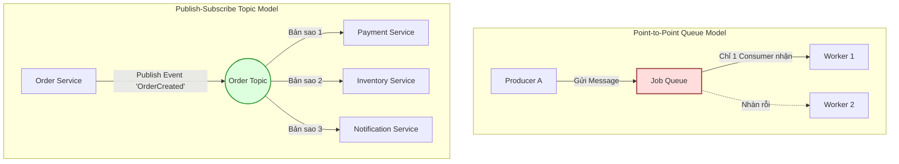

# Message broker dùng để làm gì?

## ⚡ Tóm tắt ngắn (30s)
*   **Bản chất**: Message Broker (Bộ môi giới thông điệp) là một thành phần trung gian (Middleware) trong kiến trúc phần mềm phân tán. Nhiệm vụ cốt lõi của nó là tiếp nhận, định tuyến, lưu trữ tạm thời và phân phối các thông điệp (Messages/Events) từ bên gửi (Producer/Publisher) đến bên nhận (Consumer/Subscriber) một cách bất đồng bộ.
*   **Các thảm họa thực chiến được giải quyết**:
    1.  **Sập Database do quá tải (Spike Traffic & Database Exhaustion)**: Khi lượng người dùng tăng đột biến (Flash Sale, đăng ký vé ca nhạc), hàng vạn request ghi dữ liệu ập tới cùng lúc. Nếu gọi trực tiếp, Database sẽ cạn kiệt connection pool và sập nguồn. Message Broker đóng vai trò là "đập thủy điện" (Buffer / Load Leveler) lưu giữ toàn bộ request an toàn và cho phép Database/Worker tiêu thụ từ từ theo khả năng xử lý của chúng (Backpressure).
    2.  **Lỗi sập dây chuyền (Cascading Failure & Hard Coupling)**: Trong luồng tạo đơn hàng, nếu hệ thống phải gọi trực tiếp API gửi Email, SMS, CRM và đối tác giao vận. Chỉ cần dịch vụ SMS bị nghẽn mạng hoặc sập, luồng tạo đơn hàng của khách hàng cũng bị lỗi theo. Broker loại bỏ sự phụ thuộc chéo này. Hệ thống chính đẩy tin nhắn vào Broker và trả kết quả thành công cho khách hàng ngay lập tức. Dù dịch vụ SMS có đang offline bảo trì, tin nhắn vẫn được lưu an toàn trong Broker và sẽ được xử lý khi service hoạt động trở lại.
*   **Quyết định Senior**:
    *   **Nên dùng Broker**:
        *   Tách biệt (decouple) luồng chính với các tác vụ phụ tốn thời gian (Gửi thông báo, xuất báo cáo, phân tích dữ liệu log).
        *   Đệm tải (Buffering) bảo vệ hệ thống hạ nguồn.
        *   Giao tiếp bất đồng bộ tin cậy cao giữa các dịch vụ độc lập.
    *   **Không dùng Broker**: Cho các luồng xử lý đồng bộ bắt buộc có kết quả ngay lập tức (như Xác thực mật khẩu khi login, kiểm tra mã OTP, kiểm tra số dư ví khả dụng trước khi quẹt thẻ).

---

## 🔍 Chi tiết bản chất thực chiến

Message Broker giúp phá vỡ sự ràng buộc chéo cả về **Thời gian (Temporal Decoupling)** và **Không gian (Spatial Decoupling)**. Bên gửi không cần biết bên nhận là ai, đang ở địa chỉ IP nào, và có đang hoạt động hay không.

### 2 Mô hình Giao tiếp Cơ bản của Message Broker

#### 1. Mô hình Point-to-Point (Queue - Điểm tới Điểm)
*   **Nguyên lý**: Tin nhắn được gửi vào một Queue. Chỉ có **duy nhất một** Consumer nhận và xử lý tin nhắn đó. Sau khi xử lý xong, tin nhắn biến mất khỏi Queue.
*   **Ứng dụng**: Phù hợp cho việc phân chia công việc (Work Queues), ví dụ: Hệ thống phân phối tác vụ nén ảnh cho 5 worker chạy song song để tối ưu tài nguyên.

#### 2. Mô hình Publish-Subscribe (Topic - Xuất bản & Đăng ký)
*   **Nguyên lý**: Tin nhắn (Event) được gửi vào một Topic. **Tất cả** các dịch vụ đăng ký nhận tin từ Topic đó đều sẽ nhận được một bản sao của tin nhắn.
*   **Ứng dụng**: Phù hợp cho kiến trúc hướng sự kiện (Event-driven), ví dụ: Khi đơn hàng được tạo, cả 3 dịch vụ: Thanh toán, Kho vận, và CRM đều nhận được sự kiện để tự thực hiện nghiệp vụ riêng biệt của mình.



---

## 💻 Code thực chiến: BAD vs GOOD

### ❌ BAD: Tích hợp nghiệp vụ đồng bộ ôm đồm (Monolithic Tight Coupling)
Lập trình viên cố gắng làm tất cả mọi việc (Tạo đơn, Trừ kho, Cập nhật điểm thành viên, Gửi Email) trong cùng một Transaction và xử lý đồng bộ.

```java
@Service
public class OrderServiceBad {

    @Autowired
    private OrderRepository orderRepository;
    @Autowired
    private InventoryServiceClient inventoryClient;
    @Autowired
    private LoyaltyServiceClient loyaltyClient;
    @Autowired
    private EmailServiceClient emailClient;

    @Transactional
    public OrderResponse placeOrder(OrderRequest request) {
        // 1. Tạo đơn hàng vào DB nội bộ
        Order order = new Order(request.getCustomerId(), request.getAmount(), "CREATED");
        order = orderRepository.save(order);

        // 2. Gọi đồng bộ trừ kho
        inventoryClient.deductStock(request.getProductId(), request.getQuantity());

        // 3. Gọi đồng bộ cộng điểm thành viên
        // Hậu quả: Dịch vụ điểm Loyalty chậm chạp sẽ giữ lock DB của bảng Order!
        loyaltyClient.addRewardPoints(request.getCustomerId(), request.getAmount());

        // 4. Gọi đồng bộ gửi email xác nhận đơn hàng
        // Hậu quả: Lỗi mạng khi gọi SendGrid/Mailgun sẽ rollback toàn bộ đơn hàng!
        emailClient.sendEmail(request.getEmail(), "Đơn hàng của bạn đã được tạo");

        return new OrderResponse(order.getId(), "SUCCESS");
    }
}
```

---

### ✔️ GOOD: Xử lý cốt lõi siêu tốc và đẩy tác vụ phụ qua Broker (Asynchronous Decoupling)

**1. Đầu gửi (Producer - Order Service)**
```java
@Service
@Slf4j
public class OrderServiceGood {

    @Autowired
    private OrderRepository orderRepository;
    
    // Inject KafkaTemplate (Spring Kafka) để publish message
    @Autowired
    private KafkaTemplate<String, OrderCreatedEvent> kafkaTemplate;

    @Transactional
    public OrderResponse placeOrder(OrderRequest request) {
        // 1. Chỉ thực hiện nghiệp vụ tối thiểu bắt buộc: Tạo đơn hàng ở trạng thái CREATED
        Order order = new Order(request.getCustomerId(), request.getAmount(), "CREATED");
        order = orderRepository.save(order);

        // 2. Đóng gói thông tin sự kiện nghiệp vụ
        OrderCreatedEvent event = new OrderCreatedEvent(
            order.getId(),
            request.getCustomerId(),
            request.getProductId(),
            request.getQuantity(),
            request.getAmount(),
            request.getEmail()
        );

        // 3. Publish sự kiện bất đồng bộ vào Topic của Broker
        // Thao tác này cực nhanh (< 2ms) và hoàn toàn không block luồng xử lý
        kafkaTemplate.send("order-created-topic", order.getId().toString(), event)
            .whenComplete((result, ex) -> {
                if (ex == null) {
                    log.info("Đã publish event thành công cho đơn hàng: {}, Offset: {}", 
                        order.getId(), result.getRecordMetadata().offset());
                } else {
                    log.error("Thất bại khi gửi event cho đơn hàng: {}", order.getId(), ex);
                    // Có thể ghi log khẩn cấp để đối soát hoặc đưa vào hàng đợi retry nội bộ
                }
            });

        // Trả kết quả ngay cho khách hàng (Thời gian đáp ứng API chỉ khoảng 10-15ms)
        return new OrderResponse(order.getId(), "ORDER_RECEIVED");
    }
}
```

---

**2. Đầu nhận (Consumer - Loyalty & Email Services chạy độc lập)**
```java
@Component
@Slf4j
public class LoyaltyConsumer {

    @Autowired
    private LoyaltyService loyaltyService;

    // Consumer của dịch vụ Loyalty độc lập
    @KafkaListener(topics = "order-created-topic", groupId = "loyalty-service-group")
    public void processRewardPoints(OrderCreatedEvent event, Acknowledgment ack) {
        log.info("Nhận sự kiện cộng điểm thưởng cho khách hàng: {}", event.getCustomerId());
        try {
            loyaltyService.addPoints(event.getCustomerId(), event.getAmount());
            // Commit offset thủ công khi xử lý thành công
            ack.acknowledge();
        } catch (Exception e) {
            log.error("Lỗi xử lý cộng điểm cho khách hàng: {}", event.getCustomerId(), e);
            // Không ack để Kafka retry lại sau
        }
    }
}
```

---

## 📊 Bảng so sánh Point-to-Point vs Publish-Subscribe

| Tiêu chí so sánh | Mô hình Queue (Point-to-Point) | Mô hình Topic (Publish-Subscribe) |
| :--- | :--- | :--- |
| **Đích đến của tin nhắn**| Tin nhắn được gửi vào một **Queue** cụ thể. | Tin nhắn được phát vào một **Topic** chung. |
| **Số lượng nhận tin** | **Duy nhất 1 Consumer** nhận được tin nhắn. | **Tất cả Subscriber** đăng ký topic đều nhận được. |
| **Độ phụ thuộc (Coupling)**| Chặt chẽ hơn. Producer cần biết Queue cụ thể để gửi. | Cực kỳ lỏng lẻo. Publisher không quan tâm ai đăng ký nhận tin. |
| **Use case tối ưu** | Phân phối công việc, xử lý tác vụ nặng (Batch Jobs, Image Processing). | Hệ thống hướng sự kiện (Event-driven), đồng bộ hóa dữ liệu đa dịch vụ. |
| **Ví dụ công nghệ** | RabbitMQ Classic Queues, ActiveMQ, AWS SQS. | Apache Kafka, RabbitMQ Fanout/Topic Exchange, AWS SNS. |

---

## ⚠️ Common Gotchas & Questions follow-up

### 1. Thảm họa "Poison Message" (Tin nhắn độc hại)
*   **Hiện tượng thực tế**: Hệ thống đang chạy ổn định bỗng dưng một Service Consumer bị crash liên tục, CPU nhảy lên 100% không ngừng. Khi restart service, lỗi vẫn tiếp diễn ngay lập tức.
*   **Nguyên nhân**: Một tin nhắn bị sai format hoặc chứa dữ liệu lỗi (ví dụ: `null` ở trường bắt buộc) được đẩy vào Broker. Consumer nhận tin, parse lỗi -> crash. Do lỗi xảy ra trước khi commit offset, Broker nghĩ rằng Consumer sập chưa nhận tin và sẽ **gửi lại chính tin nhắn đó** ngay khi Consumer khởi động lại. Tạo thành vòng lặp vô tận (Infinite Crash Loop).
*   **Giải pháp**: Thiết lập cơ chế **Dead Letter Queue (DLQ)** kết hợp cấu hình số lần retry tối đa (ví dụ: 3 lần). Nếu một tin nhắn lỗi quá số lần quy định, tự động chuyển hướng nó sang DLQ để các kỹ sư phân tích thủ công sau, giải phóng Queue chính để hệ thống tiếp tục xử lý các tin nhắn lành mạnh khác.

### 2. Sự cố "Out of Order" (Sai lệch thứ tự tin nhắn)
*   **Vấn đề**: Thứ tự xử lý tin nhắn bị đảo lộn. Ví dụ: Sự kiện `OrderUpdated` được xử lý trước cả sự kiện `OrderCreated`, dẫn đến lỗi logic dữ liệu nghiêm trọng.
*   **Giải pháp**: 
    *   Trong **Kafka**: Cấu hình sử dụng **Partition Key** (ví dụ: `orderId`). Mọi tin nhắn có chung `orderId` luôn đi vào duy nhất 1 Partition, và trong 1 Partition, Kafka đảm bảo thứ tự tuyệt đối từ trước đến sau.
    *   Trong **RabbitMQ**: Đảm bảo chỉ có duy nhất 1 Consumer lắng nghe trên Queue đó nếu thứ tự là tối quan trọng, hoặc sử dụng plugin hỗ trợ thứ tự ưu tiên.

### 3. Câu hỏi đào sâu từ interviewer
*   **Q: Sự khác biệt cốt lõi giữa "Message" và "Event" là gì? Khi nào gửi Message, khi nào gửi Event?**
    *   *Trả lời*: Sự khác biệt nằm ở **Mục đích thiết kế (Intent)**:
        *   **Message (Command)**: Là một chỉ thị hành động có chủ đích rõ ràng. Người gửi biết chính xác người nhận là ai và kỳ vọng người nhận thực hiện một hành động cụ thể (ví dụ: "Hãy gửi Email", "Hãy thực hiện giao dịch thanh toán"). Message thường đi theo mô hình Queue (Point-to-Point).
        *   **Event (Fact)**: Là một lời tuyên bố về một sự kiện đã xảy ra trong quá khứ và không thể thay đổi (ví dụ: "Đơn hàng đã được tạo", "Người dùng đã thanh toán thành công"). Người gửi chỉ đơn thuần phát thông báo này ra thế giới mà không quan tâm ai lắng nghe hay họ sẽ làm gì với nó. Event đi theo mô hình Topic (Pub-Sub).
