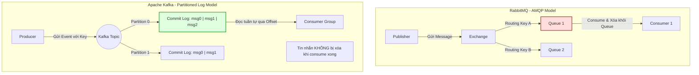

# Kafka và RabbitMQ khác nhau ở mức high-level

## ⚡ Tóm tắt ngắn (30s)
*   **Bản chất**:
    *   **RabbitMQ**: Là một Message Broker truyền thống dựa trên chuẩn AMQP. Hoạt động theo triết lý **"Smart Broker / Dumb Consumer"**. Broker gánh vác toàn bộ việc định tuyến tin nhắn phức tạp, theo dõi trạng thái tiêu thụ của Consumer để xóa tin nhắn ngay sau khi nó được xác nhận (Acknowledge) thành công.
    *   **Apache Kafka**: Là một Distributed Event Streaming Platform (Nền tảng truyền phát sự kiện phân tán). Hoạt động theo triết lý **"Dumb Broker / Smart Consumer"**. Broker đơn thuần ghi tuần tự tin nhắn vào một **Append-only Commit Log** bền vững trên đĩa. Consumer chịu trách nhiệm tự quản lý vị trí đọc của mình thông qua một con trỏ gọi là **Offset**.
*   **Các thảm họa thực chiến được giải quyết**:
    1.  **Mất lịch sử sự kiện và không thể tái tạo trạng thái (No Event Replayability)**: Với RabbitMQ, một khi tin nhắn được consume và ack thành công, nó sẽ bị xóa vĩnh viễn khỏi RAM/Disk. Nếu database hạ nguồn bị sập và mất dữ liệu, bạn không thể bảo RabbitMQ "gửi lại các tin nhắn của 3 ngày trước" để khôi phục dữ liệu. Với Kafka, tin nhắn được lưu trữ bền vững lâu dài (theo cấu hình Time/Size Retention). Bạn chỉ cần kéo ngược con trỏ **Offset** về quá khứ để Consumer chạy lại (Replay) và tái thiết lập dữ liệu từ đầu.
    2.  **Thắt cổ chai hiệu năng khi traffic đạt mức hàng triệu/giây (Throughput Bottleneck)**: Vì RabbitMQ phải liên tục cập nhật trạng thái phân phối, khóa hàng đợi (Queue Lock) và xóa tin nhắn cho từng Consumer, hiệu năng của nó bị giới hạn (ngưỡng hàng vạn tin nhắn/giây). Kafka ghi dữ liệu tuần tự trực tiếp xuống đĩa (Sequential Disk I/O) kết hợp cơ chế Zero-copy, cho phép đạt băng thông hàng triệu sự kiện/giây dễ dàng.
*   **Quyết định Senior**:
    *   **Chọn RabbitMQ khi**: Hệ thống cần định tuyến tin nhắn phức tạp (Complex Routing - qua Topic/Headers Exchange), cần các tính năng Queue nâng cao (Priority, Delay Queue, Dead Letter Queue linh hoạt), hoặc khi throughput ở mức vừa phải nhưng đòi hỏi độ trễ truyền tải cực thấp (micro-seconds).
    *   **Chọn Kafka khi**: Cần xử lý Stream dữ liệu lớn (Log aggregation, IoT Sensor data), cần khả năng Replay lại sự kiện, bảo toàn thứ tự nghiêm ngặt trên quy mô lớn, hoặc khi áp dụng mô hình Event Sourcing / CQRS.

---

## 🔍 Chi tiết bản chất thực chiến

Sự khác biệt cốt lõi nhất giữa hai hệ thống nằm ở **Kiến trúc lưu trữ và phân phối dữ liệu**.

### Sơ đồ so sánh Kiến trúc: RabbitMQ vs Kafka



### 1. Cách quản lý Tin nhắn (Message Retention)
*   **RabbitMQ**: Coi tin nhắn là vật tạm thời. Queue giống như một ống nước. Tin nhắn đi vào một đầu, Consumer hút ra ở đầu kia và ống nước trống rỗng.
*   **Kafka**: Coi tin nhắn là lịch sử vĩnh viễn (Fact). Topic giống như một cuốn sổ nhật ký ghi tay (Commit Log) chỉ ghi thêm vào cuối trang, không bao giờ sửa hay xóa dòng cũ. Consumer chỉ là người đọc lật các trang sách để xem, không có quyền xé trang sách.

### 2. Định tuyến tin nhắn (Message Routing)
*   **RabbitMQ**: Cực kỳ thông minh và linh hoạt. Có các loại Exchange như:
    *   `Direct`: Định tuyến chính xác theo Routing Key.
    *   `Topic`: Định tuyến theo pattern (ví dụ: `vietnam.hanoi.*`).
    *   `Fanout`: Broadcast tin nhắn đến tất cả các Queue liên kết.
*   **Kafka**: Rất đơn giản. Chỉ hỗ trợ định tuyến theo **Partition Key**. Các sự kiện có chung key luôn nằm trên cùng một Partition để đảm bảo thứ tự. Không hỗ trợ các cơ chế lọc hay định tuyến phức tạp ở tầng Broker; mọi việc lọc tin nhắn phải được xử lý ở tầng Consumer.

---

## 💻 Code thực chiến: Cấu hình đúng Superpower của mỗi Broker

Dưới đây là cách triển khai cấu hình và sử dụng đúng ưu thế tuyệt đối của từng loại Broker trong Spring Boot.

### 1. RabbitMQ: Tận dụng thế mạnh định tuyến phức tạp (Topic Exchange)

**Cấu hình Exchange, Queue và Binding Rules:**
```java
@Configuration
public class RabbitMqConfig {

    public static final String EXCHANGE_NAME = "ecommerce-topic-exchange";
    public static final String NOTIFICATION_QUEUE = "sms-notification-queue";

    @Bean
    public TopicExchange ecommerceExchange() {
        return new TopicExchange(EXCHANGE_NAME);
    }

    @Bean
    public Queue notificationQueue() {
        return new Queue(NOTIFICATION_QUEUE, true); // durable = true
    }

    @Bean
    public Binding bindingNotification(Queue notificationQueue, TopicExchange ecommerceExchange) {
        // Định tuyến linh hoạt: Mọi sự kiện thuộc loại "order.placed" của bất kỳ quốc gia nào 
        // (ví dụ: "vn.order.placed", "us.order.placed") đều được định tuyến vào queue này
        return BindingBuilder.bind(notificationQueue)
            .to(ecommerceExchange)
            .with("*.order.placed");
    }
}
```

**Consumer xử lý tin nhắn định tuyến:**
```java
@Component
@Slf4j
public class RabbitNotificationListener {

    @RabbitListener(queues = RabbitMqConfig.NOTIFICATION_QUEUE)
    public void receiveNotificationMessage(OrderMessage message) {
        log.info("RabbitMQ nhận tin nhắn thành công: {}", message.getOrderId());
        // Thực thi nghiệp vụ...
    }
}
```

---

### 2. Apache Kafka: Tận dụng thế mạnh xử lý phân vùng quy mô lớn (Partitions & Consumer Groups)

**Đầu gửi (Producer) chỉ định Partition Key để bảo toàn thứ tự:**
```java
@Service
@Slf4j
public class KafkaOrderPublisher {

    @Autowired
    private KafkaTemplate<String, OrderEvent> kafkaTemplate;

    public void publishOrderEvent(OrderEvent event) {
        // Sử dụng customerId làm Partition Key. 
        // Đảm bảo mọi đơn hàng của khách hàng này luôn đi vào cùng 1 Partition của Kafka
        String partitionKey = event.getCustomerId().toString();
        
        kafkaTemplate.send("orders-topic", partitionKey, event)
            .whenComplete((result, ex) -> {
                if (ex == null) {
                    log.info("Kafka gửi thành công vào partition: {}", result.getRecordMetadata().partition());
                }
            });
    }
}
```

**Đầu nhận (Consumer) chạy song song theo Consumer Group:**
```java
@Component
@Slf4j
public class KafkaOrderConsumer {

    // Kafka tự động chia tải các Partition của "orders-topic" cho các instance của Group này
    @KafkaListener(
        topics = "orders-topic", 
        groupId = "order-processing-group",
        concurrency = "3" // Khởi tạo 3 luồng xử lý song song tương ứng với 3 partition
    )
    public void consumeOrderEvent(OrderEvent event, @Header(KafkaHeaders.RECEIVED_PARTITION) int partition) {
        log.info("Consumer Kafka nhận sự kiện từ Partition: {}, Khách hàng: {}, Đơn hàng: {}", 
            partition, event.getCustomerId(), event.getOrderId());
        // Thực thi xử lý tuần tự an toàn không lo race condition
    }
}
```

---

## 📊 Bảng so sánh Kafka vs RabbitMQ

| Tiêu chí so sánh | RabbitMQ | Apache Kafka |
| :--- | :--- | :--- |
| **Kiến trúc cốt lõi** | **AMQP Broker** (Hàng đợi lưu trữ tạm thời). | **Distributed Commit Log** (Lưu trữ tuần tự bền vững). |
| **Băng thông (Throughput)**| **Trung bình** (Chục ngàn messages/giây). | **Siêu khủng** (Hàng triệu events/giây). |
| **Độ trễ (Latency)** | **Cực thấp** (Mức micro-seconds, nhanh hơn Kafka). | **Thấp** (Mức mili-seconds). |
| **Lưu trữ dữ liệu** | **Tạm thời**. Xóa ngay khi Consumer ACK thành công. | **Bền vững**. Lưu trữ theo cấu hình thời gian/kích thước đĩa. |
| **Định tuyến tin nhắn** | **Rất mạnh & linh hoạt** (Direct, Topic, Fanout, Headers). | **Yếu/Đơn giản**. Chỉ định tuyến dựa vào Partition Key. |
| **Khả năng đọc lại (Replay)**| **Không hỗ trợ**. | **Tuyệt vời**. Chỉ cần reset Offset về thời điểm cũ. |
| **Trạng thái Consumer** | Do Broker theo dõi và quản lý. | Do Consumer tự quản lý qua Offset (lưu tại Kafka). |

---

## ⚠️ Common Gotchas & Questions follow-up

### 1. Cạm bẫy "RabbitMQ Queue Block" khi đầy bộ nhớ
*   **Thảm họa thực tế**: Khi Consumer của RabbitMQ bị lỗi hoặc chạy quá chậm trong thời gian dài, tin nhắn tồn đọng trong Queue tăng lên hàng triệu. Khi đó, RabbitMQ sẽ tiêu thụ hết RAM vật lý và tự động chuyển sang chế độ **Block Producers** (ngăn chặn không cho bên gửi đẩy thêm tin nhắn để tự vệ).
*   **Hậu quả**: API chính của hệ thống bị đơ cứng và báo lỗi timeout hàng loạt.
*   **Giải pháp**: Cấu hình giới hạn kích thước tối đa cho Queue (`max-length` hoặc `max-length-bytes`) kết hợp chế độ tự động Drop tin nhắn cũ hoặc chuyển sang Dead Letter Queue khi đầy. Thiết lập hạ tầng cảnh báo (Alert) sớm khi Queue length vượt ngưỡng an toàn.

### 2. Sự cố "Kafka Rebalance Storm" (Cơn bão tái cân bằng)
*   **Hiện tượng thực tế**: Khi một Consumer trong Kafka Consumer Group xử lý một bản ghi quá lâu (vượt ngưỡng `max.poll.interval.ms`), Broker sẽ nghĩ rằng Consumer đó đã chết và kích hoạt quy trình **Rebalance** để phân chia lại các Partition cho các Consumer khác. Trong lúc Rebalance diễn ra, toàn bộ Consumer Group sẽ bị dừng hoạt động (Stop-the-world).
*   **Hậu quả**: Việc dừng đột ngột làm chậm dây chuyền, và Consumer mới nhận partition lại tiếp tục xử lý chậm -> kích hoạt tiếp Rebalance. Tạo thành vòng lặp sập hệ thống liên tục.
*   **Giải pháp**: 
    1. Tăng cấu hình thời gian chờ tối đa `max.poll.interval.ms`.
    2. Giảm số lượng tin nhắn kéo về mỗi lần `max.poll.records`.
    3. Đẩy tác vụ xử lý nặng ra một Thread Pool riêng độc lập, không block luồng poll chính của Kafka.

### 3. Câu hỏi đào sâu từ interviewer
*   **Q: Tại sao Kafka lại có hiệu năng đọc/ghi vượt trội hoàn toàn so với các hàng đợi truyền thống?**
    *   *Trả lời*: Bí mật hiệu năng của Kafka nằm ở 4 kỹ thuật thiết kế tối ưu tầng thấp:
        1.  **Sequential Disk I/O (Ghi đĩa tuần tự)**: Kafka ghi sự kiện tuần tự vào cuối Log file. Việc ghi tuần tự trên đĩa cứng cơ học có tốc độ nhanh tương đương ghi ngẫu nhiên trên RAM, loại bỏ overhead tìm kiếm sector của kim đọc đĩa.
        2.  **Pagecache (Bộ nhớ đệm OS)**: Kafka tận dụng tối đa RAM nhàn rỗi của Hệ điều hành làm bộ đệm. Dữ liệu ghi/đọc chủ yếu diễn ra trên Pagecache mà không cần chạm xuống đĩa cứng vật lý trong điều kiện tải bình thường.
        3.  **Zero-copy (Cơ chế sendfile)**: Khi gửi dữ liệu từ đĩa sang Card mạng cho Consumer, các hệ thống thường copy qua 4 bước (Disk -> OS Cache -> User Space App -> Socket Buffer -> NIC Buffer). Kafka dùng lệnh gọi hệ thống `sendfile` để truyền trực tiếp dữ liệu từ OS Cache sang NIC Buffer, bỏ qua hoàn toàn tầng ứng dụng (User Space), tiết kiệm 50% CPU và tài nguyên bus bộ nhớ.
        4.  **Batching & Compression (Gom cụm và nén)**: Gom nhiều tin nhắn thành một lô (Batch) để ghi đĩa và gửi qua mạng một lần, giảm thiểu tối đa overhead của Network Header và thao tác I/O.
