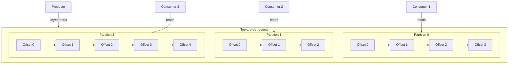

# Kafka topic, partition, offset là gì?

## ⚡ Tóm tắt ngắn (30s)
* **Topic** là logical channel để phân loại message — giống như một "bảng" trong database, mỗi topic chứa một loại event
* **Partition** là đơn vị phân tán và parallelism của topic — mỗi partition là một ordered, immutable log
* **Offset** là số thứ tự duy nhất của message trong partition — consumer dùng offset để track vị trí đọc
* Ba khái niệm này kết hợp tạo nên khả năng **high throughput, scalability và fault tolerance** của Kafka
* Thực tế production: chọn partition key đúng quyết định 80% hiệu quả hệ thống messaging

---

## 🔍 Chi tiết bản chất thực chiến

### Topic — Logical Channel
Topic là cách Kafka tổ chức data theo **category**. Mỗi topic có tên duy nhất trong cluster. Producer ghi message vào topic, consumer đọc từ topic. Topic giống như một "pipe" trong pub-sub model, nhưng khác biệt ở chỗ message **không bị xóa sau khi đọc** — nó được giữ theo retention policy (default 7 ngày).

### Partition — Đơn vị parallelism
Mỗi topic được chia thành **N partitions**. Mỗi partition là một **append-only log** nằm trên một broker. Đây là nơi data thực sự được lưu trữ trên disk.

### Offset — Con trỏ vị trí
Mỗi message khi được append vào partition sẽ nhận một **offset tăng dần** (0, 1, 2...). Offset là **immutable** và **unique trong scope partition**. Consumer commit offset để đánh dấu "đã xử lý đến đâu".



### Partition Key và Data Distribution
Producer quyết định message đi vào partition nào thông qua **partition key**. Kafka dùng `hash(key) % numPartitions` để route. Nếu không có key → round-robin.

---

## 💻 Code thực chiến: BAD vs GOOD

### ❌ BAD: Không hiểu partition key, gây data skew và mất ordering
```java
@Service
public class OrderEventProducer {

    @Autowired
    private KafkaTemplate<String, OrderEvent> kafkaTemplate;

    public void sendOrderEvent(OrderEvent event) {
        // BAD: Không set key → round-robin → mất ordering theo orderId
        kafkaTemplate.send("order-events", event);
    }

    public void sendWithBadKey(OrderEvent event) {
        // BAD: Dùng fixed key → tất cả message vào 1 partition → bottleneck
        kafkaTemplate.send("order-events", "fixed-key", event);
    }

    public void sendWithHighCardinalityKey(OrderEvent event) {
        // BAD: Dùng UUID làm key → không group được related events
        kafkaTemplate.send("order-events", UUID.randomUUID().toString(), event);
    }
}
```

---

### ✅ GOOD: Partition key strategy đúng, cấu hình topic hợp lý
```java
// === Topic Configuration ===
@Configuration
public class KafkaTopicConfig {

    @Bean
    public NewTopic orderEventsTopic() {
        return TopicBuilder.name("order-events")
                .partitions(12)              // Phù hợp với expected consumer count
                .replicas(3)                 // High availability
                .config(TopicConfig.RETENTION_MS_CONFIG, "604800000") // 7 days
                .config(TopicConfig.MIN_IN_SYNC_REPLICAS_CONFIG, "2")
                .build();
    }
}

// === Producer với partition key strategy đúng ===
@Service
@Slf4j
public class OrderEventProducer {

    @Autowired
    private KafkaTemplate<String, OrderEvent> kafkaTemplate;

    public void sendOrderEvent(OrderEvent event) {
        // GOOD: orderId làm key → cùng order luôn vào cùng partition → đảm bảo ordering
        String partitionKey = event.getOrderId();

        CompletableFuture<SendResult<String, OrderEvent>> future =
                kafkaTemplate.send("order-events", partitionKey, event);

        future.whenComplete((result, ex) -> {
            if (ex != null) {
                log.error("Failed to send event for order {}: {}", 
                    event.getOrderId(), ex.getMessage());
            } else {
                RecordMetadata metadata = result.getRecordMetadata();
                log.info("Order event sent: topic={}, partition={}, offset={}",
                    metadata.topic(), metadata.partition(), metadata.offset());
            }
        });
    }
}

// === Consumer với offset management ===
@Service
@Slf4j
public class OrderEventConsumer {

    @KafkaListener(
        topics = "order-events",
        groupId = "order-processing-group",
        concurrency = "3"   // 3 consumer threads cho 12 partitions
    )
    public void handleOrderEvent(
            @Payload OrderEvent event,
            @Header(KafkaHeaders.RECEIVED_PARTITION) int partition,
            @Header(KafkaHeaders.OFFSET) long offset,
            Acknowledgment ack) {

        log.info("Processing order={} from partition={}, offset={}",
                event.getOrderId(), partition, offset);

        try {
            processOrder(event);
            ack.acknowledge();  // Manual commit offset sau khi xử lý thành công
        } catch (Exception e) {
            log.error("Failed processing order at partition={}, offset={}", 
                partition, offset, e);
            // Không ack → message sẽ được retry
        }
    }
}
```

```yaml
# application.yml - Cấu hình chi tiết
spring:
  kafka:
    bootstrap-servers: kafka-1:9092,kafka-2:9092,kafka-3:9092
    producer:
      key-serializer: org.apache.kafka.common.serialization.StringSerializer
      value-serializer: org.springframework.kafka.support.serializer.JsonSerializer
      acks: all                    # Đảm bảo message được replicate
      retries: 3
      properties:
        enable.idempotence: true   # Exactly-once semantics cho producer
    consumer:
      key-deserializer: org.apache.kafka.common.serialization.StringDeserializer
      value-deserializer: org.springframework.kafka.support.serializer.JsonDeserializer
      auto-offset-reset: earliest  # Đọc từ đầu nếu không có committed offset
      enable-auto-commit: false    # Manual offset commit
      properties:
        spring.json.trusted.packages: "*"
    listener:
      ack-mode: manual             # Manual acknowledgment
```

---

## 📊 Bảng so sánh Topic vs Partition vs Offset

| Tiêu chí | Topic | Partition | Offset |
| :--- | :--- | :--- | :--- |
| **Scope** | Cluster-level | Topic-level | Partition-level |
| **Vai trò** | Phân loại message | Phân tán & parallelism | Tracking vị trí đọc |
| **Tính chất** | Logical channel | Physical ordered log | Immutable sequence number |
| **Scaling** | Thêm topic = thêm loại event | Thêm partition = thêm throughput | Tự tăng, không cần quản lý |
| **Ordering** | Không đảm bảo across partitions | Đảm bảo ordering trong partition | Xác định thứ tự message |
| **Storage** | Không lưu trực tiếp | Lưu trên disk của broker | Metadata trong log segment |

---

## ⚠️ Common Gotchas & Questions follow-up

### 1. Chọn số partition bao nhiêu là đủ?
* **Rule of thumb**: `max(expected throughput / partition throughput, expected consumer count)`
* Partition **chỉ tăng được, không giảm** — chọn quá nhiều gây overhead metadata trên ZooKeeper/KRaft
* Production recommendation: 6-12 partitions cho topic thông thường, 50-100+ cho high-throughput topic

### 2. Tăng partition có ảnh hưởng key routing không?
* **Có!** `hash(key) % numPartitions` sẽ thay đổi → message cùng key có thể đi vào partition khác
* Giải pháp: Plan partition count từ đầu, hoặc implement custom partitioner khi scale

### 3. auto.offset.reset là gì và khi nào trigger?
* Chỉ trigger khi consumer group **chưa có committed offset** (group mới hoặc offset expired)
* `earliest`: đọc từ đầu — dùng khi không muốn mất data
* `latest`: chỉ đọc message mới — dùng khi chấp nhận bỏ qua historical data

### 4. Offset có bị reset không?
* Offset **không bao giờ reset** trong một partition — luôn tăng dần
* Nhưng committed offset của consumer group có thể bị expired (default `offsets.retention.minutes=10080`)
* Khi offset expired + consumer restart → fallback về `auto.offset.reset`

### 5. Compact topic khác gì retention topic?
* **Retention**: xóa message theo thời gian hoặc size → dùng cho event streaming
* **Compaction**: giữ lại message cuối cùng của mỗi key → dùng cho changelog/snapshot (VD: KTable trong Kafka Streams)
