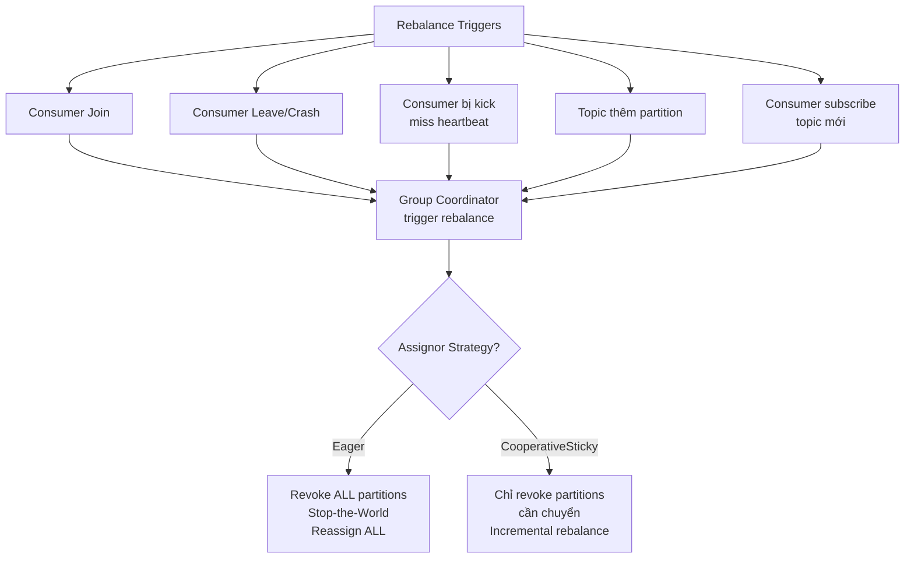
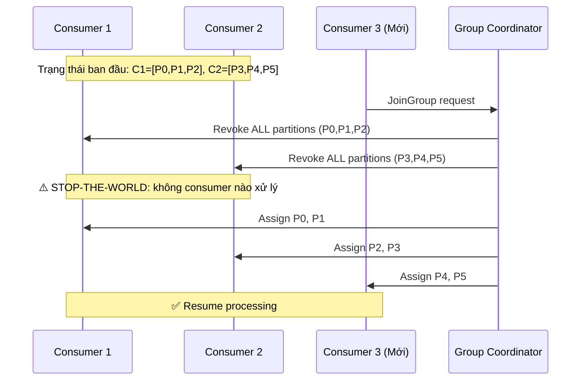
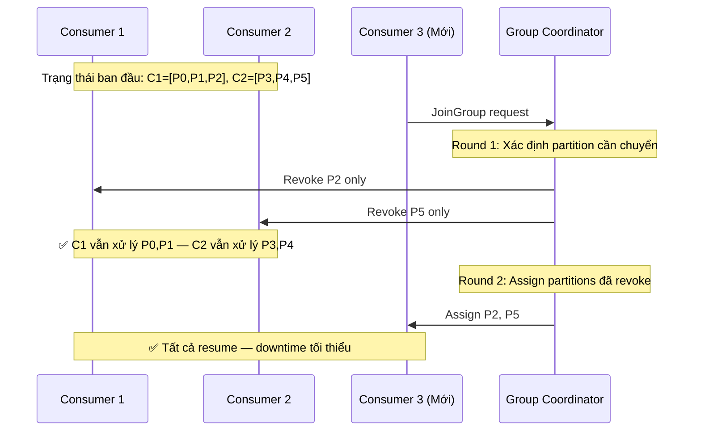

# Rebalancing là gì?

## ⚡ Tóm tắt ngắn (30s)
* **Rebalancing** là quá trình Kafka **phân phối lại partitions** giữa các consumers trong cùng một consumer group
* Xảy ra khi: consumer **join/leave** group, consumer bị coi là **dead** (miss heartbeat), hoặc topic **thêm partition**
* Trong thời gian rebalance, **toàn bộ consumer group ngừng xử lý** (Stop-the-World) → ảnh hưởng lớn đến throughput
* Kafka có 3 strategy: **Eager** (revoke tất cả), **CooperativeSticky** (chỉ revoke partition cần chuyển) — production nên dùng **CooperativeSticky**
* Rebalance storms là một trong những vấn đề phổ biến nhất khi vận hành Kafka ở production

---

## 🔍 Chi tiết bản chất thực chiến

### Khi nào Rebalance xảy ra?



### Eager Rebalance (Legacy - mặc định cũ)



### Cooperative Sticky Rebalance (Recommended)



### Các config quan trọng liên quan Rebalance

| Config | Default | Ý nghĩa |
| :--- | :--- | :--- |
| `session.timeout.ms` | 45000 (45s) | Thời gian broker chờ heartbeat trước khi kick consumer |
| `heartbeat.interval.ms` | 3000 (3s) | Consumer gửi heartbeat mỗi 3s |
| `max.poll.interval.ms` | 300000 (5 min) | Thời gian tối đa giữa 2 lần poll() |
| `partition.assignment.strategy` | RangeAssignor | Strategy phân chia partition |
| `group.instance.id` | null | Set để dùng Static Membership |

---

## 💻 Code thực chiến: BAD vs GOOD

### ❌ BAD: Config gây rebalance storm
```java
@Configuration
public class KafkaConsumerConfig {
    @Bean
    public ConsumerFactory<String, String> consumerFactory() {
        Map<String, Object> props = new HashMap<>();
        props.put(ConsumerConfig.BOOTSTRAP_SERVERS_CONFIG, "localhost:9092");
        props.put(ConsumerConfig.GROUP_ID_CONFIG, "order-group");

        // ❌ session.timeout quá ngắn → consumer bị kick dễ dàng
        props.put(ConsumerConfig.SESSION_TIMEOUT_MS_CONFIG, 6000);

        // ❌ max.poll.interval quá ngắn cho heavy processing
        props.put(ConsumerConfig.MAX_POLL_INTERVAL_MS_CONFIG, 10000);

        // ❌ Fetch quá nhiều records → xử lý lâu → vượt max.poll.interval
        props.put(ConsumerConfig.MAX_POLL_RECORDS_CONFIG, 1000);

        // ❌ Dùng Eager strategy (default cũ) → Stop-the-World mỗi lần rebalance
        props.put(ConsumerConfig.PARTITION_ASSIGNMENT_STRATEGY_CONFIG,
                "org.apache.kafka.clients.consumer.RangeAssignor");

        return new DefaultKafkaConsumerFactory<>(props);
    }
}

@KafkaListener(topics = "orders")
public void process(ConsumerRecord<String, String> record) {
    // ❌ Heavy processing: gọi external API, chờ 30s
    // → vượt max.poll.interval=10s → consumer bị kick → REBALANCE
    ExternalResult result = externalApi.call(record.value()); // 30s timeout
    orderService.update(result);
}
```

---

### ✅ GOOD: Config tối ưu tránh rebalance storm
```java
@Configuration
public class KafkaConsumerConfig {
    @Bean
    public ConsumerFactory<String, String> consumerFactory() {
        Map<String, Object> props = new HashMap<>();
        props.put(ConsumerConfig.BOOTSTRAP_SERVERS_CONFIG, "kafka1:9092,kafka2:9092");
        props.put(ConsumerConfig.GROUP_ID_CONFIG, "order-group");

        // ✅ CooperativeSticky: incremental rebalance, tránh stop-the-world
        props.put(ConsumerConfig.PARTITION_ASSIGNMENT_STRATEGY_CONFIG,
                "org.apache.kafka.clients.consumer.CooperativeStickyAssignor");

        // ✅ Session timeout hợp lý
        props.put(ConsumerConfig.SESSION_TIMEOUT_MS_CONFIG, 30000);
        props.put(ConsumerConfig.HEARTBEAT_INTERVAL_MS_CONFIG, 10000);

        // ✅ max.poll.interval đủ lớn cho processing time
        props.put(ConsumerConfig.MAX_POLL_INTERVAL_MS_CONFIG, 600000); // 10 phút

        // ✅ Giảm records per poll để xử lý nhanh hơn
        props.put(ConsumerConfig.MAX_POLL_RECORDS_CONFIG, 50);

        // ✅ Static Group Membership: tránh rebalance khi consumer restart ngắn
        props.put(ConsumerConfig.GROUP_INSTANCE_ID_CONFIG,
                "order-consumer-" + InetAddress.getLocalHost().getHostName());

        return new DefaultKafkaConsumerFactory<>(props);
    }
}

@Service
@Slf4j
public class OrderConsumer {

    @KafkaListener(topics = "orders", groupId = "order-group")
    public void process(ConsumerRecord<String, String> record, Acknowledgment ack) {
        // ✅ Xử lý nhanh, đẩy heavy work vào thread pool riêng
        CompletableFuture.runAsync(() -> {
            ExternalResult result = externalApi.call(record.value());
            orderService.update(result);
        }, asyncExecutor)
        .thenRun(() -> ack.acknowledge())
        .exceptionally(ex -> {
            log.error("Failed: {}", record.key(), ex);
            return null;
        });
    }
}
```

---

### ✅ GOOD: Rebalance Listener để handle state cleanup
```java
@Component
public class RebalanceAwareConsumer {

    @Bean
    public ConcurrentKafkaListenerContainerFactory<String, String> kafkaListenerContainerFactory(
            ConsumerFactory<String, String> cf) {
        var factory = new ConcurrentKafkaListenerContainerFactory<String, String>();
        factory.setConsumerFactory(cf);
        factory.getContainerProperties().setAckMode(ContainerProperties.AckMode.MANUAL);

        // ✅ Rebalance listener để xử lý khi partition bị revoke/assign
        factory.getContainerProperties().setConsumerRebalanceListener(
            new ConsumerAwareRebalanceListener() {
                @Override
                public void onPartitionsRevoked(Collection<TopicPartition> partitions) {
                    // ✅ Commit pending offsets trước khi mất partition
                    log.warn("Partitions REVOKED: {}", partitions);
                    // Flush in-memory buffer, commit pending work
                    bufferService.flushAndCommit(partitions);
                }

                @Override
                public void onPartitionsAssigned(Collection<TopicPartition> partitions) {
                    // ✅ Initialize state cho partitions mới
                    log.info("Partitions ASSIGNED: {}", partitions);
                    partitions.forEach(p -> stateStore.initialize(p));
                }

                @Override
                public void onPartitionsLost(Collection<TopicPartition> partitions) {
                    // ✅ Partition mất đột ngột (consumer crash)
                    log.error("Partitions LOST: {} - cleanup without commit", partitions);
                    partitions.forEach(p -> stateStore.cleanup(p));
                }
            }
        );
        return factory;
    }
}
```

---

## 📊 Bảng so sánh Partition Assignment Strategies

| Tiêu chí | RangeAssignor | RoundRobinAssignor | CooperativeStickyAssignor |
| :--- | :--- | :--- | :--- |
| **Cách chia** | Range liên tục per topic | Round-robin across topics | Sticky + incremental |
| **Stop-the-World** | Có | Có | **Không** |
| **Partition stickiness** | Không | Không | **Có** |
| **Balanced?** | Có thể lệch | Balanced | Balanced + sticky |
| **Rebalance speed** | Nhanh (1 round) | Nhanh (1 round) | Chậm hơn (2 rounds) |
| **Production recommendation** | ❌ Legacy | ❌ Legacy | ✅ **Recommended** |

---

## ⚠️ Common Gotchas & Questions follow-up

### 1. Rebalance Storm: khi consumer liên tục join/leave
* **Problem**: Container orchestrator (K8s) rolling restart 10 consumers → 10 rebalances liên tiếp
* **Solution**: Dùng **Static Group Membership** (`group.instance.id`) — consumer rejoin trong `session.timeout.ms` sẽ **không trigger rebalance**
* Static membership + `session.timeout.ms=300s` = consumer có 5 phút restart mà không rebalance

### 2. max.poll.interval.ms vs session.timeout.ms
* `session.timeout.ms`: Broker kiểm tra **heartbeat** (background thread gửi)
* `max.poll.interval.ms`: Broker kiểm tra **poll() frequency** (main thread gọi)
* **Gotcha**: Heartbeat vẫn gửi đều nhưng processing quá lâu → vượt `max.poll.interval` → bị kick
* Đây là 2 mechanism **độc lập** — cả 2 đều có thể trigger rebalance

### 3. Incremental Cooperative Rebalance cần 2 rounds
* Round 1: Coordinator tính toán assignment mới, yêu cầu revoke partitions cần chuyển
* Round 2: Assign partitions đã revoke cho consumer mới
* **Trade-off**: Chậm hơn eager ~vài giây, nhưng **không stop-the-world**

### 4. Consumer quá nhiều hơn partition
* Nếu 6 consumers mà chỉ 4 partitions → **2 consumers idle**, không nhận partition nào
* **Solution**: Đảm bảo `num.partitions >= max(consumer_count)` hoặc chấp nhận standby consumers cho HA

### 5. Follow-up: "Làm sao monitor rebalance?"
* Metric: `kafka.consumer.coordinator.rebalance.latency.avg/max`
* Log keyword: `"Revoking previously assigned partitions"`, `"Successfully joined group"`
* Alert: Rebalance frequency > 1/hour cho production system = cần investigate
* Tool: Kafka Consumer Group CLI (`kafka-consumer-groups.sh --describe`) để xem partition assignment
