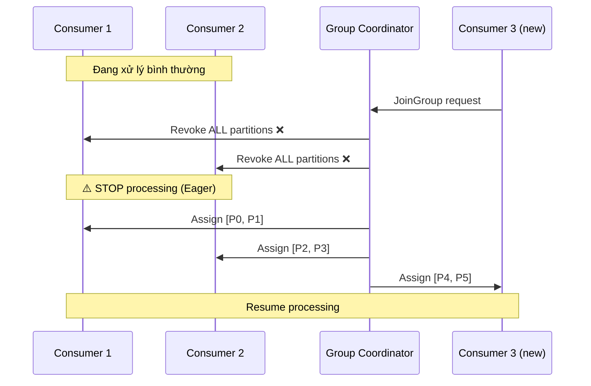

# Làm sao giảm tác động của rebalancing?

## ⚡ Tóm tắt ngắn (30s)
* Rebalancing là quá trình Kafka **phân phối lại partition** cho các consumer trong group — gây **stop-the-world** nếu dùng Eager protocol
* **3 chiến lược chính**: dùng `CooperativeStickyAssignor` (incremental rebalance), **Static Group Membership** (`group.instance.id`), và **tuning timeout** (`session.timeout.ms`, `max.poll.interval.ms`)
* Production phải tránh **unnecessary rebalance** từ deploy, scale, hoặc slow consumer — mỗi lần rebalance = **downtime vài giây đến vài phút**
* Từ Kafka 3.x+, `CooperativeStickyAssignor` là best practice thay thế hoàn toàn `RangeAssignor` mặc định

---

## 🔍 Chi tiết bản chất thực chiến

### Rebalancing là gì và tại sao nó đau?

Khi một consumer **join/leave** group, Kafka Coordinator trigger rebalancing để redistribute partition. Với **Eager protocol** (mặc định cũ), **tất cả consumer phải revoke mọi partition** trước khi reassign → toàn bộ group ngưng xử lý.



### 3 chiến lược giảm tác động

#### 1. CooperativeStickyAssignor (Incremental Rebalance)
Chỉ revoke partition **cần di chuyển**, các partition khác tiếp tục xử lý bình thường.

#### 2. Static Group Membership
Gán `group.instance.id` cố định → consumer restart không trigger rebalance ngay, chờ hết `session.timeout.ms` mới bị coi là rời group.

#### 3. Tuning Timeout & Poll Interval
- `session.timeout.ms` = 30–45s (tránh false positive khi GC pause)
- `max.poll.interval.ms` = phù hợp với thời gian xử lý batch thực tế
- `heartbeat.interval.ms` = 1/3 session timeout

---

## 💻 Code thực chiến: BAD vs GOOD

### ❌ BAD: Cấu hình mặc định gây rebalance liên tục
```java
@Configuration
public class KafkaConsumerConfig {

    @Bean
    public ConsumerFactory<String, String> consumerFactory() {
        Map<String, Object> props = new HashMap<>();
        props.put(ConsumerConfig.BOOTSTRAP_SERVERS_CONFIG, "localhost:9092");
        props.put(ConsumerConfig.GROUP_ID_CONFIG, "order-group");
        // ❌ Mặc định: RangeAssignor = Eager protocol → stop-the-world
        // ❌ Không có group.instance.id → mỗi restart = rebalance
        // ❌ session.timeout.ms mặc định 10s → GC pause dễ trigger false rebalance
        // ❌ max.poll.interval.ms = 300s mặc định, quá dài hoặc quá ngắn
        props.put(ConsumerConfig.KEY_DESERIALIZER_CLASS_CONFIG, StringDeserializer.class);
        props.put(ConsumerConfig.VALUE_DESERIALIZER_CLASS_CONFIG, StringDeserializer.class);
        return new DefaultKafkaConsumerFactory<>(props);
    }

    @KafkaListener(topics = "orders", groupId = "order-group")
    public void consume(String message) {
        // ❌ Xử lý quá lâu → vượt max.poll.interval.ms → rebalance
        callExternalApiWithoutTimeout(message); // có thể mất 10 phút
    }
}
```

---

### ✅ GOOD: Tối ưu rebalancing với Cooperative + Static Membership
```java
@Configuration
public class KafkaConsumerConfig {

    @Value("${HOSTNAME:consumer-1}")
    private String hostname;

    @Bean
    public ConsumerFactory<String, String> consumerFactory() {
        Map<String, Object> props = new HashMap<>();
        props.put(ConsumerConfig.BOOTSTRAP_SERVERS_CONFIG, "kafka:9092");
        props.put(ConsumerConfig.GROUP_ID_CONFIG, "order-group");

        // ✅ Incremental Cooperative Rebalancing — chỉ revoke partition cần move
        props.put(ConsumerConfig.PARTITION_ASSIGNMENT_STRATEGY_CONFIG,
            CooperativeStickyAssignor.class.getName());

        // ✅ Static Group Membership — restart không trigger rebalance
        props.put(ConsumerConfig.GROUP_INSTANCE_ID_CONFIG,
            "order-consumer-" + hostname);

        // ✅ Tuning timeouts hợp lý
        props.put(ConsumerConfig.SESSION_TIMEOUT_MS_CONFIG, 45_000);      // 45s
        props.put(ConsumerConfig.HEARTBEAT_INTERVAL_MS_CONFIG, 15_000);   // 1/3 session
        props.put(ConsumerConfig.MAX_POLL_INTERVAL_MS_CONFIG, 600_000);   // 10 phút
        props.put(ConsumerConfig.MAX_POLL_RECORDS_CONFIG, 100);           // Giới hạn batch

        props.put(ConsumerConfig.KEY_DESERIALIZER_CLASS_CONFIG, StringDeserializer.class);
        props.put(ConsumerConfig.VALUE_DESERIALIZER_CLASS_CONFIG, StringDeserializer.class);
        return new DefaultKafkaConsumerFactory<>(props);
    }
}

@Component
public class OrderConsumer {

    @KafkaListener(topics = "orders", groupId = "order-group", concurrency = "3")
    public void consume(ConsumerRecord<String, String> record,
                        Acknowledgment ack) {
        try {
            // ✅ Xử lý nhanh, có timeout → không vượt max.poll.interval.ms
            CompletableFuture.supplyAsync(() -> processOrder(record.value()))
                .orTimeout(30, TimeUnit.SECONDS)
                .join();
            ack.acknowledge();
        } catch (Exception e) {
            // ✅ Không block consumer thread → tránh rebalance
            sendToDeadLetterQueue(record);
            ack.acknowledge();
        }
    }
}
```

---

### ✅ GOOD: Rolling Deployment không gây rebalance
```yaml
# Kubernetes deployment strategy
apiVersion: apps/v1
kind: Deployment
spec:
  strategy:
    type: RollingUpdate
    rollingUpdate:
      maxSurge: 1         # Thêm 1 pod mới trước khi xóa pod cũ
      maxUnavailable: 0    # Không xóa pod cũ cho đến khi pod mới ready
  template:
    spec:
      terminationGracePeriodSeconds: 60  # Đủ thời gian để commit offset
      containers:
        - name: order-consumer
          env:
            # ✅ Static group instance id dựa trên pod name
            - name: HOSTNAME
              valueFrom:
                fieldRef:
                  fieldPath: metadata.name
```

---

## 📊 Bảng so sánh Rebalance Protocols

| Tiêu chí | Eager (RangeAssignor) | Cooperative (StickyAssignor) |
| :--- | :--- | :--- |
| Revoke strategy | Revoke **tất cả** partition | Chỉ revoke partition **cần di chuyển** |
| Downtime | **Toàn bộ group** ngưng xử lý | Chỉ partition bị move ngưng | 
| Số lần rebalance | 1 lần (nhưng toàn bộ) | 2 lần (nhưng incremental) |
| Phù hợp | Dev/test, ít consumer | **Production**, nhiều consumer |
| Kafka version | Mọi version | 2.4+ (stable từ 3.x) |
| Config | Mặc định | `CooperativeStickyAssignor` |

---

## ⚠️ Common Gotchas & Questions follow-up

### 1. Deploy gây rebalance storm
* **Problem**: Rolling deploy 10 pod → 10 lần rebalance liên tiếp
* **Consequence**: Consumer group lag tăng vọt, message bị delay hàng phút
* **Solution**: Dùng `group.instance.id` + `session.timeout.ms` đủ lớn để pod restart kịp rejoin mà không trigger rebalance

### 2. Slow consumer bị kick khỏi group
* **Problem**: Consumer xử lý record quá lâu → vượt `max.poll.interval.ms` → coordinator coi là dead
* **Consequence**: Rebalance + duplicate processing (record chưa commit offset)
* **Solution**: Giảm `max.poll.records`, tăng `max.poll.interval.ms`, hoặc offload processing sang thread pool riêng

### 3. Heartbeat thread vs Poll thread
* **Problem**: Nhầm lẫn `session.timeout.ms` và `max.poll.interval.ms`
* **Consequence**: `session.timeout.ms` = heartbeat thread (network), `max.poll.interval.ms` = poll thread (processing). Hai thằng **độc lập**
* **Solution**: `session.timeout.ms` cho network issue, `max.poll.interval.ms` cho slow processing — cần tune **cả hai**

### 4. Cooperative rebalance cần 2 round
* **Problem**: Incremental rebalance thực tế chạy 2 round: round 1 revoke, round 2 assign
* **Consequence**: Có khoảng thời gian ngắn giữa 2 round mà partition không ai xử lý
* **Solution**: Đây là trade-off chấp nhận được — tốt hơn nhiều so với stop-the-world của Eager
