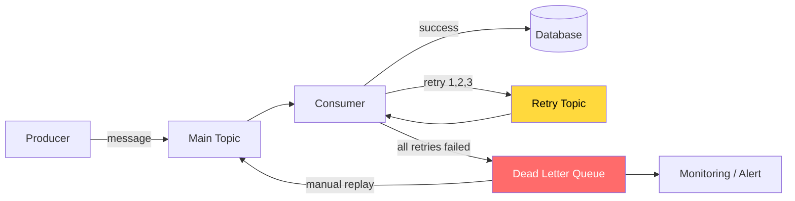

# Dead letter queue là gì?

## ⚡ Tóm tắt ngắn (30s)
* Dead Letter Queue (DLQ) là **topic riêng** chứa message mà consumer **không thể xử lý thành công** sau nhiều lần retry
* Mục đích: **tách biệt message lỗi** khỏi luồng chính để không block processing, đồng thời **lưu lại để phân tích/replay** sau
* Spring Kafka hỗ trợ sẵn `DeadLetterPublishingRecoverer` — tự động gửi failed message sang DLQ topic
* Production cần **monitoring DLQ lag**, **alert khi có message mới**, và **tooling để replay** message từ DLQ về topic gốc

---

## 🔍 Chi tiết bản chất thực chiến

### Tại sao cần DLQ?

Trong hệ thống messaging, có 2 loại lỗi:
- **Transient error**: network timeout, DB connection lost → **retry lại sẽ thành công**
- **Permanent error**: invalid data, schema mismatch, business rule violation → **retry bao nhiêu lần cũng fail**

Nếu không có DLQ, permanent error sẽ:
1. Block consumer (nếu retry vô hạn)
2. Mất message (nếu skip luôn)
3. Gây rebalance (nếu consumer bị stuck quá lâu)



### DLQ Naming Convention

Best practice: `<original-topic>.DLT` (Dead Letter Topic)
- `orders` → `orders.DLT`
- `payments.process` → `payments.process.DLT`

Spring Kafka mặc định dùng suffix `.DLT` — nên giữ convention này để dễ quản lý.

### DLQ Message phải chứa gì?

Message trong DLQ cần **đủ thông tin để debug và replay**:
- **Original message** (key + value)
- **Original topic, partition, offset** (để biết message gốc ở đâu)
- **Exception message + stacktrace** (để biết lỗi gì)
- **Retry count** (đã retry bao nhiêu lần)
- **Timestamp** (lỗi lúc nào)

---

## 💻 Code thực chiến: BAD vs GOOD

### ❌ BAD: Nuốt lỗi hoặc retry vô hạn, không có DLQ
```java
@Component
public class OrderConsumer {

    @KafkaListener(topics = "orders")
    public void consume(String message) {
        // ❌ Không có error handling → exception sẽ gây retry vô hạn
        // hoặc message bị skip mất
        Order order = objectMapper.readValue(message, Order.class);
        orderService.process(order);
    }
}

// Hoặc tệ hơn:
@KafkaListener(topics = "orders")
public void consume(String message) {
    try {
        orderService.process(message);
    } catch (Exception e) {
        // ❌ Nuốt lỗi — message biến mất, không ai biết
        log.error("Failed to process: {}", e.getMessage());
    }
}
```

---

### ✅ GOOD: DLQ với Spring Kafka DefaultErrorHandler
```java
@Configuration
@EnableKafka
public class KafkaConsumerConfig {

    @Bean
    public ConcurrentKafkaListenerContainerFactory<String, String>
            kafkaListenerContainerFactory(ConsumerFactory<String, String> cf,
                                          KafkaTemplate<String, String> template) {

        var factory = new ConcurrentKafkaListenerContainerFactory<String, String>();
        factory.setConsumerFactory(cf);

        // ✅ DeadLetterPublishingRecoverer: tự gửi sang topic .DLT sau khi hết retry
        var recoverer = new DeadLetterPublishingRecoverer(template,
            (record, ex) -> new TopicPartition(
                record.topic() + ".DLT", record.partition()));

        // ✅ FixedBackOff: retry 3 lần, cách nhau 1s, sau đó gửi DLQ
        var errorHandler = new DefaultErrorHandler(recoverer,
            new FixedBackOff(1000L, 3));

        // ✅ Chỉ retry với transient error, permanent error gửi thẳng DLQ
        errorHandler.addNotRetryableExceptions(
            DeserializationException.class,
            JsonParseException.class,
            IllegalArgumentException.class
        );

        factory.setCommonErrorHandler(errorHandler);
        factory.getContainerProperties()
               .setAckMode(ContainerProperties.AckMode.RECORD);
        return factory;
    }
}

@Component
@Slf4j
public class OrderConsumer {

    @KafkaListener(topics = "orders", groupId = "order-group")
    public void consume(ConsumerRecord<String, String> record) {
        log.info("Processing order from partition={}, offset={}",
            record.partition(), record.offset());
        // ✅ Exception sẽ được DefaultErrorHandler bắt → retry → DLQ
        Order order = parseAndValidate(record.value());
        orderService.process(order);
    }

    // ✅ DLQ consumer riêng — alert + lưu để phân tích
    @KafkaListener(topics = "orders.DLT", groupId = "order-dlt-group")
    public void consumeDlq(ConsumerRecord<String, String> record) {
        String originalTopic = new String(
            record.headers().lastHeader("kafka_dlt-original-topic").value());
        String exception = new String(
            record.headers().lastHeader("kafka_dlt-exception-message").value());

        log.error("DLQ message: originalTopic={}, key={}, error={}",
            originalTopic, record.key(), exception);

        // ✅ Lưu vào DB để dashboard hiển thị + replay sau
        dlqRepository.save(DlqRecord.builder()
            .originalTopic(originalTopic)
            .key(record.key())
            .value(record.value())
            .errorMessage(exception)
            .createdAt(Instant.now())
            .build());

        // ✅ Alert nếu DLQ tăng đột biến
        alertService.notifyDlq(originalTopic, record.key());
    }
}
```

---

### ✅ GOOD: DLQ Replay Service
```java
@Service
@Slf4j
public class DlqReplayService {

    private final KafkaTemplate<String, String> kafkaTemplate;
    private final DlqRepository dlqRepository;

    // ✅ Replay message từ DLQ về topic gốc sau khi fix bug
    public int replayMessages(String originalTopic, Instant from, Instant to) {
        List<DlqRecord> records = dlqRepository
            .findByOriginalTopicAndCreatedAtBetween(originalTopic, from, to);

        int replayed = 0;
        for (DlqRecord record : records) {
            kafkaTemplate.send(record.getOriginalTopic(),
                record.getKey(), record.getValue());
            record.setReplayedAt(Instant.now());
            record.setStatus("REPLAYED");
            replayed++;
        }
        dlqRepository.saveAll(records);
        log.info("Replayed {} messages to {}", replayed, originalTopic);
        return replayed;
    }
}
```

---

## 📊 Bảng so sánh các chiến lược xử lý message lỗi

| Tiêu chí | Nuốt lỗi (Swallow) | Retry vô hạn | DLQ | DLQ + Retry Topic |
| :--- | :--- | :--- | :--- | :--- |
| Message bị mất? | ✅ Có | ❌ Không | ❌ Không | ❌ Không |
| Block consumer? | ❌ Không | ✅ Có | ❌ Không | ❌ Không |
| Có thể replay? | ❌ Không | N/A | ✅ Có | ✅ Có |
| Debug được? | ❌ Khó | ❌ Khó | ✅ Có context | ✅ Đầy đủ nhất |
| Độ phức tạp | Thấp | Thấp | Trung bình | Cao |
| **Production-ready** | ❌ | ❌ | ✅ | ✅ |

---

## ⚠️ Common Gotchas & Questions follow-up

### 1. DLQ topic không tự tạo
* **Problem**: `orders.DLT` topic chưa tồn tại → `DeadLetterPublishingRecoverer` throw exception
* **Consequence**: Message lỗi bị mất hoặc consumer crash loop
* **Solution**: Cấu hình `NewTopic` bean hoặc set `allow.auto.topic.creation=true` trên broker (không khuyến khích production)

### 2. DLQ cũng cần monitoring
* **Problem**: Gửi vào DLQ rồi quên → message lỗi tích tụ, không ai xử lý
* **Consequence**: Data loss thầm lặng, business logic bị skip
* **Solution**: Alert khi DLQ consumer lag > 0, dashboard hiển thị DLQ metrics, SLA cho DLQ review (vd: review trong 24h)

### 3. Replay message trùng lặp
* **Problem**: Replay từ DLQ nhưng consumer không idempotent → xử lý trùng
* **Consequence**: Tạo duplicate order, charge tiền 2 lần
* **Solution**: Consumer phải **idempotent** (dùng unique key check), hoặc replay service kiểm tra trạng thái trước khi send

### 4. Header bị mất khi serialize
* **Problem**: DLQ message dùng header để lưu metadata (original topic, exception), nhưng consumer deserialize không đọc header
* **Consequence**: Mất context debug, không biết message gốc từ đâu
* **Solution**: Luôn consume `ConsumerRecord` thay vì plain object để truy cập header
