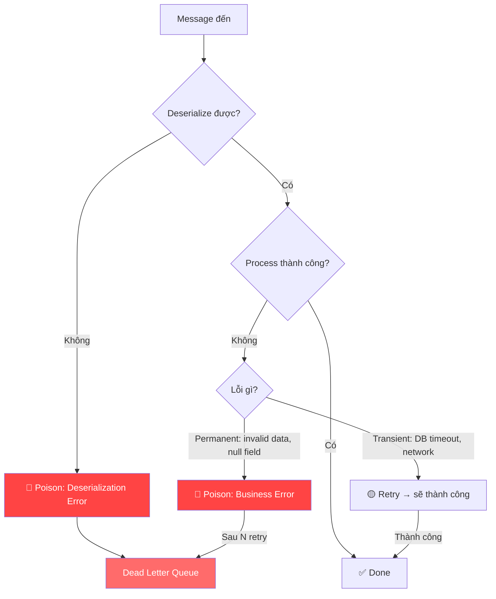

# Poison message là gì?

## ⚡ Tóm tắt ngắn (30s)
* Poison message (poison pill) là message mà consumer **không bao giờ xử lý thành công** — retry bao nhiêu lần cũng fail
* Nguyên nhân phổ biến: **deserialization failure**, schema không tương thích, data corrupt, hoặc message vi phạm business rule vĩnh viễn
* Nếu không xử lý poison message → consumer **bị stuck vĩnh viễn** tại offset đó → block toàn bộ partition
* Giải pháp: **ErrorHandlingDeserializer** cho deserialization error + **DefaultErrorHandler** với not-retryable exception list + **DLQ** để cách ly

---

## 🔍 Chi tiết bản chất thực chiến

### Poison message vs Normal error

Điểm khác biệt cốt lõi: poison message là **permanent failure** — không phải vấn đề tạm thời sẽ tự hết.



### Các dạng Poison Message thường gặp

| Loại | Ví dụ | Tần suất |
| :--- | :--- | :--- |
| **Deserialization** | Producer gửi JSON, consumer expect Avro | Rất phổ biến |
| **Schema mismatch** | Field `amount` đổi từ `int` → `string` | Phổ biến khi deploy |
| **Data corruption** | Message bị truncate, encoding sai | Hiếm |
| **Business invalid** | `orderId = null`, `quantity = -1` | Phổ biến |
| **Version mismatch** | Message v2 nhưng consumer chỉ hiểu v1 | Khi evolve schema |

### Tại sao poison message nguy hiểm?

Consumer Kafka xử lý **tuần tự theo partition**. Nếu message ở offset 100 là poison → consumer không thể commit offset → **tất cả message từ 101 trở đi đều bị block**.

---

## 💻 Code thực chiến: BAD vs GOOD

### ❌ BAD: Consumer bị stuck bởi poison message
```java
@Configuration
public class KafkaConfig {

    @Bean
    public ConsumerFactory<String, OrderEvent> consumerFactory() {
        Map<String, Object> props = new HashMap<>();
        props.put(ConsumerConfig.BOOTSTRAP_SERVERS_CONFIG, "kafka:9092");
        // ❌ Nếu message không phải JSON hợp lệ → JsonDeserializer throw exception
        // → Consumer retry vô hạn tại offset đó → STUCK
        props.put(ConsumerConfig.VALUE_DESERIALIZER_CLASS_CONFIG,
            JsonDeserializer.class);
        props.put(JsonDeserializer.TRUSTED_PACKAGES, "*");
        return new DefaultKafkaConsumerFactory<>(props);
    }
}

@Component
public class OrderConsumer {

    @KafkaListener(topics = "orders")
    public void consume(OrderEvent event) {
        // ❌ Nếu event.getAmount() = null → NullPointerException
        // ❌ Retry vô hạn, consumer bị stuck vĩnh viễn
        BigDecimal total = event.getAmount().multiply(event.getQuantity());
        orderService.save(event);
    }
}
```

---

### ✅ GOOD: Xử lý poison message đúng cách
```java
@Configuration
@EnableKafka
public class KafkaConfig {

    @Bean
    public ConsumerFactory<String, String> consumerFactory() {
        Map<String, Object> props = new HashMap<>();
        props.put(ConsumerConfig.BOOTSTRAP_SERVERS_CONFIG, "kafka:9092");
        props.put(ConsumerConfig.GROUP_ID_CONFIG, "order-group");

        // ✅ ErrorHandlingDeserializer: wrap deserializer thật
        // Nếu deserialization fail → trả về null + lưu exception vào header
        // KHÔNG throw exception → consumer không bị stuck
        props.put(ConsumerConfig.KEY_DESERIALIZER_CLASS_CONFIG,
            ErrorHandlingDeserializer.class);
        props.put(ConsumerConfig.VALUE_DESERIALIZER_CLASS_CONFIG,
            ErrorHandlingDeserializer.class);

        // Delegate thật bên trong
        props.put(ErrorHandlingDeserializer.KEY_DESERIALIZER_CLASS,
            StringDeserializer.class);
        props.put(ErrorHandlingDeserializer.VALUE_DESERIALIZER_CLASS,
            JsonDeserializer.class);

        props.put(JsonDeserializer.TRUSTED_PACKAGES, "com.example.event");
        props.put(JsonDeserializer.VALUE_DEFAULT_TYPE, OrderEvent.class.getName());

        return new DefaultKafkaConsumerFactory<>(props);
    }

    @Bean
    public ConcurrentKafkaListenerContainerFactory<String, String>
            kafkaListenerContainerFactory(ConsumerFactory<String, String> cf,
                                          KafkaTemplate<String, String> template) {

        var factory = new ConcurrentKafkaListenerContainerFactory<String, String>();
        factory.setConsumerFactory(cf);

        var recoverer = new DeadLetterPublishingRecoverer(template);

        var errorHandler = new DefaultErrorHandler(recoverer,
            new ExponentialBackOff(500L, 2.0));  // 500ms, 1s, 2s

        // ✅ Poison message types: KHÔNG retry, gửi thẳng DLQ
        errorHandler.addNotRetryableExceptions(
            DeserializationException.class,    // Schema/format sai
            ConversionException.class,         // Type mismatch
            MethodArgumentNotValidException.class, // Validation fail
            NullPointerException.class         // Null data
        );

        factory.setCommonErrorHandler(errorHandler);
        return factory;
    }
}

@Component
@Slf4j
public class OrderConsumer {

    private final MeterRegistry meterRegistry;

    @KafkaListener(topics = "orders", groupId = "order-group")
    public void consume(ConsumerRecord<String, OrderEvent> record) {
        OrderEvent event = record.value();

        // ✅ Kiểm tra deserialization error (poison message dạng 1)
        if (event == null) {
            log.error("Poison message detected: deserialization failed at offset={}",
                record.offset());
            meterRegistry.counter("kafka.poison.message",
                "topic", record.topic(), "type", "deserialization").increment();
            throw new DeserializationException("Cannot deserialize", null, false, null);
        }

        // ✅ Validate business rules (poison message dạng 2)
        validate(event);

        orderService.process(event);
    }

    private void validate(OrderEvent event) {
        if (event.getOrderId() == null) {
            // ✅ IllegalArgumentException = not-retryable → gửi thẳng DLQ
            throw new IllegalArgumentException(
                "Poison message: orderId is null");
        }
        if (event.getAmount() != null && event.getAmount().signum() < 0) {
            throw new IllegalArgumentException(
                "Poison message: negative amount = " + event.getAmount());
        }
    }
}
```

---

## 📊 Bảng so sánh cách xử lý Poison Message

| Chiến lược | Ưu điểm | Nhược điểm | Khi nào dùng |
| :--- | :--- | :--- | :--- |
| **Skip (log & continue)** | Đơn giản, không block | Mất message | Non-critical data (logs, metrics) |
| **DLQ** | Không mất, có thể replay | Cần thêm topic + monitoring | **Production default** |
| **Pause partition** | Dừng partition lỗi, partition khác tiếp tục | Phức tạp implement | High-value financial data |
| **Custom retry topic** | Kiểm soát retry policy chi tiết | Nhiều topic phụ | Complex retry logic |

---

## ⚠️ Common Gotchas & Questions follow-up

### 1. Deserialization error không vào @KafkaListener
* **Problem**: Nếu không dùng `ErrorHandlingDeserializer`, deserialization fail **trước khi** vào listener method → không catch được trong try-catch
* **Consequence**: Consumer restart loop, message bị stuck
* **Solution**: Luôn dùng `ErrorHandlingDeserializer` wrap deserializer thật — nó chuyển exception thành header, value = null

### 2. Poison message gây cascade failure
* **Problem**: 1 producer bug gửi hàng ngàn poison message → DLQ tràn, consumer lag tăng vọt
* **Consequence**: Alert storm, team hoảng loạn
* **Solution**: Circuit breaker ở consumer — nếu DLQ rate > threshold thì pause consumer + alert urgent. Fix producer trước.

### 3. Phân biệt poison vs transient error
* **Problem**: NullPointerException do bug code (poison) vs NullPointerException do race condition (transient) — cùng exception type
* **Consequence**: Cấu hình sai not-retryable → mất message hoặc stuck
* **Solution**: Wrap business exception rõ ràng: `PermanentProcessingException` vs `TransientProcessingException` thay vì dựa vào Java exception type

### 4. Consumer lag monitoring sau poison message
* **Problem**: Poison message bị skip nhưng **offset đã commit** → consumer lag metric không phản ánh data loss
* **Consequence**: Tưởng mọi thứ bình thường nhưng thực tế mất message
* **Solution**: Monitor cả **DLQ message count** + **consumer lag** — hai metric bổ sung cho nhau
