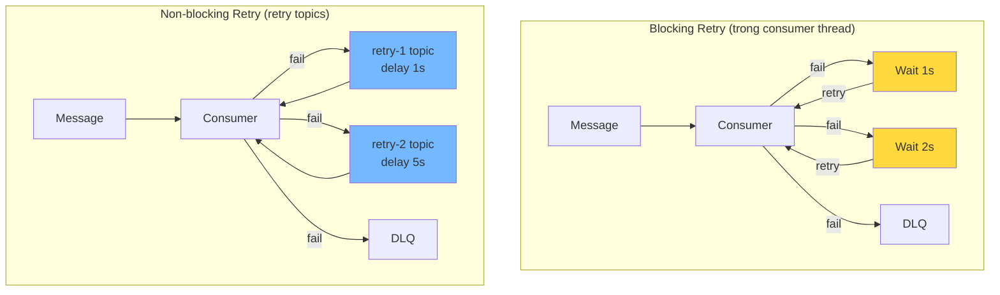

# Retry message nên thiết kế ra sao?

## ⚡ Tóm tắt ngắn (30s)
* Có 2 chiến lược retry chính: **Blocking retry** (retry ngay trong consumer thread) và **Non-blocking retry** (dùng retry topic riêng)
* **Blocking retry**: đơn giản, dùng `DefaultErrorHandler` + `BackOff` — phù hợp khi retry ít lần, delay ngắn
* **Non-blocking retry**: dùng `@RetryableTopic` hoặc retry topic chain (`orders-retry-1`, `orders-retry-2`) — consumer không bị block, throughput không giảm
* Spring Kafka 3.x cung cấp `@RetryableTopic` — annotation-based non-blocking retry cực kỳ tiện
* **Quan trọng nhất**: phân biệt **retryable error** (transient) vs **non-retryable error** (permanent) — retry sai loại = lãng phí resource

---

## 🔍 Chi tiết bản chất thực chiến

### Blocking vs Non-blocking Retry



### Khi nào dùng loại nào?

| Tình huống | Blocking | Non-blocking |
| :--- | :--- | :--- |
| Retry 1-3 lần, delay < 1s | ✅ | Overkill |
| Retry 5+ lần, delay phút/giờ | ❌ Block consumer | ✅ |
| High throughput topic | ❌ Giảm throughput | ✅ |
| Cần ordering guarantee | ✅ Giữ thứ tự | ❌ Mất thứ tự |
| Đơn giản, ít topic | ✅ | ❌ Nhiều topic phụ |

---

## 💻 Code thực chiến: BAD vs GOOD

### ❌ BAD: Tự implement retry bằng tay, đầy lỗi
```java
@Component
public class OrderConsumer {

    @KafkaListener(topics = "orders")
    public void consume(ConsumerRecord<String, String> record) {
        int maxRetries = 3;
        int attempt = 0;

        // ❌ Retry loop trong consumer thread → block partition processing
        while (attempt < maxRetries) {
            try {
                orderService.process(record.value());
                return;
            } catch (Exception e) {
                attempt++;
                // ❌ Thread.sleep block consumer thread → có thể vượt max.poll.interval.ms
                // ❌ → Trigger rebalance!
                try { Thread.sleep(attempt * 5000L); } catch (InterruptedException ie) {}
            }
        }
        // ❌ Sau 3 retry: log rồi nuốt → message biến mất
        log.error("Failed after {} retries: {}", maxRetries, record.value());
    }
}
```

---

### ✅ GOOD: Blocking retry với DefaultErrorHandler
```java
@Configuration
public class KafkaRetryConfig {

    @Bean
    public ConcurrentKafkaListenerContainerFactory<String, String>
            kafkaListenerContainerFactory(ConsumerFactory<String, String> cf,
                                          KafkaTemplate<String, String> template) {

        var factory = new ConcurrentKafkaListenerContainerFactory<String, String>();
        factory.setConsumerFactory(cf);

        // ✅ Exponential backoff: 500ms → 1s → 2s → 4s → DLQ
        var backOff = new ExponentialBackOff(500L, 2.0);
        backOff.setMaxElapsedTime(10_000L); // max 10s total

        var recoverer = new DeadLetterPublishingRecoverer(template,
            (r, e) -> new TopicPartition(r.topic() + ".DLT", r.partition()));

        var errorHandler = new DefaultErrorHandler(recoverer, backOff);

        // ✅ Phân loại rõ: permanent error → DLQ ngay, không retry
        errorHandler.addNotRetryableExceptions(
            DeserializationException.class,
            InvalidOrderException.class,
            SchemaValidationException.class
        );

        factory.setCommonErrorHandler(errorHandler);
        return factory;
    }
}
```

---

### ✅ GOOD: Non-blocking retry với @RetryableTopic (Spring Kafka 3.x)
```java
@Component
@Slf4j
public class PaymentConsumer {

    // ✅ Spring Kafka tự tạo retry topics + DLT
    // payments → payments-retry-0 (1s) → payments-retry-1 (5s)
    //         → payments-retry-2 (30s) → payments.DLT
    @RetryableTopic(
        attempts = "4",                                // 1 main + 3 retry
        backoff = @Backoff(
            delay = 1000,                              // 1s ban đầu
            multiplier = 5,                            // x5 mỗi lần
            maxDelay = 30000                           // max 30s
        ),
        topicSuffixingStrategy = TopicSuffixingStrategy.SUFFIX_WITH_INDEX_VALUE,
        dltStrategy = DltStrategy.FAIL_ON_ERROR,       // DLT là trạm cuối
        exclude = {                                     // Không retry permanent error
            DeserializationException.class,
            InvalidPaymentException.class
        }
    )
    @KafkaListener(topics = "payments", groupId = "payment-group")
    public void consume(ConsumerRecord<String, PaymentEvent> record) {
        log.info("Processing payment: key={}, attempt header check",
            record.key());

        PaymentEvent event = record.value();
        // Nếu throw exception → tự động gửi sang retry topic tiếp theo
        paymentGateway.charge(event); // Có thể throw TransientException
    }

    // ✅ DLT handler — xử lý message đã hết retry
    @DltHandler
    public void handleDlt(ConsumerRecord<String, PaymentEvent> record) {
        log.error("Payment failed permanently: key={}, value={}",
            record.key(), record.value());
        // Lưu vào DB, gửi alert, tạo support ticket
        failedPaymentService.save(record);
        alertService.critical("Payment DLT: " + record.key());
    }
}
```

---

### ✅ GOOD: Custom retry với header tracking
```java
@Component
@Slf4j
public class OrderRetryConsumer {

    private static final String RETRY_COUNT_HEADER = "x-retry-count";
    private static final String FIRST_FAILURE_HEADER = "x-first-failure-at";
    private static final int MAX_RETRIES = 5;

    private final KafkaTemplate<String, String> kafkaTemplate;

    @KafkaListener(topics = {"orders", "orders.retry"}, groupId = "order-group")
    public void consume(ConsumerRecord<String, String> record) {
        int retryCount = getRetryCount(record);

        try {
            orderService.process(record.value());
        } catch (TransientException e) {
            if (retryCount >= MAX_RETRIES) {
                // ✅ Hết retry → DLQ
                sendToDlq(record, e, retryCount);
                return;
            }
            // ✅ Gửi sang retry topic với header tracking
            sendToRetry(record, retryCount);
        } catch (PermanentException e) {
            // ✅ Permanent → DLQ ngay, không retry
            sendToDlq(record, e, retryCount);
        }
    }

    private void sendToRetry(ConsumerRecord<String, String> record, int retryCount) {
        ProducerRecord<String, String> retryRecord = new ProducerRecord<>(
            "orders.retry", record.key(), record.value());

        // ✅ Track retry metadata trong header
        retryRecord.headers()
            .add(RETRY_COUNT_HEADER,
                String.valueOf(retryCount + 1).getBytes())
            .add(FIRST_FAILURE_HEADER,
                getOrSetFirstFailure(record).getBytes());

        kafkaTemplate.send(retryRecord);
        log.warn("Retry #{} for key={}", retryCount + 1, record.key());
    }

    private int getRetryCount(ConsumerRecord<String, String> record) {
        Header header = record.headers().lastHeader(RETRY_COUNT_HEADER);
        return header != null ? Integer.parseInt(new String(header.value())) : 0;
    }
}
```

---

## 📊 Bảng so sánh Retry Strategies

| Tiêu chí | Blocking (DefaultErrorHandler) | Non-blocking (@RetryableTopic) | Custom Retry Topic |
| :--- | :--- | :--- | :--- |
| Độ phức tạp | Thấp | Trung bình | Cao |
| Throughput impact | Giảm khi retry | Không ảnh hưởng | Không ảnh hưởng |
| Message ordering | ✅ Giữ thứ tự | ❌ Mất thứ tự | ❌ Mất thứ tự |
| Max delay hợp lý | < 10s | < 1 giờ | Không giới hạn |
| Số topic phụ | 0 (+ 1 DLT) | N retry + 1 DLT | Tùy thiết kế |
| Spring support | Có sẵn | Có sẵn (3.x+) | Tự implement |
| **Khi nào dùng** | Simple retry | **Production default** | Custom business logic |

---

## ⚠️ Common Gotchas & Questions follow-up

### 1. Retry gây duplicate processing
* **Problem**: Message retry thành công nhưng offset chưa commit → consumer restart → xử lý lại
* **Consequence**: Charge tiền 2 lần, tạo duplicate record
* **Solution**: Consumer phải **idempotent** — dùng idempotency key (orderId, transactionId) + upsert thay insert

### 2. Non-blocking retry mất message ordering
* **Problem**: Message A (offset 100) fail → vào retry topic. Message B (offset 101) success. Message A retry success sau → B xử lý trước A
* **Consequence**: State inconsistent nếu A và B liên quan cùng entity
* **Solution**: Nếu ordering critical → dùng blocking retry. Hoặc design consumer idempotent + dùng version/timestamp check

### 3. Exponential backoff quá lâu
* **Problem**: Backoff 1s → 2s → 4s → 8s → 16s → ... → hàng giờ
* **Consequence**: Message quan trọng bị delay quá lâu
* **Solution**: Luôn set `maxDelay` cap — vd max 30s hoặc 1 phút. Dùng `maxElapsedTime` để giới hạn tổng thời gian retry

### 4. Retry topic consumer cần group riêng?
* **Problem**: Retry topic dùng chung consumer group với main topic?
* **Consequence**: `@RetryableTopic` tự quản lý — mỗi retry topic có consumer riêng trong cùng group. Custom implementation cần cẩn thận
* **Solution**: Với `@RetryableTopic` thì Spring lo. Với custom → dùng cùng `@KafkaListener` handle cả main + retry topic, hoặc tách group riêng
