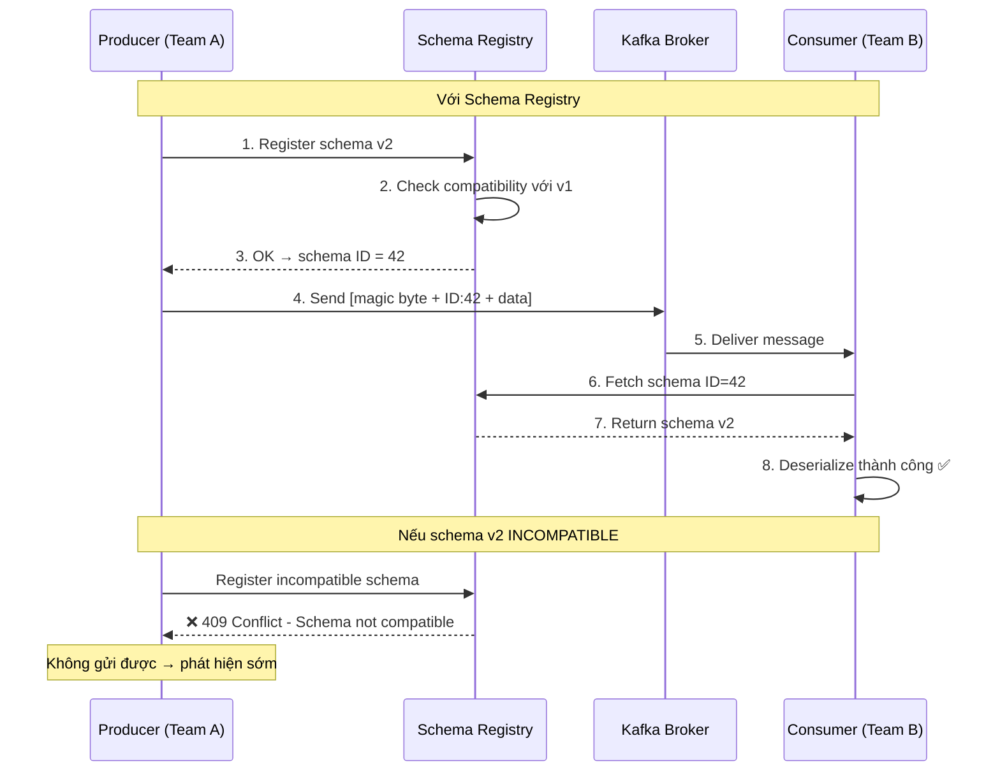

# Schema Registry dùng để làm gì?

## ⚡ Tóm tắt ngắn (30s)
* Schema Registry là **service trung tâm** quản lý schema (Avro, Protobuf, JSON Schema) cho Kafka message — đảm bảo **producer và consumer đồng ý format dữ liệu**
* Giải quyết vấn đề: producer thay đổi schema → consumer cũ bị crash vì **deserialization fail** (poison message)
* Schema Registry enforce **compatibility rules** (BACKWARD, FORWARD, FULL) → ngăn breaking change lọt vào production
* Message trong Kafka chỉ chứa **schema ID** (4 bytes) thay vì toàn bộ schema → **tiết kiệm bandwidth** đáng kể so với JSON

---

## 🔍 Chi tiết bản chất thực chiến

### Vấn đề khi không có Schema Registry

Trong hệ thống microservice dùng Kafka, producer và consumer là **các team/service khác nhau**. Khi producer thay đổi message format (thêm/xóa field, đổi type) mà không báo consumer → **deserialization failure hàng loạt**.



### Schema Registry hoạt động thế nào?

1. **Producer serialize**: Tra schema trong Registry → lấy schema ID → gửi `[0x00][schema-id-4bytes][avro-data]`
2. **Consumer deserialize**: Đọc schema ID từ message → fetch schema từ Registry → deserialize
3. **Schema caching**: Cả producer và consumer cache schema locally → không call Registry mỗi message

### Compatibility Modes

| Mode | Cho phép | Ví dụ |
| :--- | :--- | :--- |
| **BACKWARD** (default) | Thêm field có default, xóa field | Consumer mới đọc được data cũ |
| **FORWARD** | Xóa field, thêm field có default | Consumer cũ đọc được data mới |
| **FULL** | Chỉ thêm/xóa field có default | Cả hai chiều tương thích |
| **NONE** | Mọi thay đổi | Không check — nguy hiểm |

---

## 💻 Code thực chiến: BAD vs GOOD

### ❌ BAD: Dùng JSON không có schema — breaking change âm thầm
```java
// Producer - Team A: đổi field name mà không báo ai
@Component
public class OrderProducer {
    @Autowired
    private KafkaTemplate<String, String> kafkaTemplate;

    public void sendOrder(Order order) {
        // ❌ Serialize thành JSON string — không có schema enforcement
        String json = objectMapper.writeValueAsString(order);
        kafkaTemplate.send("orders", order.getId(), json);
    }
}

// Version 1: {"orderId": "123", "amount": 100}
// Version 2: {"order_id": "123", "total": 100}  ← đổi field name!
// Consumer bị crash vì expect "orderId" và "amount"

// Consumer - Team B: bị poison message
@Component
public class OrderConsumer {
    @KafkaListener(topics = "orders")
    public void consume(String json) {
        // ❌ JsonParseException hoặc null field — không ai validate schema trước
        Order order = objectMapper.readValue(json, Order.class);
        // order.getOrderId() = null ← field name đổi thành order_id!
        process(order);
    }
}
```

---

### ✅ GOOD: Avro + Schema Registry
```java
// 1. Định nghĩa Avro schema: src/main/avro/OrderEvent.avsc
/*
{
  "type": "record",
  "name": "OrderEvent",
  "namespace": "com.example.event",
  "fields": [
    {"name": "orderId", "type": "string"},
    {"name": "amount", "type": "double"},
    {"name": "currency", "type": "string", "default": "VND"},
    {"name": "customerId", "type": "string"},
    {"name": "createdAt", "type": "long", "logicalType": "timestamp-millis"}
  ]
}
*/

// 2. Producer Configuration
@Configuration
public class KafkaProducerConfig {

    @Bean
    public ProducerFactory<String, OrderEvent> producerFactory() {
        Map<String, Object> props = new HashMap<>();
        props.put(ProducerConfig.BOOTSTRAP_SERVERS_CONFIG, "kafka:9092");

        // ✅ Avro serializer tự register schema lên Registry
        props.put(ProducerConfig.KEY_SERIALIZER_CLASS_CONFIG,
            StringSerializer.class);
        props.put(ProducerConfig.VALUE_SERIALIZER_CLASS_CONFIG,
            KafkaAvroSerializer.class);

        // ✅ Schema Registry URL
        props.put("schema.registry.url", "http://schema-registry:8081");

        // ✅ Auto-register schema (disable ở production, dùng CI/CD register)
        props.put("auto.register.schemas", false);

        return new DefaultKafkaProducerFactory<>(props);
    }
}

@Component
public class OrderProducer {

    @Autowired
    private KafkaTemplate<String, OrderEvent> kafkaTemplate;

    public void sendOrder(String orderId, double amount, String customerId) {
        // ✅ Type-safe, schema-validated Avro object
        OrderEvent event = OrderEvent.newBuilder()
            .setOrderId(orderId)
            .setAmount(amount)
            .setCurrency("VND")
            .setCustomerId(customerId)
            .setCreatedAt(Instant.now().toEpochMilli())
            .build();

        kafkaTemplate.send("orders", orderId, event);
    }
}
```

```java
// 3. Consumer Configuration
@Configuration
public class KafkaConsumerConfig {

    @Bean
    public ConsumerFactory<String, OrderEvent> consumerFactory() {
        Map<String, Object> props = new HashMap<>();
        props.put(ConsumerConfig.BOOTSTRAP_SERVERS_CONFIG, "kafka:9092");
        props.put(ConsumerConfig.GROUP_ID_CONFIG, "order-consumer-group");

        props.put(ConsumerConfig.KEY_DESERIALIZER_CLASS_CONFIG,
            StringDeserializer.class);
        // ✅ Avro deserializer tự fetch schema từ Registry
        props.put(ConsumerConfig.VALUE_DESERIALIZER_CLASS_CONFIG,
            KafkaAvroDeserializer.class);

        props.put("schema.registry.url", "http://schema-registry:8081");
        // ✅ Deserialize thành specific Avro class thay vì GenericRecord
        props.put("specific.avro.reader", true);

        return new DefaultKafkaConsumerFactory<>(props);
    }
}

@Component
@Slf4j
public class OrderConsumer {

    @KafkaListener(topics = "orders", groupId = "order-consumer-group")
    public void consume(OrderEvent event) {
        // ✅ Type-safe, compile-time check — không sợ field name sai
        log.info("Order received: id={}, amount={} {}",
            event.getOrderId(), event.getAmount(), event.getCurrency());
        orderService.process(event);
    }
}
```

---

### ✅ GOOD: Schema Evolution — thêm field an toàn
```java
// Schema v2: Thêm field "discountPercent" với default value
/*
{
  "type": "record",
  "name": "OrderEvent",
  "namespace": "com.example.event",
  "fields": [
    {"name": "orderId", "type": "string"},
    {"name": "amount", "type": "double"},
    {"name": "currency", "type": "string", "default": "VND"},
    {"name": "customerId", "type": "string"},
    {"name": "createdAt", "type": "long", "logicalType": "timestamp-millis"},
    // ✅ BACKWARD compatible: thêm field MỚI với DEFAULT value
    // Consumer cũ (v1) đọc data v2 → ignore field mới → OK
    // Consumer mới (v2) đọc data v1 → dùng default 0.0 → OK
    {"name": "discountPercent", "type": "double", "default": 0.0}
  ]
}
*/

// CI/CD pipeline: register schema trước khi deploy
// curl -X POST http://schema-registry:8081/subjects/orders-value/versions \
//   -H "Content-Type: application/vnd.schemaregistry.v1+json" \
//   -d '{"schema": "..."}'
// → Nếu incompatible → 409 → pipeline fail → không deploy
```

---

## 📊 Bảng so sánh Serialization Formats

| Tiêu chí | JSON (no schema) | JSON Schema | Avro | Protobuf |
| :--- | :--- | :--- | :--- | :--- |
| Message size | Lớn (field names) | Lớn | **Nhỏ nhất** (binary) | Nhỏ (binary) |
| Schema evolution | ❌ Không enforce | ✅ Có | ✅ Có | ✅ Có |
| Type safety | ❌ Runtime | ✅ Runtime | ✅ **Compile-time** | ✅ **Compile-time** |
| Human readable | ✅ | ✅ | ❌ Binary | ❌ Binary |
| Code generation | ❌ | ❌ | ✅ Avro compiler | ✅ protoc |
| Kafka ecosystem | Phổ biến | Ít | **Phổ biến nhất** | Đang tăng |
| Compatibility check | ❌ | Cơ bản | **Mạnh nhất** | Mạnh |

---

## ⚠️ Common Gotchas & Questions follow-up

### 1. Schema Registry là Single Point of Failure?
* **Problem**: Schema Registry down → producer/consumer không serialize/deserialize được?
* **Consequence**: Không hẳn — client **cache schema locally**. Chỉ fail khi gặp schema ID mới chưa cache
* **Solution**: Deploy Schema Registry HA (multi-node), client cache TTL đủ dài. Confluent Schema Registry hỗ trợ leader election qua Kafka

### 2. auto.register.schemas = true ở production
* **Problem**: Bật auto-register → bất kỳ producer nào cũng có thể register schema mới
* **Consequence**: Breaking change lọt vào mà không qua review
* **Solution**: Production: `auto.register.schemas=false`. Schema register qua **CI/CD pipeline** với compatibility check + approval

### 3. Subject naming strategy
* **Problem**: Mặc định `TopicNameStrategy` = 1 schema per topic. Nếu 1 topic chứa nhiều event type?
* **Consequence**: Không register được nhiều schema cho cùng topic
* **Solution**: Dùng `RecordNameStrategy` (schema theo record name) hoặc `TopicRecordNameStrategy` (topic + record name)

### 4. Xóa field không có default
* **Problem**: Schema v1 có field `address` (required), v2 xóa field `address`
* **Consequence**: Consumer v1 đọc data v2 → fail vì thiếu required field
* **Solution**: **Không bao giờ xóa required field** — deprecate bằng cách thêm default value trước, rồi mới xóa ở version sau
