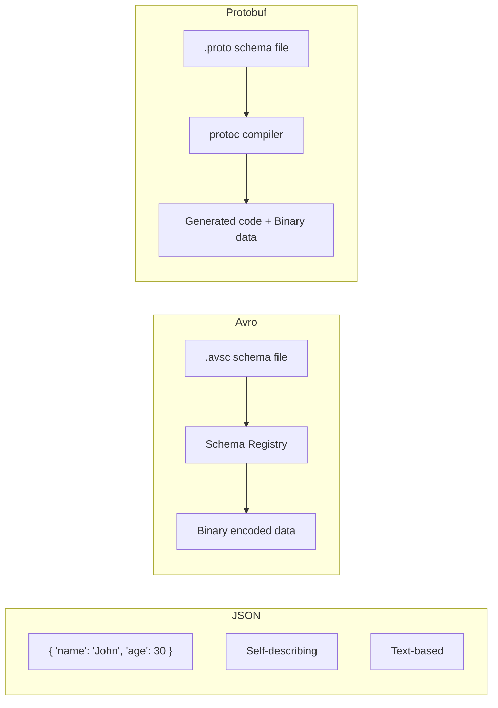

# Avro/Protobuf/JSON khác nhau thế nào?

## ⚡ Tóm tắt ngắn (30s)
* **JSON**: Human-readable, schema-less, dễ debug nhưng payload lớn và không có schema enforcement → phù hợp API, config, log
* **Avro**: Binary format, schema đi kèm data hoặc lưu Schema Registry, hỗ trợ schema evolution mạnh → **default choice cho Kafka** trong hệ sinh thái Confluent
* **Protobuf**: Binary format của Google, schema định nghĩa qua `.proto` file, code generation mạnh, hiệu năng cao → phù hợp gRPC và cross-language communication
* Trong production Kafka, **Avro + Schema Registry** là lựa chọn phổ biến nhất vì tích hợp native, schema evolution linh hoạt, và backward/forward compatibility enforcement

---

## 🔍 Chi tiết bản chất thực chiến

### Schema Definition & Encoding



### Cách hoạt động trong Kafka

- **JSON**: Producer serialize object → JSON string → byte[]. Consumer nhận byte[] → parse JSON. Không có validation tự động, schema thay đổi có thể break consumer mà không biết.
- **Avro**: Producer serialize theo schema → binary → gửi kèm schema ID (4 bytes header). Consumer lấy schema từ Schema Registry bằng ID → deserialize. Schema Registry enforce compatibility rules.
- **Protobuf**: Tương tự Avro nhưng dùng `.proto` file, Confluent Schema Registry cũng hỗ trợ Protobuf từ Confluent Platform 5.5+. Mỗi field có number tag, cho phép evolution tốt.

### Khi nào dùng gì?

- **JSON**: Prototype nhanh, debug dễ, data không critical, team nhỏ không cần strict contract
- **Avro**: Kafka-centric system, data pipeline (ETL), khi cần schema evolution + Schema Registry
- **Protobuf**: Cross-language microservices (gRPC + Kafka), khi cần code generation mạnh, Google ecosystem

---

## 💻 Code thực chiến: BAD vs GOOD

### ❌ BAD: Dùng JSON không có schema validation trong Kafka

```java
// Producer gửi JSON tự do - không có contract enforcement
@Service
public class OrderProducer {
    @Autowired
    private KafkaTemplate<String, String> kafkaTemplate;

    public void sendOrder(Order order) throws JsonProcessingException {
        ObjectMapper mapper = new ObjectMapper();
        // Vấn đề 1: Không có schema validation - field sai type không ai biết
        // Vấn đề 2: Payload lớn vì text-based + field names lặp lại
        // Vấn đề 3: Consumer phải tự handle mọi trường hợp schema thay đổi
        String json = mapper.writeValueAsString(order);
        kafkaTemplate.send("orders", order.getId(), json);
    }
}

// Consumer parse JSON - dễ break khi producer thay đổi schema
@KafkaListener(topics = "orders")
public void consume(String message) {
    ObjectMapper mapper = new ObjectMapper();
    // Runtime exception nếu producer thêm/xóa/đổi field
    Order order = mapper.readValue(message, Order.class);
}
```

---

### ✅ GOOD: Dùng Avro + Schema Registry với Spring Boot

```java
// application.yml - Cấu hình Avro + Schema Registry
// spring:
//   kafka:
//     producer:
//       key-serializer: org.apache.kafka.common.serialization.StringSerializer
//       value-serializer: io.confluent.kafka.serializers.KafkaAvroSerializer
//     consumer:
//       key-deserializer: org.apache.kafka.common.serialization.StringDeserializer
//       value-deserializer: io.confluent.kafka.serializers.KafkaAvroDeserializer
//     properties:
//       schema.registry.url: http://schema-registry:8081
//       specific.avro.reader: true

// Schema: order.avsc
// {
//   "type": "record",
//   "name": "OrderEvent",
//   "namespace": "com.example.avro",
//   "fields": [
//     {"name": "orderId", "type": "string"},
//     {"name": "amount", "type": "double"},
//     {"name": "status", "type": {"type": "enum", "name": "Status",
//       "symbols": ["CREATED","PAID","SHIPPED"]}},
//     {"name": "note", "type": ["null","string"], "default": null}
//   ]
// }

@Service
public class OrderAvroProducer {
    @Autowired
    private KafkaTemplate<String, OrderEvent> kafkaTemplate;

    public void sendOrder(String orderId, double amount) {
        // Schema Registry tự validate schema compatibility
        // Binary encoding: payload nhỏ hơn JSON 3-5 lần
        // Schema evolution: thêm field có default → backward compatible
        OrderEvent event = OrderEvent.newBuilder()
            .setOrderId(orderId)
            .setAmount(amount)
            .setStatus(Status.CREATED)
            .setNote(null) // optional field
            .build();
        kafkaTemplate.send("orders", orderId, event);
    }
}

@Service
public class OrderAvroConsumer {
    @KafkaListener(topics = "orders")
    public void consume(OrderEvent event) {
        // Type-safe deserialization - compile-time check
        // Schema Registry đảm bảo data luôn valid
        log.info("Order: {} - Amount: {}", event.getOrderId(), event.getAmount());
    }
}
```

---

## 📊 Bảng so sánh Avro vs Protobuf vs JSON

| Tiêu chí | JSON | Avro | Protobuf |
| :--- | :--- | :--- | :--- |
| **Encoding** | Text (UTF-8) | Binary | Binary |
| **Schema** | Implicit / không bắt buộc | `.avsc` (JSON-based) | `.proto` file |
| **Payload size** | Lớn nhất (field names lặp) | Nhỏ (không chứa field names) | Nhỏ nhất (varint encoding) |
| **Schema Evolution** | Không hỗ trợ native | Rất mạnh (full/transitive) | Tốt (field numbers) |
| **Schema Registry** | Hỗ trợ (JSON Schema) | Native support | Hỗ trợ từ CP 5.5+ |
| **Code Generation** | Không cần | Optional (specific vs generic) | Bắt buộc (protoc) |
| **Human Readable** | ✅ Có | ❌ Không | ❌ Không |
| **Kafka Ecosystem** | ⭐⭐ | ⭐⭐⭐⭐⭐ | ⭐⭐⭐⭐ |
| **gRPC Support** | ❌ | ❌ | ✅ Native |
| **Speed (Ser/De)** | Chậm nhất | Nhanh | Nhanh nhất |
| **Cross-language** | Tốt (universal) | Tốt (nhiều lib) | Rất tốt (protoc plugins) |
| **Use case chính** | REST API, config, logging | Kafka data pipeline | gRPC, cross-service |

---

## ⚠️ Common Gotchas & Questions follow-up

### 1. "Tại sao Avro phổ biến hơn Protobuf trong Kafka?"
* Avro được thiết kế cho **data serialization + storage** (Hadoop ecosystem), schema đi kèm data hoặc qua registry
* Protobuf thiết kế cho **RPC communication**, cần code generation trước
* Confluent Schema Registry hỗ trợ Avro từ đầu, Protobuf mới thêm sau → ecosystem maturity cao hơn

### 2. "JSON Schema có thay thế được Avro không?"
* Confluent hỗ trợ JSON Schema qua Schema Registry, nhưng **payload vẫn text-based** → size lớn
* Phù hợp khi team muốn human-readable + schema validation, nhưng **throughput thấp hơn 3-5x** so với Avro
* Trade-off: debug dễ hơn vs performance kém hơn

### 3. "Avro Generic vs Specific Record khác gì?"
* **GenericRecord**: Không cần code generation, access field bằng `record.get("fieldName")` → linh hoạt nhưng không type-safe
* **SpecificRecord**: Code generation từ `.avsc` file, access qua getter → type-safe, IDE support tốt
* Production nên dùng **SpecificRecord** cho producer/consumer chính, **GenericRecord** cho tool monitoring/debugging

### 4. "Khi migrate từ JSON sang Avro, làm thế nào?"
* Tạo topic mới với Avro schema, chạy **dual-write** trong thời gian migration
* Hoặc dùng Kafka Connect SMT (Single Message Transform) để convert on-the-fly
* **Không bao giờ** mix JSON và Avro trong cùng 1 topic → consumer sẽ crash
