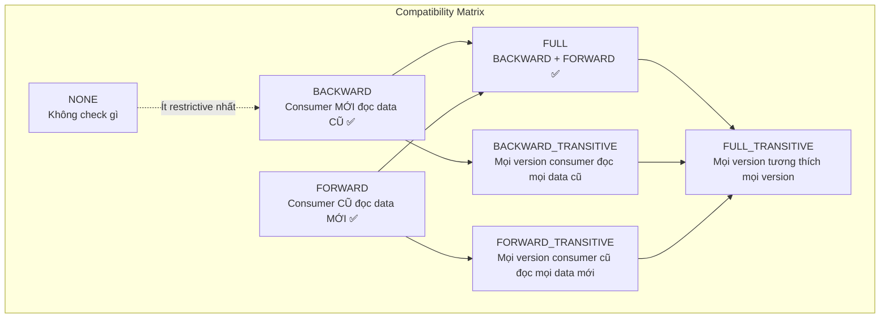
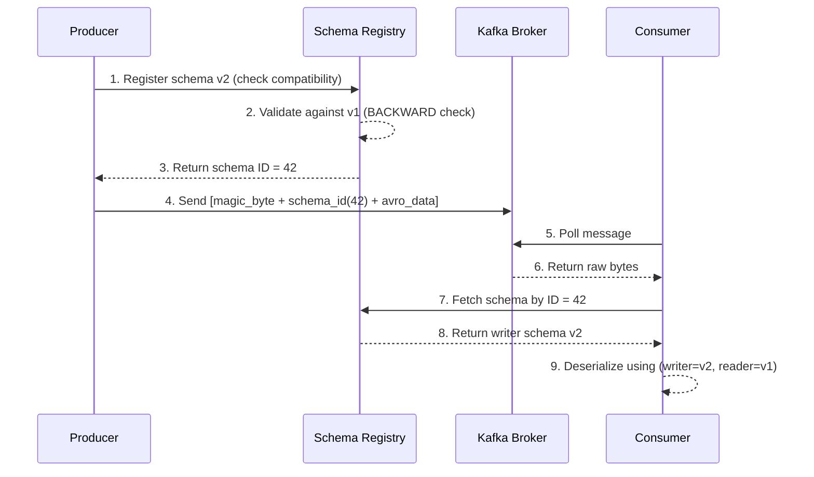

# Schema evolution là gì?

## ⚡ Tóm tắt ngắn (30s)
* **Schema evolution** là khả năng thay đổi schema (thêm/xóa/đổi field) mà **không break** producer và consumer đang chạy
* Trong Kafka, Schema Registry enforce **compatibility rules**: BACKWARD, FORWARD, FULL, NONE
* **BACKWARD compatible** (default): Consumer mới đọc được data cũ → thêm field có default value, xóa field không default
* **FORWARD compatible**: Consumer cũ đọc được data mới → thêm field không default, xóa field có default
* Production rule: **Luôn dùng FULL compatibility** (backward + forward) để đảm bảo rolling deployment an toàn

---

## 🔍 Chi tiết bản chất thực chiến

### Tại sao Schema Evolution quan trọng?

Trong microservices, producer và consumer **deploy độc lập**. Khi business thay đổi → schema phải thay đổi. Không có schema evolution:
- Producer deploy v2 schema → consumer v1 **crash** vì không hiểu data mới
- Phải coordinate deployment giữa tất cả services → **downtime**, **coupling**

### Compatibility Levels



### Quy tắc thay đổi schema (Avro)

| Thay đổi | BACKWARD | FORWARD | FULL |
| :--- | :--- | :--- | :--- |
| Thêm field **có** default | ✅ | ❌ | Chỉ khi cả hai |
| Thêm field **không** default | ❌ | ✅ | ❌ |
| Xóa field **có** default | ❌ | ✅ | Chỉ khi cả hai |
| Xóa field **không** default | ✅ | ❌ | ❌ |
| Đổi field type | ❌ | ❌ | ❌ |
| Thêm field có default + xóa field có default | ✅ | ✅ | ✅ |

### Schema Registry Flow



---

## 💻 Code thực chiến: BAD vs GOOD

### ❌ BAD: Breaking schema change không có compatibility check

```java
// Schema V1: OrderEvent
// {
//   "fields": [
//     {"name": "orderId", "type": "string"},
//     {"name": "amount", "type": "double"},
//     {"name": "currency", "type": "string"}  // REQUIRED field
//   ]
// }

// Schema V2: Breaking change - đổi type và xóa required field
// {
//   "fields": [
//     {"name": "orderId", "type": "string"},
//     {"name": "amount", "type": "string"},     // ❌ Đổi double -> string
//     {"name": "totalAmount", "type": "double"}  // ❌ Rename field = xóa cũ + thêm mới
//     // ❌ Xóa "currency" (required field) → consumer cũ crash
//   ]
// }

// Kết quả: Schema Registry reject nếu có compatibility check
// Nếu NONE mode: consumer cũ crash với SerializationException
```

---

### ✅ GOOD: Safe schema evolution với FULL compatibility

```java
// Schema V1: OrderEvent
// {
//   "type": "record", "name": "OrderEvent",
//   "fields": [
//     {"name": "orderId", "type": "string"},
//     {"name": "amount", "type": "double"},
//     {"name": "currency", "type": "string", "default": "USD"}
//   ]
// }

// Schema V2: Thêm field có default (BACKWARD + FORWARD compatible)
// {
//   "type": "record", "name": "OrderEvent",
//   "fields": [
//     {"name": "orderId", "type": "string"},
//     {"name": "amount", "type": "double"},
//     {"name": "currency", "type": "string", "default": "USD"},
//     {"name": "discount", "type": ["null", "double"], "default": null},
//     {"name": "region",  "type": ["null", "string"], "default": null}
//   ]
// }

// Spring Boot config cho Schema Registry compatibility
@Configuration
public class SchemaRegistryConfig {

    @Bean
    public Map<String, Object> producerConfigs() {
        Map<String, Object> props = new HashMap<>();
        props.put(ProducerConfig.BOOTSTRAP_SERVERS_CONFIG, "kafka:9092");
        props.put(ProducerConfig.KEY_SERIALIZER_CLASS_CONFIG, StringSerializer.class);
        props.put(ProducerConfig.VALUE_SERIALIZER_CLASS_CONFIG, KafkaAvroSerializer.class);
        props.put("schema.registry.url", "http://schema-registry:8081");
        // Auto-register schema khi producer gửi message
        props.put("auto.register.schemas", true);
        // Set compatibility level per-subject
        props.put("value.subject.name.strategy",
            TopicRecordNameStrategy.class.getName());
        return props;
    }
}

// REST API set compatibility level
// PUT /config/orders-value
// {"compatibility": "FULL_TRANSITIVE"}

// Test compatibility trước khi deploy
// POST /compatibility/subjects/orders-value/versions/latest
// Body: new schema JSON
// Response: {"is_compatible": true}

@Service
public class SafeEvolutionProducer {
    @Autowired
    private KafkaTemplate<String, OrderEvent> kafkaTemplate;

    public void send(OrderEvent event) {
        // Schema Registry tự check compatibility khi register
        // Nếu incompatible → throw RestClientException trước khi gửi
        kafkaTemplate.send("orders", event.getOrderId(), event);
    }
}
```

---

## 📊 Bảng so sánh Compatibility Levels

| Tiêu chí | BACKWARD | FORWARD | FULL | NONE |
| :--- | :--- | :--- | :--- | :--- |
| **Consumer mới đọc data cũ** | ✅ | ❌ | ✅ | ❌ |
| **Consumer cũ đọc data mới** | ❌ | ✅ | ✅ | ❌ |
| **Rolling deploy an toàn** | Upgrade consumer trước | Upgrade producer trước | Thứ tự bất kỳ | Phải deploy đồng thời |
| **Thêm required field** | ❌ | ✅ | ❌ | ✅ |
| **Thêm optional field** | ✅ | ✅ | ✅ | ✅ |
| **Xóa required field** | ✅ | ❌ | ❌ | ✅ |
| **Khi nào dùng** | Confluent default | Hiếm khi | **Production recommended** | Dev/test only |

---

## ⚠️ Common Gotchas & Questions follow-up

### 1. "BACKWARD vs FORWARD - deploy thứ tự nào?"
* **BACKWARD**: Deploy **consumer mới trước** → consumer mới phải đọc được data cũ. Sau đó deploy producer mới
* **FORWARD**: Deploy **producer mới trước** → consumer cũ phải đọc được data mới. Sau đó deploy consumer mới
* **FULL**: Deploy thứ tự **bất kỳ** → an toàn nhất cho rolling deployment

### 2. "Transitive vs Non-transitive khác gì?"
* **Non-transitive** (BACKWARD): Chỉ check schema v(N) compatible với v(N-1)
* **Transitive** (BACKWARD_TRANSITIVE): Check v(N) compatible với **tất cả** v1, v2, ..., v(N-1)
* Consumer có thể đọc data rất cũ (compacted topic giữ data lâu) → **cần transitive**

### 3. "Làm sao handle breaking change bắt buộc?"
* Tạo **topic mới** (v2) với schema mới, chạy dual-write trong transition period
* Hoặc dùng **transform layer** (Kafka Streams / ksqlDB) để convert v1 → v2
* **Không bao giờ** set NONE compatibility trong production để force push breaking change

### 4. "Subject naming strategy ảnh hưởng gì?"
* **TopicNameStrategy** (default): `{topic}-value` → mỗi topic 1 schema, đơn giản nhưng rigid
* **RecordNameStrategy**: `{record-name}` → nhiều event types trong 1 topic (event sourcing)
* **TopicRecordNameStrategy**: `{topic}-{record-name}` → linh hoạt nhất, mỗi record type per topic có schema riêng

### 5. "Schema Registry là single point of failure?"
* Chạy **multi-instance** Schema Registry, state lưu trong Kafka internal topic `_schemas`
* Client cache schema ID locally → nếu Registry down, vẫn serialize/deserialize data đã biết
* Chỉ fail khi gặp **schema ID chưa thấy** + Registry unavailable
