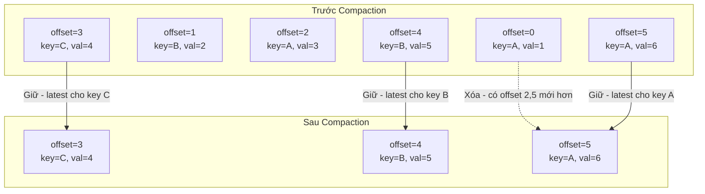
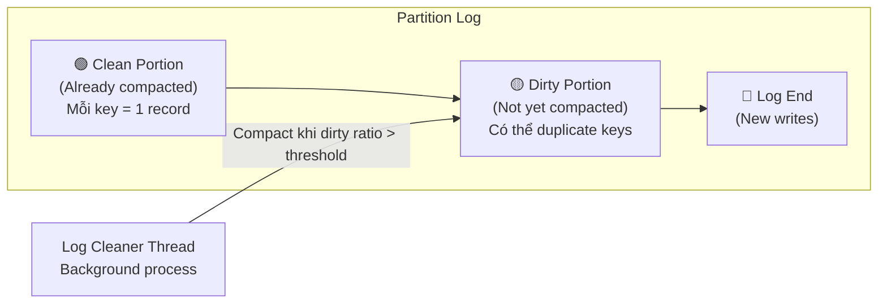

# Compacted topic là gì?

## ⚡ Tóm tắt ngắn (30s)
* **Compacted topic** là topic mà Kafka chỉ giữ lại **record mới nhất cho mỗi key**, xóa các record cũ hơn có cùng key
* Hoạt động như một **distributed key-value store** persistent trên Kafka — giữ "latest state" của mỗi entity
* Use case chính: **CDC (Change Data Capture)**, user profile cache, configuration store, KTable trong Kafka Streams
* Khác với time/size-based retention: compaction **không xóa theo thời gian** mà xóa theo **key duplication**
* Gửi message với value = `null` (tombstone) để **xóa key** khỏi compacted topic

---

## 🔍 Chi tiết bản chất thực chiến

### Cơ chế hoạt động



### Log Compaction Process

Kafka chia log thành 2 phần:
- **Clean portion**: Đã compacted, mỗi key chỉ có 1 record
- **Dirty portion**: Chưa compacted, có thể có duplicate keys



### Tombstone Records

Để **xóa một key** khỏi compacted topic, gửi record với `value = null`. Đây gọi là **tombstone**:
- Tombstone được giữ lại trong khoảng `delete.retention.ms` (default 24h) để consumer kịp thấy deletion
- Sau `delete.retention.ms`, tombstone bị xóa hoàn toàn → key biến mất khỏi topic

---

## 💻 Code thực chiến: BAD vs GOOD

### ❌ BAD: Dùng regular topic làm state store - data bị mất khi retention hết

```java
// Dùng time-based retention topic cho user profile → data bị xóa sau 7 ngày
// User không login 8 ngày → profile biến mất!

// Topic config SAI cho use case state store
// retention.ms=604800000 (7 days)
// cleanup.policy=delete

@Service
public class UserProfileProducer {
    public void updateProfile(String userId, UserProfile profile) {
        // Mỗi lần update gửi full profile
        kafkaTemplate.send("user-profiles", userId, profile);
        // Sau 7 ngày không update → record bị xóa
        // Consumer restart sau 7 ngày → mất toàn bộ data
        // Phải có DB backup → phức tạp, duplicated state
    }
}

@KafkaListener(topics = "user-profiles")
public void rebuildCache(ConsumerRecord<String, UserProfile> record) {
    // Khi service restart, read from earliest
    // Nhưng data cũ hơn 7 ngày đã bị xóa → cache thiếu data!
    cache.put(record.key(), record.value());
}
```

---

### ✅ GOOD: Dùng compacted topic làm distributed state store

```java
// Tạo compacted topic qua AdminClient
@Configuration
public class KafkaTopicConfig {

    @Bean
    public NewTopic userProfilesTopic() {
        return TopicBuilder.name("user-profiles")
            .partitions(12)
            .replicas(3)
            .config(TopicConfig.CLEANUP_POLICY_CONFIG,
                    TopicConfig.CLEANUP_POLICY_COMPACT)
            // Compaction bắt đầu khi dirty ratio > 50%
            .config(TopicConfig.MIN_CLEANABLE_DIRTY_RATIO_CONFIG, "0.5")
            // Segment phải cũ hơn 1h mới eligible cho compaction
            .config(TopicConfig.MIN_COMPACTION_LAG_MS_CONFIG, "3600000")
            // Tombstone giữ 24h trước khi xóa hẳn
            .config(TopicConfig.DELETE_RETENTION_MS_CONFIG, "86400000")
            // Segment size nhỏ hơn → compaction thường xuyên hơn
            .config(TopicConfig.SEGMENT_BYTES_CONFIG, "104857600") // 100MB
            .build();
    }
}

@Service
public class UserProfileService {
    @Autowired
    private KafkaTemplate<String, UserProfile> kafkaTemplate;

    // Update profile → chỉ giữ version mới nhất per userId
    public void updateProfile(String userId, UserProfile profile) {
        kafkaTemplate.send("user-profiles", userId, profile);
        // Compaction tự xóa records cũ cùng userId
        // Topic size ổn định = số unique users * avg record size
    }

    // Xóa profile → gửi tombstone
    public void deleteProfile(String userId) {
        // value = null → tombstone record
        kafkaTemplate.send("user-profiles", userId, null);
        // Sau delete.retention.ms, key bị xóa hoàn toàn
    }
}

// Consumer rebuild cache từ compacted topic khi startup
@Component
public class ProfileCacheRebuilder {
    private final ConcurrentHashMap<String, UserProfile> cache = new ConcurrentHashMap<>();

    @KafkaListener(topics = "user-profiles",
        properties = {"auto.offset.reset=earliest"})
    public void onMessage(ConsumerRecord<String, UserProfile> record) {
        if (record.value() == null) {
            cache.remove(record.key()); // Tombstone → remove from cache
        } else {
            cache.put(record.key(), record.value()); // Upsert
        }
        // Khi read hết topic → cache có FULL latest state
        // Không bao giờ mất data vì compaction giữ latest per key
    }
}
```

---

## 📊 Bảng so sánh Delete vs Compact Retention

| Tiêu chí | cleanup.policy=delete | cleanup.policy=compact | compact,delete |
| :--- | :--- | :--- | :--- |
| **Xóa data dựa trên** | Thời gian hoặc size | Key duplication | Cả hai |
| **Giữ data bao lâu** | Theo `retention.ms` | Vĩnh viễn (latest per key) | Latest per key + TTL |
| **Topic size** | Tăng theo thời gian → bị trim | Ổn định ≈ unique keys | Ổn định + bounded |
| **Use case** | Event log, audit trail | State store, CDC, cache | CDC với TTL |
| **Null value** | Record bình thường | **Tombstone** (xóa key) | Tombstone + TTL |
| **Rebuild state** | Chỉ trong retention window | Bất kỳ lúc nào | Trong retention window |
| **Kafka Streams KTable** | ❌ Không phù hợp | ✅ Perfect fit | ✅ Với expiry |

---

## ⚠️ Common Gotchas & Questions follow-up

### 1. "Compacted topic có đảm bảo chỉ 1 record per key không?"
* **Dirty portion** vẫn có thể chứa duplicate keys — compaction chạy **bất đồng bộ** (background thread)
* Consumer đọc từ đầu có thể thấy **nhiều record cùng key** → phải xử lý bằng cách **lấy record cuối cùng**
* Chỉ clean portion mới đảm bảo 1 record per key

### 2. "Key = null có được trong compacted topic không?"
* **Không** — records với key = null sẽ bị compaction bỏ qua và cuối cùng bị xóa
* Compacted topic **yêu cầu tất cả records phải có key** → đây là invariant quan trọng
* Producer gửi key null → log warning, data có thể mất

### 3. "Compaction ảnh hưởng performance không?"
* Log cleaner threads tiêu tốn **CPU + I/O** khi compaction chạy → tune `log.cleaner.threads`, `log.cleaner.dedupe.buffer.size`
* `min.compaction.lag.ms` quá nhỏ → compaction chạy liên tục, waste I/O
* `min.cleanable.dirty.ratio` quá nhỏ → compaction trigger quá thường xuyên
* Best practice: để default hoặc tune based on monitoring

### 4. "Khi nào dùng compact,delete cùng lúc?"
* Khi muốn giữ latest state per key **nhưng** cũng muốn TTL cho inactive keys
* Ví dụ: User session store — giữ latest session, nhưng expire sau 30 ngày không hoạt động
* Config: `cleanup.policy=compact,delete` + `retention.ms=2592000000`

### 5. "Compacted topic và Kafka Streams KTable liên quan thế nào?"
* **KTable** trong Kafka Streams sử dụng compacted topic làm **changelog topic**
* Mỗi lần KTable state thay đổi → ghi vào changelog topic (compacted)
* Khi Kafka Streams restart → rebuild KTable state từ changelog topic
* Đây là cơ chế **fault-tolerance** của Kafka Streams stateful processing
