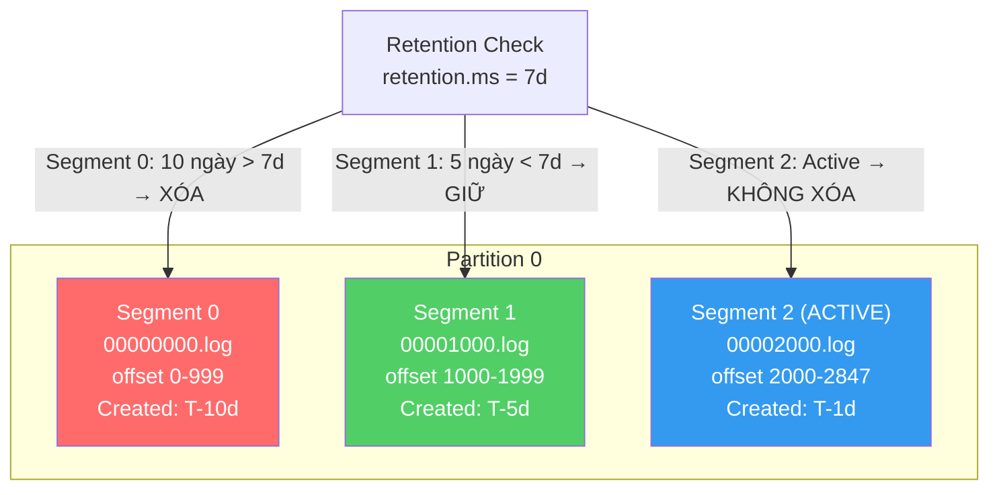
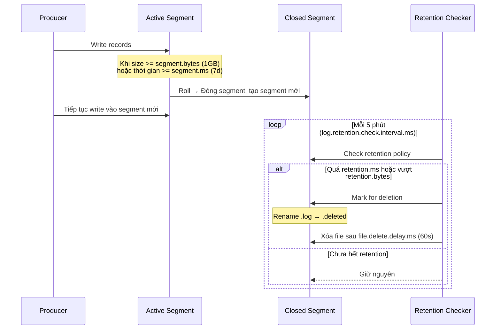

# Kafka retention hoạt động thế nào?

## ⚡ Tóm tắt ngắn (30s)
* Kafka retention quyết định **data được giữ bao lâu** trên broker trước khi bị xóa, dựa trên **thời gian** (`retention.ms`) hoặc **dung lượng** (`retention.bytes`)
* Data được lưu trong **log segments** — Kafka xóa theo **segment level**, không xóa từng record
* Có 2 cleanup policy: **delete** (xóa segment cũ) và **compact** (giữ latest per key)
* Default: `retention.ms = 7 ngày`, `retention.bytes = -1` (unlimited) → data giữ 7 ngày
* **Consumer offset không liên quan đến retention** — data bị xóa dù consumer chưa đọc → data loss nếu consumer lag quá retention period

---

## 🔍 Chi tiết bản chất thực chiến

### Kiến trúc Log Segments



### Cơ chế xóa data

1. **Log Segment**: Mỗi partition chia thành nhiều segment files. Active segment (đang write) **không bao giờ bị xóa**
2. **Time-based** (`retention.ms`): Segment eligible để xóa khi **last modified time** > retention.ms
3. **Size-based** (`retention.bytes`): Xóa segment cũ nhất khi tổng size partition > retention.bytes
4. **Cả hai áp dụng**: Nếu set cả 2, segment bị xóa khi **thỏa mãn bất kỳ** điều kiện nào

### Segment Lifecycle



---

## 💻 Code thực chiến: BAD vs GOOD

### ❌ BAD: Retention config sai dẫn đến data loss hoặc disk full

```java
// Sai 1: Retention quá ngắn → consumer restart sau weekend mất data
// Topic config:
// retention.ms=86400000 (1 ngày)
// Consumer group bị lag 3 ngày → data đã bị xóa
// OffsetOutOfRangeException → reset offset → MẤT DATA

// Sai 2: Retention unlimited + không set retention.bytes
// retention.ms=-1 (never expire)
// retention.bytes=-1 (unlimited)
// → Disk đầy 100% sau vài tháng → Broker crash → Cluster down

// Sai 3: segment.bytes quá lớn → retention không chính xác
// segment.bytes=1073741824 (1GB)
// retention.ms=3600000 (1 giờ)
// Nhưng segment mất 2 ngày mới đầy 1GB
// → Data giữ ~2 ngày + 1h thay vì 1h vì active segment không bị xóa!

@Bean
public NewTopic badTopic() {
    return TopicBuilder.name("events")
        .config(TopicConfig.RETENTION_MS_CONFIG, "3600000")      // 1h
        .config(TopicConfig.SEGMENT_BYTES_CONFIG, "1073741824")  // 1GB
        // Segment mất rất lâu mới đóng → retention thực tế >> 1h
        .build();
}
```

---

### ✅ GOOD: Retention config hợp lý cho production

```java
@Configuration
public class KafkaRetentionConfig {

    // Topic cho event processing - retention 7 ngày, bounded size
    @Bean
    public NewTopic orderEventsTopic() {
        return TopicBuilder.name("order-events")
            .partitions(12)
            .replicas(3)
            // Time-based: giữ 7 ngày
            .config(TopicConfig.RETENTION_MS_CONFIG, "604800000")
            // Size-based: max 50GB per partition (safety net)
            .config(TopicConfig.RETENTION_BYTES_CONFIG, "53687091200")
            // Segment size nhỏ hơn → retention chính xác hơn
            .config(TopicConfig.SEGMENT_BYTES_CONFIG, "104857600")  // 100MB
            // Segment roll theo thời gian nếu chưa đầy size
            .config(TopicConfig.SEGMENT_MS_CONFIG, "3600000")  // 1h
            .config(TopicConfig.CLEANUP_POLICY_CONFIG, "delete")
            .build();
    }

    // Topic cho audit log - retention dài, tiered storage
    @Bean
    public NewTopic auditLogTopic() {
        return TopicBuilder.name("audit-log")
            .partitions(6)
            .replicas(3)
            // Local retention 30 ngày
            .config(TopicConfig.RETENTION_MS_CONFIG, "2592000000")
            // Tiered Storage: remote retention 1 năm (Kafka 3.6+)
            .config("remote.storage.enable", "true")
            .config("local.retention.ms", "604800000")  // Local: 7 ngày
            .config("retention.ms", "31536000000")       // Total: 365 ngày
            .build();
    }
}

// Monitoring consumer lag vs retention
@Component
@Slf4j
public class RetentionLagMonitor {

    @Autowired
    private KafkaAdmin kafkaAdmin;

    @Scheduled(fixedRate = 300000) // Mỗi 5 phút
    public void checkConsumerLag() {
        try (AdminClient admin = AdminClient.create(kafkaAdmin.getConfigurationProperties())) {
            // List consumer groups và check lag
            Map<TopicPartition, OffsetSpec> earliestRequest = new HashMap<>();
            Map<TopicPartition, OffsetSpec> latestRequest = new HashMap<>();
            // ... populate requests

            // CẢNH BÁO: Nếu consumer lag > 80% retention period
            // → Risk of data loss khi consumer restart
            long retentionMs = 604800000L; // 7 ngày
            long lagMs = calculateLagInMs(admin);
            if (lagMs > retentionMs * 0.8) {
                log.error("CRITICAL: Consumer lag {}ms > 80% retention {}ms. "
                    + "Risk of data loss!", lagMs, retentionMs);
                // Alert to PagerDuty/Slack
            }
        }
    }
}
```

---

## 📊 Bảng so sánh các Retention Config

| Config | Default | Ý nghĩa | Ảnh hưởng |
| :--- | :--- | :--- | :--- |
| `retention.ms` | 604800000 (7d) | Thời gian giữ data | -1 = unlimited |
| `retention.bytes` | -1 (unlimited) | Max size per partition | Xóa segment cũ khi vượt |
| `segment.bytes` | 1073741824 (1GB) | Size mỗi segment file | Nhỏ hơn → retention chính xác hơn |
| `segment.ms` | 604800000 (7d) | Force roll segment theo thời gian | Quan trọng cho low-throughput topics |
| `log.retention.check.interval.ms` | 300000 (5min) | Tần suất check retention | Broker-level config |
| `min.compaction.lag.ms` | 0 | Delay trước khi compact | Cho phép consumer đọc data cũ |
| `delete.retention.ms` | 86400000 (24h) | Giữ tombstone bao lâu | Chỉ cho compacted topics |
| `file.delete.delay.ms` | 60000 (1min) | Delay trước khi xóa file thật | Safety buffer |

---

## ⚠️ Common Gotchas & Questions follow-up

### 1. "Active segment không bị xóa - ảnh hưởng gì?"
* Retention chỉ áp dụng cho **closed segments**. Active segment đang nhận data → không eligible
* Với low-throughput topic, segment có thể mất **rất lâu** mới đầy → data giữ lâu hơn `retention.ms`
* **Fix**: Set `segment.ms` để force roll segment theo thời gian, ví dụ `segment.ms=3600000` (1h)

### 2. "Consumer lag vượt retention period thì sao?"
* Consumer sẽ gặp `OffsetOutOfRangeException` khi offset đã bị xóa
* Default behavior: `auto.offset.reset=latest` → **nhảy đến cuối, mất data ở giữa**
* **Fix**: Monitor consumer lag, alert khi lag > 70% retention. Set `auto.offset.reset=earliest` khi cần reprocess

### 3. "Retention per topic hay per partition?"
* `retention.bytes` là **per partition**, không phải per topic
* Topic 12 partitions + `retention.bytes=10GB` → tổng max = **120GB**
* Khi capacity planning phải nhân `retention.bytes × partitions`

### 4. "Tiered Storage giải quyết gì?"
* Kafka 3.6+ hỗ trợ **Tiered Storage**: data cũ tự move từ local disk → remote storage (S3, GCS)
* `local.retention.ms`: Data trên broker disk (SSD, nhanh)
* `retention.ms`: Tổng retention bao gồm remote (S3, rẻ)
* Cho phép **retention rất dài** (months/years) mà không tốn disk broker

### 5. "Làm sao estimate disk cần cho retention?"
* Formula: `disk_per_partition = write_rate × retention_seconds × replication_factor`
* Ví dụ: 10MB/s × 604800s (7d) × 3 replicas = **~17.6TB per partition**
* Cần thêm buffer 20-30% cho segment overhead và compaction
