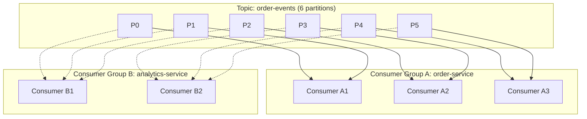
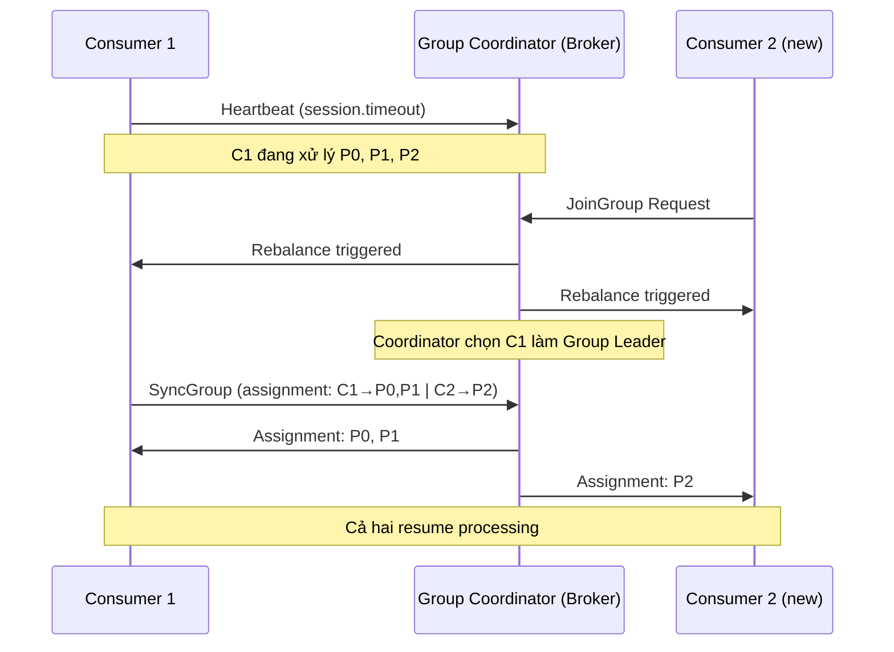

# Consumer group hoạt động thế nào?

## ⚡ Tóm tắt ngắn (30s)
* Consumer group là cơ chế cho phép **nhiều consumer cùng đọc song song** từ một topic — mỗi partition chỉ được **một consumer trong group** xử lý tại một thời điểm
* Kafka dùng **Group Coordinator** (một broker) để quản lý membership và trigger **rebalance** khi consumer join/leave
* Số consumer tối ưu = số partition — thêm consumer vượt partition count → consumer bị idle
* Rebalance là "nỗi đau" lớn nhất — **Cooperative Sticky Assignor** giúp giảm downtime đáng kể so với Eager rebalance
* Thực tế production: phải hiểu rebalance, offset commit strategy, và session timeout tuning

---

## 🔍 Chi tiết bản chất thực chiến

### Consumer Group — Publish-Subscribe có kiểm soát
Mỗi consumer thuộc một **group.id**. Kafka đảm bảo: trong cùng một group, mỗi partition chỉ được gán cho **đúng 1 consumer**. Điều này cho phép:
- **Parallel processing**: nhiều consumer chia nhau partitions
- **Load balancing tự động**: Kafka tự phân phối partitions
- **Fault tolerance**: consumer chết → partitions được gán lại cho consumer còn lại

### Nhiều group đọc cùng topic
Khác group → đọc **độc lập**, mỗi group có committed offset riêng. Đây là cách Kafka implement **publish-subscribe pattern** — một message có thể được xử lý bởi nhiều group khác nhau.



### Rebalance Protocol
Khi consumer join/leave group hoặc topic có thêm partition → **rebalance** xảy ra:



### Partition Assignment Strategies
- **RangeAssignor** (default cũ): chia theo range, dễ bị skew khi có nhiều topic
- **RoundRobinAssignor**: phân đều hơn nhưng vẫn eager rebalance
- **StickyAssignor**: giữ assignment cũ nhất có thể → giảm partition migration
- **CooperativeStickyAssignor** (recommended): incremental rebalance — chỉ revoke partition cần chuyển, không stop toàn bộ

---

## 💻 Code thực chiến: BAD vs GOOD

### ❌ BAD: Auto-commit, không handle rebalance, default config
```java
@Service
public class BadOrderConsumer {

    // BAD: Dùng auto-commit → có thể commit offset trước khi xử lý xong
    // Nếu crash sau commit nhưng trước khi process → MẤT MESSAGE
    @KafkaListener(topics = "order-events", groupId = "order-group")
    public void listen(OrderEvent event) {
        processOrder(event);  // Nếu exception ở đây → offset đã auto-commit → message mất
    }
}

// BAD: application.yml
// spring.kafka.consumer.enable-auto-commit: true  (default)
// → offset commit mỗi 5s bất kể message đã xử lý xong hay chưa
// Không configure session.timeout → default 45s quá lâu để detect failure
```

---

### ✅ GOOD: Manual commit, rebalance listener, production-ready config
```java
@Configuration
public class KafkaConsumerConfig {

    @Bean
    public ConsumerFactory<String, OrderEvent> consumerFactory() {
        Map<String, Object> props = new HashMap<>();
        props.put(ConsumerConfig.BOOTSTRAP_SERVERS_CONFIG, "kafka:9092");
        props.put(ConsumerConfig.GROUP_ID_CONFIG, "order-processing-group");
        
        // Cooperative rebalance — không stop tất cả consumers
        props.put(ConsumerConfig.PARTITION_ASSIGNMENT_STRATEGY_CONFIG,
                CooperativeStickyAssignor.class.getName());
        
        // Tuning session & heartbeat
        props.put(ConsumerConfig.SESSION_TIMEOUT_MS_CONFIG, 30000);    // 30s
        props.put(ConsumerConfig.HEARTBEAT_INTERVAL_MS_CONFIG, 10000); // 10s (1/3 session)
        props.put(ConsumerConfig.MAX_POLL_INTERVAL_MS_CONFIG, 300000); // 5 min cho heavy processing
        props.put(ConsumerConfig.MAX_POLL_RECORDS_CONFIG, 100);        // Batch size hợp lý
        
        props.put(ConsumerConfig.AUTO_OFFSET_RESET_CONFIG, "earliest");
        props.put(ConsumerConfig.ENABLE_AUTO_COMMIT_CONFIG, false);    // Manual commit
        
        return new DefaultKafkaConsumerFactory<>(props,
                new StringDeserializer(),
                new JsonDeserializer<>(OrderEvent.class));
    }

    @Bean
    public ConcurrentKafkaListenerContainerFactory<String, OrderEvent> kafkaListenerFactory() {
        ConcurrentKafkaListenerContainerFactory<String, OrderEvent> factory =
                new ConcurrentKafkaListenerContainerFactory<>();
        factory.setConsumerFactory(consumerFactory());
        factory.setConcurrency(3);  // 3 consumer threads
        factory.getContainerProperties().setAckMode(ContainerProperties.AckMode.MANUAL_IMMEDIATE);
        return factory;
    }
}

// === Consumer với rebalance awareness ===
@Service
@Slf4j
public class OrderEventConsumer {

    @KafkaListener(
        topics = "order-events",
        groupId = "order-processing-group",
        containerFactory = "kafkaListenerFactory"
    )
    public void handleOrderEvent(
            @Payload OrderEvent event,
            @Header(KafkaHeaders.RECEIVED_PARTITION) int partition,
            @Header(KafkaHeaders.OFFSET) long offset,
            Acknowledgment ack) {
        
        log.info("Processing: partition={}, offset={}, orderId={}",
                partition, offset, event.getOrderId());
        try {
            orderService.processOrder(event);
            ack.acknowledge();  // Commit offset CHỈ sau khi xử lý thành công
        } catch (RetryableException e) {
            log.warn("Retryable error at offset={}, will retry", offset);
            ack.nack(Duration.ofSeconds(5));  // Retry sau 5s
        } catch (Exception e) {
            log.error("Non-retryable error at offset={}", offset, e);
            deadLetterPublisher.send(event);   // Gửi vào DLT
            ack.acknowledge();                  // Skip message lỗi
        }
    }
}

// === Rebalance Listener để handle cleanup ===
@Component
@Slf4j
public class RebalanceHandler implements ConsumerAwareRebalanceListener {

    @Override
    public void onPartitionsRevoked(Consumer<?, ?> consumer, 
                                     Collection<TopicPartition> partitions) {
        log.info("Partitions revoked: {}", partitions);
        // Commit offset cho partitions đang bị revoke
        consumer.commitSync(consumer.assignment().stream()
                .collect(Collectors.toMap(
                        tp -> tp,
                        tp -> new OffsetAndMetadata(consumer.position(tp))
                )));
        // Flush in-memory state nếu có
        stateStore.flush(partitions);
    }

    @Override
    public void onPartitionsAssigned(Consumer<?, ?> consumer,
                                      Collection<TopicPartition> partitions) {
        log.info("Partitions assigned: {}", partitions);
        // Load state cho partitions mới nếu cần
        stateStore.restore(partitions);
    }
}
```

---

## 📊 Bảng so sánh Partition Assignment Strategies

| Tiêu chí | RangeAssignor | RoundRobinAssignor | StickyAssignor | CooperativeStickyAssignor |
| :--- | :--- | :--- | :--- | :--- |
| **Balancing** | Có thể skew | Đều | Đều | Đều |
| **Rebalance type** | Eager (stop-the-world) | Eager | Eager | Incremental |
| **Partition migration** | Nhiều | Nhiều | Tối thiểu | Tối thiểu |
| **Downtime khi rebalance** | Cao | Cao | Trung bình | **Thấp nhất** |
| **Multi-topic** | Skew nặng | OK | OK | OK |
| **Recommended** | ❌ Legacy | ❌ | ⚠️ | ✅ Production |

---

## ⚠️ Common Gotchas & Questions follow-up

### 1. Consumer nhiều hơn partition → consumer idle
* Nếu topic có 6 partitions mà group có 8 consumers → 2 consumer **không nhận partition nào**
* Chúng vẫn join group, tốn resource, nhưng không xử lý message
* **Fix**: scale consumer count ≤ partition count

### 2. max.poll.interval.ms vs session.timeout.ms
* `session.timeout.ms` (default 45s): consumer không gửi heartbeat → bị coi là dead → rebalance
* `max.poll.interval.ms` (default 5min): khoảng cách giữa 2 lần poll() — nếu processing quá lâu → consumer bị kick
* **Gotcha**: heavy processing + nhỏ max.poll.interval → rebalance liên tục → "rebalance storm"

### 3. Rebalance storm là gì?
* Consumer bị kick → rebalance → processing chậm → lại bị kick → rebalance loop
* **Fix**: tăng `max.poll.interval.ms`, giảm `max.poll.records`, hoặc offload heavy processing sang thread pool riêng

### 4. Static group membership giảm rebalance thế nào?
* Set `group.instance.id` cho mỗi consumer → consumer restart không trigger rebalance ngay
* Kafka chờ `session.timeout.ms` trước khi reassign → nếu consumer rejoin trong thời gian đó → giữ nguyên assignment
* Rất hữu ích cho **rolling deployment**

### 5. Khi nào dùng nhiều consumer group cho cùng topic?
* Mỗi service cần **xử lý độc lập** cùng event: VD order-events → order-service (group A), analytics (group B), notification (group C)
* Đây chính là **fan-out pattern** — mỗi group đọc toàn bộ message, track offset riêng
