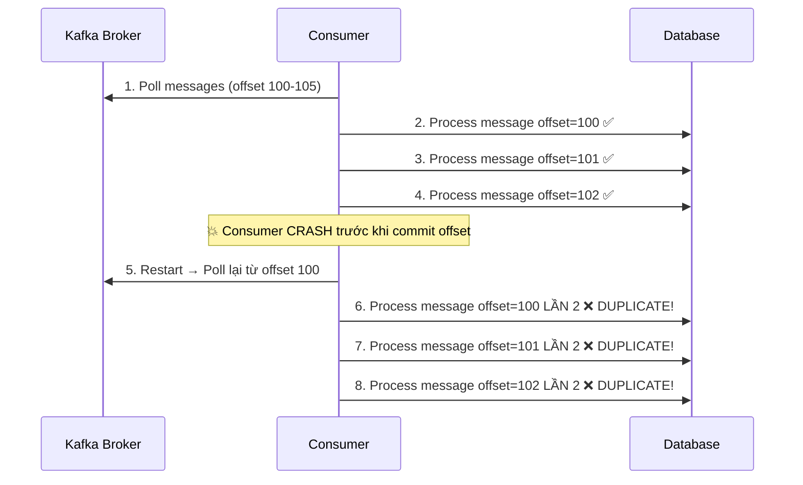
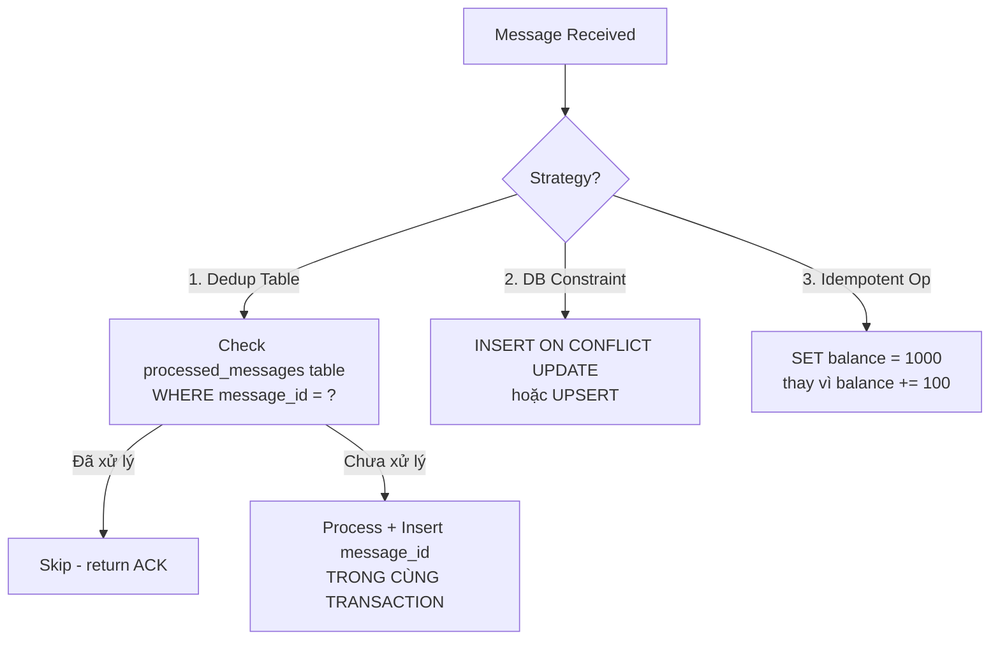

# Làm sao đảm bảo idempotency khi consume message?

## ⚡ Tóm tắt ngắn (30s)
* **Idempotency** = xử lý cùng message nhiều lần cho **kết quả giống hệt** lần đầu — critical vì Kafka guarantee **at-least-once delivery** by default
* 3 chiến lược chính: **Idempotent Key** (dedup bằng unique ID), **Database Constraint** (UPSERT/unique index), **Idempotent Operation** (thiết kế operation tự nhiên idempotent)
* Production pattern phổ biến: Lưu **processed message ID** vào deduplication table, check trước khi xử lý, wrap trong **database transaction** cùng business logic
* Kafka producer cũng có `enable.idempotence=true` nhưng chỉ đảm bảo **exactly-once gửi** vào broker, không đảm bảo exactly-once processing ở consumer side

---

## 🔍 Chi tiết bản chất thực chiến

### Tại sao message bị duplicate?



### Các nguyên nhân gây duplicate

1. **Consumer crash** sau khi xử lý nhưng trước khi commit offset
2. **Rebalance** giữa lúc đang xử lý → partition reassign → reprocess
3. **Network timeout**: Consumer xử lý xong, commit offset nhưng broker không nhận ACK → consumer retry
4. **Producer retry**: `retries > 0` + network issue → broker nhận 2 copies (nếu không bật producer idempotence)

### 3 Strategies Pattern



---

## 💻 Code thực chiến: BAD vs GOOD

### ❌ BAD: Consumer không handle duplicate - auto commit offset

```java
// spring.kafka.consumer.enable-auto-commit=true (DEFAULT!)
// Auto commit mỗi 5s → window 5s cho duplicate processing

@KafkaListener(topics = "payment-events")
public void processPayment(PaymentEvent event) {
    // Vấn đề 1: Không check duplicate → xử lý payment 2 lần
    // Vấn đề 2: Auto-commit → crash giữa chừng = reprocess
    // Vấn đề 3: Không idempotent operation → balance bị trừ 2 lần
    
    paymentService.deductBalance(event.getUserId(), event.getAmount());
    // Nếu crash SAU deductBalance nhưng TRƯỚC auto-commit
    // → Restart → Poll lại → deductBalance LẦN 2
    // → User bị trừ tiền 2 lần!
    
    orderService.updateStatus(event.getOrderId(), "PAID");
    notificationService.sendEmail(event.getUserId(), "Payment Success");
    // Email gửi 2 lần → user confused
}
```

---

### ✅ GOOD: Idempotent consumer với deduplication table + manual commit

```java
// application.yml
// spring:
//   kafka:
//     consumer:
//       enable-auto-commit: false
//     listener:
//       ack-mode: MANUAL

// 1. Deduplication table
// CREATE TABLE processed_messages (
//     message_id VARCHAR(255) PRIMARY KEY,
//     topic VARCHAR(255) NOT NULL,
//     partition_num INT NOT NULL,
//     offset_num BIGINT NOT NULL,
//     processed_at TIMESTAMP DEFAULT CURRENT_TIMESTAMP,
//     INDEX idx_topic_partition_offset (topic, partition_num, offset_num)
// );

@Service
@Slf4j
public class IdempotentPaymentConsumer {

    @Autowired
    private ProcessedMessageRepository processedMessageRepo;
    @Autowired
    private PaymentService paymentService;
    @Autowired
    private TransactionTemplate transactionTemplate;

    @KafkaListener(topics = "payment-events",
        containerFactory = "manualAckListenerFactory")
    public void processPayment(
            ConsumerRecord<String, PaymentEvent> record,
            Acknowledgment ack) {

        String messageId = extractMessageId(record);

        // Step 1: Check idempotency TRƯỚC khi xử lý
        if (processedMessageRepo.existsById(messageId)) {
            log.info("Duplicate message detected: {}. Skipping.", messageId);
            ack.acknowledge(); // Commit offset để không poll lại
            return;
        }

        try {
            // Step 2: Process + save dedup record TRONG CÙNG TRANSACTION
            transactionTemplate.executeWithoutResult(status -> {
                // Business logic
                paymentService.processPayment(record.value());

                // Lưu message ID vào dedup table
                processedMessageRepo.save(ProcessedMessage.builder()
                    .messageId(messageId)
                    .topic(record.topic())
                    .partitionNum(record.partition())
                    .offsetNum(record.offset())
                    .build());
            });

            // Step 3: Manual ACK SAU KHI transaction commit thành công
            ack.acknowledge();

        } catch (Exception e) {
            log.error("Failed to process message: {}", messageId, e);
            // Không ACK → Kafka sẽ gửi lại → retry tự động
            // Lần retry sẽ check dedup table → nếu đã process thì skip
        }
    }

    private String extractMessageId(ConsumerRecord<String, PaymentEvent> record) {
        // Ưu tiên dùng business ID từ header hoặc payload
        Header idHeader = record.headers().lastHeader("message-id");
        if (idHeader != null) {
            return new String(idHeader.value());
        }
        // Fallback: dùng topic+partition+offset (unique trong Kafka)
        return String.format("%s-%d-%d",
            record.topic(), record.partition(), record.offset());
    }
}

// Listener factory với manual ACK
@Configuration
public class KafkaConsumerConfig {

    @Bean
    public ConcurrentKafkaListenerContainerFactory<String, PaymentEvent>
            manualAckListenerFactory(ConsumerFactory<String, PaymentEvent> cf) {
        var factory = new ConcurrentKafkaListenerContainerFactory<String, PaymentEvent>();
        factory.setConsumerFactory(cf);
        factory.getContainerProperties().setAckMode(AckMode.MANUAL);
        // Retry với backoff khi xử lý fail
        factory.setCommonErrorHandler(new DefaultErrorHandler(
            new FixedBackOff(1000L, 3L) // 3 retries, 1s interval
        ));
        return factory;
    }
}
```

### ✅ GOOD Alternative: UPSERT pattern (không cần dedup table riêng)

```java
@Service
public class IdempotentOrderConsumer {

    @Autowired
    private OrderRepository orderRepository;

    @KafkaListener(topics = "order-events")
    @Transactional
    public void processOrder(OrderEvent event, Acknowledgment ack) {
        // UPSERT: INSERT nếu chưa có, UPDATE nếu đã có
        // Idempotent by design - chạy bao nhiêu lần cũng cùng kết quả
        orderRepository.upsert(
            event.getOrderId(),
            event.getStatus(),
            event.getUpdatedAt()
        );
        ack.acknowledge();
    }
}

// Repository với native UPSERT query
@Repository
public interface OrderRepository extends JpaRepository<Order, String> {

    @Modifying
    @Query(value = """
        INSERT INTO orders (order_id, status, updated_at)
        VALUES (:orderId, :status, :updatedAt)
        ON CONFLICT (order_id)
        DO UPDATE SET status = :status, updated_at = :updatedAt
        WHERE orders.updated_at < :updatedAt
        """, nativeQuery = true)
    void upsert(@Param("orderId") String orderId,
                @Param("status") String status,
                @Param("updatedAt") Instant updatedAt);
}
```

---

## 📊 Bảng so sánh các Idempotency Strategies

| Tiêu chí | Dedup Table | DB Constraint / UPSERT | Idempotent Operation |
| :--- | :--- | :--- | :--- |
| **Complexity** | Medium | Low | Low |
| **Storage overhead** | Cần dedup table riêng | Không cần thêm | Không cần thêm |
| **Cleanup** | Cần TTL/cron xóa records cũ | Tự động | Tự động |
| **Áp dụng được khi** | Mọi use case | Có DB write operation | Operation tự nhiên idempotent |
| **Ví dụ** | Payment processing | Order status update | SET balance = X |
| **Side effects** | Handle được (check trước) | Không handle side effects | Không handle side effects |
| **Performance** | Extra DB read per message | Chỉ 1 DB write | Tối ưu nhất |

---

## ⚠️ Common Gotchas & Questions follow-up

### 1. "Dedup table phình to - cleanup thế nào?"
* Chạy **scheduled job** xóa records cũ hơn 2× retention period
* Hoặc dùng TTL table (Cassandra, DynamoDB) tự expire
* Alternatively: dùng **Bloom Filter** cho check nhanh + DB cho persistence → giảm DB reads 95%

### 2. "Producer idempotence (`enable.idempotence=true`) có đủ không?"
* **Không đủ**. Producer idempotence chỉ đảm bảo **broker không nhận duplicate** từ cùng producer session
* Consumer vẫn có thể nhận duplicate vì **rebalance, crash, retry** ở consumer side
* Cần **cả producer idempotence + consumer idempotency pattern**

### 3. "Exactly-once semantics (EOS) của Kafka có giải quyết không?"
* Kafka EOS (`isolation.level=read_committed` + transactional producer) đảm bảo **exactly-once trong Kafka ecosystem**
* Nhưng khi consumer ghi ra **external system** (DB, API) → vẫn cần idempotency
* EOS chỉ hoàn hảo cho **Kafka-to-Kafka** processing (Kafka Streams)

### 4. "Thứ tự xử lý message có bị ảnh hưởng?"
* Idempotency check có thể gây **out-of-order** nếu không cẩn thận
* Ví dụ: Message A (status=CREATED) bị duplicate, message B (status=PAID) đến trước duplicate A
* **Fix**: Dùng **version/timestamp** trong UPSERT: `WHERE updated_at < :newUpdatedAt`

### 5. "Side effects (email, SMS) handle thế nào?"
* Side effects **không thể UPSERT** → phải dùng dedup table approach
* Check dedup **trước** khi gửi email/SMS
* Hoặc dùng **Outbox Pattern**: ghi event vào DB outbox table (idempotent) → separate process gửi email (with its own dedup)
