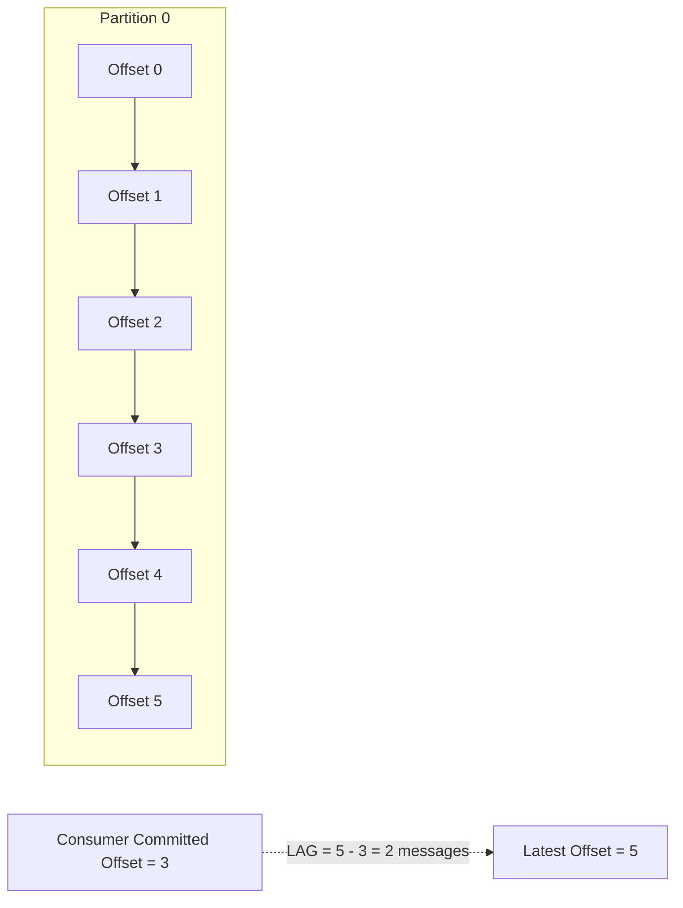

# Kafka lag là gì?

## ⚡ Tóm tắt ngắn (30s)
* **Kafka lag** (consumer lag) là **khoảng chênh lệch** giữa offset mới nhất (latest offset) mà producer đã ghi và offset hiện tại mà consumer đã commit — tức là số message chưa được xử lý
* Lag cao kéo dài → consumer không theo kịp tốc độ produce → dữ liệu bị delay, có thể gây **data loss** nếu retention hết hạn trước khi consume
* Monitor lag bằng **Kafka Consumer Group API**, **Burrow**, **Prometheus + kafka_exporter**, hoặc **Confluent Control Center**
* Nguyên nhân phổ biến: consumer xử lý chậm, rebalance liên tục, partition skew, hoặc downstream service bị bottleneck

---

## 🔍 Chi tiết bản chất thực chiến

### Cơ chế Offset trong Kafka



Mỗi partition trong Kafka là một **append-only log** với offset tăng dần. Consumer đọc message và **commit offset** để đánh dấu đã xử lý xong. Lag = `Latest Offset - Committed Offset`.

### Phân loại Lag

| Loại | Mô tả | Mức độ nguy hiểm |
| :--- | :--- | :--- |
| **Transient lag** | Lag tạm thời do burst traffic, tự hồi phục | Thấp |
| **Steady-state lag** | Lag ổn định ở mức nhất định, consumer theo kịp | Chấp nhận được |
| **Growing lag** | Lag tăng liên tục theo thời gian | **Cao — cần xử lý ngay** |
| **Stuck consumer** | Lag tăng nhưng consumer không commit offset mới | **Nghiêm trọng** |

### Nguyên nhân gốc rễ

1. **Consumer xử lý chậm**: business logic nặng, gọi DB/API chậm, blocking I/O
2. **Partition imbalance**: một partition nhận quá nhiều message (hot partition)
3. **Consumer rebalance liên tục**: `max.poll.interval.ms` quá nhỏ, consumer bị kick khỏi group
4. **Không đủ consumer instances**: số consumer < số partition
5. **Downstream bottleneck**: DB, external API, hoặc network bị nghẽn

---

## 💻 Code thực chiến: BAD vs GOOD

### ❌ BAD: Consumer xử lý chậm gây lag tăng liên tục
```java
@KafkaListener(topics = "orders", groupId = "order-processor")
public void processOrder(ConsumerRecord<String, Order> record) {
    Order order = record.value();
    
    // BAD: Gọi external API đồng bộ cho TỪNG message
    PaymentResult result = paymentClient.charge(order); // 500ms-2s mỗi lần
    
    // BAD: Insert DB từng record một
    orderRepository.save(order);
    
    // BAD: Gửi email đồng bộ
    emailService.sendConfirmation(order); // 1-3s mỗi lần
    
    // Tổng: 2-5s/message → 1 partition 1000 msg/s → lag TĂNG VĨNH VIỄN
}
```

---

### ✅ GOOD: Tối ưu consumer để giảm lag
```java
@Configuration
public class KafkaConsumerConfig {
    @Bean
    public ConcurrentKafkaListenerContainerFactory<String, Order> kafkaListenerContainerFactory(
            ConsumerFactory<String, Order> consumerFactory) {
        var factory = new ConcurrentKafkaListenerContainerFactory<String, Order>();
        factory.setConsumerFactory(consumerFactory);
        // GOOD: Xử lý batch thay vì từng message
        factory.setBatchListener(true);
        // GOOD: Nhiều thread xử lý song song
        factory.setConcurrency(3);
        factory.getContainerProperties().setIdleBetweenPolls(0);
        factory.getContainerProperties().setAckMode(AckMode.BATCH);
        return factory;
    }
}

@Service
@RequiredArgsConstructor
public class OrderConsumer {
    private final OrderRepository orderRepository;
    private final AsyncPaymentService asyncPaymentService;

    @KafkaListener(topics = "orders", groupId = "order-processor",
                   containerFactory = "kafkaListenerContainerFactory")
    public void processOrders(List<ConsumerRecord<String, Order>> records) {
        // GOOD: Batch insert vào DB
        List<Order> orders = records.stream()
            .map(ConsumerRecord::value)
            .toList();
        orderRepository.saveAll(orders);

        // GOOD: Gửi async, không block consumer thread
        orders.forEach(order -> 
            asyncPaymentService.chargeAsync(order)
                .exceptionally(ex -> {
                    log.error("Payment failed for order {}", order.getId(), ex);
                    return null;
                })
        );
    }
}
```

---

## 📊 Bảng so sánh chiến lược xử lý Lag

| Chiến lược | Khi nào dùng | Trade-off |
| :--- | :--- | :--- |
| **Tăng partition + consumer** | Throughput không đủ | Tăng complexity, rebalance cost |
| **Batch processing** | Xử lý từng message quá chậm | Tăng latency cho từng message |
| **Async downstream calls** | Bottleneck ở external service | Cần xử lý error/retry phức tạp |
| **Pause/Resume consumer** | Downstream bị overload tạm thời | Message bị delay thêm |
| **Tăng `max.poll.records`** | Consumer poll quá thường xuyên | Cần đủ memory cho batch lớn |
| **Consumer scale-out** | Lag tăng ổn định | Cần ≤ số partition |

---

## ⚠️ Common Gotchas & Questions follow-up

### 1. Lag = 0 không có nghĩa là hệ thống khỏe mạnh
* Consumer có thể commit offset mà **không thực sự xử lý thành công** (auto-commit)
* Cần kết hợp lag metric với **processing error rate** và **end-to-end latency**

### 2. Consumer rebalance gây lag spike
* Khi consumer join/leave group → rebalance → tất cả consumer DỪNG xử lý
* **Giải pháp**: dùng `CooperativeStickyAssignor` thay vì `RangeAssignor` mặc định
```java
spring.kafka.consumer.properties.partition.assignment.strategy=\
  org.apache.kafka.clients.consumer.CooperativeStickyAssignor
```

### 3. Lag cao + retention hết hạn = MẤT DỮ LIỆU
* Nếu `retention.ms=7 ngày` mà lag > 7 ngày → message bị xóa trước khi consume
* Consumer sẽ nhận `OffsetOutOfRangeException` → cần set `auto.offset.reset=earliest`

### 4. Interviewer hỏi: "Làm sao biết lag đang tăng hay ổn định?"
* Không chỉ đo **absolute lag**, mà đo **lag velocity** (tốc độ thay đổi lag theo thời gian)
* Lag velocity > 0 kéo dài → consumer đang thua cuộc
* Tool: **Burrow** tự động phân loại consumer state (OK, WARNING, STALLED, STOPPED)

### 5. Lag trên multi-partition
* Lag tổng = tổng lag tất cả partition, nhưng cần xem **per-partition lag**
* Một partition lag cao → có thể do **hot key** hoặc **slow consumer instance**
