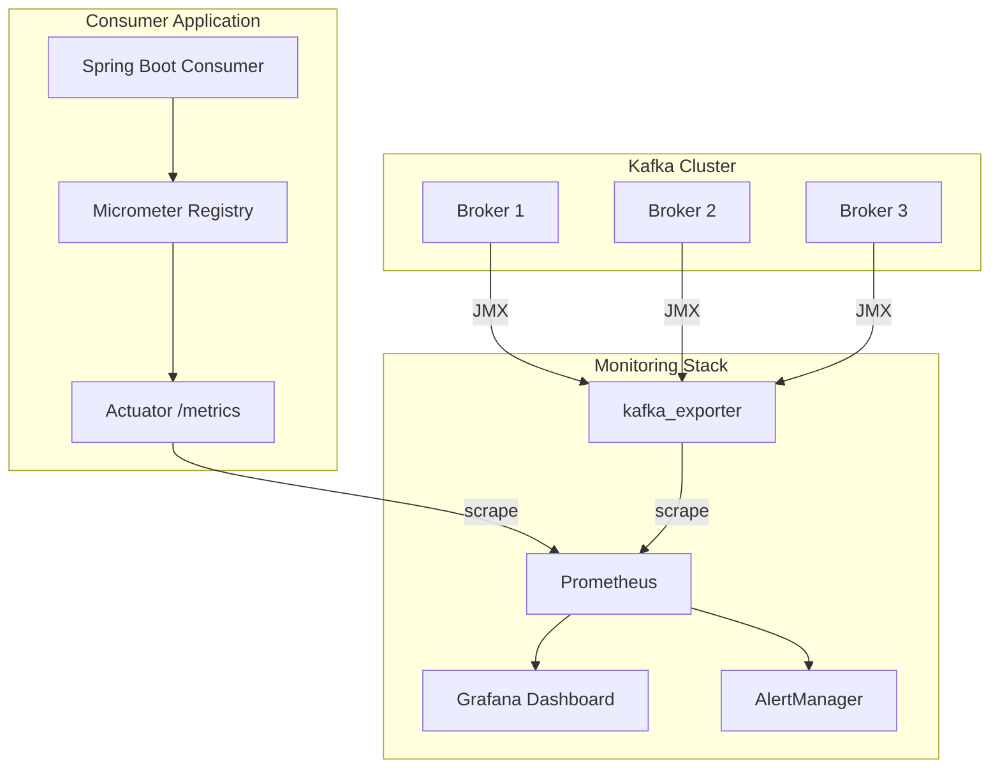

# Cách monitor Kafka consumer

## ⚡ Tóm tắt ngắn (30s)
* Monitor Kafka consumer tập trung vào **4 pillars**: consumer lag, throughput (records/sec), error rate, và rebalance frequency
* Stack phổ biến production: **JMX Metrics → Micrometer → Prometheus → Grafana**, kết hợp **kafka_exporter** hoặc **Burrow** cho consumer group lag
* Cần alert trên **lag velocity** (tốc độ tăng lag) chứ không chỉ absolute lag — lag 10K nhưng ổn định thì OK, lag 1K nhưng tăng liên tục thì nguy
* Spring Boot Actuator + Micrometer tích hợp sẵn Kafka consumer metrics, chỉ cần enable và expose

---

## 🔍 Chi tiết bản chất thực chiến

### Kiến trúc monitoring stack



### 4 Pillars of Kafka Consumer Monitoring

| Pillar | Metrics | Ý nghĩa |
| :--- | :--- | :--- |
| **Lag** | `kafka_consumer_group_lag`, `records-lag-max` | Consumer có theo kịp producer không? |
| **Throughput** | `records-consumed-rate`, `bytes-consumed-rate` | Consumer đang xử lý bao nhiêu msg/s? |
| **Errors** | `failed-rebalance-rate`, deserialization errors | Có lỗi xảy ra không? |
| **Latency** | `poll-idle-ratio`, `commit-latency-avg` | Consumer có bị block không? |

### Các công cụ monitoring phổ biến

| Tool | Ưu điểm | Hạn chế |
| :--- | :--- | :--- |
| **kafka-consumer-groups.sh** | Built-in, không cần cài thêm | Manual, không real-time |
| **kafka_exporter** | Prometheus-native, nhẹ | Chỉ có broker/group metrics |
| **Burrow** | Auto-detect lag status | Cần deploy riêng |
| **Confluent Control Center** | UI đẹp, toàn diện | Enterprise license |
| **AKHQ/Kafdrop** | Open-source UI | Không có alerting |

---

## 💻 Code thực chiến: BAD vs GOOD

### ❌ BAD: Không có monitoring, debug bằng log
```java
@KafkaListener(topics = "payments", groupId = "payment-service")
public void consume(ConsumerRecord<String, Payment> record) {
    // BAD: Chỉ log, không có metrics
    log.info("Received payment: {}", record.value());
    
    try {
        paymentService.process(record.value());
    } catch (Exception e) {
        // BAD: Nuốt exception, không đếm lỗi
        log.error("Error processing payment", e);
    }
    // Khi lag tăng → không biết nguyên nhân
    // Khi consumer chết → phát hiện chậm hàng giờ
}
```

---

### ✅ GOOD: Monitoring toàn diện với Micrometer + Custom Metrics
```java
@Configuration
public class KafkaMonitoringConfig {

    @Bean
    public ConsumerFactory<String, Payment> consumerFactory(MeterRegistry registry) {
        Map<String, Object> props = Map.of(
            ConsumerConfig.BOOTSTRAP_SERVERS_CONFIG, "kafka:9092",
            ConsumerConfig.GROUP_ID_CONFIG, "payment-service",
            // GOOD: Enable JMX metrics từ Kafka client
            ConsumerConfig.METRIC_REPORTER_CLASSES_CONFIG,
                "org.apache.kafka.common.metrics.JmxReporter"
        );
        var factory = new DefaultKafkaConsumerFactory<String, Payment>(props);
        // GOOD: Bind Kafka client metrics vào Micrometer
        factory.addListener(new MicrometerConsumerListener<>(registry));
        return factory;
    }
}

@Service
@RequiredArgsConstructor
public class PaymentConsumer {
    private final PaymentService paymentService;
    private final MeterRegistry meterRegistry;

    // GOOD: Custom metrics cho business logic
    private final Counter successCounter;
    private final Counter failureCounter;
    private final Timer processingTimer;

    @PostConstruct
    void initMetrics() {
        successCounter = Counter.builder("kafka.consumer.payment.success")
            .description("Successfully processed payments")
            .register(meterRegistry);
        failureCounter = Counter.builder("kafka.consumer.payment.failure")
            .description("Failed payment processing")
            .register(meterRegistry);
        processingTimer = Timer.builder("kafka.consumer.payment.duration")
            .description("Payment processing duration")
            .publishPercentiles(0.5, 0.95, 0.99)
            .register(meterRegistry);
    }

    @KafkaListener(topics = "payments", groupId = "payment-service")
    public void consume(ConsumerRecord<String, Payment> record) {
        Timer.Sample sample = Timer.start(meterRegistry);
        try {
            paymentService.process(record.value());
            successCounter.increment();
        } catch (Exception e) {
            failureCounter.increment();
            log.error("Payment processing failed: partition={}, offset={}",
                record.partition(), record.offset(), e);
            throw e; // Re-throw để Spring Kafka retry
        } finally {
            sample.stop(processingTimer);
        }
    }
}
```

**application.yml — Expose metrics cho Prometheus:**
```yaml
management:
  endpoints:
    web:
      exposure:
        include: health, prometheus, metrics
  metrics:
    tags:
      application: payment-service
    export:
      prometheus:
        enabled: true
  # GOOD: Health check cho Kafka
  health:
    kafka:
      enabled: true
```

**Prometheus alert rules:**
```yaml
groups:
  - name: kafka-consumer-alerts
    rules:
      # Alert khi lag tăng liên tục trong 10 phút
      - alert: KafkaConsumerLagGrowing
        expr: |
          delta(kafka_consumergroup_lag_sum{group="payment-service"}[10m]) > 0
          and kafka_consumergroup_lag_sum{group="payment-service"} > 1000
        for: 10m
        labels:
          severity: warning
        annotations:
          summary: "Consumer lag growing for {{ $labels.group }}"

      # Alert khi consumer không commit offset trong 5 phút
      - alert: KafkaConsumerStalled
        expr: |
          changes(kafka_consumergroup_current_offset{group="payment-service"}[5m]) == 0
        for: 5m
        labels:
          severity: critical
```

---

## 📊 Bảng so sánh các Kafka Metrics quan trọng

| Metric | Source | Alert threshold gợi ý | Ý nghĩa khi bất thường |
| :--- | :--- | :--- | :--- |
| `records-lag-max` | Consumer JMX | > 10K và tăng liên tục | Consumer không theo kịp |
| `poll-idle-ratio-avg` | Consumer JMX | < 0.5 | Consumer xử lý quá lâu giữa các poll |
| `records-consumed-rate` | Consumer JMX | Giảm > 50% so với baseline | Throughput suy giảm |
| `commit-latency-avg` | Consumer JMX | > 500ms | Broker chậm hoặc network issue |
| `failed-rebalance-total` | Consumer JMX | > 0 trong 5 phút | Consumer bị kick liên tục |
| `last-heartbeat-seconds-ago` | Consumer JMX | > `session.timeout.ms` | Consumer sắp bị coi là dead |

---

## ⚠️ Common Gotchas & Questions follow-up

### 1. Auto-commit che giấu lag thực
* `enable.auto.commit=true` → offset được commit ngay cả khi xử lý thất bại
* Lag metric = 0 nhưng data bị mất → **luôn dùng manual commit** trong production

### 2. Consumer group lag ≠ end-to-end latency
* Lag 100 messages có thể là 1 giây (nếu throughput cao) hoặc 1 giờ (nếu throughput thấp)
* Cần đo **message timestamp** vs **processing timestamp** để có e2e latency thực

### 3. JMX metrics không đủ cho consumer group monitoring
* JMX chỉ thấy metrics của **consumer instance đang chạy**
* Cần **kafka_exporter** hoặc `AdminClient.listConsumerGroupOffsets()` để thấy **toàn bộ group**

### 4. Interviewer hỏi: "Dùng gì monitor Kafka trong production?"
* Trả lời theo stack: `kafka_exporter` + `Prometheus` + `Grafana` cho infrastructure metrics
* `Micrometer` + `Spring Boot Actuator` cho application-level metrics
* `Burrow` hoặc custom health check cho consumer group status
* **AKHQ/Kafdrop** cho developer self-service UI

### 5. Health check endpoint cho Kafka consumer
```java
@Component
public class KafkaConsumerHealthIndicator implements HealthIndicator {
    @Autowired private KafkaListenerEndpointRegistry registry;

    @Override
    public Health health() {
        boolean allRunning = registry.getListenerContainers().stream()
            .allMatch(MessageListenerContainer::isRunning);
        return allRunning ? Health.up().build()
            : Health.down().withDetail("status", "Consumer stopped").build();
    }
}
```
