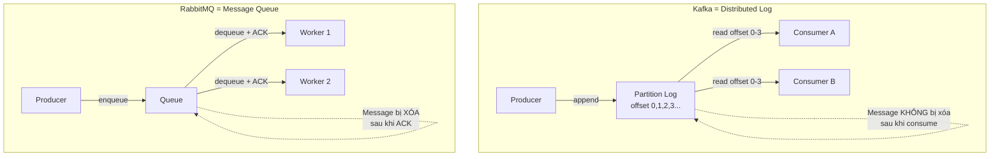

# Khi nào Kafka không phù hợp?

## ⚡ Tóm tắt ngắn (30s)
* Kafka **không phù hợp** khi cần: request-reply pattern (RPC), message routing phức tạp, low-latency delivery cho ít message, hoặc message-level acknowledgment/retry riêng lẻ
* Kafka là **distributed log**, không phải **message broker truyền thống** — thiết kế cho high-throughput streaming, không phải task queue
* **Overhead vận hành cao**: cần ZooKeeper/KRaft, disk, replication — nếu hệ thống nhỏ, dùng RabbitMQ hoặc Redis Streams đỡ phức tạp hơn nhiều
* Rule of thumb: nếu bạn cần **"gửi task cho 1 worker xử lý"** → RabbitMQ; nếu cần **"ghi log event cho N consumer đọc"** → Kafka

---

## 🔍 Chi tiết bản chất thực chiến

### Bản chất Kafka vs Message Queue truyền thống



### Các tình huống Kafka KHÔNG phù hợp

#### 1. Request-Reply Pattern (RPC-style)
* Kafka không có built-in **reply mechanism** — phải tự implement reply topic
* Latency cao hơn nhiều so với gRPC, REST, hoặc RabbitMQ RPC
* Spring Kafka có `ReplyingKafkaTemplate` nhưng là anti-pattern trong production

#### 2. Complex Message Routing
* RabbitMQ có **exchange types** (fanout, direct, topic, headers) với flexible binding
* Kafka chỉ có **topic → partition** — routing logic phải nằm trong consumer code
* Nếu cần route message theo nhiều criteria → RabbitMQ/ActiveMQ phù hợp hơn

#### 3. Individual Message Acknowledgment & Retry
* Kafka commit offset **sequential** — không thể ACK message offset 5 mà skip offset 3
* Nếu message 3 fail → phải xử lý riêng (dead letter topic, retry topic) — phức tạp
* RabbitMQ: reject message 3 → message về lại queue → worker khác xử lý

#### 4. Hệ thống nhỏ, ít traffic
* Kafka cần tối thiểu 3 broker + ZooKeeper/KRaft cluster → tốn resource
* Nếu chỉ có vài nghìn message/ngày → Redis Pub/Sub hoặc SQS là đủ

#### 5. Priority Queue
* Kafka **không hỗ trợ message priority** — message xử lý theo thứ tự offset
* Muốn priority → phải tạo nhiều topic (high/medium/low) — workaround phức tạp
* RabbitMQ có built-in priority queue

---

## 💻 Code thực chiến: BAD vs GOOD

### ❌ BAD: Dùng Kafka làm task queue với retry riêng lẻ
```java
// BAD: Dùng Kafka như RabbitMQ — xử lý task riêng lẻ với retry
@KafkaListener(topics = "email-tasks", groupId = "email-worker")
public void sendEmail(ConsumerRecord<String, EmailTask> record) {
    try {
        emailService.send(record.value());
    } catch (Exception e) {
        // BAD: Không thể "reject" 1 message và để message khác tiếp tục
        // Offset 5 fail → offset 6,7,8 phải ĐỢI hoặc bỏ qua offset 5
        
        // BAD: Workaround bằng cách gửi lại vào topic → message loop nguy hiểm
        kafkaTemplate.send("email-tasks", record.key(), record.value());
        // Message sẽ lặp vô hạn nếu lỗi persistent!
    }
}

// BAD: Dùng Kafka cho request-reply
@PostMapping("/api/calculate")
public ResponseEntity<?> calculate(@RequestBody CalcRequest req) {
    // Gửi request vào Kafka topic
    kafkaTemplate.send("calc-requests", req);
    // CHỜ reply từ topic khác ??? → timeout, complexity, ordering issues
    // Kafka không sinh ra cho use case này!
    return ResponseEntity.accepted().build();
}
```

---

### ✅ GOOD: Chọn đúng tool cho đúng bài toán
```java
// GOOD: Dùng RabbitMQ cho task queue với retry và priority
@Configuration
public class RabbitConfig {
    @Bean
    public Queue emailQueue() {
        return QueueBuilder.durable("email-tasks")
            .withArgument("x-max-priority", 10)         // Priority support
            .withArgument("x-dead-letter-exchange", "dlx") // DLQ tự động
            .withArgument("x-dead-letter-routing-key", "email-tasks.dlq")
            .build();
    }
}

@RabbitListener(queues = "email-tasks")
public void sendEmail(EmailTask task, Channel channel, 
                      @Header(AmqpHeaders.DELIVERY_TAG) long tag) {
    try {
        emailService.send(task);
        channel.basicAck(tag, false); // ACK riêng từng message
    } catch (Exception e) {
        // GOOD: Reject message → về lại queue cho worker khác retry
        channel.basicNack(tag, false, true);
    }
}

// GOOD: Dùng Kafka cho event streaming — đúng bản chất
@Service
public class OrderEventPublisher {
    @Transactional
    public void placeOrder(Order order) {
        orderRepository.save(order);
        // Kafka: phát event cho NHIỀU consumer đọc (analytics, inventory, shipping)
        kafkaTemplate.send("order-events", order.getId(), 
            new OrderPlacedEvent(order));
    }
}

// Nhiều consumer group cùng đọc event — đây là thế mạnh Kafka
@KafkaListener(topics = "order-events", groupId = "analytics-service")
public void analytics(OrderPlacedEvent event) { /* ... */ }

@KafkaListener(topics = "order-events", groupId = "inventory-service") 
public void updateInventory(OrderPlacedEvent event) { /* ... */ }
```

---

## 📊 Bảng so sánh khi nào dùng gì

| Tình huống | Kafka | RabbitMQ | Redis Streams | SQS |
| :--- | :--- | :--- | :--- | :--- |
| Event streaming, audit log | ✅ Best | ❌ | ⚠️ Limited | ❌ |
| Task queue / work distribution | ⚠️ Workaround | ✅ Best | ✅ Good | ✅ Good |
| Request-Reply / RPC | ❌ | ✅ Built-in | ❌ | ❌ |
| Priority queue | ❌ | ✅ Built-in | ❌ | ⚠️ Limited |
| Nhiều consumer groups đọc cùng data | ✅ Best | ⚠️ Complex | ✅ Good | ❌ |
| Message replay / reprocessing | ✅ Best | ❌ | ⚠️ Limited | ❌ |
| Low latency (< 1ms) | ❌ | ⚠️ | ✅ Best | ❌ |
| Ít traffic, team nhỏ | ⚠️ Overkill | ✅ | ✅ | ✅ Best |
| Ordering guarantee | ✅ Per-partition | ⚠️ Phức tạp | ✅ Per-stream | ✅ FIFO |

---

## ⚠️ Common Gotchas & Questions follow-up

### 1. "Kafka không phù hợp" ≠ "Kafka không làm được"
* Kafka CÓ THỂ làm task queue, RPC, priority — nhưng phải **workaround phức tạp**
* Câu hỏi đúng: **"Chi phí engineering để workaround có đáng không?"**

### 2. Kafka Streams không thay thế được stream processing framework
* Kafka Streams chỉ xử lý data từ Kafka → Kafka
* Nếu cần xử lý data từ nhiều source (DB, file, API) → dùng Flink hoặc Spark Streaming

### 3. Interviewer hỏi: "Trong microservices, lúc nào dùng Kafka, lúc nào dùng REST?"
* **Synchronous communication** (cần response ngay): REST/gRPC
* **Asynchronous event** (fire-and-forget, eventual consistency): Kafka
* **Hybrid**: API Gateway nhận request → gửi event Kafka → consumer xử lý → push notification khi xong

### 4. Kafka Connect không thay thế ETL tool
* Kafka Connect tốt cho **streaming CDC** (Debezium), nhưng không phù hợp cho **complex transformation**
* Nếu cần join nhiều source, aggregate phức tạp → dùng Spark/Flink + Kafka làm transport layer

### 5. Kafka trên cloud — managed vs self-hosted
* **Managed** (Confluent Cloud, AWS MSK): giảm ops burden nhưng tốn tiền, vendor lock-in
* **Self-hosted**: control nhiều hơn nhưng cần team DevOps giỏi Kafka
* Nếu team < 5 người → **đừng self-host Kafka**, dùng managed hoặc SQS/SNS
