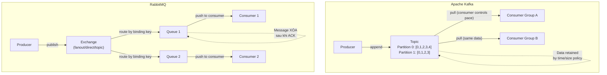

# So sánh Kafka với RabbitMQ

## ⚡ Tóm tắt ngắn (30s)
* **Kafka** = distributed commit log, thiết kế cho **high-throughput event streaming**, consumer pull-based, message persist theo retention — phù hợp event sourcing, analytics pipeline, CDC
* **RabbitMQ** = traditional message broker (AMQP), thiết kế cho **reliable message delivery**, broker push-based, message xóa sau khi ACK — phù hợp task queue, RPC, routing phức tạp
* Kafka mạnh về **throughput** (millions msg/s), **replay**, **multi-consumer**; RabbitMQ mạnh về **routing flexibility**, **per-message ACK**, **low-latency delivery** cho workload nhỏ
* Trong microservices thực tế, nhiều hệ thống dùng **CẢ HAI**: Kafka cho event bus, RabbitMQ cho command/task queue

---

## 🔍 Chi tiết bản chất thực chiến

### Kiến trúc khác biệt cốt lõi



### Pull vs Push Model

| Đặc điểm | Kafka (Pull) | RabbitMQ (Push) |
| :--- | :--- | :--- |
| Ai kiểm soát tốc độ? | **Consumer** quyết định poll bao nhiêu | **Broker** push message đến consumer |
| Backpressure | Consumer tự điều chỉnh | Cần `prefetch_count` để limit |
| Batching | Consumer poll batch tự nhiên | Từng message hoặc small batch |
| Idle consumer | Poll loop chiếm resource | Event-driven, không tốn resource khi idle |

### Message Delivery Semantics

| Semantic | Kafka | RabbitMQ |
| :--- | :--- | :--- |
| **At-most-once** | Auto-commit offset | Auto-ACK |
| **At-least-once** | Manual commit + idempotent consumer | Manual ACK + requeue on NACK |
| **Exactly-once** | Idempotent producer + transactional API | Không native (cần deduplication) |

---

## 💻 Code thực chiến: BAD vs GOOD

### ❌ BAD: Chọn sai tool — dùng Kafka làm task queue
```java
// BAD: Dùng Kafka để phân phối task nặng cho workers
// Vấn đề: không thể retry riêng 1 message, không priority, ordering cản trở parallelism
@KafkaListener(topics = "image-resize-tasks", groupId = "resize-workers",
               concurrency = "5")
public void resizeImage(ConsumerRecord<String, ResizeTask> record) {
    try {
        imageService.resize(record.value()); // 5-30 giây mỗi task
    } catch (Exception e) {
        // BAD: Offset 10 fail → offset 11-20 đã được poll nhưng chưa commit
        // Nếu restart → xử lý LẠI từ offset 10 → duplicate processing
        log.error("Resize failed, sending to retry topic", e);
        kafkaTemplate.send("image-resize-tasks-retry", record.value());
        // Phải tự build retry logic + DLQ + tracking → PHỨC TẠP
    }
}
```

---

### ✅ GOOD: Dùng đúng tool cho đúng bài toán
```java
// ===== Kafka: Event streaming — phát order event cho nhiều service =====
@Configuration
public class KafkaProducerConfig {
    @Bean
    public ProducerFactory<String, OrderEvent> producerFactory() {
        Map<String, Object> props = Map.of(
            ProducerConfig.BOOTSTRAP_SERVERS_CONFIG, "kafka:9092",
            ProducerConfig.ACKS_CONFIG, "all",
            ProducerConfig.ENABLE_IDEMPOTENCE_CONFIG, true, // Exactly-once
            ProducerConfig.KEY_SERIALIZER_CLASS_CONFIG, StringSerializer.class,
            ProducerConfig.VALUE_SERIALIZER_CLASS_CONFIG, JsonSerializer.class
        );
        return new DefaultKafkaProducerFactory<>(props);
    }
}

@Service
public class OrderService {
    public void placeOrder(Order order) {
        orderRepository.save(order);
        // Kafka: 1 event → N consumers (analytics, inventory, notification)
        kafkaTemplate.send("order-events", order.getId(), 
            new OrderPlacedEvent(order));
    }
}

// ===== RabbitMQ: Task queue — phân phối email task cho workers =====
@Configuration
public class RabbitConfig {
    @Bean
    public DirectExchange emailExchange() {
        return new DirectExchange("email.exchange");
    }

    @Bean
    public Queue emailQueue() {
        return QueueBuilder.durable("email.tasks")
            .withArgument("x-dead-letter-exchange", "email.dlx")
            .withArgument("x-message-ttl", 300_000) // 5 min TTL
            .withArgument("x-max-priority", 10)       // Priority support
            .build();
    }

    @Bean
    public Binding emailBinding() {
        return BindingBuilder.bind(emailQueue())
            .to(emailExchange())
            .with("email.send"); // Routing key
    }
}

@Service
public class EmailTaskPublisher {
    public void sendWelcomeEmail(User user) {
        // RabbitMQ: route theo key, priority, với per-message ACK
        rabbitTemplate.convertAndSend("email.exchange", "email.send",
            new EmailTask(user.getEmail(), "Welcome!", 
                EmailTemplate.WELCOME),
            message -> {
                message.getMessageProperties().setPriority(5);
                return message;
            });
    }
}

@RabbitListener(queues = "email.tasks", concurrency = "3-10")
public void processEmail(EmailTask task, Channel channel,
                         @Header(AmqpHeaders.DELIVERY_TAG) long tag) {
    try {
        emailService.send(task);
        channel.basicAck(tag, false); // ACK riêng message này
    } catch (TransientException e) {
        channel.basicNack(tag, false, true); // Requeue để retry
    } catch (PermanentException e) {
        channel.basicNack(tag, false, false); // Đến DLQ
    }
}
```

---

## 📊 Bảng so sánh toàn diện Kafka vs RabbitMQ

| Tiêu chí | Apache Kafka | RabbitMQ |
| :--- | :--- | :--- |
| **Kiến trúc** | Distributed commit log | Message broker (AMQP) |
| **Throughput** | Millions msg/s | Tens of thousands msg/s |
| **Latency** | ~5ms (batch-optimized) | ~1ms (per-message) |
| **Message retention** | Configurable (time/size) | Xóa sau ACK |
| **Replay** | ✅ Seek to any offset | ❌ Không thể |
| **Ordering** | Per-partition guarantee | Per-queue (single consumer) |
| **Routing** | Topic → Partition (simple) | Exchange → Queue (flexible) |
| **Consumer model** | Pull-based | Push-based |
| **Per-message ACK** | ❌ Sequential offset only | ✅ Individual ACK/NACK |
| **Priority queue** | ❌ | ✅ Built-in |
| **Exactly-once** | ✅ Transactional API | ❌ (cần dedup) |
| **Multi-consumer** | ✅ Consumer groups | ⚠️ Cần exchange fanout |
| **Protocol** | Custom binary protocol | AMQP, MQTT, STOMP |
| **Operations** | Phức tạp (ZK/KRaft, disk) | Đơn giản hơn |
| **Use case chính** | Event streaming, CDC, analytics | Task queue, RPC, routing |

---

## ⚠️ Common Gotchas & Questions follow-up

### 1. "Kafka throughput cao hơn" — nhưng so sánh phải fair
* Kafka throughput cao nhờ **batching + sequential I/O** — nhưng latency per-message cao hơn
* RabbitMQ latency thấp hơn cho **individual message** — nhưng throughput bị giới hạn bởi broker RAM
* So sánh phải cùng **delivery guarantee** và **persistence level**

### 2. RabbitMQ Streams — RabbitMQ cũng có "log" bây giờ
* RabbitMQ 3.9+ có **Streams** — append-only log giống Kafka
* Phù hợp nếu đã có RabbitMQ và muốn thêm event streaming nhẹ
* Nhưng **không mature bằng Kafka** về ecosystem, tooling, và community

### 3. Interviewer hỏi: "Khi nào dùng cả hai?"
* **Kafka**: event bus giữa các service (order-placed, payment-completed)
* **RabbitMQ**: task queue nội bộ (send-email, generate-report, resize-image)
* Pattern phổ biến: Kafka event → consumer nhận → tạo RabbitMQ task

### 4. Kafka Connect vs RabbitMQ Shovel
* Kafka Connect: ecosystem lớn, 200+ connectors, CDC với Debezium
* RabbitMQ Shovel/Federation: di chuyển message giữa các RabbitMQ cluster
* Khác nhau hoàn toàn về mục đích

### 5. Cloud managed options
* **Kafka**: Confluent Cloud, AWS MSK, Azure Event Hubs
* **RabbitMQ**: CloudAMQP, Amazon MQ, Azure Service Bus (AMQP)
* Nếu trên AWS và đơn giản: SQS + SNS có thể thay cả hai cho small-medium workloads
