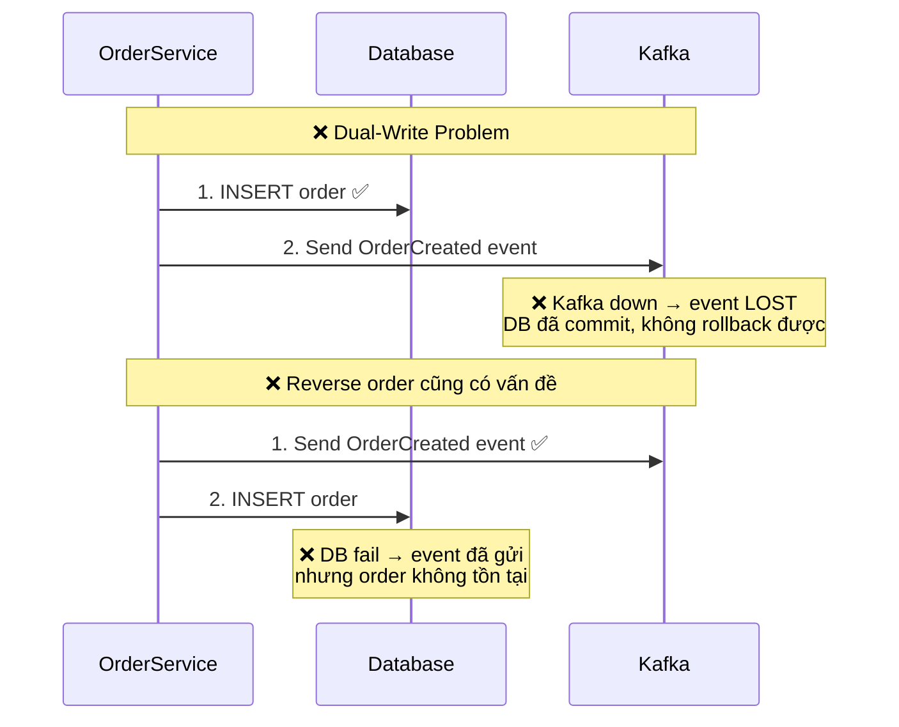
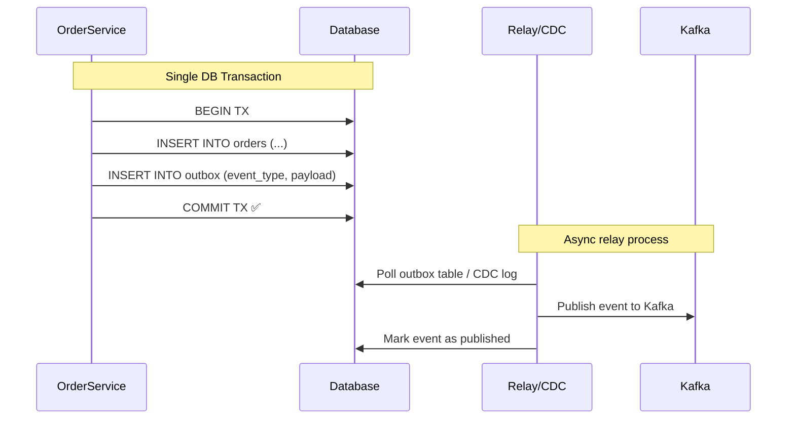

# Transactional outbox với Kafka

## ⚡ Tóm tắt ngắn (30s)
* **Transactional Outbox** giải quyết bài toán **dual-write**: khi cần vừa ghi DB vừa gửi Kafka message trong 1 business operation mà đảm bảo **atomicity** — hoặc cả hai thành công, hoặc cả hai không xảy ra
* Pattern: ghi business data + outbox event vào **cùng 1 DB transaction**, rồi có process riêng **poll outbox table** (hoặc dùng **CDC/Debezium**) để publish lên Kafka
* Đây là pattern **bắt buộc** trong microservices khi cần **eventual consistency** giữa service state và event notification
* **Debezium CDC** là cách production-grade nhất — không cần polling, near real-time, không miss event

---

## 🔍 Chi tiết bản chất thực chiến

### Bài toán Dual-Write



### Transactional Outbox Pattern



### Hai cách triển khai Outbox Relay

| Approach | Mô tả | Ưu điểm | Nhược điểm |
| :--- | :--- | :--- | :--- |
| **Polling Publisher** | Scheduled job query outbox table | Đơn giản, dễ implement | Latency cao, tải DB, cần distributed lock |
| **CDC (Debezium)** | Đọc DB transaction log (binlog/WAL) | Near real-time, không tải DB thêm | Phức tạp hơn, cần Kafka Connect |

---

## 💻 Code thực chiến: BAD vs GOOD

### ❌ BAD: Dual-write không có outbox
```java
@Service
@RequiredArgsConstructor
public class OrderService {
    private final OrderRepository orderRepository;
    private final KafkaTemplate<String, OrderEvent> kafkaTemplate;

    @Transactional
    public Order createOrder(CreateOrderRequest request) {
        Order order = Order.from(request);
        orderRepository.save(order);

        // BAD: Gửi Kafka TRONG transaction
        // Nếu Kafka down → exception → DB rollback → user thấy lỗi
        // Nếu Kafka gửi OK nhưng DB commit fail → event orphan
        kafkaTemplate.send("order-events", order.getId(),
            new OrderCreatedEvent(order)).get(); // BLOCKING!

        // BAD: Ngay cả khi dùng @TransactionalEventListener
        // vẫn không đảm bảo Kafka gửi thành công sau DB commit
        return order;
    }
}
```

---

### ✅ GOOD: Transactional Outbox với Polling Publisher
```java
// 1. Outbox Entity
@Entity
@Table(name = "outbox_events")
@Getter @NoArgsConstructor
public class OutboxEvent {
    @Id
    @GeneratedValue(strategy = GenerationType.IDENTITY)
    private Long id;

    @Column(nullable = false)
    private String aggregateType; // "Order"

    @Column(nullable = false)
    private String aggregateId; // order ID

    @Column(nullable = false)
    private String eventType; // "OrderCreated"

    @Column(columnDefinition = "TEXT", nullable = false)
    private String payload; // JSON serialized event

    @Column(nullable = false)
    private Instant createdAt;

    @Column(nullable = false)
    @Enumerated(EnumType.STRING)
    private OutboxStatus status = OutboxStatus.PENDING;

    public static OutboxEvent create(String aggregateType, String aggregateId,
                                      String eventType, Object event) {
        OutboxEvent e = new OutboxEvent();
        e.aggregateType = aggregateType;
        e.aggregateId = aggregateId;
        e.eventType = eventType;
        e.payload = JsonUtil.toJson(event);
        e.createdAt = Instant.now();
        e.status = OutboxStatus.PENDING;
        return e;
    }
}

// 2. Service — ghi cả business data + outbox trong 1 transaction
@Service
@RequiredArgsConstructor
public class OrderService {
    private final OrderRepository orderRepository;
    private final OutboxRepository outboxRepository;

    @Transactional // GOOD: 1 transaction cho cả order + outbox
    public Order createOrder(CreateOrderRequest request) {
        Order order = Order.from(request);
        orderRepository.save(order);

        // GOOD: Ghi outbox event vào CÙNG DB transaction
        OutboxEvent event = OutboxEvent.create(
            "Order", order.getId(),
            "OrderCreated",
            new OrderCreatedEvent(order.getId(), order.getTotal(),
                order.getCustomerId())
        );
        outboxRepository.save(event);

        return order; // Kafka publish sẽ xảy ra async bởi relay
    }
}

// 3. Polling Relay — scheduled job publish outbox → Kafka
@Component
@RequiredArgsConstructor
public class OutboxPollingRelay {
    private final OutboxRepository outboxRepository;
    private final KafkaTemplate<String, String> kafkaTemplate;

    @Scheduled(fixedDelay = 1000) // Poll mỗi 1 giây
    @Transactional
    public void publishPendingEvents() {
        List<OutboxEvent> events = outboxRepository
            .findTop100ByStatusOrderByCreatedAtAsc(OutboxStatus.PENDING);

        for (OutboxEvent event : events) {
            try {
                String topic = event.getAggregateType().toLowerCase() + "-events";
                kafkaTemplate.send(topic, event.getAggregateId(), 
                    event.getPayload()).get(5, TimeUnit.SECONDS);

                event.setStatus(OutboxStatus.PUBLISHED);
            } catch (Exception e) {
                log.warn("Failed to publish outbox event {}", event.getId(), e);
                // Sẽ retry ở lần poll tiếp theo
            }
        }
    }

    // GOOD: Cleanup job xóa events cũ đã published
    @Scheduled(cron = "0 0 2 * * *") // 2 AM hàng ngày
    @Transactional
    public void cleanupOldEvents() {
        Instant cutoff = Instant.now().minus(7, ChronoUnit.DAYS);
        outboxRepository.deleteByStatusAndCreatedAtBefore(
            OutboxStatus.PUBLISHED, cutoff);
    }
}
```

### ✅ BETTER: Debezium CDC — Production-grade
```json
// Debezium Connector Config — deploy lên Kafka Connect
{
  "name": "outbox-connector",
  "config": {
    "connector.class": "io.debezium.connector.mysql.MySqlConnector",
    "database.hostname": "mysql",
    "database.port": "3306",
    "database.user": "debezium",
    "database.password": "secret",
    "database.server.id": "1",
    "topic.prefix": "app",
    "table.include.list": "app_db.outbox_events",
    "transforms": "outbox",
    "transforms.outbox.type": 
      "io.debezium.transforms.outbox.EventRouter",
    "transforms.outbox.table.field.event.key": "aggregate_id",
    "transforms.outbox.table.field.event.type": "event_type",
    "transforms.outbox.table.field.event.payload": "payload",
    "transforms.outbox.route.topic.replacement": "${routedByValue}-events",
    "transforms.outbox.table.fields.additional.placement": 
      "aggregate_type:header:aggregateType"
  }
}
```

```sql
-- Outbox table schema cho Debezium
CREATE TABLE outbox_events (
    id            BIGINT AUTO_INCREMENT PRIMARY KEY,
    aggregate_type VARCHAR(255) NOT NULL,
    aggregate_id   VARCHAR(255) NOT NULL,
    event_type     VARCHAR(255) NOT NULL,
    payload        JSON NOT NULL,
    created_at     TIMESTAMP DEFAULT CURRENT_TIMESTAMP
);
-- Debezium đọc binlog → không cần status column
-- Có thể DELETE ngay sau INSERT (Debezium vẫn capture từ binlog)
```

---

## 📊 Bảng so sánh Polling vs CDC

| Tiêu chí | Polling Publisher | Debezium CDC |
| :--- | :--- | :--- |
| **Latency** | 1-5 giây (poll interval) | ~100ms (near real-time) |
| **DB load** | Query mỗi poll cycle | Đọc binlog, không query table |
| **Complexity** | Đơn giản, pure Java | Cần Kafka Connect + Debezium |
| **Distributed lock** | Cần nếu multi-instance | Không cần (1 connector) |
| **Ordering guarantee** | Theo ID tăng dần | Theo binlog order |
| **Scalability** | Bị giới hạn bởi DB polling | Scale tốt với partitioned binlog |
| **Khi nào chọn** | MVP, team nhỏ, < 1K events/s | Production, > 1K events/s |

---

## ⚠️ Common Gotchas & Questions follow-up

### 1. Outbox table phình to — cần cleanup strategy
* PHẢI có job cleanup xóa events đã published cũ hơn N ngày
* Với Debezium CDC: có thể DELETE ngay sau INSERT vì Debezium đọc binlog, không đọc table

### 2. Idempotent consumer vẫn cần thiết
* Outbox đảm bảo **at-least-once delivery** — message có thể duplicate (relay crash sau send, trước khi mark published)
* Consumer PHẢI idempotent: dùng `eventId` để dedup
```java
@KafkaListener(topics = "order-events")
public void handle(OrderCreatedEvent event) {
    if (processedEventRepository.existsById(event.getEventId())) {
        return; // Already processed — idempotent
    }
    // Process event...
    processedEventRepository.save(new ProcessedEvent(event.getEventId()));
}
```

### 3. Interviewer hỏi: "Sao không dùng Kafka Transaction thay outbox?"
* Kafka Transactional API chỉ đảm bảo **Kafka → Kafka** atomicity
* Không giải quyết **DB → Kafka** atomicity — đó chính là bài toán outbox giải quyết
* Dùng Kafka transaction KẾT HỢP outbox cho end-to-end exactly-once

### 4. Thứ tự event trong outbox
* Polling: `ORDER BY created_at, id` → đảm bảo thứ tự trong cùng aggregate
* CDC: thứ tự theo binlog position → tự nhiên đúng thứ tự
* Kafka partition key = `aggregate_id` → đảm bảo ordering per-aggregate

### 5. Outbox pattern với NoSQL (MongoDB)
* MongoDB 4.0+ hỗ trợ multi-document transactions → outbox pattern vẫn hoạt động
* Debezium có MongoDB connector đọc oplog thay vì binlog
* Pattern tương tự, chỉ khác implementation layer
