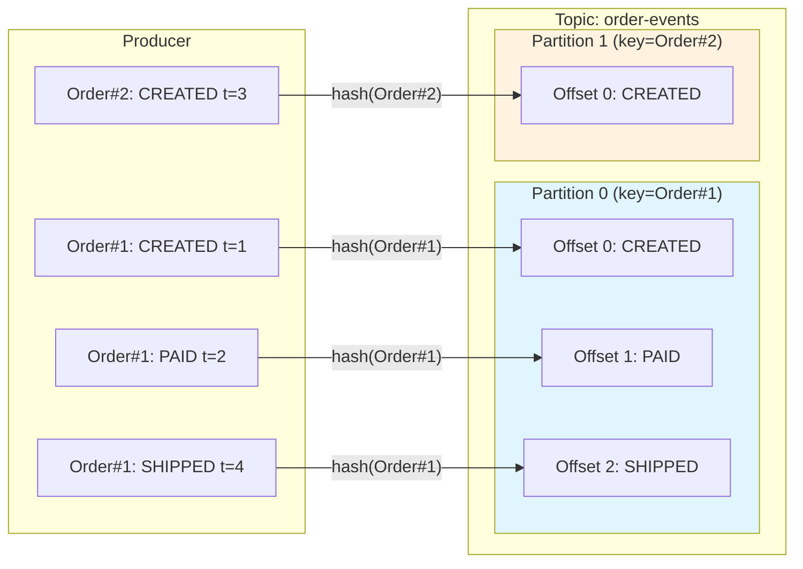
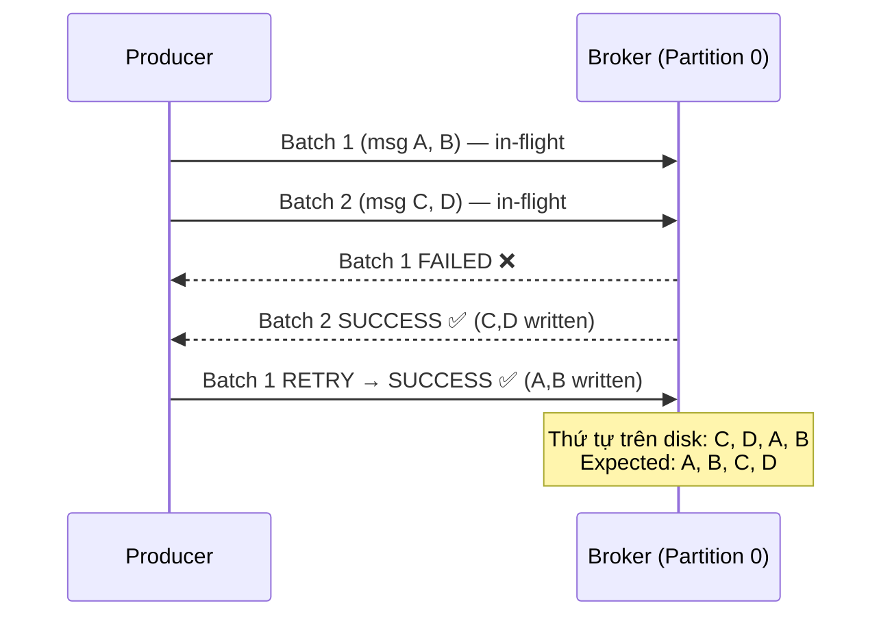

# Partition ảnh hưởng gì đến ordering?

## ⚡ Tóm tắt ngắn (30s)
* Kafka **chỉ đảm bảo ordering trong một partition** — messages cùng partition được đọc theo đúng thứ tự ghi
* **Across partitions thì KHÔNG có ordering guarantee** — đây là trade-off cốt lõi giữa ordering và throughput
* Partition key là vũ khí chính: cùng key → cùng partition → ordering cho entity đó được đảm bảo
* Khi `max.in.flight.requests.per.connection > 1` và retry → message có thể bị **reorder ngay trong cùng partition**
* Production solution: enable **idempotent producer** (`enable.idempotence=true`) để giữ ordering khi retry

---

## 🔍 Chi tiết bản chất thực chiến

### Ordering guarantee của Kafka
Kafka có một quy tắc đơn giản nhưng cực kỳ quan trọng:
> **Messages trong cùng partition luôn được đọc theo đúng thứ tự chúng được ghi (append order)**

Nhưng across partitions, Kafka **không** đảm bảo thứ tự. Consumer có thể đọc message từ partition 2 trước partition 1.

### Tại sao không ordering toàn cục?
Ordering toàn cục (total ordering) yêu cầu:
1. Tất cả messages đi qua **một điểm duy nhất** (single partition)
2. Hoặc có **distributed coordination** giữa partitions (đắt đỏ)

Cả hai cách đều **giết throughput**. Kafka chọn **partition-level ordering** là sweet spot giữa correctness và performance.



### Nguy cơ reorder khi retry
Khi `max.in.flight.requests.per.connection = 5` (default), producer gửi 5 batch song song. Nếu batch 1 fail, batch 2 thành công → batch 1 retry thành công → **message bị đảo thứ tự** ngay trong cùng partition.



---

## 💻 Code thực chiến: BAD vs GOOD

### ❌ BAD: Phá vỡ ordering guarantee mà không biết
```java
@Service
public class BadEventProducer {

    @Autowired
    private KafkaTemplate<String, Object> kafkaTemplate;

    public void publishOrderLifecycle(Order order) {
        // BAD 1: Không dùng key → round-robin → CREATED có thể ở P0, PAID ở P1
        kafkaTemplate.send("order-events", new OrderCreated(order));
        kafkaTemplate.send("order-events", new OrderPaid(order));
        kafkaTemplate.send("order-events", new OrderShipped(order));
        // Consumer có thể nhận SHIPPED trước CREATED!
    }

    public void publishWithInconsistentKey(Order order) {
        // BAD 2: Key khác nhau cho cùng entity → messages vào partitions khác nhau
        kafkaTemplate.send("order-events", order.getOrderId(), new OrderCreated(order));
        kafkaTemplate.send("order-events", order.getUserId(), new OrderPaid(order));
        // orderId và userId hash khác nhau → khác partition → mất ordering
    }
}
```

```yaml
# BAD: Producer config gây reorder trong cùng partition
spring:
  kafka:
    producer:
      retries: 3
      # max.in.flight.requests.per.connection: 5 (default)
      # enable.idempotence: false (default)
      # → Retry + multiple in-flight = REORDER RISK!
```

---

### ✅ GOOD: Đảm bảo ordering đúng cách
```java
// === Producer Config đảm bảo ordering ===
@Configuration
public class KafkaProducerConfig {

    @Bean
    public ProducerFactory<String, Object> producerFactory() {
        Map<String, Object> props = new HashMap<>();
        props.put(ProducerConfig.BOOTSTRAP_SERVERS_CONFIG, "kafka:9092");
        
        // CRITICAL: Enable idempotent producer
        // Tự động set: acks=all, retries=MAX_INT, max.in.flight=5 (safe với idempotence)
        props.put(ProducerConfig.ENABLE_IDEMPOTENCE_CONFIG, true);
        
        // Idempotent producer cho phép max.in.flight=5 mà VẪN đảm bảo ordering
        // Vì broker sẽ reject out-of-order sequence numbers
        props.put(ProducerConfig.MAX_IN_FLIGHT_REQUESTS_PER_CONNECTION, 5);
        props.put(ProducerConfig.ACKS_CONFIG, "all");
        
        props.put(ProducerConfig.KEY_SERIALIZER_CLASS_CONFIG, StringSerializer.class);
        props.put(ProducerConfig.VALUE_SERIALIZER_CLASS_CONFIG, JsonSerializer.class);
        
        return new DefaultKafkaProducerFactory<>(props);
    }
}

// === Producer với consistent partition key ===
@Service
@Slf4j
public class OrderEventProducer {

    @Autowired
    private KafkaTemplate<String, Object> kafkaTemplate;

    /**
     * GOOD: Tất cả events của cùng order dùng CÙNG partition key
     * → cùng partition → ordering guaranteed
     */
    public CompletableFuture<Void> publishOrderLifecycle(Order order) {
        String partitionKey = order.getOrderId();  // Consistent key

        return kafkaTemplate.send("order-events", partitionKey, new OrderCreated(order))
            .thenCompose(r -> kafkaTemplate.send("order-events", partitionKey, new OrderPaid(order)))
            .thenCompose(r -> kafkaTemplate.send("order-events", partitionKey, new OrderShipped(order)))
            .thenAccept(r -> log.info("All events published in order for {}", order.getOrderId()));
    }
}

// === Consumer xử lý ordered events ===
@Service
@Slf4j
public class OrderEventConsumer {

    private final Map<String, OrderState> stateMap = new ConcurrentHashMap<>();

    @KafkaListener(topics = "order-events", groupId = "order-processor")
    public void handle(@Payload Object event,
                       @Header(KafkaHeaders.RECEIVED_KEY) String key,
                       @Header(KafkaHeaders.RECEIVED_PARTITION) int partition,
                       Acknowledgment ack) {
        // Vì cùng orderId luôn vào cùng partition, chỉ 1 consumer xử lý
        // → State machine transition an toàn, không cần distributed locking
        
        if (event instanceof OrderCreated created) {
            stateMap.put(key, OrderState.CREATED);
            log.info("Order {} CREATED on partition {}", key, partition);
        } else if (event instanceof OrderPaid paid) {
            OrderState current = stateMap.get(key);
            if (current != OrderState.CREATED) {
                log.error("Invalid state transition: {} -> PAID for order {}", current, key);
                // Handle out-of-order (shouldn't happen with correct setup)
            }
            stateMap.put(key, OrderState.PAID);
        }
        
        ack.acknowledge();
    }
}
```

---

## 📊 Bảng so sánh các mức Ordering

| Tiêu chí | Single Partition (Total Order) | Per-Key Ordering | No Ordering (Round-Robin) |
| :--- | :--- | :--- | :--- |
| **Ordering scope** | Toàn bộ topic | Per entity/key | Không đảm bảo |
| **Throughput** | Thấp (bottleneck) | Cao | Cao nhất |
| **Parallelism** | 1 consumer duy nhất | N consumers | N consumers |
| **Use case** | Audit log, sequential processing | Order lifecycle, user events | Metrics, logs |
| **Partition count** | 1 | N (theo business entity) | N |
| **Scalability** | ❌ Không scale | ✅ Scale tốt | ✅ Scale tốt nhất |

---

## ⚠️ Common Gotchas & Questions follow-up

### 1. Idempotent producer giải quyết reorder thế nào?
* Mỗi producer được gán **Producer ID (PID)** và mỗi message có **sequence number**
* Broker track sequence per partition → reject message nếu sequence không đúng thứ tự
* Cho phép `max.in.flight=5` mà **vẫn đảm bảo ordering** — best of both worlds
* **Lưu ý**: idempotent producer chỉ đảm bảo trong **single producer session** — restart producer → PID mới

### 2. Nếu cần ordering across multiple keys thì sao?
* **Option 1**: Dùng cùng partition key cho related entities (VD: dùng `userId` thay vì `orderId`)
* **Option 2**: Single partition — nhưng mất parallelism
* **Option 3**: Application-level ordering — buffer + sort theo timestamp trước khi process
* **Option 4**: Kafka Streams với windowed aggregation

### 3. Thay đổi partition count có ảnh hưởng ordering?
* **Có!** Sau khi tăng partition, `hash(key) % newPartitionCount` cho kết quả khác
* Messages cùng key có thể bị route sang partition mới → **ordering bị phá vỡ tạm thời**
* **Giải pháp**: drain consumer trước khi tăng partition, hoặc dùng custom partitioner

### 4. Consumer concurrency ảnh hưởng ordering thế nào?
* `concurrency=N` trong Spring Kafka tạo N consumer threads, mỗi thread xử lý riêng partitions
* Ordering **vẫn được đảm bảo** vì mỗi partition chỉ gán cho 1 thread
* **Gotcha**: nếu dùng thread pool bên trong consumer để async process → ordering bị phá vỡ ở application layer

### 5. Ordering trong Kafka Transactions?
* Transactional producer dùng `transactional.id` → đảm bảo **exactly-once** và ordering across producer restarts
* Consumer đọc với `isolation.level=read_committed` → chỉ thấy message đã committed → ordering nhất quán
