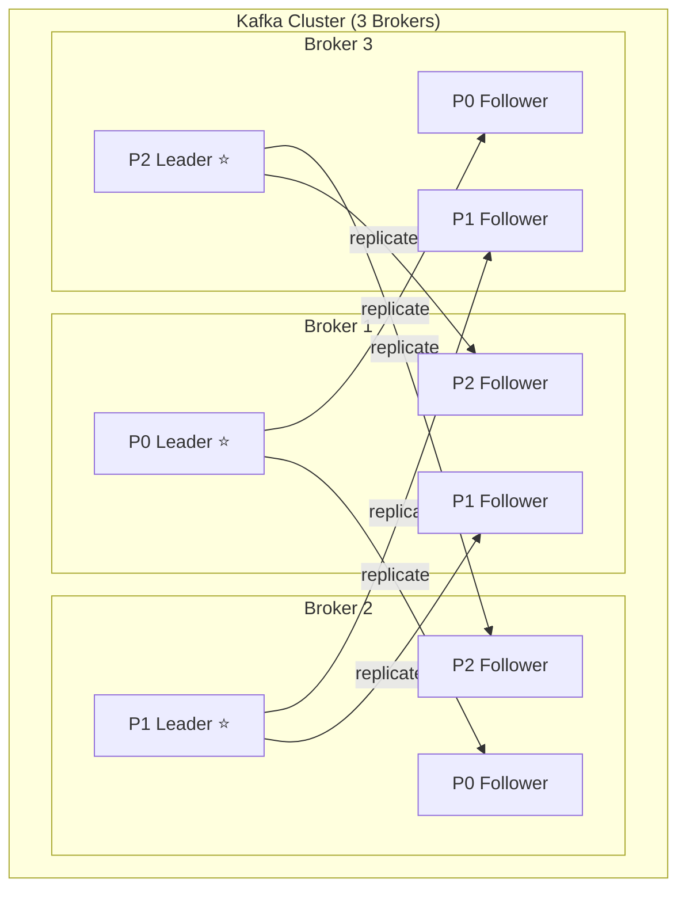
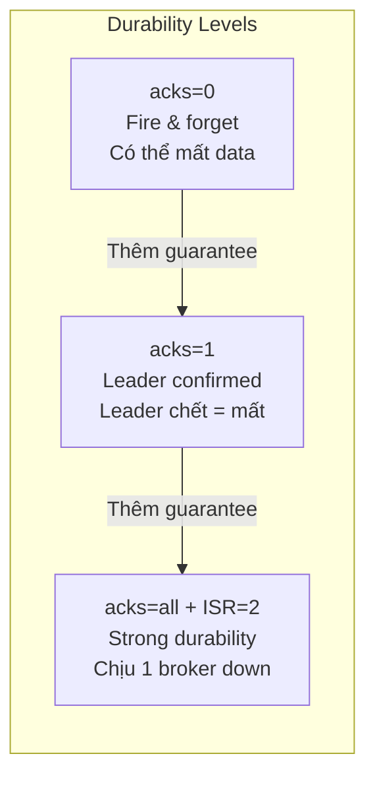

# Replication factor là gì?

## ⚡ Tóm tắt ngắn (30s)
* Replication factor (RF) xác định **số bản sao** (replica) của mỗi partition trên các brokers khác nhau
* RF=3 nghĩa là mỗi partition có **3 copies** trên 3 brokers → chịu được **2 broker chết** mà không mất data
* Kết hợp với `min.insync.replicas` (ISR) để kiểm soát **durability guarantee** — thường set RF=3, ISR=2
* Producer `acks=all` + ISR ≥ 2 = **strong durability** — message không bị mất trừ khi toàn bộ cluster sập
* Trade-off chính: RF cao → tốn disk gấp bội, tăng network replication traffic, nhưng data safety hơn

---

## 🔍 Chi tiết bản chất thực chiến

### Replication — Cốt lõi của Fault Tolerance
Kafka distribute mỗi partition trên nhiều brokers. Mỗi partition có:
- **1 Leader replica**: nhận tất cả read/write requests
- **(RF-1) Follower replicas**: liên tục fetch data từ leader để sync

Khi leader chết → một follower trong **ISR (In-Sync Replicas)** được bầu làm leader mới.



### In-Sync Replicas (ISR)
ISR là tập hợp replicas **đã catch up** với leader. Follower bị loại khỏi ISR khi:
- Lag quá `replica.lag.time.max.ms` (default 30s) — tức là follower không fetch kịp data từ leader

### Mối quan hệ RF, ISR, và acks



| Config | Ý nghĩa | Khi nào message bị mất? |
|--------|---------|------------------------|
| `acks=0` | Producer không chờ ack | Message chưa đến broker |
| `acks=1` | Chỉ leader ack | Leader chết trước khi replicate |
| `acks=all, ISR=1` | Tất cả ISR ack, nhưng ISR có thể chỉ còn leader | Leader chết = mất |
| `acks=all, ISR=2` | Ít nhất 2 replicas confirm | 2 brokers chết đồng thời |

---

## 💻 Code thực chiến: BAD vs GOOD

### ❌ BAD: Replication config yếu, dễ mất data
```java
@Configuration
public class BadKafkaConfig {

    @Bean
    public NewTopic criticalPaymentTopic() {
        return TopicBuilder.name("payment-events")
                .partitions(6)
                .replicas(1)     // BAD: Chỉ 1 bản sao → broker chết = MẤT DATA hoàn toàn
                .build();
    }

    @Bean
    public NewTopic anotherBadTopic() {
        return TopicBuilder.name("order-events")
                .partitions(6)
                .replicas(3)
                // BAD: RF=3 nhưng không set min.insync.replicas
                // → ISR có thể xuống còn 1 → acks=all chỉ cần leader ack
                .build();
    }
}
```

```yaml
# BAD Producer config
spring:
  kafka:
    producer:
      acks: 1   # Chỉ leader ack → leader chết trước khi replicate = mất message
```

---

### ✅ GOOD: Production-grade replication setup
```java
@Configuration
public class KafkaTopicConfig {

    // === Critical business data: RF=3, ISR=2 ===
    @Bean
    public NewTopic paymentEventsTopic() {
        return TopicBuilder.name("payment-events")
                .partitions(12)
                .replicas(3)                    // 3 copies trên 3 brokers khác nhau
                .config(TopicConfig.MIN_IN_SYNC_REPLICAS_CONFIG, "2")  // Ít nhất 2 replicas must ack
                .config(TopicConfig.UNCLEAN_LEADER_ELECTION_ENABLE_CONFIG, "false") // Không cho out-of-sync replica làm leader
                .build();
    }

    // === Less critical data: RF=2 chấp nhận được ===
    @Bean
    public NewTopic metricsEventsTopic() {
        return TopicBuilder.name("metrics-events")
                .partitions(6)
                .replicas(2)
                .config(TopicConfig.MIN_IN_SYNC_REPLICAS_CONFIG, "1")
                .build();
    }
}

// === Producer config cho strong durability ===
@Configuration
public class KafkaProducerConfig {

    @Bean
    public ProducerFactory<String, Object> producerFactory() {
        Map<String, Object> props = new HashMap<>();
        props.put(ProducerConfig.BOOTSTRAP_SERVERS_CONFIG, 
                "kafka-1:9092,kafka-2:9092,kafka-3:9092");
        
        // Strong durability settings
        props.put(ProducerConfig.ACKS_CONFIG, "all");     // Tất cả ISR phải ack
        props.put(ProducerConfig.ENABLE_IDEMPOTENCE_CONFIG, true);  // No duplicates
        props.put(ProducerConfig.RETRIES_CONFIG, Integer.MAX_VALUE);
        props.put(ProducerConfig.MAX_IN_FLIGHT_REQUESTS_PER_CONNECTION, 5);
        
        // Batching cho throughput (không ảnh hưởng durability)
        props.put(ProducerConfig.BATCH_SIZE_CONFIG, 32768);      // 32KB
        props.put(ProducerConfig.LINGER_MS_CONFIG, 20);          // Chờ 20ms gom batch
        props.put(ProducerConfig.COMPRESSION_TYPE_CONFIG, "lz4"); // Giảm replication traffic
        
        props.put(ProducerConfig.KEY_SERIALIZER_CLASS_CONFIG, StringSerializer.class);
        props.put(ProducerConfig.VALUE_SERIALIZER_CLASS_CONFIG, JsonSerializer.class);
        
        return new DefaultKafkaProducerFactory<>(props);
    }
}

// === Producer với error handling cho replication failures ===
@Service
@Slf4j
public class PaymentEventProducer {

    @Autowired
    private KafkaTemplate<String, Object> kafkaTemplate;

    public void publishPaymentEvent(PaymentEvent event) {
        String key = event.getPaymentId();

        kafkaTemplate.send("payment-events", key, event)
            .whenComplete((result, ex) -> {
                if (ex != null) {
                    if (ex.getCause() instanceof NotEnoughReplicasException) {
                        // ISR < min.insync.replicas → cluster degraded
                        log.error("NOT ENOUGH REPLICAS for payment {}: cluster may be degraded",
                                event.getPaymentId());
                        alertService.fireAlert("KAFKA_INSUFFICIENT_REPLICAS");
                        // Fallback: write to DB và retry later
                        outboxRepository.save(new OutboxEvent("payment-events", key, event));
                    } else {
                        log.error("Failed to publish payment event: {}", ex.getMessage());
                    }
                } else {
                    RecordMetadata meta = result.getRecordMetadata();
                    log.info("Payment event published: partition={}, offset={}", 
                            meta.partition(), meta.offset());
                }
            });
    }
}
```

---

## 📊 Bảng so sánh Replication Factor levels

| Tiêu chí | RF=1 | RF=2 | RF=3 |
| :--- | :--- | :--- | :--- |
| **Fault tolerance** | 0 broker failure | 1 broker failure | 2 broker failures |
| **Disk usage** | 1x | 2x | 3x |
| **Write latency** | Thấp nhất | Trung bình | Cao hơn (khi acks=all) |
| **Network traffic** | Không replication | 1x replication | 2x replication |
| **Min brokers** | 1 | 2 | 3 |
| **Production recommendation** | ❌ Dev/test only | ⚠️ Non-critical data | ✅ Critical data |
| **Kết hợp ISR** | N/A | ISR=1 | ISR=2 |

---

## ⚠️ Common Gotchas & Questions follow-up

### 1. RF=3 nhưng chỉ có 3 brokers — có vấn đề gì?
* Hoạt động được nhưng **không có room cho maintenance** — nếu 1 broker down để upgrade → chỉ còn 2 replicas
* Best practice: **số brokers ≥ RF + 1** để có buffer cho rolling upgrades
* Với RF=3 nên có ít nhất **4-5 brokers**

### 2. min.insync.replicas nên set bao nhiêu?
* **Rule**: `min.insync.replicas < replication.factor` — nếu bằng nhau → 1 broker down = cluster không accept writes
* Common pattern: RF=3, ISR=2 → chịu được 1 broker down mà vẫn write/read bình thường
* RF=3, ISR=3 → **cực kỳ strict**, bất kỳ broker nào down → producer không ghi được

### 3. Unclean leader election là gì?
* Khi tất cả ISR replicas chết, Kafka có thể bầu **out-of-sync replica** làm leader → **data loss**
* `unclean.leader.election.enable=false` (default từ Kafka 0.11): thà **unavailable** còn hơn **mất data**
* Set `true` chỉ khi availability quan trọng hơn data consistency (rất hiếm)

### 4. Rack-awareness replication
* Default Kafka đặt replicas trên bất kỳ broker nào → có thể 3 replicas trên cùng rack → rack failure = mất tất cả
* Configure `broker.rack` → Kafka phân replicas đều across racks
* Cloud: dùng availability zones (AZs) — mỗi replica ở AZ khác nhau

### 5. Replication factor có thể thay đổi runtime không?
* **Có**, dùng `kafka-reassign-partitions.sh` để tăng/giảm RF
* Tăng RF: Kafka copy data sang broker mới → tốn bandwidth và thời gian
* Giảm RF: bỏ replica → data trên broker đó bị xóa
* Nên làm **off-peak hours** vì replication traffic ảnh hưởng cluster performance
