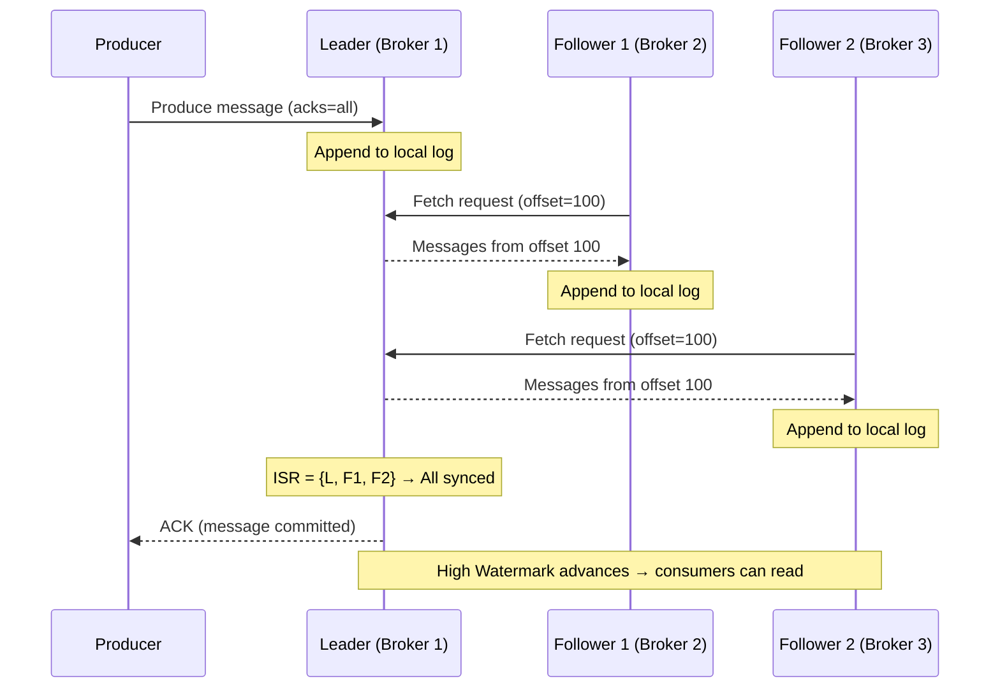
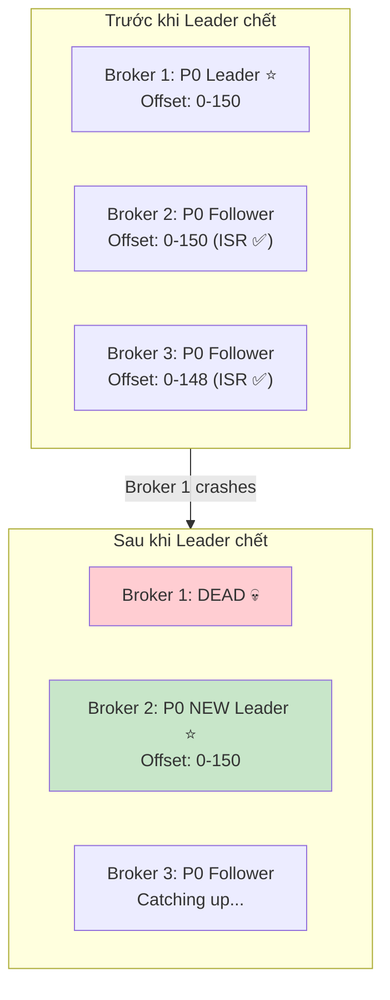

# Leader và follower replica là gì?

## ⚡ Tóm tắt ngắn (30s)
* Mỗi partition có **1 leader** và **(RF-1) followers** — leader xử lý **mọi read/write**, followers chỉ **replicate data**
* Followers liên tục fetch data từ leader để giữ sync — tập hợp followers đã sync gọi là **ISR (In-Sync Replicas)**
* Khi leader chết → Kafka controller bầu follower trong ISR làm leader mới — quá trình gọi là **leader election**
* Từ **Kafka 2.4+**, có thể bật **follower fetching** (`rack.aware`) để consumer đọc từ follower gần nhất → giảm cross-AZ latency
* Production insight: **leader skew** (1 broker chịu quá nhiều leader partitions) là performance killer thường gặp

---

## 🔍 Chi tiết bản chất thực chiến

### Leader — Single point of read/write
Leader replica là **nguồn sự thật duy nhất** (single source of truth) cho partition đó. Mọi producer write và consumer read đều đi qua leader. Thiết kế này đơn giản hóa consistency — không cần distributed consensus cho mỗi message.

### Follower — Hot standby
Follower liên tục gửi **Fetch requests** đến leader (giống consumer) để nhận messages mới. Follower không serve bất kỳ client request nào (trừ khi bật follower fetching từ Kafka 2.4).

### ISR (In-Sync Replicas) — Ai đủ điều kiện làm leader?
ISR = {leader} ∪ {followers đã catch up}. Follower bị loại khỏi ISR khi lag vượt `replica.lag.time.max.ms`. Chỉ replicas trong ISR mới đủ điều kiện được bầu làm leader mới.



### Leader Election Flow



### High Watermark (HW) và Log End Offset (LEO)
- **LEO (Log End Offset)**: offset cuối cùng mà mỗi replica đã ghi
- **High Watermark**: offset cao nhất mà **tất cả ISR** đã replicate → consumer chỉ thấy messages đến HW
- Messages giữa HW và LEO gọi là **"uncommitted"** — chưa durable, có thể mất nếu leader chết

---

## 💻 Code thực chiến: BAD vs GOOD

### ❌ BAD: Không hiểu leader/follower, gây cluster imbalance
```java
@Configuration
public class BadKafkaSetup {

    // BAD: Tạo topic không kiểm soát leader distribution
    @Bean
    public NewTopic topic1() {
        return TopicBuilder.name("service-events")
                .partitions(20)     // 20 partitions trên 3 brokers
                .replicas(3)
                // Không configure rack awareness
                // Không monitor leader distribution
                // → Có thể 15/20 leaders dồn vào 1 broker → HOT BROKER
                .build();
    }
}

// BAD: Consumer config không tận dụng follower fetching
// Trong multi-AZ deployment → tất cả read đều cross-AZ → latency cao, cost cao
@Service
public class BadConsumer {
    @KafkaListener(topics = "service-events", groupId = "my-group")
    public void listen(String message) {
        // Cross-AZ reads mỗi lần → unnecessary latency & bandwidth cost
        process(message);
    }
}
```

---

### ✅ GOOD: Leader-aware config, follower fetching, monitoring
```java
// === Broker config (server.properties) ===
// broker.id=1
// broker.rack=az-1                          # Rack awareness
// replica.lag.time.max.ms=30000             # 30s trước khi kick out of ISR
// num.replica.fetchers=4                    # Threads cho replication
// replica.fetch.max.bytes=10485760          # 10MB per fetch

// === Topic với rack-aware placement ===
@Configuration
public class KafkaTopicConfig {

    @Bean
    public NewTopic criticalTopic() {
        return TopicBuilder.name("payment-events")
                .partitions(12)
                .replicas(3)
                .config(TopicConfig.MIN_IN_SYNC_REPLICAS_CONFIG, "2")
                .config(TopicConfig.UNCLEAN_LEADER_ELECTION_ENABLE_CONFIG, "false")
                .build();
        // Với broker.rack configured, Kafka tự phân replicas across AZs
    }
}

// === Consumer với Follower Fetching (Kafka 2.4+) ===
@Configuration
public class KafkaConsumerConfig {

    @Bean
    public ConsumerFactory<String, Object> consumerFactory() {
        Map<String, Object> props = new HashMap<>();
        props.put(ConsumerConfig.BOOTSTRAP_SERVERS_CONFIG, "kafka:9092");
        props.put(ConsumerConfig.GROUP_ID_CONFIG, "payment-processor");
        
        // Follower fetching: consumer đọc từ replica gần nhất (cùng rack/AZ)
        // Giảm cross-AZ latency & bandwidth cost
        props.put(ConsumerConfig.CLIENT_RACK_CONFIG, "az-1");  // Consumer ở AZ nào
        
        props.put(ConsumerConfig.ENABLE_AUTO_COMMIT_CONFIG, false);
        props.put(ConsumerConfig.AUTO_OFFSET_RESET_CONFIG, "earliest");
        
        return new DefaultKafkaConsumerFactory<>(props,
                new StringDeserializer(), new JsonDeserializer<>(Object.class));
    }
}

// === Health Check & Leader Distribution Monitoring ===
@Component
@Slf4j
public class KafkaClusterHealthCheck {

    @Autowired
    private AdminClient adminClient;

    @Scheduled(fixedRate = 60000)  // Mỗi phút
    public void checkLeaderDistribution() {
        try {
            Map<Integer, Long> leaderCountPerBroker = new HashMap<>();
            
            DescribeTopicsResult topics = adminClient.describeTopics(
                    List.of("payment-events", "order-events"));
            
            topics.allTopicNames().get().values().forEach(desc -> {
                desc.partitions().forEach(partInfo -> {
                    int leaderId = partInfo.leader().id();
                    leaderCountPerBroker.merge(leaderId, 1L, Long::sum);
                    
                    // Check ISR health
                    if (partInfo.isr().size() < partInfo.replicas().size()) {
                        log.warn("Under-replicated partition: {}-{}, ISR={}/{}", 
                            desc.name(), partInfo.partition(),
                            partInfo.isr().size(), partInfo.replicas().size());
                    }
                });
            });
            
            // Detect leader skew
            long maxLeaders = Collections.max(leaderCountPerBroker.values());
            long minLeaders = Collections.min(leaderCountPerBroker.values());
            if (maxLeaders > minLeaders * 1.5) {
                log.warn("Leader skew detected! Distribution: {}", leaderCountPerBroker);
                alertService.fire("KAFKA_LEADER_SKEW", leaderCountPerBroker);
            }
            
        } catch (Exception e) {
            log.error("Failed to check cluster health", e);
        }
    }
}
```

---

## 📊 Bảng so sánh Leader vs Follower Replica

| Tiêu chí | Leader Replica | Follower Replica |
| :--- | :--- | :--- |
| **Vai trò** | Serve all reads & writes | Passive replication |
| **Client interaction** | Nhận produce/fetch requests | Không (trừ follower fetching) |
| **Data flow** | Append messages trực tiếp | Fetch từ leader, append locally |
| **Failure impact** | Trigger leader election | ISR shrinks, ít ảnh hưởng |
| **CPU/Network load** | Cao (serve clients + replicate) | Thấp hơn (chỉ fetch) |
| **Follower fetching (2.4+)** | N/A | Có thể serve consumer reads |
| **ISR membership** | Luôn trong ISR | Tùy thuộc lag |

---

## ⚠️ Common Gotchas & Questions follow-up

### 1. Preferred leader election là gì?
* Mỗi partition có **preferred leader** (replica đầu tiên trong assignment list)
* Sau nhiều lần failover, leaders có thể bị skew → `auto.leader.rebalance.enable=true` tự rebalance
* Hoặc chạy thủ công: `kafka-leader-election.sh --election-type preferred`
* **Gotcha**: auto rebalance tại thời điểm xấu (peak traffic) có thể gây latency spike

### 2. Follower fetching có ảnh hưởng consistency không?
* Consumer đọc từ follower nhận data **slightly stale** (vài ms lag)
* **Vẫn đảm bảo**: consumer chỉ đọc đến High Watermark → không đọc uncommitted data
* Trade-off: chấp nhận vài ms staleness để giảm cross-AZ latency 5-20ms

### 3. Under-replicated partitions (URP) nghĩa là gì?
* Partition mà ISR < RF → có follower đang **lag behind**
* **Nguyên nhân**: broker overloaded, network issue, disk slow, GC pause
* URP > 0 kéo dài = **red flag** → cần investigate ngay
* **Metric quan trọng nhất để monitor**: `kafka.server:type=ReplicaManager,name=UnderReplicatedPartitions`

### 4. Khi nào follower bị kick khỏi ISR?
* Follower không fetch data từ leader trong `replica.lag.time.max.ms` (default 30s)
* **Nguyên nhân phổ biến**: broker đang GC, disk I/O saturated, network partition
* Khi follower catch up lại → tự động rejoin ISR

### 5. Controller là ai trong quá trình leader election?
* **Controller** là một broker đặc biệt, quản lý partition assignments và leader elections cho toàn cluster
* Trong ZooKeeper mode: controller được bầu qua ZooKeeper ephemeral node
* Trong **KRaft mode** (Kafka 3.3+): controller sử dụng Raft consensus protocol — không cần ZooKeeper
* Controller failure → broker khác trở thành controller mới — quá trình này gây short disruption
