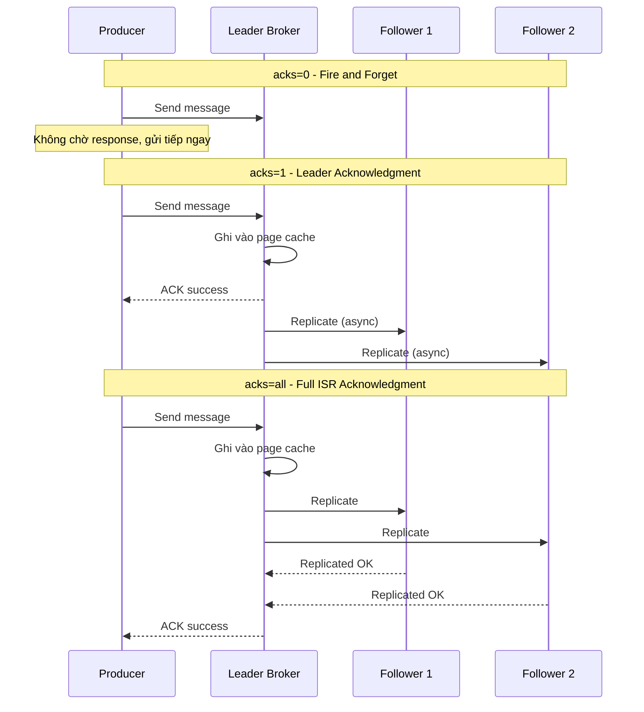

# Producer acknowledgment acks=0/1/all khác nhau thế nào?

## ⚡ Tóm tắt ngắn (30s)
* **acks=0**: Producer gửi xong là quên luôn — không chờ broker xác nhận → throughput cao nhất, **mất data dễ nhất**
* **acks=1**: Chờ leader broker ghi xong vào page cache → cân bằng giữa tốc độ và độ tin cậy, nhưng **vẫn mất data nếu leader crash trước khi replicate**
* **acks=all (-1)**: Chờ tất cả ISR (In-Sync Replicas) ghi xong → **đảm bảo durability cao nhất**, throughput thấp nhất
* Trong production, hầu hết hệ thống critical dùng `acks=all` kết hợp `min.insync.replicas=2` để đảm bảo không mất message

---

## 🔍 Chi tiết bản chất thực chiến

### Cơ chế hoạt động từng mức acks



### acks=0: Fire and Forget
- Producer không chờ bất kỳ response nào từ broker
- Nếu broker down, message mất mà producer không biết
- **Use case**: Metrics collection, logging không quan trọng, IoT sensor data volume lớn mà chấp nhận mất vài %

### acks=1: Leader Only
- Producer chờ leader ghi thành công vào **page cache** (chưa flush disk)
- Nếu leader crash **sau khi ACK nhưng trước khi replicate**, message mất vĩnh viễn
- **Use case**: Application logs, activity tracking — cần biết gửi thành công nhưng chấp nhận rủi ro nhỏ

### acks=all: Full ISR
- Producer chờ **tất cả replica trong ISR** ghi thành công
- Kết hợp `min.insync.replicas` để đảm bảo tối thiểu N replicas phải sẵn sàng
- Nếu ISR < `min.insync.replicas`, producer nhận `NotEnoughReplicasException`
- **Use case**: Payment, order processing, financial transactions — không chấp nhận mất data

### Mối quan hệ với min.insync.replicas
- `acks=all` mà chỉ có 1 broker trong ISR → tương đương `acks=1`
- **Best practice**: `replication.factor=3`, `min.insync.replicas=2`, `acks=all` → chịu được 1 broker fail

---

## 💻 Code thực chiến: BAD vs GOOD

### ❌ BAD: Dùng acks=0 cho payment processing
```java
@Configuration
public class KafkaProducerConfig {

    @Bean
    public ProducerFactory<String, String> producerFactory() {
        Map<String, Object> props = new HashMap<>();
        props.put(ProducerConfig.BOOTSTRAP_SERVERS_CONFIG, "localhost:9092");
        // ❌ acks=0 cho hệ thống payment - MẤT TIỀN khi broker crash
        props.put(ProducerConfig.ACKS_CONFIG, "0");
        // ❌ Không cấu hình retry
        props.put(ProducerConfig.RETRIES_CONFIG, 0);
        return new DefaultKafkaProducerFactory<>(props);
    }
}

@Service
public class PaymentProducer {
    @Autowired
    private KafkaTemplate<String, String> kafkaTemplate;

    public void sendPayment(PaymentEvent event) {
        // ❌ Fire and forget - không biết message có đến broker không
        kafkaTemplate.send("payments", event.getId(), toJson(event));
        log.info("Payment sent"); // Log này LIE - chưa chắc đã gửi thành công
    }
}
```

---

### ✅ GOOD: acks=all + idempotent cho payment processing
```java
@Configuration
public class KafkaProducerConfig {

    @Bean
    public ProducerFactory<String, String> producerFactory() {
        Map<String, Object> props = new HashMap<>();
        props.put(ProducerConfig.BOOTSTRAP_SERVERS_CONFIG, "kafka1:9092,kafka2:9092,kafka3:9092");

        // ✅ acks=all: chờ tất cả ISR replicas xác nhận
        props.put(ProducerConfig.ACKS_CONFIG, "all");

        // ✅ Enable idempotent producer: tránh duplicate khi retry
        props.put(ProducerConfig.ENABLE_IDEMPOTENCE_CONFIG, true);

        // ✅ Retry với backoff hợp lý
        props.put(ProducerConfig.RETRIES_CONFIG, 3);
        props.put(ProducerConfig.RETRY_BACKOFF_MS_CONFIG, 1000);

        // ✅ Giới hạn in-flight requests khi enable idempotence
        props.put(ProducerConfig.MAX_IN_FLIGHT_REQUESTS_PER_CONNECTION, 5);

        props.put(ProducerConfig.KEY_SERIALIZER_CLASS_CONFIG, StringSerializer.class);
        props.put(ProducerConfig.VALUE_SERIALIZER_CLASS_CONFIG, StringSerializer.class);
        return new DefaultKafkaProducerFactory<>(props);
    }
}

@Service
@Slf4j
public class PaymentProducer {
    @Autowired
    private KafkaTemplate<String, String> kafkaTemplate;

    public CompletableFuture<SendResult<String, String>> sendPayment(PaymentEvent event) {
        // ✅ Dùng CompletableFuture để handle kết quả async
        return kafkaTemplate.send("payments", event.getId(), toJson(event))
                .whenComplete((result, ex) -> {
                    if (ex != null) {
                        // ✅ Handle failure: retry, dead letter, alert
                        log.error("Payment send FAILED for id={}: {}", event.getId(), ex.getMessage());
                        alertService.sendAlert("PAYMENT_KAFKA_FAIL", event.getId());
                    } else {
                        log.info("Payment sent OK: topic={}, partition={}, offset={}",
                            result.getRecordMetadata().topic(),
                            result.getRecordMetadata().partition(),
                            result.getRecordMetadata().offset());
                    }
                });
    }
}
```

---

## 📊 Bảng so sánh các mức acks

| Tiêu chí | acks=0 | acks=1 | acks=all |
| :--- | :--- | :--- | :--- |
| **Durability** | Không đảm bảo | Trung bình | Cao nhất |
| **Throughput** | Cao nhất | Cao | Thấp nhất |
| **Latency** | Thấp nhất (~0.5ms) | Thấp (~2-5ms) | Cao hơn (~10-50ms) |
| **Data loss risk** | Cao | Trung bình | Rất thấp |
| **Khi leader crash** | Mất message | Có thể mất | Không mất (nếu ISR >= min.insync.replicas) |
| **Use case** | Metrics, logs không quan trọng | Application logs, tracking | Payment, orders, financial data |
| **Retry có ý nghĩa?** | Không (không biết lỗi) | Có | Có |

---

## ⚠️ Common Gotchas & Questions follow-up

### 1. acks=all không có nghĩa ghi xuống disk
* **Problem**: Nhiều người nghĩ `acks=all` = tất cả replica đã flush xuống disk
* **Thực tế**: Chỉ ghi vào **page cache** của OS. Flush disk phụ thuộc `log.flush.interval.messages` và `log.flush.interval.ms`
* **Solution**: Kafka dựa vào replication để đảm bảo durability, không dựa vào fsync. Đây là trade-off có chủ đích

### 2. acks=all với ISR chỉ còn 1 broker
* **Problem**: Nếu 2/3 broker down, ISR chỉ còn leader → `acks=all` = `acks=1`
* **Solution**: Set `min.insync.replicas=2` để producer nhận lỗi thay vì âm thầm giảm durability
* **Consequence**: Producer sẽ bị block/exception khi cluster không healthy — đây là **desired behavior**

### 3. acks=all ảnh hưởng throughput bao nhiêu?
* **Benchmark thực tế**: acks=0 (~100k msg/s) vs acks=1 (~80k msg/s) vs acks=all (~50-60k msg/s)
* **Mitigation**: Dùng batching (`linger.ms=5`, `batch.size=32768`) và compression (`compression.type=lz4`) để bù throughput

### 4. Idempotent Producer và acks
* Khi enable `enable.idempotence=true`, Kafka **bắt buộc** `acks=all`
* Nếu set `acks=0` hoặc `acks=1` kèm idempotence → exception khi khởi tạo producer
* Idempotent producer đảm bảo **exactly-once delivery** tới single partition

### 5. Follow-up: "Tại sao không mặc định acks=all?"
* Vì Kafka được thiết kế cho **nhiều use case khác nhau**: log aggregation (acks=0), general messaging (acks=1), critical data (acks=all)
* Từ Kafka 3.0+, default đã đổi từ `acks=1` sang `acks=all` — phản ánh xu hướng ưu tiên safety
